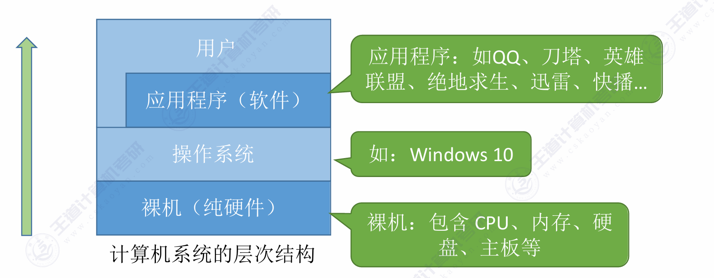

### 第一章 计算机系统概述

#### 一、操作系统的概念、功能和目标

1. **概念**：操作系统是指**控制和管理**整个计算机系统的**硬件和软件**资源，并合理地组织调度计算机的工作和资源的分配，以**提供给用户和其他软件方便的接口和环境**；它是计算机系统中最基本的系统软件 。

   - **作为系统资源的管理者**：提供处理机管理、存储器管理、文件管理、设备管理等功能，目标是保证系统安全、高效 。
     - 处理机管理：本质上是**进程管理**。
     - 存储器管理：旨在**为多道程序提供良好的内存运行环境**。
     - 文件管理：负责文件管理的部分称为**文件系统**，功能包括内存分配与回收、地址映射、目录管理、文件读/写操作以及访问保护。
     - 设备管理：**处理用户的I/O请求，屏蔽设备差异**。

   - **向上层提供方便易用的服务**：
     - **GUI（图形用户界面）**：用户可以使用形象的图形界面进行操作 。
     - **命令接口（供普通用户使用）**：分为联机命令接口（说一句做一句，如Windows的cmd）和脱机命令接口（说一堆做一堆，如批处理.bat文件） 。
     - **程序接口（系统调用）**：提供给程序员或应用程序使用，由一系列系统调用组成 。

   - **作为最接近硬件的层次**：实现**对硬件机器的扩展**，通常把覆盖了软件的机器称为扩充机器或虚拟机 。

#### 二、操作系统的四个特征

**并发和共享**是操作系统的两个**最基本的特征**，二者**互为存在条件** 。

- **并发(最基本特征)**：指两个或多个事件在同一时间间隔内发生（**宏观上同时发生，微观上交替发生**），需要**注意与“并行”（同一时刻同时发生）的区别** 。
- **共享**：系统中的资源可供内存中多个并发执行的进程共同使用。分为互斥共享方式和同时共享方式。
  - 互斥共享方式：一个时间段内只允许一个进程访问该资源。
  - 同时共享方式：允许一个时间段内有多个进程 **“同时”** 对他们进行访问。
- **虚拟**：把一个物理上的实体变为若干个逻辑上的对应物。包括空分复用技术（如虚拟存储器技术）和时分复用技术（如虚拟处理器）。**没有并发性就谈不上虚拟性** 。
- **异步**：在多道程序环境下，允许多个程序并发执行，由于资源有限，进程以不可预知的速度向前推进（走走停停）。**只有系统拥有并发性，才有可能导致异步性 。**

#### 三、操作系统的发展与分类

- **手工操作阶段**：主要缺点是用户独占全机、人机速度矛盾导致资源利用率极低 。分为人工操作模式和脱机I/O模式。
  - 人工操作：程序的装入，执行和结果输出等全过程均依赖人工操作。
  - 脱机I/O：引入一台外围机，预先完成I/O预备工作
- **单道批处理系统**：引入了**脱机输入/输出技术**，并由**监督程序**控制作业的输入、输出，作业按磁带上的顺序依次装入内存**(顺序性)**，先装入者先自动完成**(自动性)**，内存中只允许一道用户程序运行**(单道性)**。缓解了人机速度矛盾，但资源利用率依然很低 。
  - 缺点：
    - 内存中仅能有一道程序运行，只有该程序运行结束后才能调入下一道程序。
    - CPU 有大量时间在等待 I/O 完成，资源利用率依然很低
- **多道批处理系统**：标志着操作系统正式诞生，多道程序**并发**执行，**资源利用率大幅提升**，但缺点是**没有提供人机交互功能** 。
- **分时操作系统**：以**时间片**为单位轮流为各个用户/作业服务，**解决了人机交互问题**，但缺点是**不能优先处理紧急任务** 。
- **实时操作系统**：能优先响应紧急任务，**要求在严格的时限内完成**，主要特点是**确定性(响应时间可预测)、高可靠性和强时效性**，进一步分为硬实时系统（绝对严格的规定时间）和软实时系统（能接受偶尔违反规定时间） 。
- **其他类型**：网络操作系统、分布式操作系统、个人计算机操作系统等 。
  - 网络操作系统：基于单机操作系统扩展网络功能。
  - 分布式系统：多台计算机组成的集合，**分布性，并行性和透明性**。
  - 微机操作系统：为微型计算机设计的系统。

#### 四、操作系统的运行机制

- **两种指令**：特权指令（仅允许操作系统内核使用）和非特权指令（应用程序只能使用非特权指令） 。
- **两种处理器状态**：
  - **内核态（核心态/管态）**：正在运行内核程序，可以执行特权指令 。
  - **用户态（目态）**：正在运行应用程序，只能执行非特权指令 。
  - **状态切换机制**：内核态转为用户态是通过执行一条特权指令修改PSW标志位实现的（操作系统主动让出CPU）；用户态转为内核态是由“中断”引发的，由硬件自动完成（操作系统强行夺回CPU） 。

## 5. 中断和异常

- **中断的作用**：让操作系统内核强行夺回CPU的控制权，这是实现程序并发的前提 。

- **分类**：

  - **内中断（也称异常、例外）**：中断信号来源于CPU内部，与当前执行的指令有关。具体包含陷入（trap，如系统调用等故意引发的指令）、故障（fault）和终止（abort） 。

  - **外中断（狭义的中断）**：中断信号来源于CPU外部，与当前执行的指令无关。例如时钟中断、I/O中断请求 。

- **基本原理**：CPU检测到中断信号后，会根据信号类型查询“中断向量表”，以此找到相应的中断处理程序 。

## 6. 系统调用

- **概念**：操作系统提供给应用程序（程序员）使用的接口，应用程序通过系统调用请求获得操作系统内核的服务 。

- **适用场景**：凡是与共享资源有关的操作（如设备管理、文件管理、进程控制、进程通信、内存管理等）都必须通过系统调用的方式向内核提出服务请求，以保证系统的稳定和安全 。

- **执行过程**：传递参数 -> 执行**陷入指令（Trap指令/访管指令）**（注意：陷入指令是在**用户态**执行并引发内中断） -> CPU进入核心态执行相应内核程序处理 -> 返回应用程序 。

## 7. 操作系统的体系结构

- **大内核（宏内核/单内核）**：将主要功能模块都作为内核运行在核心态。优点是性能高，缺点是内核代码庞大、结构混乱、难以维护 。

- **微内核**：只把最基本的功能保留在内核。优点是结构清晰、方便维护，缺点是需要频繁地在核心态和用户态之间切换，导致性能较低 。

- **其他结构**：文档还提及了分层结构、模块化、外核（exokernel）等设计思想 。

## 8. 操作系统引导与虚拟机

- **操作系统引导（Boot）**：CPU从特定主存地址取指令执行ROM中的引导程序进行硬件自检 -> 将磁盘第一块（主引导记录）读入内存扫描分区表 -> 从活动分区读入分区引导记录 -> 找到完整操作系统初始化程序（启动管理器）并执行 。

- **虚拟机**：使用虚拟化技术将一台物理机器虚拟化为多台虚拟机器。分为直接运行在硬件上的第一类VMM（虚拟机管理程序）和运行在宿主操作系统上的第二类VMM 。

  

  