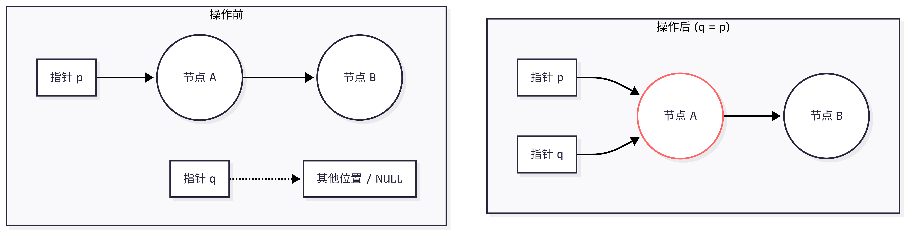
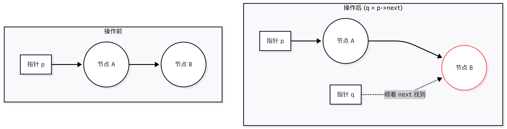
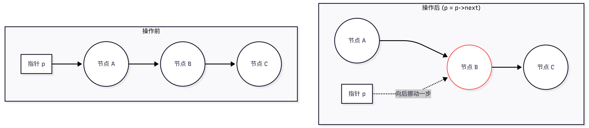
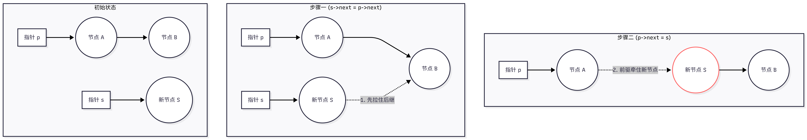
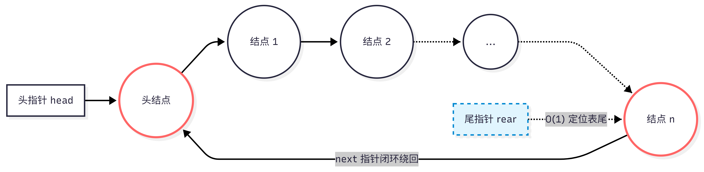

<h2 align="center">第二章 顺序表</h2>

### （一）线性表的定义与基本概念

- **定义**：线性表是具有相同数据类型的 $n (n\ge0)$ 个数据元素的有限序列 。
- **关键概念**：
  -  $ n $为表长，当 $ n=0 $ 时，说明该线性表是一个空表 。
  - 线性表中元素的**位序**从 1 开始计算（注意与编程语言中数组下标从 0 开始区分开来） 。
  - 除第一个元素外，每个元素有且仅有一个直接前驱；除最后一个元素外，每个元素有且仅有一个直接后继 。
- **基本操作**：数据结构的基本操作通常可以总结为“创、销、增、删、改、查” 。具体包括初始化 (`InitList`)、销毁 (`DestroyList`)、插入 (`ListInsert`)、删除 (`ListDelete`)、按位查找 (`GetElem`)、按值查找 (`LocateElem`)、求表长 (`Length`) 等操作 。
  - **`InitList(&L)`**：初始化操作，构造一个空的线性表。
  - **`DestroyList(&L`)**：销毁线性表，释放其占用的存储空间。
  - **`ClearList(&L)`**：将线性表清空（变为空表）。
  - **`Empty(L)`**：判断线性表是否为空，若为空返回 true，否则返回 false。
  - **`Length(L)`**：求线性表的长度（元素个数）。
  - **`GetElem(L, i)`**：取第 i 个位置的元素，用 e 返回其值。
  - **`LocateElem(L, e)`**：按值查找，返回元素 e 在表中的位置。
  - **`ListInsert(&L, i, e)`**：在第 i 个位置插入元素 e。
  - **`ListDelete(&L, i, &e)`**：删除第 i 个元素，并用 e 返回被删除元素的值。
  - **`TraverseList(L)`**：遍历线性表，依次访问每个元素。

### （二）顺序表 (顺序存储)

- **定义**：用顺序存储的方式实现线性表，即把**逻辑上相邻**的元素存储在**物理位置上也相邻（地址连续**）的存储单元中 。

- **实现方式**：

  - **静态分配（数组方式）**：使用大小固定的静态数组存放数据元素，最大长度一旦确定就无法改变 。

    ```c++
    #define MaxSize 10          // 定义最大长度
    
    typedef struct {
        ElemType data[MaxSize]; // 用静态的“数组”存放数据元素
        int length;             // 顺序表的当前长度
    } SqList;                   // 结构体的类型别名
    ```

  - **动态分配（指针方式）**：使用动态数组实现。当容量存满时，可通过 `malloc` 动态申请一片更大的连续存储空间，然后将原数据复制到新区域，并用 `free` 释放原内存区域 。

    ```c++
    #define InitSize 10         // 默认的最大长度
    
    typedef struct {
        ElemType *data;         // 指示动态分配数组的指针
        int MaxSize;            // 顺序表的最大容量
        int length;             // 顺序表的当前长度
    } SeqList;                  // 结构体的类型别名
    ```

- **特点**：

  - **优点**：支持随机访问（随机存取），可以在 $O(1)$时间内立即找到第 $i$个元素；结点的存储密度高 。
  - **缺点**：拓展容量不方便（动态分配的时间开销也较大）；插入和删除操作不方便，需要移动大量元素 。

- **基本操作的实现：**

  1. 初始化

     - 静态分配：

     ```c++
     // 静态分配：数组空间已在结构体内部，只需初始化 length
     void InitList_Sq(SqList *L) {
         L->length = 0;
     }
     ```

     - 动态分配：申请内存

     ```c++
     // L需要被修改（分配内存、改变属性），所以必须传入指针
     void InitList_Seq(SeqList *L) {
         // 1. 用 malloc 申请一片连续的存储空间
         // 大小 = 初始容量(InitSize) * 每个元素占用的字节数
         L->data = (ElemType *)malloc(InitSize * sizeof(ElemType));
         
         // 健壮性检查：如果内存分配失败，malloc 会返回 NULL
         if (L->data == NULL) {
             // 在实际工程中这里应该有报错处理逻辑
             return; 
         }
         
         // 2. 初始化当前长度为 0，表示此时是个空表
         L->length = 0;
         
         // 3. 初始化最大容量为 InitSize
         L->MaxSize = InitSize;
     }
     ```

  2. 插入操作：

  ```c++
  // 在顺序表 L 的第 i 个位置插入新元素 e (i 的范围是 1 到 length+1)
  bool ListInsert_Seq(SeqList *L, int i, ElemType e) {
      // 1. 边界防雷：判断 i 的范围是否有效
      if (i < 1 || i > L->length + 1) {
          return false; // 插入位置不合法
      }
      
      // 2. 容量防雷：当前存储空间已满，不能插入
      // (在高级应用中，这里可以调用 realloc 进行动态扩容)
      if (L->length >= L->MaxSize) {
          return false; 
      }
      
      // 3. 核心搬家操作：把第 i 个元素及之后的元素全部后移一位
      // ⚠️ 极其关键：必须从后往前搬！
      for (int j = L->length; j >= i; j--) {
          L->data[j] = L->data[j - 1]; 
      }
      
      // 4. 腾出空位，放入新元素
      L->data[i - 1] = e; // 注意数组下标是从 0 开始的，所以第 i 个位置的下标是 i-1
      
      // 5. 长度加 1
      L->length++;
      
      return true; // 插入成功
  }
  ```

  3. 删除操作

  ```c++
  // 删除顺序表 L 中第 i 个位置的元素
  bool ListDelete_Seq(SeqList *L, int i) {
      if (L->length == 0) {
          return false;
      }
      // 1. 边界防雷：判断 i 的范围是否有效
      if (i < 1 || i > L->length) {
          return false; // 删除位置不合法
      }
      
      // 2. 核心搬家操作：把第 i 个位置之后的元素全部前移一位
      // ⚠️ 极其关键：必须从前往后搬！
      for (int j = i; j < L->length; j++) {
          L->data[j - 1] = L->data[j]; 
      }
      
      // 3. 长度减 1 (物理上原本最后一个位置的数据还留在内存里，但逻辑上它已经不在表内了)
      L->length--;
      
      return true; // 删除成功
  }
  ```

  4. 按值查找

  ```c++
  // 只需要读取表的数据，不需要修改，所以不加引用
  int LocateElem_Sq(SqList L, ElemType e) {
      for (int i = 0; i < L.length; i++) {
          if (L.data[i] == e) {
              return i + 1; // 找到了，返回位序（数组下标 + 1）
          }
      }
      return 0; // 遍历完都没找到，返回 0 表示失败
  }
  ```

  5. 查找定位删除

  ```c++
  // 查找顺序表中第一个值为 key 的元素，并删除它
  bool LocateAndDelete_Seq(SeqList *L, ElemType key) {
      int target_index = -1; // 记录目标元素的数组下标
      
      // 1. 遍历查找
      for (int i = 0; i < L->length; i++) {
          if (L->data[i] == key) {
              target_index = i; // 找到了！记录下标
              break;            // 找到第一个就停止查找
          }
      }
      
      // 2. 判断是否找到
      if (target_index == -1) {
          return false; // 没找到，删除失败
      }
      
      // 3. 核心搬家操作：将 target_index 后面的所有元素统一前移一位
      for (int j = target_index + 1; j < L->length; j++) {
          L->data[j - 1] = L->data[j];
      }
      
      // 4. 长度减 1
      L->length--;
      
      return true; // 删除成功
  }
  ```

- **时间复杂度分析**：

  - **插入与删除操作**：由于需要移动元素，平均情况和最坏情况下的时间复杂度均为 $O(n)$。

  - **按位查找**：得益于连续存放的特性，时间复杂度为 $O(1)$。

  - **按值查找**：需要逐个遍历对比，平均时间复杂度为 $O(n)$ 。

### （三）链表 (链式存储)

#### 一、单链表

##### 1. 基础定义

- **定义**：每个结点除了存放数据元素本身外，还要存储指向下一个节点的指针 。
- 单链表通过“指针”将一个个零散的内存块（节点）串联起来。每个节点（Node）包含两部分：

  1. **数据域 (data)**：存放实际的数据元素。
  2. **指针域 (next)**：存放下一个节点的内存地址，称为`link`或者`pointer`。

- **结构体定义**：

```c++
typedef struct LNode {
    ElemType data;        // 数据域
    struct LNode *next;   // 指针域，指向下一个节点
} LNode, *LinkList;       // LNode 强调这是一个节点，LinkList 强调这是一个链表
```

- **头结点机制**：

  - **头指针**：指向头节点


  - **头节点**：不存放数据，不是必须的，但是一般都有
    - 有头节点：单链表判断空的条件是：`p->next==null`
    - 无头结点：单链表判断空的条件是：`p==null`

##### 2. 基本操作

- **创建节点**

```c++
LNode *p;                              // 1. 声明指针（在栈区准备一个遥控器）
p = (LNode *)malloc(sizeof(LNode));    // 2. 动态分配内存（去堆区申请一块能装下 LNode 的空间，把地址交给 p）
p->data = e;                           // 3. 赋值数据域（给新房间搬入家具）
p->next = NULL;                        // 4. 置空指针域（⚠️极其重要：切断通往未知内存的后门，防止野指针）
```

- **节点赋值 (`q = p`)**：没有产生新的物理节点，只是让指针 `q` 和指针 `p` 指向了内存中的同一个实体节点。



- **赋值为直接后继节点 (`q = p->next`)**：这是“顺藤摸瓜”或“派小弟探路”。`q` 越过了 `p` 指向的当前节点，直接获取了下一节车厢（后继节点）的内存地址。常用于遍历或删除操作前的“锁定”目标。



- **指针向后移动 (`p = p->next`)**：这是遍历链表的“履带行进”。`p` 放弃了当前的节点，将自己的指向更新为下一个节点。经常出现在 `while(p != NULL)` 的循环体中。




- **插入节点**：在节点 `p` 之后插入新节点 `s`。永远遵循“先连后面大部队，再让前驱牵自己”的黄金法则，防止断链。
	- 步骤 1：`s->next = p->next;`
	- 步骤 2：`p->next = s;`



- **删除节点**：删除节点 `p` 的直接后继节点。必须先派一个额外指针 `q` 将目标“按住”，完成前驱的“绕过”操作后，再将 `q` 物理销毁。
	- 步骤 1：`q = p->next;` (锁定目标)
	- 步骤 2：`p->next = q->next;` (绕过目标)
	- 步骤 3：`free(q);` (物理毁灭)


##### 3. 运算

**1. 建立单链表**

**（1）头插入法**

- **"后来居上"**。每次新来的节点，都会抢占原本“第一名”的位置，紧紧贴在头结点的后面，直到读到结束标志为止。
- 假设当前头结点是 `L`，我们要把新造好的节点 `s` 插进去：
  1. **`s->next = L->next;`** （新节点 `s` 先拉住原本的第一名，防止后面的队伍走丢）
  2. **`L->next = s;`** （头结点放开原本的第一名，转而牵住新节点 `s`）
```c++
// 头插法创建单链表 (逆序建表)
LinkList CreateList_Head() {
    int data;
    
    // 1. 建立头结点
    LinkList L = (LinkList)malloc(sizeof(LNode));
    L->next = NULL; // ⚠️ 致命防雷点：刚建好的头结点，必须置空，否则后续遍历会陷入野指针！
    
    // 2. 循环读取数据
    scanf("%d", &data);
    while (data != 9999) { // 假设 9999 为输入结束标志
        
        // 申请新节点并赋值
        LNode *s = (LNode *)malloc(sizeof(LNode));
        s->data = data;
        
        // 3. 核心钩链：永远插在头结点之后
        s->next = L->next; 
        L->next = s;       
        
        scanf("%d", &data);
    }
    
    return L;
}
```

**（2）尾插入法**

- 尾插法（Tail Insert）**更符合我们人类的直觉：**“先来后到，排队上车”
- 核心在于维护一个**尾指针 `r` (rear)**。如果说头插法是“叠罗汉”，那尾插法就是“开火车”：每来一节新车厢，都要挂在最后面的车厢上，然后新车厢变成了新的车尾。
- 假设当前尾指针是 `r`，我们要把新造好的节点 `s` 插进去：
  1. **`r->next = s;`** （当前的尾巴 `r` 伸出钩子，拉住新来的节点 `s`）
  2. **`r = s;`** （尾指针 `r` 身份转移，跳到 `s` 身上，宣布 `s` 成为新的车尾）

```c++
// 尾插法创建单链表 (正序建表)
LinkList CreateList_Tail() {
    int data;
    
    // 1. 建立头结点
    LinkList head = (LinkList)malloc(sizeof(LNode));
    
    // 2. 极其关键：定义尾指针 r，初始状态下，头结点就是尾巴
    LNode *s, *r = head; 
    
    // 3. 循环读取数据
    scanf("%d", &data);
    while (data != 9999) { // 假设 9999 为输入结束标志
        
        // 申请新节点并赋值
        s = (LNode *)malloc(sizeof(LNode));
        s->data = data;
        
        // 4. 核心钩链：永远插在尾指针 r 之后
        r->next = s; // 步骤一：把新节点 s 挂在当前尾巴 r 的后面
        r = s;       // 步骤二：尾指针 r 向后移动，重新指向新的尾巴 s
        
        scanf("%d", &data);
    }
    
    // 5. ⚠️ 致命考点：循环结束后，必须亲手将尾节点的指针置空！
    r->next = NULL; 
    
    return head;
}
```

**2. 查找元素**

**（1）按序号查找单链表的第i个元素**

与顺序表（数组）那种能够直接通过下标“空降”的 $O(1)$ 随机访问不同，单链表的物理内存是分散的。要想找到第 $i$ 个元素，我们唯一的办法就是“顺藤摸瓜”：从头结点开始，顺着 `next` 指针一节一节车厢地往后数。

```c++
// 按序号查找：返回带头结点的单链表 L 中第 i 个位置的结点指针
LNode* GetElem(LinkList L, int i) {
    // 1. 极其关键的边界防雷
    if (i < 0) {
        return NULL; // 位置不合法
    }
    if (i == 0) {
        return L;    // 如果 i=0，按惯例返回头结点（这在插入操作找前驱时非常有用）
    }
    
    // 2. 初始化探路员 p 和计数器 j
    int j = 1;          // j 表示当前 p 指向的是第几个真正的数据结点
    LNode *p = L->next; // p 初始指向第一个数据结点
    
    // 3. 核心遍历：只要没找完，且前方还有路，就一直往下走
    while (p != NULL && j < i) {
        p = p->next; // 走到下一个结点
        j++;         // 计数器加 1
    }
    
    // 4. 返回结果
    // 循环结束有两种情况：
    // 情况 A: j == i，找到了！此时 p 指向第 i 个结点。
    // 情况 B: p == NULL，还没数到 i 链表就断了（比如链表长 3，你非要找第 5 个），返回 NULL。
    return p; 
}
```

**（2）按值查找**

```c++
// 按值查找：在带头结点的单链表 L 中，查找值为 e 的第一个结点指针
LNode* LocateElem(LinkList L, ElemType e) {
    LNode *p = L->next; // p 初始指向第一个真实的数据结点
    
    // 只要 p 没走到尽头，且当前结点的值不是我们要找的 e，就继续往下走
    while (p != NULL && p->data != e) {
        p = p->next;
    }
    
    // 循环结束时有两种可能：
    // 1. p 停在了 p->data == e 的结点上（找到了）
    // 2. p 走到了尽头变成了 NULL（没找到）
    // 无论哪种情况，直接返回 p 都是绝对正确的！
    return p; 
}
```

**3. 单链表的插入**

- 操作步骤（**以在节点 `p` 之后插入新节点 `s` 为例**）：

  1. **寻找前驱节点 `p`**：要想在某处插入，必须先找到插入位置的前一个节点（称为前驱节点）。
  2. **创建新节点 `s`**：在内存中申请一块新空间，存入你要插入的数据。
  3. **新节点连接后继**：让新节点 `s` 的 `next` 指针，指向 `p` 原本的下一个节点（即 `p->next`）。代码：`s->next = p->next;`
  4. **前驱连接新节点**：让前驱节点 `p` 的 `next` 指针，改指为新节点 `s`。代码：`p->next = s;`

- ⚠️ **致命考点：指针赋值的顺序绝对不能反！**

  必须**先连后面，再连前面**（即先执行 `s->next = p->next;`，再执行 `p->next = s;`）。 如果先执行了 `p->next = s;`，那么 `p` 原本后面的节点就彻底丢失了（因为没人记录它的地址了），会导致内存泄漏和链表断裂！

```c++
// 在带头结点的单链表 L 中的第 i 个位置插入元素 e
bool ListInsert(LinkList L, int i, ElemType e) {
    if (i < 1) return false; // 位置不合法
    
    LNode *p = L; // p 指向头结点
    int j = 0;    // 当前 p 指向的是第几个节点
    
    // 1. 寻找第 i-1 个节点（前驱节点）
    while (p != NULL && j < i - 1) {
        p = p->next;
        j++;
    }
    
    if (p == NULL) return false; // i 值超过了链表长度
    
    // 2. 创建新节点 s
    LNode *s = (LNode *)malloc(sizeof(LNode));
    s->data = e;
    
    // 3 & 4. 核心钩链操作
    s->next = p->next; // 步骤一：新节点连上后面的大部队
    p->next = s;       // 步骤二：前驱节点连上新节点
    
    return true;
}
```

**4. 单链表的按序号删除**

- 由于单链表的物理空间是离散的，无法像数组（顺序表）那样通过下标 `L[i-1]` 实现 $O(1)$ 的直接定位，因此其核心依然是“寻找前驱”：必须先循环数到第 $i-1$ 个节点（前驱节点），拿到控制权后，才能安全地对第 $i$ 个节点动刀。

- 核心解剖三步曲

  假设链表长度足够，我们要删除第 $i$ 个节点：

  1. **长途跋涉找前驱**：让工作指针 `p` 从头节点（序号 0）出发，带着计步器 `j = 0` 一步步向后踩点，直到 `p` 停留在第 $i-1$ 个节点。
  2. **派驻哨兵防泄漏**：声明一个临时指针 `q`，直接指向待删的目标：`q = p->next;`。这一步极其关键，如果直接跨越，目标节点的地址就会丢失，在内存中变成无法回收的“幽灵隐患”（内存泄漏）。
  3. **逻辑跨越与物理超度**：
     - 让前驱 `p` 的下一针，越过 `q`，直接扎进 `q` 的下一个节点：`p->next = q->next;`（逻辑断链）。
     - 将 `q` 占用的堆内存彻底归还给系统：`free(q);`（物理销毁）。

```c++
// 在带头结点的单链表 L 中，删除第 i 个位置的节点，并用指针变量 e 传回其值
bool ListDelete_Index(LinkList L, int i, ElemType *e) {
    int j = 0;
    LNode *p = L; // p 初始指向头结点（序号0）
    LNode *q;     // 用于锁定目标的辅助指针
    
    // 1. 寻找第 i-1 个节点（前驱）
    while (p != NULL && j < i - 1) {
        p = p->next;
        j++;
    }
    
    // 2. 极其严格的边界防雷检查
    // p == NULL：说明输入的 i 远远超过了链表的长度（p 已经滑到了尽头以外）
    // p->next == NULL：说明第 i-1 个节点存在（就是最后一个节点），但是它后面没有第 i 个节点可删
    // j > i - 1：拦截用户手滑输入的 i = 0 或负数不合法序号
    if (p == NULL || p->next == NULL || j > i - 1) {
        return false; // 删除失败，位置不合法
    }
    
    // 3. 执行安全的删除手术
    q = p->next;        // 步骤一：哨兵 q 锁定第 i 个节点
    p->next = q->next;  // 步骤二：前驱 p 绕过 q，连向第 i+1 个节点
    *e = q->data;       // 步骤三：提取出被删节点的数据，交给 e 带走
    free(q);            // 步骤四：物理释放内存，大功告成
    
    return true; // 删除成功
}
```

**5. 按值删除**

**（1）删除第一个值为key的节点**

🔬核心防雷点拆解

1. **短路求值拦截崩溃**： 在 `while (q != NULL && q->data != key)` 中，如果链表里根本没有 `key`，`q` 最终会变成 `NULL`。因为 C 语言具有**短路求值**特性，此时系统发现 `q != NULL` 已经为假，便会直接跳出循环，而不会去执行右边的 `q->data`。如果把两者的顺序写反，一旦没找到目标，程序就会因为访问 `NULL->data` 而彻底崩溃！
2. **为什么只删“第一个”**： 因为一旦 `q->data == key` 成立，`while` 循环的条件立刻失效，循环终止。代码会直接向下执行“断链和释放”并 `return 1` 退出函数，因此后续即使还有相同的 `key` 节点，也不会被触及。

```c++
// 删除带头结点的单链表 L 中第一个值为 key 的节点
bool DeleteFirstKey(LinkList L, ElemType key) {
    LNode *p = L;           // p 充当前驱指针，初始指向头结点
    LNode *q = L->next;     // q 充当探路指针，初始指向第一个有效节点
    
    // 1. 探路员 q 在前搜索，前驱 p 在后紧跟
    // ⚠️ 安全铁律：必须先判断 q != NULL，再判断 q->data != key（防止空指针异常）
    while (q != NULL && q->data != key) {
        p = q;              // p 挪到当前 q 的位置，成为新的前驱
        q = q->next;        // q 迈步走向下一个节点
    }
    
    // 2. 循环跳出后的边界检查
    if (q == NULL) {
        return false;       // 情况 A：q 查到了链表尽头也没找到 key，删除失败
    }
    
    // 3. 情况 B：找到了！此时 q 正好停在第一个 key 节点上，p 稳稳站在其前驱上
    p->next = q->next;      // 核心断链：前驱 p 越过 q，牵手 q 的下一个节点
    free(q);                // 物理销毁：释放目标节点的内存空间
    
    return true;            // 删除成功
}
```

**（2）按值删除所有为key的节点**

核心：为什么删除发生时 `p` 绝对不能动？


假设链表中存在连续的两个目标值：`Head -> 10 -> [20] -> [20] -> 30 -> NULL`，我们要删除所有的 `20`。

- **错误的思路**：不管删没删，每次循环结束都习惯性地执行 `p = q; q = q->next;`。
- **错误结果**：
  1. `q` 停在第一个 `20`，`p` 在 `10`。命中目标，执行删除。第一个 `20` 消失，链表变成 `Head -> 10 -> [20] -> 30`。
  2. 如果此时你让 `p` 后移，`p` 就会站到第二个 `20` 上，而 `q` 指向了 `30`。
  3. **后果**：第二个 `20` 完美成为了漏网之鱼，它被判定为了“安全的前驱”，从此驻留在链表中。
- **正确战术（守株待兔）**： 删除第一个 `20` 后，**`p` 必须死死钉在 `10` 的位置上不要动**，只让 `q` 去接手 `p->next`（即第二个 `20`）。下一轮循环一进来，`q` 发现脚下依然是目标，而此时 `p` 还在后方完美护航，从而可以连续切除。

```c++
// 删除带头结点的单链表 L 中所有值为 key 的节点
void DeleteAllKeyNodes(LinkList L, ElemType key) {
    LNode *p = L;           // p 充当前驱指针，初始指向头结点
    LNode *q = L->next;     // q 充当工作指针，用来遍历检查每个节点
    
    // 遍历整条链表，直到 q 走到尽头
    while (q != NULL) {
        if (q->data == key) {
            // 【情况 A：命中目标，执行切除】
            p->next = q->next; // 步骤一：前驱 p 越过 q，指向 q 的下一个节点
            free(q);           // 步骤二：物理释放当前目标节点的内存
            q = p->next;       // 步骤三：⚠️核心灵魂！q 重新指向新的后继，但前驱 p 保持原地不动！
        } 
        else {
            // 【情况 B：未命中目标，双指针安全同步后移】
            p = q;             // p 挪到当前 q 的位置
            q = q->next;       // q 迈步走向下一个节点
        }
    }
}
```

**（3）删除所有重复的节点，使其所有节点值不相同**

**“双层嵌套循环 + 三指针暴力扫荡”**

**🔬 核心战术透析：为什么要用三个指针？**

在无序链表中，重复的元素可能隔着十万八千里（比如 `10 -> 20 -> 30 -> 10`）。为了彻底去重，我们需要三个指针各司其职、完美配合：

1. **锚点 `p`（基准）**：它就像一个站在原地的指挥官。如果 `p` 站在 `10` 上，那它就向后下达死命令：“后面所有人，只要是谁也是 `10`，格杀勿论。”
2. **巡视员 `ptr`（探路）**：它是跑腿的，负责顺着链表往下挨个查身份证，看看是不是跟指挥官 `p` 的值一样。
3. **行刑者 `q`（前驱）**：它是 `ptr` 的影子。只要是执行删除操作，**永远离不开前驱节点**。所以 `q` 必须死死跟在 `ptr` 后面，一旦 `ptr` 身份核实为重复项，`q` 立即执行绕过和断链操作。

```c++
// 删除带头结点的单链表 L 中所有值重复的节点（保留首次出现的节点）
void DeleteDuplicateNodes(LinkList L) {
    if (L == NULL || L->next == NULL) return; // 空表或只有一个节点的表，直接返回

    LNode *p = L->next; // p 充当“锚点(标尺)”，用来逐个考察每一个节点
    LNode *q, *ptr;     // ptr 充当“巡视员”向后寻找重复值，q 是 ptr 的前驱（用于执行断链）

    while (p != NULL) { // 外层循环：p 从头到尾锚定每一个基准节点
        q = p;          // 每次向后巡视前，q 初始指向当前的锚点 p
        ptr = p->next;  // ptr 从 p 的下一个节点开始向后巡视

        while (ptr != NULL) { // 内层循环：ptr 检查 p 后面的所有节点
            if (ptr->data == p->data) {
                // 【发现重复值！暗杀开始】
                q->next = ptr->next; // 步骤一：前驱 q 绕过 ptr
                free(ptr);           // 步骤二：物理毁灭重复节点
                ptr = q->next;       // 步骤三：ptr 继续指向新的下一个节点（注意：前驱 q 原地不动！）
            } 
            else {
                // 【不是重复值，安全路过】
                q = ptr;             // q 跟上 ptr
                ptr = ptr->next;     // ptr 继续往下走
            }
        }
        // 内层循环结束，说明以 p 为基准的重复值已经全部被清洗干净了
        p = p->next; // 外层循环：锚点 p 往下挪一步，换下一个人作为基准，开始下一轮大清洗
    }
}
```

#### 二、循环链表



如果说普通的单链表是一条“单行道”，走到尽头就是死胡同（`NULL`），那么**循环链表（Circular Linked List）**就是一条**“环形跑道”**。

在 408 考研和实际应用中，循环链表并不是一种全新的数据结构，它只是将原本指向 `NULL` 的尾巴，**重新连回了头结点**。这个看似微小的改动，却带来了极大的战术优势。

我们分两块来拆解：**循环单链表**与**循环双链表**。

##### 1. 循环单链表：首尾相连的衔尾蛇

- **核心判别标志**

  * **普通单链表**：判断是否走到表尾的条件是 `p->next == NULL`。

  * **循环单链表**：判断是否走到表尾的条件变成了 **`p->next == L`**（也就是看看下一步是不是又绕回起点（头结点）了）。


- **重点：尾指针（`rear`）策略**这是循环单链表最爱考的选择题和大题技巧。
  如果你只设置一个**头指针 `head**`：

  * 找头结点：$O(1)$

  * 找尾节点：必须把整个环跑一圈，**$O(n)$**

  **降维打击策略：我们不设头指针，只设一个尾指针 `rear`！**

  * **找尾节点**：直接就是 `rear`，**$O(1)$**！

  * **找头结点**：尾巴的下一个就是头，直接 `rear->next`，也是 **$O(1)$**！


- 实例：合并两个循环单链表

假设有两个用**尾指针** `Ta` 和 `Tb` 表示的循环单链表，如何把它们首尾相接拼成一个大环？

* **口诀**：存 A 头，A 尾接 B 头（实质数据），斩 B 头，B 尾接 A 头。

```c++
// 合并两个用尾指针表示的带头结点的循环单链表
LinkList Merge_Circular(LNode *Ta, LNode *Tb) {
    LNode *p = Ta->next;         // 1. 派 p 暂存 A 的头结点，防走丢
    
    Ta->next = Tb->next->next;   // 2. A 的尾巴连上 B 的第一个有效节点（跳过 B 的头结点）
    
    free(Tb->next);              // 3. 过河拆桥：B 的头结点没用了，物理超度
    
    Tb->next = p;                // 4. B 的尾巴连回 A 的头结点，形成终极大闭环
    
    return Tb;                   // 5. 返回全新的大尾巴
}

```

##### 2. 循环双链表：极其优雅的“四通八达”

普通的双链表（Doubly Linked List）在头尾插入/删除时，总是要写一堆 `if (p->next != NULL)` 这种防雷代码，生怕访问了空指针。

**循环双链表直接消灭了 `NULL`！**
它的头结点的 `prior` 指向尾巴，尾巴的 `next` 指向头。整个链表没有任何死角，所有的节点都必定既有前驱，又有后继。

- 极其优雅的空表判断

```c++
// 初始化循环双链表
void InitDLinkList(DLinkList *L) {
    *L = (DNode *)malloc(sizeof(DNode));
    (*L)->prior = *L; // 头的前驱是自己
    (*L)->next = *L;  // 头的后继也是自己
}

// 判断是否为空：自己指自己
bool Empty(DLinkList L) {
    return L->next == L; 
}
```

- 无脑插入（再也不用判断边界了）

在节点 `p` 之后插入节点 `s`：

```c++
s->next = p->next;     // 1. s 的右臂拉住后面的兄弟
p->next->prior = s;    // 2. 后面的兄弟伸出左臂拉住 s (循环链表绝对不会报空指针错误！)
s->prior = p;          // 3. s 的左臂拉住大哥 p
p->next = s;           // 4. 大哥 p 的右臂拉住小弟 s
```

#### 三、双链表（Doubly Linked List）

如果说单链表是一条“单行道”，人生不能重来，那么双链表就是一条“双向车道”。

在单链表中，最大的痛点就是“找前驱极其痛苦”**。如果你现在站在节点 `p` 上，想要对它进行删除，或者在它前面插入新节点，你必须从头结点开始重新遍历 $O(n)$ 次才能找到它的前驱。 为了解决这个问题，双链表采用了经典的**“空间换时间”策略：在每个节点里多塞一个指针 `prior`，专门指向它的前驱节点。这样，找前驱的时间复杂度瞬间从 $O(n)$ 降维到了 **$O(1)$**。


##### 1. 节点定义

```c++
typedef struct DNode {
    ElemType data;              // 数据域
    struct DNode *prior;        // 前驱指针（向左看）
    struct DNode *next;         // 后继指针（向右看）
} DNode, *DLinkList;
```

##### 2. 双链表的插入（著名的“四步连线法”） 


在双链表中插入节点，是历年 408 选择题的极高频考点。考的就是**连线的先后顺序**。

**目标**：在节点 `p` 的**后面**插入新节点 `s`。

**口诀**：**“先连右边（后继），再连左边（前驱）”**。绝对不能先动 `p->next`，否则 `p` 原本后面的大部队就彻底失联了！

```c++
// 在双链表中节点 p 之后插入新节点 s
bool InsertNextDNode(DNode *p, DNode *s) {
    if (p == NULL || s == NULL)
        return false;               // 非法参数拦截
    
    // 1. s 的右臂拉住后面的兄弟
    s->next = p->next; 
    
    // 2. ⚠️ 致命防雷点：后面的兄弟伸出左臂拉住 s
    // 如果 p 本身就是最后一个节点，p->next 就是 NULL，空指针没有 prior，强行访问会崩溃！
    if (p->next != NULL) { 
        p->next->prior = s; 
    }
    
    // 3. s 的左臂拉住大哥 p
    s->prior = p;      
    
    // 4. 大哥 p 的右臂放开原小弟，拉住新小弟 s
    p->next = s;       
    
    return true;
}
```

##### 3. 双链表的删除

相比于插入的 4 步，删除操作只需要 2 步断链，但同样需要极度小心空指针。

**目标**：删除节点 `p` 的后继节点 `q`。

```c++
// 删除双链表中节点 p 的后继节点 q
bool DeleteNextDNode(DNode *p) {
    if (p == NULL || p->next == NULL)
        return false;           // p 不存在，或者 p 后面没东西可删
    
    DNode *q = p->next; // 派临时指针 q 锁定要被杀掉的目标
    
    // 1. 大哥 p 的右臂直接越过 q，拉住 q 后面的兄弟
    p->next = q->next;  
    
    // 2. ⚠️ 致命防雷点：q 后面的兄弟伸出左臂，越过 q，拉住大哥 p
    // 同样，如果 q 是最后一个节点，q->next 就是 NULL，必须防拦截！
    if (q->next != NULL) {
        q->next->prior = p; 
    }
    
    // 3. 物理毁灭 q
    free(q); 
    
    return true;
}
```

##### 💡 核心总结：双链表的“边界地雷”

在写双链表的代码时，阅卷老师的眼睛会死死盯住你有没有写这句代码：**`if (p->next != NULL)`**。

因为双链表的最后一个节点，它的 `next` 是指向 `NULL` 的。当你试图修改它后面那个节点的 `prior` 时，如果不对 `NULL` 进行判断，程序当场就会报“段错误”崩溃。**这是双链表大题最容易丢分的细节。**

#### 四、静态链表

**静态链表（Static Linked List）**是数据结构中一个非常有意思的“缝合怪”。如果说顺序表是“纯正的数组”，单链表是“纯正的指针”，那么静态链表就是**“穿着数组外衣的链表”**。

它在物理内存上是一整块连续的数组空间，但它不依靠物理位置的相邻来表示逻辑关系，而是用一个游标（Cursor，其实就是数组的整型下标）来充当指针，指引下一个元素的位置。

在一些不支持指针的古老语言（如 Basic、Fortran）中，或者在操作系统的文件分配表（FAT）中，静态链表发挥着巨大的作用。在 408 统考中，它也是选择题最爱用来考察你是否真正理解了“链表本质”的试金石。

##### 1. 静态链表的结构定义

在 C 语言中，静态链表的本质是一个**结构体数组**：

```c++
#define MaxSize 50   // 静态链表的最大长度

typedef struct {
    ElemType data;   // 数据域
    int next;        // 游标（Cursor），也就是下一个元素的数组下标
} SLinkList[MaxSize]; 
```

- **注意**：这里的 `next` 不是真正的内存地址指针，而是一个 `int` 类型的整数。
- **结束标志**：通常约定 `next = -1` 作为链表的结束标志（等同于单链表中的 `NULL`）。

##### 2. 核心灵魂：双链交织与“备用链表”

初学者最容易在静态链表上栽跟头的点是：既然它是数组，那我怎么知道哪里是空的？我删掉一个元素后，空出来的位置以后怎么重复利用？

答案是极其巧妙的：**一条静态链表数组中，实际上同时运行着“两条链表”！**

1. **数据链表**：把所有存有有效数据的节点串联起来。
2. **备用链表（Free List）**：把所有当前为空、未被使用的数组元素串联起来。

这相当于我们在数组内部自己实现了一套微型的内存管理系统：

- 当你要**插入**（相当于 `malloc`）时：从“备用链表”的头部摘下一个空闲节点，装入数据，然后挂到“数据链表”中。
- 当你要**删除**（相当于 `free`）时：把节点从“数据链表”上摘下，然后挂回“备用链表”中，等待下次被回收利用。

通常在 408 的教材（如严蔚敏版）中，有这样一种约定俗成的初始化设定：

- `数组[0]` 作为备用链表的头结点。
- `数组[MaxSize-1]` 作为数据链表的头结点。

##### 3. 核心操作的物理动作（以插入为例）

假设我们要在数据链表的节点 `A` 后面插入节点 `X`，静态链表的底层动作如下：

1. **自制 `malloc` 分配节点**：查看备用链表的头（比如下标为 5），取出这个下标 5，然后让备用链表的头指向下一个空闲位置。
2. **存入数据**：把 `X` 存入 `数组[5].data`。
3. **断链重连**：
   - `数组[5].next = 节点A的next` （X 连上后面的大部队）
   - `节点A的next = 5` （A 连上 X）

你会发现，在整个过程中，**数组里的元素连 1 毫米都没有移动过**！我们仅仅是修改了几个整数下标。这就是静态链表虽然身在数组，却拥有 $O(1)$ 插入/删除速度的秘密。
