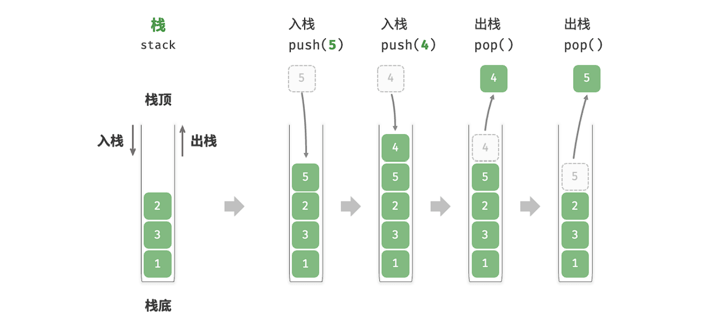
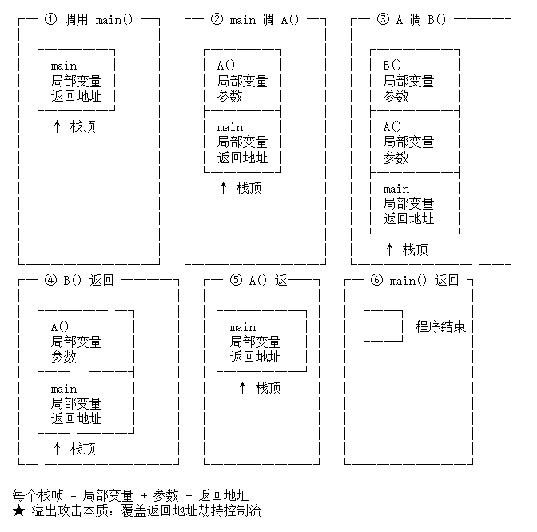

<h2 align="center">第三章 栈</h2>

### （一）栈的基本概念

#### 一、栈的定义

##### 1. 核心定义与特性

栈是一种特殊的**线性表**，其最大的特点是**操作受限**：它只允许在表的一端进行插入和删除操作。

- **核心原则**：**LIFO (Last In, First Out，后进先出)**。最后放进去的元素，必须最先被取出来，就像在桌面上叠放盘子，你只能从最上面拿走或放上新盘子。

##### 2. 基本术语

- **栈顶 (Top)**：允许进行插入和删除操作的一端，处于动态变化中。用栈顶指针`top`来之时栈顶元素
- **栈底 (Bottom)**：固定的、不允许进行任何操作的另一端。
- **空栈**：不包含任何数据元素的栈。
- **入栈 / 压栈 (Push)**：向栈顶添加新元素的操作。
- **出栈 / 退栈 (Pop)**：将栈顶元素删除并取出的操作。



##### 3. 关键数学性质：出栈序列

这是一个非常经典的理论考点。如果 $n$ 个不同的元素依次进栈（中间允许穿插出栈操作），那么能够得到的合法出栈序列的总数，符合**卡特兰数 (Catalan Number)** 公式：

$$
\frac{1}{n+1} C_{2n}^{n}
$$

> **举例**：如果有 3 个元素 `A, B, C` 依次进栈，那么合法的出栈序列共有 $\frac{1}{3+1} C_{6}^{3} = 5$ 种。

##### 4. 常见的实际应用

栈的 LIFO 特性使其在处理具有”嵌套”、”递归”或”回溯”性质的问题时不可或缺：

- **括号匹配**：编译器在词法分析时，检查代码中的 `()`、`[]`、`{}` 是否正确嵌套和成对闭合。
- **表达式求值**：将人类易读的中缀表达式转换为计算机易处理的后缀表达式（逆波兰表达式），并利用栈进行高效计算。
- **图/树的遍历**：在深度优先搜索 (DFS) 中，利用栈来记录当前的搜索路径，以便在到达死胡同时进行回溯。
- **函数调用与系统级应用**：这是栈在底层最核心的应用。程序在运行时，系统会为每个函数分配一个栈帧（Stack Frame），用于存储局部变量、传入参数以及**返回地址**。理解这一底层数据结构的布局，也是进行逆向工程和研究内存破坏漏洞（如通过溢出覆盖返回地址来劫持控制流）的绝对基础。

#### 二、栈的抽象类型数据定义

抽象数据类型（Abstract Data Type, ADT）包含三个核心部分：**数据对象**、**数据关系**和**基本操作**。下面是栈的规范 ADT 定义，采用了教科书中通用的 C/C++ 引用风格描述：

##### 1. 数据对象与数据关系

- **数据对象**：$D = \{a_1, a_2, \dots, a_n\}$，其中 $n \ge 0$。每个 $a_i$ 属于同一种数据类型（ElemType）。
- **数据关系**：$R = \{ <a_{i-1}, a_i> | a_{i-1}, a_i \in D, i=2,\dots,n \}$。
  - 这是一个严格的线性关系。
  - 约定 $a_1$ 为**栈底**（Bottom），$a_n$ 为**栈顶**（Top）。

##### 2. 基本操作 (Operations)

在考察和实际编码中，栈的接口通常被定义为以下几个核心原子操作：

- **`InitStack(&S)`**
  - **操作前提**：无。
  - **操作结果**：构造一个空栈 `S`，分配必要的内存空间。
- **`DestroyStack(&S)`**
  - **操作前提**：栈 `S` 已存在。
  - **操作结果**：销毁栈 `S`，释放其占用的所有内存资源。
- **`StackEmpty(S)`**
  - **操作前提**：栈 `S` 已存在。
  - **操作结果**：若栈为空则返回 `true`，否则返回 `false`。
- **`Push(&S, x)`**
  - **操作前提**：栈 `S` 已存在且未满。
  - **操作结果**：将元素 `x` 压入栈中，使其成为新的栈顶元素。
- **`Pop(&S, &x)`**
  - **操作前提**：栈 `S` 已存在且**非空**。
  - **操作结果**：删除栈顶元素，并用引用参数 `x` 返回其值。
- **`GetTop(S, &x)`**
  - **操作前提**：栈 `S` 已存在且**非空**。
  - **操作结果**：读取当前的栈顶元素，用参数 `x` 返回其值。**注意：此操作不会改变栈的状态（元素不出栈）**。

### （二）顺序栈

顺序栈（Sequential Stack）是利用**一段物理地址连续的存储空间**（即数组）来存储栈内元素的。

在实际的 C/C++ 代码实现以及数据结构考研大纲中，顺序栈通常被分为**静态**和**动态**两种形式。它们的核心区别在于**底层数组的容量是否可以在运行期间发生改变**。

#### 一、静态顺序栈

静态顺序栈的容量在代码编译时就已经固定死，通常通过宏定义来指定数组的大小。这是考试中最常见、最基础的形式。

##### 1. **核心结构定义 (C/C++)：**

```c
#define MAXSIZE 50      // 定义栈中元素的最大个数

typedef struct {
    int data[MAXSIZE];  // 存放栈中元素的静态数组
    int top;            // 栈顶指针
} SqStack;
```

*(注：`top` 通常初始化为 `-1`，表示栈空；此时 `data[top]` 就是栈顶元素。如果 `top` 初始化为 `0`，则它指向栈顶元素的下一个空闲位置。)*

- **静态顺序栈的结构**：栈底固定不变；栈顶随着进栈和退栈的操作变化，用int型变量 `top` 指示栈顶位置。
- **特性分析：**
  - **内存分配**：通常分配在系统的栈区（局部变量）或全局/静态区。空间分配是一次性的。
  - **优点**：实现极其简单，不存在内存泄漏的风险（不需要手动 `free` 或 `delete`），操作速度极快（严格的 $O(1)$ 时间复杂度）。
  - **致命缺点**：缺乏灵活性。如果预设的 `MAXSIZE` 太小，容易发生**上溢（Stack Overflow）**；如果预设太大，又会造成内存空间的严重浪费。

##### 2. 操作

> 以下以 `top = 0` 方案（top 指向下一个空位）为例。

###### ① 初始化

```c++
#include <stdbool.h>

bool InitStack(SqStack &S) {
    S.top = 0;          // top 指向下标 0，表示空栈
    return true;
}
```

| 项目 | 内容 |
|:---|:---|
| 初始值 | `S.top = 0` |
| 判空 | `S.top == 0` |
| 判满 | `S.top == MAXSIZE` |

###### ② 入栈 (Push)

```c++
bool Push(SqStack &S, int x) {
    // ① 进栈先判满
    if (S.top == MAXSIZE)
        return false;

    // ② 将 x 放入当前 top 所指的空位
    S.data[S.top] = x;

    // ③ 栈顶指针后移，指向下一个空位
    S.top++;

    return true;
}
```

| 项目 | 内容 |
|:---|:---|
| 核心步骤 | `S.data[S.top] = x; S.top++`（先存再移） |
| 判满 | `S.top == MAXSIZE` 时返回 false |

###### ③ 出栈 (Pop)

```c++
bool Pop(SqStack &S, int &x) {
    // ① 出栈先判空
    if (S.top == 0)
        return false;

    // ② 栈顶指针前移，指向当前有效的栈顶元素
    S.top--;

    // ③ 取出元素
    x = S.data[S.top];

    return true;
}
```

| 项目 | 内容 |
|:---|:---|
| 核心步骤 | `S.top--; x = S.data[S.top]`（先移再取） |
| 判空 | `S.top == 0` 时返回 false |

###### ④ 销毁 (DestroyStack)

```c++
void DestroyStack(SqStack &S) {
    S.top = 0;          // 静态栈无需释放内存，重置即可
}
```


#### 二、动态顺序栈

为了解决静态栈容量锁死的问题，动态顺序栈在初始化时只分配一个较小的基础容量。当栈满时，它会自动在堆区（Heap）申请一块更大的连续内存，将老数据搬迁过去，从而实现“扩容”。

##### 1. **核心结构定义 (C/C++)：**

```c
#define INIT_SIZE 10    // 初始分配的容量
#define INCREMENT 5     // 每次扩容增加的增量

typedef struct {
    int *data;          // 指向动态分配数组的基址指针
    int top;            // 栈顶指针（这里用作索引）
    int maxSize;        // 栈当前的最大容量
} DynSqStack;
```

##### 2. **扩容核心逻辑（Push 操作的变体）：**

当执行压栈发现 `S.top == S.maxSize - 1` 时，不直接报错，而是调用 `realloc` 函数：

```c++
// 重新分配更大的内存空间
int *newdata = (int *)realloc(S.data, (S.maxSize + INCREMENT) * sizeof(int));
if (newdata) {                      // 分配成功才更新
    S.data = newdata;
    S.maxSize += INCREMENT;         // 更新容量标志
}
// 若 realloc 失败返回 NULL，原 S.data 仍有效，不会泄漏
```

- **特性分析：**

  - **内存分配**：使用 `malloc/new` 分配在系统的**堆区**。需要程序员在销毁栈时手动调用 `free/delete` 释放内存。
  - **优点**：按需分配，极大地提高了内存的利用率，理论上只要物理内存足够，就不会发生上溢。
  - **缺点**：扩容操作（`realloc`）在底层需要寻找新内存并**复制搬运原有数据**，这一瞬间的时间复杂度会退化为 $O(n)$。此外，频繁的动态内存申请容易产生内存碎片。

##### 3. 栈游标 `top` 和 `bottom` 的不同初始化方式

在顺序栈的实现中，`top` 指针的初始化方式决定了判空、判满、入栈、出栈的代码细节。**考研中必须根据题目给定的初始条件来写对应代码**，否则会全错。以下是四种经典初始化方式的完整对比：

###### ① 从下往上增长（bottom → up）

栈底固定在数组下标 `0`，入栈时 `top` 向数组尾方向移动。

**方式一：`top = bottom = 0`**（`top` 指向**下一个可插入的空位**）

```
初始 (top=0)：           入栈 A (top=1)：        入栈 B (top=2)：
┌───┬───┬───┬───┐      ┌───┬───┬───┬───┐      ┌───┬───┬───┬───┐
│   │   │   │   │      │ A │   │   │   │      │ A │ B │   │   │
└───┴───┴───┴───┘      └───┴───┴───┴───┘      └───┴───┴───┴───┘
  ↑                        ↑                        ↑
 top=0                    top=1                    top=2
```

| 操作 | 伪代码 | 说明 |
|:---|:---|:---|
| 初始化 | `top = 0` | top 指向下标 0 |
| 判空 | `top == 0` | 空位在 0，说明没有元素 |
| 判满 | `top == MAXSIZE` | top 已越界到数组之外 |
| 入栈 | `S[top++] = x` | 先存入 x，再移动 top |
| 出栈 | `x = S[--top]` | 先移动 top，再取出 |
| 读栈顶 | `x = S[top - 1]` | 栈顶在 top 左边一位 |
| 元素个数 | `top` | 直接就是个数 |

**方式二：`top = bottom = -1`**（`top` 指向**当前栈顶元素**）

```
初始 (top=-1)：         入栈 A (top=0)：        入栈 B (top=1)：
┌───┬───┬───┬───┐      ┌───┬───┬───┬───┐      ┌───┬───┬───┬───┐
│   │   │   │   │      │ A │   │   │   │      │ A │ B │   │   │
└───┴───┴───┴───┘      └───┴───┴───┴───┘      └───┴───┴───┴───┘
↑                          ↑                        ↑
top=-1                    top=0                    top=1
(数组外)                  (指向A)                  (指向B)
```

| 操作 | 伪代码 | 说明 |
|:---|:---|:---|
| 初始化 | `top = -1` | top 虚拟指向数组外 |
| 判空 | `top == -1` | 没有指向任何有效元素 |
| 判满 | `top == MAXSIZE - 1` | top 指向数组最后一个元素 |
| 入栈 | `S[++top] = x` | 先移动 top，再存入 x |
| 出栈 | `x = S[top--]` | 先取出，再移动 top |
| 读栈顶 | `x = S[top]` | top 直接指向栈顶 |
| 元素个数 | `top + 1` | 下标从 0 开始，需 +1 |

###### ② 从上往下增长（top → down）

栈底固定在数组末尾 `n-1`，入栈时 `top` 向数组头方向移动。**共享栈中的 2 号栈就采用这种方向**。

设数组大小为 `n`，即有效下标范围 `0 ~ n-1`。

**方式三：`top = bottom = n`**（`top` 指向**当前栈顶元素**）

```
初始 (top=n)：           入栈 A (top=n-1)：      入栈 B (top=n-2)：
┌───┬───┬───┬───┐      ┌───┬───┬───┬───┐      ┌───┬───┬───┬───┐
│   │   │   │   │      │   │   │   │ A │      │   │   │ B │ A │
└───┴───┴───┴───┘      └───┴───┴───┴───┘      └───┴───┴───┴───┘
                  ↑                      ↑                  ↑
                 top=n                  top=n-1            top=n-2
                 (数组外)               (指向A)            (指向B)
```

| 操作 | 伪代码 | 说明 |
|:---|:---|:---|
| 初始化 | `top = n` | top 虚拟指向数组尾之外 |
| 判空 | `top == n` | 空位还在起始位置 |
| 判满 | `top == 0` | top 已越过数组头 |
| 入栈 | `S[--top] = x` | 先移动 top，再存入 x |
| 出栈 | `x = S[top++]` | 先取出，再移动 top |
| 读栈顶 | `x = S[top]` | top 指向栈顶元素 |
| 元素个数 | `n - top` | 数组尾到 top 的距离 |

**方式四：`top = bottom = n - 1`**（`top` 指向**下一个可插入的空位**）

```
初始 (top=n-1)：        入栈 A (top=n-2)：      入栈 B (top=n-3)：
┌───┬───┬───┬───┐      ┌───┬───┬───┬───┐      ┌───┬───┬───┬───┐
│   │   │   │   │      │   │   │   │ A │      │   │   │ B │ A │
└───┴───┴───┴───┘      └───┴───┴───┴───┘      └───┴───┴───┴───┘
                  ↑                  ↑                  ↑
                 top=n-1            top=n-2            top=n-3
                 (空栈)             (空位)             (空位)
```

| 操作 | 伪代码 | 说明 |
|:---|:---|:---|
| 初始化 | `top = n - 1` | top 指向最后一个元素（但栈空） |
| 判空 | `top == n - 1` | 未移动过 |
| 判满 | `top == -1` | top 已越界到数组头之外 |
| 入栈 | `S[top--] = x` | 先存入 x，再移动 top |
| 出栈 | `x = S[++top]` | 先移动 top，再取出 |
| 读栈顶 | `x = S[top + 1]` | 栈顶在 top 右边一位 |
| 元素个数 | `n - 1 - top` | — |

###### ③ 四种方式统一对比

| 特性 | 从下往上<br>`top=0` | 从下往上<br>`top=-1` | 从上往下<br>`top=n` | 从上往下<br>`top=n-1` |
|:---|:---:|:---:|:---:|:---:|
| **top 含义** | 下一空位 | 当前栈顶 | 当前栈顶 | 下一空位 |
| **初始值** | `0` | `-1` | `n` | `n-1` |
| **判空** | `top == 0` | `top == -1` | `top == n` | `top == n-1` |
| **判满** | `top == MAXSIZE` | `top == MAXSIZE-1` | `top == 0` | `top == -1` |
| **入栈** | `S[top++] = x` | `S[++top] = x` | `S[--top] = x` | `S[top--] = x` |
| **出栈** | `x = S[--top]` | `x = S[top--]` | `x = S[top++]` | `x = S[++top]` |
| **读栈顶** | `S[top - 1]` | `S[top]` | `S[top]` | `S[top + 1]` |
| **元素个数** | `top` | `top + 1` | `n - top` | `n - 1 - top` |

###### ④ 记忆技巧

.png)

> ⚠️ **考研提醒**：严蔚敏教材默认 `top = 0`（top 指向栈顶下一位置），但很多习题使用 `top = -1`（top 直接指向栈顶）。**审题时先确认题目给的 `top` 初始值，再推导对应的判空、入栈、出栈代码！**

##### 4. 核心操作实现（InitStack / Push / Pop）

动态顺序栈的实现核心在于**动态内存管理**——检测到”栈满”时通过 `realloc` 扩大底层连续内存空间，而不是直接报错。

> 以下 `top` 为索引（指向下一个空位），初始 `top = 0` 表示空栈。

###### ① 初始化 (InitStack)

在堆区申请初始大小的连续空间。

```c++
#include <stdlib.h>
#include <stdbool.h>

bool InitStack(DynSqStack &S) {
    // ① 在堆区分配底层的连续数组空间
    S.data = (int *)malloc(INIT_SIZE * sizeof(int));

    // ② 检查内存是否分配成功
    if (!S.data)
        return false;

    // ③ 空栈：栈顶索引置 0
    S.top = 0;
    S.maxSize = INIT_SIZE;

    return true;
}
```

###### ② 入栈 (Push) —— 最核心的逻辑

**入栈时必须先检查是否栈满！！！** 若满，则调用 `realloc` 追加空间。

```c++
bool Push(DynSqStack &S, int x) {
    // ① 进栈先判满
    if (S.top >= S.maxSize) {

        // ② 追加存储空间
        int *newdata = (int *)realloc(S.data,
            (S.maxSize + INCREMENT) * sizeof(int));

        // ③ 检查是否分配成功
        if (!newdata)
            return false;

        // ④ 更新基址指针和总容量（top 索引不变，数据已自动复制）
        S.data = newdata;
        S.maxSize += INCREMENT;
    }

    // ⑤ 元素入栈（此时一定有空间了）
    S.data[S.top] = x;      // 存入当前 top 指向的空位
    S.top++;                // top 后移，指向下一个空位

    return true;
}
```

*注意：`realloc` 可能会在堆区寻找全新的足够大的连续空间并将原数据复制过去，因此必须更新 `S.data` 指针。`S.top` 是索引，数据搬移后索引关系不变，无需调整。*

###### ③ 出栈 (Pop)

出栈前必须检查是否为空栈。

```c++
bool Pop(DynSqStack &S, int &x) {
    // ① 出栈先判空
    if (S.top == 0)
        return false;

    // ② 栈顶前移，取出元素
    S.top--;
    x = S.data[S.top];

    return true;
}
```

###### ④ 销毁 (DestroyStack)

```c++
void DestroyStack(DynSqStack &S) {
    free(S.data);           // 释放堆区数组
    S.data = NULL;
    S.top = 0;
    S.maxSize = 0;
}
```

---

#### 核心对比

| **维度**                | **静态顺序栈**                     | **动态顺序栈**                       |
| ----------------------- | ---------------------------------- | ------------------------------------ |
| **内存位置**            | 系统栈区或全局/静态数据区          | 系统堆区 (Heap)                      |
| **容量限制**            | 编译时固定 (`MAXSIZE`)，不可变     | 运行时可动态扩容 (`realloc`)         |
| **上溢风险 (Overflow)** | 高（数据量超过 `MAXSIZE` 报错）    | 极低（仅受限于系统物理内存）         |
| **时间复杂度**          | 所有操作严格 $O(1)$                | 绝大部分操作 $O(1)$，扩容瞬间 $O(n)$ |
| **适用场景**            | 数据量最大值**可预测**且不大的情况 | 数据量未知，或波动极大的情况         |

### （三）链栈

链栈（Linked Stack）是用**链表**实现的栈，本质上是一个**只允许在表头进行插入和删除的单链表**。只要内存够就一直能入栈，彻底告别”栈满溢出”。

> **核心设计原则**：栈顶指针必须锚定在链表头部——入栈用头插法、出栈用头删法，均为 $O(1)$。若栈顶在链表尾部，每次入栈找尾结点 + 出栈找前驱都会退化为 $O(n)$。

#### 一、不带头结点链栈

不带头结点是**严蔚敏教材默认形式，408 最常考**。`S`（即 `top`）直接指向第一个数据结点。

##### 1. 核心结构定义

```c
typedef struct LinkNode {
    int data;               // 数据域
    struct LinkNode *next;  // 指针域，指向栈中更底部的元素
} LinkNode, *LiStack;       // LiStack ≡ LinkNode*（栈顶指针类型）
```

> **关键理解**：链栈是倒过来的链表——`next` 指向栈中**下方**的元素。入栈 = 头插法，出栈 = 头删法。

##### 2. 分步图解

**① 初始空栈**

```
S = NULL

    S → NULL

判空：S == NULL  → true ✓
```

**② 入栈 A（空栈插入第一个元素）**

```
① 新建结点 p(data=A, next=NULL)

② p->next = S          p 指向当前栈顶（即 NULL）

③ S = p                S 移到新结点

        S
        ↓   p
        ┌────┬──────┐
        │ A  │ NULL │
        └────┴──────┘
         栈顶(A)

此时栈中元素（从 S 往下）：A
```

**③ 入栈 B（在 A 之上压栈）**

```
① p(data=B) → p->next = S → S = p

        S
        ↓
        ┌────┬──────┐    ┌────┬──────┐
        │ B  │  ────────→│ A  │ NULL │
        └────┴──────┘    └────┴──────┘
         栈顶(B)           栈底(A)

栈中元素：B → A
```

**④ 入栈 C（连续压栈完整形态）**

```
① p(data=C) → p->next = S → S = p

        S
        ↓
        ┌────┬──────┐    ┌────┬──────┐    ┌────┬──────┐
        │ C  │  ────────→│ B  │  ────────→│ A  │ NULL │
        └────┴──────┘    └────┴──────┘    └────┴──────┘
         栈顶(C)                            栈底(A)

栈中元素：C → B → A（next 方向 = 栈顶 → 栈底）
```

**⑤ 出栈 C（正常弹出）**

```
① p = S                锁定栈顶 C
② e = p->data          取出 C
③ S = p->next          S 指向 B
④ free(p)              释放 C

        S
        ↓
        ┌────┬──────┐    ┌────┬──────┐
        │ B  │  ────────→│ A  │ NULL │
        └────┴──────┘    └────┴──────┘
         栈顶(B)           栈底(A)

弹出 C 后的栈：B, A
```

**⑥ 出栈最后一个元素（关键边界！）**

```
栈中只剩 A：

        S
        ↓
        ┌────┬──────┐
        │ A  │ NULL │
        └────┴──────┘

出栈 A：
① p = S                ② e = p->data
③ S = p->next          此时 p->next = NULL → S = NULL
④ free(p)

    S → NULL

判空：S == NULL → true ✓
★ 无需额外判断！S = p->next 自然让 S 变为 NULL
```

##### 3. 操作

###### ① 初始化

```c++
#include <stdlib.h>
#include <stdbool.h>

bool InitStack(LiStack &S) {
    S = NULL;           // 栈顶指针置空，空栈
    return true;
}
```

| 项目 | 内容 |
|:---|:---|
| 初始值 | `S = NULL` |
| 判空 | `S == NULL` |
| 判满 | 不存在（链栈不会满） |

###### ② 入栈 (Push)

```c++
bool Push(LiStack &S, int x) {
    // ① 生成新结点
    LinkNode *p = (LinkNode *)malloc(sizeof(LinkNode));
    if (p == NULL)
        return false;               // 内存耗尽（极罕见）

    // ② 头插法核心两步
    p->data = x;
    p->next = S;                    // 新结点指向当前栈顶
    S = p;                          // 栈顶指针移到新结点
    return true;
}
```

| 项目 | 内容 |
|:---|:---|
| 时间复杂度 | 严格 $O(1)$ |
| 核心步骤 | `p->next = S; S = p`（头插法） |
| 判满 | 不需要——链栈不会满，`malloc` 失败才返回 false |

###### ③ 出栈 (Pop)

```c++
bool Pop(LiStack &S, int &x) {
    // ① 先判空
    if (S == NULL)
        return false;

    // ② 头删法四步
    LinkNode *p = S;                // 暂存栈顶结点
    x = p->data;                    // 取出数据
    S = S->next;                    // 栈顶下移（p->next 为 NULL 时 S=NULL）
    free(p);                        // 释放原栈顶
    return true;
}
```

| 项目 | 内容 |
|:---|:---|
| 时间复杂度 | 严格 $O(1)$ |
| 核心步骤 | `p = S; S = S->next; free(p)`（头删法） |
| 出栈最后一个 | `S = p->next` 自然置 NULL，**无需特殊处理** |

###### ④ 读栈顶 (GetTop)

```c++
bool GetTop(LiStack S, int &x) {
    if (S == NULL)
        return false;               // 栈空
    x = S->data;                    // 直接读 top 所指结点的数据
    return true;
}
```

###### ⑤ 销毁 (DestroyStack)

```c++
void DestroyStack(LiStack &S) {
    while (S != NULL) {
        LinkNode *p = S;            // 逐个释放栈顶结点
        S = S->next;
        free(p);
    }
}
```

#### 二、带头结点链栈

带头结点时 `S`（top）永远指向头结点，真正的栈顶数据在 `S->next`。入栈/出栈逻辑**完全统一**，无需区分空栈边界。

##### 1. 结构定义与图解

```
【空栈】
        S
        ↓
        ┌────┬──────┐
        │  ? │ NULL │     ← 头结点（data 域不使用）
        └────┴──────┘
判空：S->next == NULL → true ✓

【入栈 A, B 后】
        S
        ↓
        ┌────┬──────┐    ┌────┬──────┐    ┌────┬──────┐
        │  ? │  ────────→│ B  │  ────────→│ A  │ NULL │
        └────┴──────┘    └────┴──────┘    └────┴──────┘
         头结点            栈顶(B)           栈底(A)
```

##### 2. 操作

###### ① 初始化

```c++
#include <stdlib.h>
#include <stdbool.h>

bool InitStack(LiStack &S) {
    S = (LinkNode *)malloc(sizeof(LinkNode));   // 创建头结点
    if (S == NULL)
        return false;
    S->next = NULL;
    return true;
}
```

| 项目 | 内容 |
|:---|:---|
| 初始值 | `S = malloc(sizeof(LinkNode)); S->next = NULL` |
| 判空 | `S->next == NULL` |
| 比不带头结点 | 多一个头结点的 malloc/free 开销 |

###### ② 入栈 (Push)

```c++
bool Push(LiStack &S, int x) {
    LinkNode *p = (LinkNode *)malloc(sizeof(LinkNode));
    if (p == NULL)
        return false;

    p->data = x;
    p->next = S->next;          // 新结点指向当前栈顶（可能是 NULL）
    S->next = p;                // 头结点链到新结点
    return true;
}
```

| 项目 | 内容 |
|:---|:---|
| 核心步骤 | `p->next = S->next; S->next = p` |
| 与不带头结点的区别 | 操作对象是 `S->next` 而不是 `S` 本身 |

###### ③ 出栈 (Pop)

```c++
bool Pop(LiStack &S, int &x) {
    if (S->next == NULL)
        return false;               // 判空

    LinkNode *p = S->next;          // 锁定栈顶数据结点
    x = p->data;                    // 取出数据
    S->next = p->next;              // 头结点跳过 p
    free(p);                        // 释放
    return true;
}
```

| 项目 | 内容 |
|:---|:---|
| 核心步骤 | `p = S->next; S->next = p->next; free(p)` |
| 出栈最后一个 | `S->next = p->next` 自然置 NULL，同样无需特殊处理 |

###### ④ 销毁 (DestroyStack)

```c++
void DestroyStack(LiStack &S) {
    while (S->next != NULL) {       // 跳过数据结点
        LinkNode *p = S->next;
        S->next = p->next;
        free(p);
    }
    free(S);                        // 最后释放头结点
    S = NULL;
}
```

#### 三、不带头结点 vs 带头结点 对比

| 维度 | 不带头结点 | 带头结点 |
|:---|:---|:---|
| 初始值 | `S = NULL` | `S = malloc(…); S->next = NULL` |
| 判空 | `S == NULL` | `S->next == NULL` |
| 入栈 | `p->next = S; S = p` | `p->next = S->next; S->next = p` |
| 出栈 | `p = S; S = S->next; free(p)` | `p = S->next; S->next = p->next; free(p)` |
| 出栈最后元素 | `S = p->next` → NULL | `S->next = p->next` → NULL |
| 内存 | 省一个头结点 | 多一个头结点（`sizeof(LinkNode)`） |
| **考研倾向** | **★ 严蔚敏教材默认，最常考** | 考试较少出现 |

#### 四、链栈 vs 顺序栈 对比

| 维度 | 顺序栈 | 链栈 |
|:---|:---|:---|
| 存储方式 | 连续数组 | 离散结点（单链表） |
| 栈顶表示 | `int top`（下标） | `LiStack S`（指针） |
| 容量 | 有限（静态）/ 可扩（动态） | 无限（仅受物理内存限制） |
| 判满 | `top == MAXSIZE` 等 | 不存在（`malloc` 失败才满） |
| 判空 | `top == -1` / `top == 0` | `S == NULL`（不带头） |
| 入栈 | $O(1)$，偶尔 $O(n)$（扩容时） | 严格 $O(1)$（头插法） |
| 出栈 | $O(1)$ | 严格 $O(1)$（头删法） |
| 扩容 | `realloc`，需搬运数据 | 天然动态，无需扩容 |
| 内存开销 | 无指针开销，可能浪费预分配空间 | 每个结点多一个 `next` 指针 |
| 适用场景 | 元素个数可预估 | 元素个数未知、波动极大 |

### （四）栈的应用

题目中可以直接使用的函数：

- **初始化 (`initStack`)**：在 C++ 中直接声明 `std::stack<int> S;`，底层构造函数会自动替你完成空间的分配和基准线的设置。
- **压栈 (`push`)**：调用 `S.push(e)`，底层会自动处理扩容（通常复用了动态数组 `vector` 或双端队列 `deque` 的机制）。
- **栈顶 (`top`)**：调用 `S.top()`，它会返回栈顶元素的引用，你可以直接读取，此时数据**还在栈里**。
- **弹栈 (`pop`)**：调用 `S.pop()`。这里有一个容易踩坑的区别：理论上的 `pop(S, &e)` 通常是“取数据 + 删节点”二合一；但在 C++ 标准库中，`pop()` **只负责删除栈顶，没有返回值**。所以标准的出栈动作往往是先 `e = S.top()` 取出，再 `S.pop()` 删掉。

#### 一、括号匹配

括号匹配（Bracket Matching）是栈最经典、最基础的应用，也是各大计算机考试和面试中的高频考点。编译器在进行词法分析时，检查代码里的括号是否成对、正确嵌套，底层靠的就是这个算法。

##### 1. 算法核心思想

这个算法完美利用了栈 **LIFO（后进先出）** 的特性，因为**最后出现的左括号，必须最先遇到与其配对的右括号**。

算法流程可以浓缩为以下四步：

1. **遍历字符串**：从左到右依次读取字符。
2. **遇左则入**：如果遇到左括号 `(`、`[`、`{`，直接压入栈中。
3. **遇右则弹**：如果遇到右括号 `)`、`]`、`}`，则弹出当前的栈顶元素进行比对：
   - 如果能配对（如栈顶是 `[`，当前是 `]`），则继续扫描。
   - **[失败情况 A]** 如果类型不匹配（如栈顶是 `(`，当前是 `]`），直接判定非法！
   - **[失败情况 B]** 如果此时栈**已经空了**，说明右括号多余了（如 `())`），直接判定非法！
4. **终局判定**：字符串遍历结束后，检查栈。
   - 如果栈为空，说明所有括号完美配对，**匹配成功**。
   - **[失败情况 C]** 如果栈还不为空，说明左括号多余了（如 `(()`），判定非法！

##### 2. 具体算法

```c++
#include <stdlib.h>
#include <stdbool.h>

// 假设 SqStack 以及 Push, Pop, StackEmpty 函数已正确实现
bool MatchBrackets(SqStack &S) {
    char ch, x;
    
    // 持续读取字符，直到遇到回车符（'\n'）
    while (scanf("%c", &ch) != EOF && ch != '\n') {
        
        // 1. 遇左括号压栈
        if (ch == '(' || ch == '[') {
            Push(S, ch);
        } 
        // 2. 遇右括号弹栈比对
        else if (ch == ')' || ch == ']') {
            
            // 【防御核心】出栈前必须判空！防止右括号多余
            if (StackEmpty(S)) {
                printf("匹配失败：右括号多余！\n");
                return false;
            }
            
            // 弹出栈顶元素到 x 中
            Pop(S, x); 
            
            // 检查括号类型是否匹配
            if ((ch == ')' && x != '(') || (ch == ']' && x != '[')) {
                printf("匹配失败：括号类型不匹配！\n");
                return false; 
            }
        }
    }
    
    // 3. 终局判断：字符串读取完毕后，栈必须为空
    if (!StackEmpty(S)) {
        printf("匹配失败：左括号多余！\n");
        return false;
    }
    
    printf("匹配成功！\n");
    return true;
}
```

**ASCII 图解：匹配 `[ ( ) { } ]`**

```
┌─ 步骤1：读入 '[' ────────────┐  ┌─ 步骤2：读入 '(' ────────────┐
│ 遇左括号，压栈                │  │ 遇左括号，压栈               │
│   +---+                    │  │   +---+                    │
│   | [ | ← 栈顶=栈底          │  │   | ( | ← 栈顶             │
│   +---+                    │  │   | [ | ← 栈底              │
│                            │  │   +---+                    │
└───────────────────── ──────┘  └────────────────────────────┘

┌─ 步骤3：读入 ')' ────────────┐  ┌─ 步骤4：读入 '{' ────────────┐
│ 遇右括号，弹栈比对            │  │ 遇左括号，压栈                │
│  弹出 '(' → 与 ')' 配对! ✓  │  │   +---+                     │
│   +---+                    │  │   | { | ← 栈顶              │
│   | [ | ← 剩下              │  │   | [ | ← 栈底              │
│   +---+                    │  │   +---+                     │
└────────────────────────────┘  └─────────────────────────────┘

┌─ 步骤5：读入 '}' ────────────┐  ┌─ 步骤6：读入 ']' ────────────┐
│ 遇右括号，弹栈比对            │  │ 遇右括号，弹栈比对             │
│   弹出 '{' → 与 '}' 配对! ✓  │  │   弹出 '[' → 与 ']' 配对! ✓  │
│   +---+                    │  │   +---+                     │
│   | [ | ← 剩下              │  │   |   | ← 空栈，匹配成功!     │
│   +---+                    │  │   +---+                     │
└────────────────────────────┘  └─────────────────────────────┘
```

#### 二、进制转换

##### 1. 算法过程

**第一步：环境初始化**

1. 构造一个空的顺序栈（或链栈）`S`，用于暂时存储后续计算产生的余数。
2. 准备一个普通整型变量 `e`，用于在最后阶段接收出栈的数据。

**第二步：除基取余，顺序入栈 (核心计算层)**

当被转换的十进制数 $n > 0$ 时，持续执行以下循环：

1. **求余**：计算当前 $n$ 除以目标进制 $d$ 的余数，记为 $k$（公式：$k = n \bmod d$）。这个余数实际上就是目标进制的某一位数字。
2. **压栈**：将产生的余数 $k$ 压入栈 `S` 的栈顶。
3. **降维**：更新 $n$ 的值，将其替换为商，即 $n = n / d$（整数除法，向下取整），为下一次计算做准备。

**第三步：逆序出栈，完成转换 (核心输出层)**

当上述循环结束（即 $n = 0$）时，所有的余数都已经按照“从低位到高位”的顺序堆叠在栈中。

当栈 `S` 不为空时，持续执行以下循环：

1. **弹栈**：将栈顶元素弹出，并赋值给变量 `e`。

2. **输出**：打印变量 `e` 的值。

   *(利用栈后进先出的特性，最先算出的低位余数被压在栈底最后输出，最后算出的高位余数在栈顶最先输出，完美实现逆序。)*

##### 2. 算法实现

```c++
#include <stdlib.h>
#include <stdbool.h>

void Conversion(int n, int d) {
    /* 将十进制整数 n 转换为 d (2或8) 进制数 */
    SqStack S; 
    int k, e;

    // 1. 初始化栈
    InitStack(S); 

    // 2. 除基取余，压入栈中
    while (n > 0) {
        k = n % d;
        Push(S, k);
        n = n / d;
    }

    // 3. 栈不空时出栈，逆序输出
    while (!StackEmpty(S)) { 
        Pop(S, e);
        printf(“%d”, e);
    }
    
    printf(“\n”);
}
```

**ASCII 图解：十进制 13 → 二进制 1101**

```
【”除基取余，顺序入栈”】         【”逆序出栈”】
n=13: 13%2=1 → Push(1)          Pop → 1 (最高位)
n=6 :  6%2=0 → Push(0)          Pop → 1
n=3 :  3%2=1 → Push(1)          Pop → 0
n=1 :  1%2=1 → Push(1)          Pop → 1 (最低位)
n=0 : 结束

入栈后栈底→顶: [1][0][1][1]     出栈顺序: 1→1→0→1 → 结果 1101 ✓
```

#### 三、递归调用

递归调用（Recursive Call）是计算机科学中最具数学美感的机制之一。简单来说，就是**一个函数在执行的过程中，直接或间接地调用了它自己**。

如果你在准备 11408 数据结构或进行底层安全分析，理解递归就绝不能只停留在“函数调函数”的表面，必须深挖到内存层面：**递归的底层基石，就是系统栈（System Call Stack）。**

##### 1. 递归的两大绝对铁律

任何一个能成功运行的递归函数，都必须包含这两个部分，缺一不可：

- **边界条件（Base Case / 出口）**：必须有一个明确的条件，在满足时不再往下调用，直接返回。否则就会陷入无限死循环，直到内存爆炸。
- **递归方程（Recursive Step）**：将一个庞大的问题，分解为一个与原问题**性质相同但规模更小**的子问题，并向着边界条件收敛。

##### 2. 底层真相：系统栈与“栈帧” (Stack Frame)

当你用高级语言写下一句 `return n * factorial(n - 1);` 时，CPU 是如何记住算完 `factorial(n - 1)` 之后还要回来乘以 `n` 的？

答案就在操作系统的**调用栈**里。每一次函数调用，系统都会在内存的栈区中为这次调用划分一块专属领地，称为**栈帧（Stack Frame）**。

一个完整的栈帧通常包含三大核心机密：

1. **传入的参数（Parameters）**：比如当前轮次的 `n` 是几。
2. **局部变量（Local Variables）**：该函数内部声明的临时变量。
3. **返回地址（Return Address）**：最致命的数据。它记录了当前这个函数执行完毕后，CPU 的程序计数器（PC）应该跳回到上一层代码的哪一行继续执行。*(注：在安全攻防和漏洞挖掘中，经典的“缓冲区溢出攻击”就是通过覆盖掉这个返回地址，来劫持程序的执行流。)*

##### 3. 递归的执行宏观轨迹

递归的过程可以拆分为“递”和“归”两个半场：

- **“递”的过程（疯狂压栈）**：函数不断调用自身，系统栈一层一层往上叠栈帧。此时没有任何一个函数真正执行完毕，都在“挂机”等待下一层返回结果。
- **“归”的过程（疯狂弹栈）**：一旦触碰到边界条件，最顶层的函数终于算出了具体数值，它带着结果出栈，并根据“返回地址”回到上一层。上一层拿到结果后也算出了自己的值，继续出栈……直到最初的调用者拿到最终结果。

##### 4. 递归的优劣势 (11408 核心考点)

| **维度**                    | <nobr>**评价**</nobr> | **详解**                                                     |
| --------------------------- | --------------------- | ------------------------------------------------------------ |
| <nobr>**代码表达**</nobr>   | **极优**              | 逻辑极度清晰，代码极其简洁。处理树形结构（如二叉树遍历）、图的深度优先搜索（DFS）等问题时，几行代码就能搞定。 |
| <nobr>**空间复杂度**</nobr> | **极差**              | 递归深度为 $n$ 时，系统需要同时维持 $n$ 个栈帧，空间复杂度往往高达 $O(n)$。如果深度过大，极易引发致命的**栈溢出 (Stack Overflow)**。 |
| **时间效率**                | **较差**              | 频繁的压栈、弹栈、现场保护和恢复，带来了巨大的系统开销。如果是像斐波那契数列（Fibonacci）那样包含大量重复子问题的递归，时间复杂度会飙升至 $O(2^n)$。 |

**ASCII 图解：`factorial(3)` 递归栈帧推演**

.png)

#### 四、函数调用

理解了递归的“自我调用”，我们再把视角稍微拉远一点，来看看最普适的**函数调用（Function Call）**。

在计算机底层，不管是函数 A 调用函数 B，还是函数 A 调用自己，本质上都是一次“控制流的劫持与恢复”。CPU 就像一个极其专注的单核工人，当它正在执行函数 A 的代码时，突然遇到了调用函数 B 的指令，它必须立刻放下手头的工作去执行 B。

但问题是：**B 执行完之后，CPU 怎么知道该回到 A 的哪里继续干活？A 之前算到一半的临时数据怎么办？**

这就必须请出系统底层的“幕后黑手”——**系统调用栈（System Call Stack）**。

##### 1. 核心机密：栈帧 (Stack Frame) 的解剖

每当发生一次函数调用，操作系统就会在内存的栈区，为这个函数“圈”出一块专属的地盘，这块地盘就叫**栈帧**（在一些教材中也叫“活动记录”）。

一个标准的栈帧，从底向上通常包含以下四大核心情报：

1. **传入的参数 (Parameters)**：调用者传给这个函数的变量值。
2. **返回地址 (Return Address)**：这是最致命的数据！它记录了当前函数执行完毕后，CPU 的指令指针（PC/EIP）应该跳回到上一层代码的哪一行。
3. **现场保护 (Saved Registers)**：保存调用者原来的底层寄存器状态（如 EBP 栈基址指针），确保等会儿回去的时候，调用者的环境没有被破坏。
4. **局部变量 (Local Variables)**：当前函数内部声明的临时变量。

##### 2. 调用的微观全过程 (Push 与 Pop 的交响乐)

当你写下一句 `funcB(5)` 时，底层其实发生了一连串惊心动魄的入栈出栈操作：

- **“去”的过程（Call / 压栈）：**
  1. **参数入栈**：将数字 `5` 压入系统栈。
  2. **返回地址入栈**：将 `funcB(5)` 这一行**下一条指令**的内存地址压栈。
  3. **现场保护**：保存当前函数的栈底指针。
  4. **开辟新领地**：栈顶指针（ESP）继续向上移动，为 `funcB` 的局部变量腾出空间。此时，CPU 控制权正式移交给 `funcB`。
- **“回”的过程（Return / 弹栈）：**
  1. **保存战果**：将 `funcB` 的计算结果（返回值）放入一个专门的寄存器（如 EAX）中。
  2. **销毁领地**：将栈顶指针降回来，废弃掉所有的局部变量（这就是为什么函数运行结束后，局部变量就消失了）。
  3. **恢复现场**：弹出之前保存的栈底指针。
  4. **精准跳回**：弹出**返回地址**，将其塞给 CPU 的指令寄存器。CPU 瞬间”穿越”回原来的函数，继续往下执行。

**ASCII 图解：`main() → A() → B()` 调用链栈帧变化**



#### 五、表达式求值

人类习惯阅读的是**中缀表达式**（例如 `3 + 4 * 2`），因为我们能一眼看懂全貌并识别出乘除的优先级较高。但计算机的编译器在扫描代码时是“近视”的，它只能从左到右一个个读取字符，遇到 `+` 的时候，它根本不知道后面是不是还藏着个 `*` 或括号。

为了解决这个问题，计算机科学家（确切地说是图灵奖得主 Dijkstra）发明了经典的**调度场算法 (Shunting-yard algorithm)**，利用栈将中缀表达式转化为计算机极易处理的**后缀表达式（逆波兰表达式）**，然后再进行计算。

整个过程分为两大堪称艺术的阶段：

##### 阶段一：中缀表达式转后缀表达式（核心难点）

这是考察的绝对重心。这一步需要借助一个操作符栈（Operator Stack）来暂存还未确定执行时机的运算符。

**核心运算铁律：**

1. **遇到操作数（数字或字母）**：不要犹豫，直接输出到结果序列中。
2. **遇到左括号 `(`**：它的优先级最高，直接压入操作符栈。
3. **遇到右括号 `)`**：开始疯狂弹栈并输出到结果序列，直到弹出对应的左括号 `(` 为止（注意：括号对互相抵消，不输出）。
4. **遇到运算符（`+`, `-`, `\*`, `/`）**：这是最容易错的地方。
   - 将它与当前栈顶的运算符比较优先级。
   - **如果栈顶的优先级 $\ge$ 当前运算符的优先级**，说明栈顶的那个运算早就该执行了，把栈顶弹出并输出。继续比较，直到栈顶优先级更低或栈空。
   - 最后，将当前运算符压入栈中。
5. **处理尾声**：表达式扫描结束后，如果操作符栈里还有东西，全部弹栈并输出。

*(原理隐喻：优先级高的运算符就像急脾气，不能被优先级低的压在下面；一旦遇到优先级更低的压过来，急脾气就必须立刻出栈去执行。)*

##### 阶段二：后缀表达式求值

后缀表达式（例如 `3 4 2 * +`）中没有括号，也不需要考虑优先级，极其适合计算机无脑执行。

这一步需要借助一个**操作数栈（Operand Stack）**：

1. 遇到数字：直接压栈。
2. 遇到运算符：从栈顶弹出**两个**操作数，进行计算（**注意顺序**：次栈顶元素 运算 栈顶元素），然后将算出的新结果压回栈中。
3. 扫描结束后，栈中最后剩下的那个数字，就是最终的答案。

##### 完整示例：`b - (a + 5) * 3`（代入 $a = 2, b = 30$）

**第一阶段：中缀转后缀（调度场算法）**

| 步骤 | 读入 | 操作符栈 (底→顶) | 输出区 | 判定逻辑 |
|:---:|:---|:---|:---|:---|
| 1 | `b` | `[ ]` | `b` | 操作数，直接输出 |
| 2 | `-` | `[ - ]` | `b` | 栈空，直接压入 |
| 3 | `(` | `[ -, ( ]` | `b` | 左括号，直接压入 |
| 4 | `a` | `[ -, ( ]` | `b a` | 操作数，直接输出 |
| 5 | `+` | `[ -, (, + ]` | `b a` | 栈顶是 `(`，直接压入 |
| 6 | `5` | `[ -, (, + ]` | `b a 5` | 操作数，直接输出 |
| 7 | `)` | `[ - ]` | `b a 5 +` | **弹栈!** 弹出 `+` 直到遇 `(` 抵消 |
| 8 | `*` | `[ -, * ]` | `b a 5 +` | `*` 优先级 > 栈顶 `-`，压入 |
| 9 | `3` | `[ -, * ]` | `b a 5 + 3` | 操作数，直接输出 |
| 10 | 结束 | `[ ]` | `b a 5 + 3 * -` | 弹空栈中剩余 `*` `-` |

> 战果：后缀表达式 **`b a 5 + 3 * -`**

**阶段一关键时刻 ASCII 栈快照**

.png)

**第二阶段：后缀表达式求值（代入 $b=30, a=2$）**

扫描：`30 2 5 + 3 * -`

| 步骤 | 读入 | 操作数栈 (底→顶) | 计算动作 |
|:---:|:---|:---|:---|
| 1 | `30` | `[ 30 ]` | 数字，压栈 |
| 2 | `2` | `[ 30, 2 ]` | 数字，压栈 |
| 3 | `5` | `[ 30, 2, 5 ]` | 数字，压栈 |
| 4 | `+` | `[ 30, 7 ]` | 弹出 5,2 → **2+5=7**，7 压栈 |
| 5 | `3` | `[ 30, 7, 3 ]` | 数字，压栈 |
| 6 | `*` | `[ 30, 21 ]` | 弹出 3,7 → **7×3=21**，21 压栈 |
| 7 | `-` | `[ 9 ]` | 弹出 21,30 → **30−21=9**，9 压栈 |
| 8 | 结束 | `[ 9 ]` | 栈中唯一数字 **9** = 最终答案! |

**阶段二关键时刻 ASCII 栈快照**

```
┌─ 时刻4：压入 30,2,5 后遇到 '+' ───────────────────────────────┐
│                                                            │
│   +-----+        弹出栈顶两数：                              │
│   |  5  | ← 弹出 → 右操作数 = 5                              │
│   |  2  | ← 弹出 → 左操作数 = 2                              │
│   |  30 |                                                  │
│   +-----+        CPU：2 + 5 = 7 → 压回 7                    │
│   操作数栈        操作后栈：[30, 7]                           │
└────────────────────────────────────────────────────────────┘

┌─ 时刻5：算完加法，读入 3，遇到 '*' ───────────────────────────┐
│                                                           │
│   +-----+        弹出栈顶两数：                             │
│   |  3  | ← 弹出 → 右操作数 = 3                             │
│   |  7  | ← 弹出 → 左操作数 = 7                             │
│   |  30 |                                                 │
│   +-----+        CPU：7 × 3 = 21 → 压回 21                 │
│   操作数栈        操作后栈：[30, 21]                         │
└───────────────────────────────────────────────────────────┘

┌─ 时刻6：遇到最后的 '-' ───────────────────────────────────────┐
│                                                            │
│   +-----+        弹出栈顶两数：                              │
│   |  21 | ← 弹出 → 右操作数 = 21                             │
│   |  30 | ← 弹出 → 左操作数 = 30                             │
│   +-----+        CPU：30 - 21 = 9 → 压回 9                  │
│   操作数栈        操作后栈：[9]                               │
└────────────────────────────────────────────────────────────┘

┌─ 大结局：表达式全部读完 ──────────────────────────────────────┐
│                                                           │
│   +-----+                                                 │
│   |  9  | ← 最终答案                                       │
│   +-----+                                                 │
│   操作数栈        结果 = 9 ✓                                │
└───────────────────────────────────────────────────────────┘
```

> **核心理解**：阶段一栈 = "推迟执行"（低优先级压下，高优先级在上出击）；阶段二栈 = "缓冲数据"（没轮到计算的数字暂存，随用随取）。

