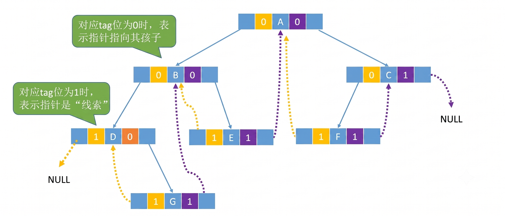

<h2 align="center">第五章 树与二叉树</h2>

### （一）树的基本概念

#### 一、树的定义与术语

##### 1. 定义

树（Tree）是 $n (n \ge 0)$ 个结点的有限集。$n=0$ 时称为**空树**。非空树满足：
- 有且仅有一个**根结点（Root）**
- 其余结点可分为 $m (m \ge 0)$ 个互不相交的有限集 $T_1, T_2, \dots, T_m$，每个集合本身又是一棵树，称为根的**子树（Subtree）**

##### 2. 基本术语

```
                    A           ← 根结点（Root）
                  / | \
                 B  C  D        ← A 的孩子（Child），A 是 B,C,D 的双亲（Parent）
                / \    |
               E   F   G        ← 兄弟（Sibling）：B,C,D 互为兄弟
              / \               ← 堂兄弟（Cousin）：E,F 与 G 互为堂兄弟
             J   K              ← （双亲互为兄弟的结点）
            / \                 ← 叶子（Leaf）：K,F,G 没有孩子
           L   M                 ← 分支结点：除叶子外的结点
                                ← 祖先：A→B→E→J（路径上所有结点）
                                ← 子孙：B 的子孙 = E,F,J,K,L,M
```

| 术语 | 含义 |
|:---|:---|
| 结点的**度** | 该结点的孩子个数。上图中 A 的度为 3，B 的度为 2 |
| 树的**度** | 树中所有结点的最大度。上图树的度为 3 |
| **层数（深度）** | 根为第 1 层，孩子层数 = 双亲层数 + 1 |
| 树的**高度（深度）** | 树中结点的最大层数 |
| **兄弟** | 同一双亲的孩子之间互称兄弟 |
| **堂兄弟** | 双亲互为兄弟的结点。上图中 E、F（父 B）与 G（父 D）互为堂兄弟 |
| **有序树 / 无序树** | 子树是否有左右顺序之分 |
| **森林** | $m (m \ge 0)$ 棵互不相交的树的集合 |

#### 二、树的性质（408 常考）

| # | 性质 | 公式 |
|:---|:---|:---|
| 1 | 树中结点数 = 所有结点度之和 + 1 | $n = \sum d_i + 1$ |
| 2 | 度为 $m$ 的树，第 $i$ 层最多 $m^{i-1}$ 个结点 | $i \ge 1$ |
| 3 | 高度为 $h$ 的 $m$ 叉树最多 $\frac{m^h - 1}{m - 1}$ 个结点 | $m > 1$ |
| 4 | $n$ 个结点的 $m$ 叉树最小高度 | $\lceil \log_m(n(m-1)+1) \rceil$ |

> **性质 1 推导**：除根结点外，每个结点恰好由一条边连接其双亲。$n$ 个结点有 $n-1$ 条边，而每条边对应一个结点的度，故 $\sum d_i = n-1$，即 $n = \sum d_i + 1$。

#### 三、树的存储结构

##### 1. 双亲表示法

数组存结点，每个结点只记双亲下标。找双亲 $O(1)$，找孩子需遍历。

```c
#define MAX_TREE_SIZE 100

// 单个结点定义
typedef struct {
    int data;           // 数据域
    int parent;         // 双亲下标（根结点的 parent = -1）
} PTNode;

/*
结点结构（双亲表示法）：
┌──────┬────────┐
│ data │ parent │
└──────┴────────┘
*/

// 整棵树定义
typedef struct {
    PTNode nodes[MAX_TREE_SIZE];
    int num, root;      // n: 当前结点数; r: 根结点在数组中的位置（下标）
} PTree;
```

```
示例树：                  双亲表示法存储：
       A(0)              下标  data  parent
     /  |  \             0     A     -1（根）
  B(1) C(2) D(3)         1     B      0
   |                     2     C      0
  E(4)                   3     D      0
                         4     E      1
```

##### 2. 孩子表示法（孩子链表）

每个结点拉一条链表串起所有孩子。找孩子方便，找双亲需遍历所有链表。

```c
typedef struct CTNode {         // 孩子链表结点
    int child;                  // 孩子结点在数组中的下标
    struct CTNode *next;        // 下一个兄弟
} *ChildPtr;

typedef struct {                // 数组元素（头结点）
    int data;                   // 数据域
    ChildPtr firstchild;        // 指向第一个孩子的链表
} CTBox;

/*
头结点结构（孩子表示法）：
┌──────┬─────────────┐
│ data │ firstchild  │
└──────┴──────┬──────┘
              ↓
         ┌─────┬──────┐    ┌─────┬──────┐
         │child│ next │───→│child│ next │───→ NULL
         └─────┴──────┘    └─────┴──────┘
           孩子链表结点
*/

typedef struct {                // 整棵树
    CTBox nodes[MAX_TREE_SIZE];
    int num, root;              // 结点数 + 根结点下标
} CTree;
```

```
示例树：                  孩子链表存储：
      A(0)              下标  data  firstchild
    / | \                0     A  ──→ [1]→[2]→[3]→NULL
  B(1) C(2) D(3)         1     B  ──→ [4]→NULL
   |                     2     C  ──→ NULL
  E(4)                   3     D  ──→ NULL
                         4     E  ──→ NULL
```

##### 3. 孩子兄弟表示法（二叉链表）

左指针指向第一个孩子，右指针指向下一个兄弟。与二叉树存储完全一致——这是树 ↔ 二叉树转换的基础。

```c
typedef struct CSNode {
    int data;                   // 节点数据
    struct CSNode *firstchild;  // 第一个孩子
    struct CSNode *nextsibling; // 下一个兄弟
} CSNode, *CSTree;
```

```
结点结构（孩子兄弟表示法）：
┌─────────────┬──────┬──────────────┐
│ firstchild  │ data │ nextsibling  │
└──────┬──────┴──────┴──────┬───────┘
       ↓ 指向第一个孩子       → 指向下一个兄弟
```

```
示例树：                    孩子兄弟链表存储：
      A                         A
    / | \                     /
  B   C   D          ──→    B → C → D
  |                         |       |
  E                         E      NULL
                            |
                           NULL

关键：firstchild 向下指第一个孩子，nextsibling 向右指下一个兄弟
      A.firstchild = B    B.nextsibling = C    C.nextsibling = D
      B.firstchild = E    C.firstchild = NULL  D.firstchild = NULL
      E.firstchild = NULL
```

---

### （二）二叉树

#### 一、二叉树的定义

二叉树是 $n (n \ge 0)$ 个结点的有限集，每个结点**最多有两棵子树**（左子树和右子树），**有左右之分**，即使只有一棵子树也要区分左右。

##### 五种基本形态

```
空树      单结点     只有左子树       只有右子树        左右子树都有
  ∅        ○           ○              ○                ○
                      /                \              / \
                     ○                   ○           ○   ○
```

#### 二、二叉树的性质（408 必考）

| # | 性质 | 公式 |
|:---|:---|:---|
| 1 | 第 $i$ 层最多 $2^{i-1}$ 个结点 | $i \ge 1$ |
| 2 | 深度为 $k$ 的二叉树最多 $2^k - 1$ 个结点 | $k \ge 1$ |
| 3 | $n_0 = n_2 + 1$ | 叶子数 = 度为 2 的结点数 + 1 |
| 4 | $n$ 个结点的完全二叉树深度 $\lfloor \log_2 n \rfloor + 1$ | — |
| 5 | 完全二叉树按层编号：$i$ 的左孩子 $2i$，右孩子 $2i+1$，双亲 $\lfloor i/2 \rfloor$ | $i \ge 1$ |

#### 三、满二叉树

> 一棵深度为 $k$ 且有 $2^k - 1$ 个结点的二叉树。

```
满二叉树（k=3，结点数=7）：
按层编号 1,2,3,...

      A(1)
     /    \
   B(2)   C(3)
   /  \   /  \
 D(4) E(5)F(6)G(7)

特点：每层都满，不存在度为 1 的结点
```

| 性质 | 内容 |
|:---|:---|
| 结点数 | 深度 $k$ 的满二叉树恰有 $2^k - 1$ 个结点 |
| 编号规则 | 按层序从 1 开始编号 |
| 孩子编号 | 编号 $i$ 的左孩子 = $2i$，右孩子 = $2i+1$ |
| 双亲编号 | 编号 $i$ 的双亲 = $\lfloor i/2 \rfloor$ |
| 叶子位置 | 全部在第 $k$ 层，共 $2^{k-1}$ 个 |
| 分支结点 | 全部在 $1 \sim k-1$ 层，每个度均为 2 |

#### 四、完全二叉树

> 深度为 $k$、有 $n$ 个结点的二叉树，当且仅当其每个结点都与深度为 $k$ 的满二叉树中编号 1~n 的结点**一一对应**。

```
完全二叉树（k=3，n=6）：         不是完全二叉树：
编号 1~6 与满二叉树前 6 个完全一致     编号 7 空了但 6 在 → 不允许"中间缺"

      A(1)                                  A(1)
     /    \                                /    \
   B(2)   C(3)                          B(2)   C(3)
  /  \     /                             /  \      \
D(4) E(5) F(6)                       D(4) E(5)    G(7)
                                              ↑
                                         F(6) 缺失，编号不连续
```

| 性质 | 内容 |
|:---|:---|
| 形态约束 | 只有最后一层可以不满，且结点必须靠左连续排列 |
| 叶子分布 | 只可能出现在最大的两层 |
| 度为 1 的结点 | 最多只有 1 个，且只有左孩子 |
| 编号规则 | 与满二叉树相同：$i$ 的左孩子 $2i$，右孩子 $2i+1$，双亲 $\lfloor i/2 \rfloor$ |
| 深度公式 | $k = \lfloor \log_2 n \rfloor + 1$（$n$ 个结点的完全二叉树深度） |
| 顺序存储 | 最适合用数组存储，无空间浪费 |

#### 五、满二叉树 vs 完全二叉树 对比

| 维度 | 满二叉树 | 完全二叉树 |
|:---|:---|:---|
| 每层 | 全部满 | 仅最后一层可缺 |
| 结点数 | 固定 $2^k-1$ | 任意 $\le 2^k-1$ |
| 度为 1 的结点 | 0 个 | 最多 1 个（且只有左孩子） |
| 数组存储 | 无浪费 | 无浪费 |
| 关系 | 满二叉树 ⊆ 完全二叉树 | — |

---

#### 六、二叉树的存储结构

##### 1. 顺序存储（数组）

按完全二叉树的层序编号存储。适合**完全二叉树**，一般二叉树会浪费大量空间填补空位置。

```c
#define MAX_TREE_SIZE 100           // 最大结点数

typedef int ElemType;               // 考场上通常直接写 int
typedef ElemType SqBiTree[MAX_TREE_SIZE];  // SqBiTree[0] 闲置或作哨兵，从 1 开始编号
```

```
         A(1)
       /     \
     B(2)    C(3)
    /   \       \
  D(4) E(5)    G(7)

数组：[×, A, B, C, D, E, ×, G, ×, ...]
下标： 0   1  2  3  4  5  6  7  8
      ↑ 闲置或哨兵
```

##### 2. 链式存储（二叉链表，408 默认）

```c
typedef struct BiTNode {
    int data;                     // 数据域
    struct BiTNode *lchild;       // 左孩子指针
    struct BiTNode *rchild;       // 右孩子指针
} BiTNode, *BiTree;
```

```
结点结构（二叉链表）：
┌────────┬──────┬────────┐
│ lchild │ data │ rchild │
└────────┴──────┴────────┘
```

> $n$ 个结点的二叉链表共有 $n+1$ 个空指针域（每个结点 2 个指针，$n$ 个结点共 $2n$ 个，其中 $n-1$ 个指向孩子，剩余 $n+1$ 个为空）。

##### 3. 链式存储（三叉链表）

在二叉链表基础上增加**双亲指针** `parent`，便于从孩子回溯到双亲。常用于需要频繁找父结点的场景（如并查集、哈夫曼解码等）。

```c
typedef struct TriTNode {
    int data;                      // 数据域
    struct TriTNode *lchild;       // 左孩子指针
    struct TriTNode *rchild;       // 右孩子指针
    struct TriTNode *parent;       // 双亲指针（根结点的 parent = NULL）
} TriTNode, *TriTree;
```

```
结点结构（三叉链表）：
┌────────┬──────┬────────┬────────┐
│ lchild │ data │ rchild │ parent │
└────────┴──────┴────────┴────────┘
                           ↓
                       指回双亲结点
```

> $n$ 个结点的三叉链表共有 $n+1$ 个空孩子指针域（同二叉链表），外加根结点的 `parent = NULL`。

---

#### 七、二叉树的遍历（核心考点）

##### 1. 递归遍历（必须默写）

```
         A
       /   \
      B     C
     / \   / \
    D   E F   G

先序（根左右）：A → B → D → E → C → F → G
中序（左根右）：D → B → E → A → F → C → G
后序（左右根）：D → E → B → F → G → C → A
层序（按层）：  A → B → C → D → E → F → G
```

```c++
// 先序遍历
void PreOrder(BiTree T) {
    if (T == NULL) return;
    printf("%d ", T->data);      // ① 访问根
    PreOrder(T->lchild);         // ② 遍历左子树
    PreOrder(T->rchild);         // ③ 遍历右子树
}

// 中序遍历
void InOrder(BiTree T) {
    if (T == NULL) return;
    InOrder(T->lchild);          // ① 遍历左子树
    printf("%d ", T->data);      // ② 访问根
    InOrder(T->rchild);          // ③ 遍历右子树
}

// 后序遍历
void PostOrder(BiTree T) {
    if (T == NULL) return;
    PostOrder(T->lchild);        // ① 遍历左子树
    PostOrder(T->rchild);        // ② 遍历右子树
    printf("%d ", T->data);      // ③ 访问根
}
```

> **关键结论**：已知**中序 + 先序** 或 **中序 + 后序**可唯一确定二叉树。仅先序+后序不能唯一确定。

##### 2. 非递归遍历（用栈模拟）

中序非递归是 408 手写代码最高频考点。核心思路：**一路向左压栈，左到头弹栈访问转右**。

```c++
void InOrder_NonRecursive(BiTree T) {
    SqStack S; InitStack(S);
    BiTNode *p = T;

    while (p != NULL || !StackEmpty(S)) {
        if (p != NULL) {            // ① 一路向左，沿途压栈
            Push(S, p);
            p = p->lchild;
        } else {                    // ② 左到头了，弹栈访问，转向右子树
            Pop(S, p);
            printf("%d ", p->data);
            p = p->rchild;
        }
    }
}
```

> 先序非递归只需把 `printf` 移到 `Push` 之前（入栈即访问）。后序非递归最复杂，需额外标记栈记录访问次数，408 极少考手写。

**图解：中序非递归遍历过程**

```
示例树：         A
               /   \
              B     C
             / \   / \
            D   E F   G

中序期望输出：D B E A F C G

状态1：p=A，一路向左压栈                      状态2：弹栈 D，访问 D，转右(NULL)
  p=A→Push(A) p=B→Push(B) p=D→Push(D)      Pop(D) printf:D  p=D->rchild=NULL
  ┌───┐       ┌───┐       ┌───┐            ┌───┐
  │ A │       │ B │       │ D │            │ B │        再次弹栈 →
  └───┘       │ A │       │ B │            │ A │
              └───┘       │ A │            └───┘
                          └───┘            输出：D
 
状态3：弹栈 B，访问 B，转右(E)                 状态4：p=E，压栈 E，弹栈访问 E
  Pop(B) printf:B  p=B->rchild=E           Push(E)  p=E->lchild=NULL
  ┌───┐                                    ┌───┐   弹栈→Pop(E) printf:E
  │ A │                                    │ E │   p=E->rchild=NULL
  └───┘                                    │ A │
  输出：D B                                 └───┘   输出：D B E

状态5：弹栈 A，访问 A，转右(C)                 状态6：p=C，压 C→F，弹F→弹C，转右(G)
  Pop(A) printf:A  p=C                     Push(C)→Push(F)  Pop(F) printf:F
  ┌───┐                                    ┌───┐            Pop(C) printf:C
  │   │ 栈空                                │ F │            p=C->rchild=G
  └───┘                                    │ C │
  输出：D B E A                             └───┘            输出：D B E A F C

状态7：p=G，压栈 G，弹栈访问 G → 结束
  Push(G)  Pop(G) printf:G  p=NULL 栈空 → 循环结束
  ┌───┐     ┌───┐
  │ G │     │   │
  └───┘     └───┘
  输出：D B E A F C G  ✓
```

##### 3. 层序遍历（用队列）

```c++
void LevelOrder(BiTree T) {
    if (T == NULL) return;
    SqQueue Q; InitQueue(Q);
    EnQueue(Q, T);

    while (!QueueEmpty(Q)) {
        BiTNode *p;
        DeQueue(Q, p);
        printf("%d ", p->data);
        if (p->lchild != NULL) EnQueue(Q, p->lchild);
        if (p->rchild != NULL) EnQueue(Q, p->rchild);
    }
}
```

**数组队列实现及图解**

考试中常要求用**数组模拟队列**（省去链队定义），代码如下：

```c
#define MAX_NODE 50

void LevelOrder(BTNode *T) {
    BTNode *Queue[MAX_NODE];     // 用数组充当队列，存结点指针
    BTNode *p = T;
    int front = 0, rear = 0;     // front=队头  rear=队尾（指向下一个空位）

    if (p != NULL) {
        Queue[++rear] = p;       // ① 根结点先入队（rear 先+1再存）
        while (front < rear) {   // ② 队列不空则循环（front==rear 时队空）
            p = Queue[++front];  // ③ 出队：front 先+1再取
            printf("%d ", p->data);
            if (p->lchild != NULL)
                Queue[++rear] = p->lchild;  // ④ 左孩子入队
            if (p->rchild != NULL)
                Queue[++rear] = p->rchild;  // ⑤ 右孩子入队
        }
    }
}
```

```
图解：层序遍历数组队列执行过程

示例树：
        A
      /   \
     B     C
    / \   / \
   D   E F   G

front=0 rear=0  初始空队

状态1：根 A 入队                               状态2：A 出队，B,C 入队
  Queue[++rear]=A  → rear=1                    p=Queue[++front] → front=1, p=A
  ┌───┬───┬───┬───┬───┬───┐                    printf: A
  │ A │   │   │   │   │   │                    B,C 入队 → rear=3
  └───┴───┴───┴───┴───┴───┘                     ┌───┬───┬───┬───┬───┬───┐
   ↑    ↑                                       │ A │ B │ C │   │   │   │
  front rear                                    └───┴───┴───┴───┴───┴───┘
  输出： (空)                                      ↑           ↑
                                                 front       rear
                                                 输出：A

状态3：B 出队，D,E 入队                         状态4：C 出队，F,G 入队
  front=2 p=B  printf:B                         front=3 p=C  printf:C
  D,E入队 → rear=5                              F,G入队 → rear=7
  ┌───┬───┬───┬───┬───┬───┬───┐                ┌───┬───┬───┬───┬───┬───┬───┬───┐
  │ A │ B │ C │ D │ E │   │   │                │ A │ B │ C │ D │ E │ F │ G │   │
  └───┴───┴───┴───┴───┴───┴───┘                └───┴───┴───┴───┴───┴───┴───┴───┘
           ↑               ↑                            ↑                   ↑
         front            rear                        front                rear
  输出：A B                                       输出：A B C

状态5：D,E,F,G 依次出队（均无孩子）
  front=4 p=D printf:D  →  front=5 p=E printf:E
  → front=6 p=F printf:F  →  front=7 p=G printf:G
  ┌───┬───┬───┬───┬───┬───┬───┬───┐
  │ A │ B │ C │ D │ E │ F │ G │   │    front=7 rear=7 → front==rear 队空!
  └───┴───┴───┴───┴───┴───┴───┴───┘    循环结束
                               ↑
                          front=rear
  输出：A B C D E F G  ✓
```

> **关键点**：`front` 和 `rear` 初值均为 0。入队先 `++rear` 再存，出队先 `++front` 再取。`front == rear` 时队空。

##### 4. 由遍历序列构造二叉树

**核心规则**：必须有**中序**才能唯一确定一棵二叉树。

| 序列组合 | 能否唯一确定 | 原因 |
|:---|:---:|:---|
| 先序 + 中序 | ✅ | 先序定根，中序分左右 |
| 后序 + 中序 | ✅ | 后序定根，中序分左右 |
| 层序 + 中序 | ✅ | 层序定根，中序分左右 |
| 先序 + 后序 | ❌ | 能定根但无法区分左右子树边界 |

**示例 1：已知先序 + 中序，反推二叉树**

```
已知：先序 = A B D E C F G
      中序 = D B E A F C G

Step1: 先序第一个 = A → A 是整棵树的根
       中序中 A 左边 = D B E（左子树），右边 = F C G（右子树）

Step2: 左子树 D,B,E 在先序中顺序 = B D E → B 是左子树根
       中序中 B 左边 = D，右边 = E → D和E 分别为 B 的左右孩子

Step3: 右子树 F,C,G 在先序中顺序 = C F G → C 是右子树根
       中序中 C 左边 = F，右边 = G → F和G 分别为 C 的左右孩子

最终树：          A
               /   \
              B     C
             / \   / \
            D   E F   G

验证：先序=ABDECFG ✓  中序=DBEAFCG ✓
```

**示例 2：已知后序 + 中序，反推二叉树**

```
已知：后序 = D E B F G C A
      中序 = D B E A F C G

Step1: 后序最后一个 = A → A 是整棵树的根
       中序中 A 左边 = D B E，右边 = F C G

Step2: 左子树 D,B,E 在后序中顺序 = D E B → B（最后一个）是左子树根
       → D 是 B 的左孩子，E 是 B 的右孩子

Step3: 右子树 F,G,C 在后序中顺序 = F G C → C（最后一个）是右子树根
       → F 是 C 的左孩子，G 是 C 的右孩子

最终树与示例 1 相同 ✓
```

**反例：先序 + 后序不能唯一确定**

```
已知：先序 = A B C
      后序 = C B A

可能的树有两棵：
     A           A
    /           / \
   B           B   ∅
  /           / \
 C           C   ∅

两棵树的先序都是 A B C，后序都是 C B A → 无法区分！
```

> **通用方法**：① 从先序/后序/层序中确定根 → ② 在中序中找到根，划分左右子树 → ③ 递归处理左右子树。

---

#### 八、线索二叉树

##### 概念

利用二叉链表的 $n+1$ 个空指针域，存放**前驱**或**后继**指针（线索）。需要两个 tag 区分指向的是孩子还是线索：

```c
typedef struct ThreadNode {
    int data;
    struct ThreadNode *lchild, *rchild;
    int ltag, rtag;     // 0=指向孩子  1=指向线索（前驱/后继）
} ThreadNode, *ThreadTree;
```

```
结点结构（线索二叉链表）：
┌────────┬──────┬──────┬──────┬────────┐
│ lchild │ ltag │ data │ rtag │ rchild │
└────────┴──────┴──────┴──────┴────────┘
  左指针   0=孩子  数据域  0=孩子   右指针
          1=前驱         1=后继
```



##### 中序线索化

```
示例树中序遍历：D → B → E → A → F → C → G

图1：线索化前的二叉链表（× = NULL 空指针）
              A
            /   \
           B     C
          / \   / \
         D   E F   G
        / \ /\/ \ / \
        ×× ××  ×× ××

每个结点 2 个指针，7 个结点共 14 个指针，其中 6 个指向孩子，8 个空指针(=线索候选)

图2：中序线索化后（实线=孩子，虚线···→=线索）
             A
           /   \
          B     C
         / \   / \
        D   E F   G
        ··→··→··→··→

具体线索指向：
  D.lchild=NULL,ltag=1 (首结点无前驱)     D.rchild→B ,rtag=1
  E.lchild→B  ,ltag=1                     E.rchild→A ,rtag=1
  F.lchild→A  ,ltag=1                     F.rchild→C ,rtag=1
  G.lchild→C  ,ltag=1                     G.rchild=NULL,rtag=1 (尾结点无后继)
  B.lchild→D  ,ltag=0 (真孩子)            B.rchild→E ,rtag=0 (真孩子)
  A.lchild→B  ,ltag=0                     A.rchild→C ,rtag=0
  C.lchild→F  ,ltag=0                     C.rchild→G ,rtag=0
```

##### 中序线索化核心算法

```c++
void InThread(ThreadTree &p, ThreadTree &pre) {
    if (p == NULL) return;
    InThread(p->lchild, pre);       // ① 递归线索化左子树

    if (p->lchild == NULL) {        // ② 左孩子为空 → 指向前驱
        p->lchild = pre;
        p->ltag = 1;
    }
    if (pre != NULL && pre->rchild == NULL) {
        pre->rchild = p;            // ③ 前驱的右孩子为空 → 指向当前
        pre->rtag = 1;
    }
    pre = p;                        // ④ 保存前驱

    InThread(p->rchild, pre);       // ⑤ 递归线索化右子树
}
```

---


### （三）树与森林

> 树的存储结构见（一）→ 三。以下基于**孩子兄弟表示法**（左孩子右兄弟）展开。

#### 一、树 ↔ 森林 ↔ 二叉树的转换

##### 1. 树 → 二叉树

> **核心口诀**：左孩子右兄弟——树转二叉树时，每个结点的左指针指向第一个孩子，右指针指向下一个兄弟。

```
     树（3 层，度=3）                           转换后的二叉树（左孩子右兄弟）
           A                                          A
        /  |  \                                      /
       B   C   D                                    B
      / \     / \                                  / \
     E   F   G   H              ──→               E   C
        / \   \                                    \   \
       I   J   K                                    F   D
                                                   /   /
                  口诀：左孩子右兄弟                 I    G
                  （左=firstchild, 右=nextsibling） \  / \
                                                   J K  H
                 B.left=E     B.right=C            ★ 对照着看：
                 E.left=NULL  E.right=F              B.right=C  → C 在 B 右侧
                 C.left=NULL  C.right=D              C.right=D  → D 在 C 右侧
                 F.left=I     F.right=NULL           E.right=F  → F 在 E 右侧
                 D.left=G     D.right=NULL           G.right=H  → H 在 G 右侧
                 G.left=K     G.right=H              I.right=J  → J 在 I 右侧
                 I.left=NULL  I.right=J
                 J.left=NULL  J.right=NULL           叶子结点左右均 NULL
                 K.left=NULL  K.right=NULL
                 H.left=NULL  H.right=NULL
```

##### 2. 二叉树 → 森林

> **逆口诀**：左孩子是亲子，右兄弟是邻居。根结点沿右链一路向右——**每经过一个右链就多一棵树**。

```
转换前的二叉树：                        还原后的森林（两棵树，度均≥3）：
         A                                       A           X
      /     \                                  / | \       / | \
     B       X                  ──→           B  C  D     Y  Z  W
      \     / \                               / \
       C   Y   Z                             E   F
      / \       \
     E   D       W
      \
       F

还原步骤（逆用"左孩子右兄弟"）：
① 根 A 没有父结点 → A 是第一棵树的根
② A.left = B → B 是 A 的第一个孩子
③ B.right = C → C 是 B 的右兄弟 → C 也是 A 的孩子
④ C.right = D → D 也是 A 的孩子（A 的孩子链：B→C→D）
⑤ C.left = E → E 是 C 的第一个孩子
⑥ E.right = F → F 是 E 的右兄弟 → C 的孩子 = {E, F}
⑦ A.right = X → ★ 根的右链 = 下一棵树的根 → X 是第二棵树的根
⑧ X.left = Y → Y 是 X 的第一个孩子
⑨ Y.right = Z, Z.right = W → X 的孩子 = {Y, Z, W}

最终还原为两棵树组成的森林 ✓（两棵树都不是二叉树）
```

##### 3. 森林 → 二叉树

> **两步走**：① 每棵树各自用"左孩子右兄弟"转为二叉树 → ② 将各棵二叉树的根用**右指针串起来**

```
森林（两棵树）：           Step1: 各自转（左孩子右兄弟）     Step2: 串根（右链）
                                  A        X                      A
        A          X             /        /                     /   \
      / | \      / | \          B        Y                     B     X
     B  C  D    Y  Z  W   ──→    \        \        ──→          \   / \
       / \                       C        Z                      C Y   Z
      E   F                     / \        \                    / \      \
                               E   D        W                  E   D      W
                                \                              \
                                 F                              F

① 树1转(左孩子右兄弟)        ② 树2转(左孩子右兄弟)      ③ A.right = X 串起
  A.left=B, B.right=C         X.left=Y, Y.right=Z        两棵二叉树的根用
  C.right=D, C.left=E         Z.right=W                  右指针相连 → 一棵二叉树
  E.right=F
```

#### 二、树与森林的遍历

##### 1. 树的遍历

```
         A
       / | \
      B  C  D
     / \    |
    E   F   G

先根遍历（根 → 各子树）：          后根遍历（各子树 → 根）：
A → B → E → F → C → D → G        E → F → B → C → G → D → A
                                    ↑
                              叶子最先返回，根最后
```

- 先根遍历树 = 二叉树先序
- 后根遍历树 = 二叉树中序

##### 2. 森林的遍历

```
森林 = 两棵树：
    树1：     树2：
     A         X
   / | \      / \
  B  C  D    Y   Z

先序遍历森林：                    中序遍历森林：
① 先根遍历树1：A→B→C→D          ① 后根遍历树1：B→C→D→A
② 先根遍历树2：X→Y→Z            ② 后根遍历树2：Y→Z→X
→ 结果：A B C D X Y Z              → 结果：B C D A Y Z X
```

##### 3. 与二叉树的等价关系

```
原树：                    转成二叉树：             遍历对照：
      A                      A
    / | \        ──→       /                    先根遍历树 = 二叉树先序
   B  C  D                B                     后根遍历树 = 二叉树中序
  / \    |                 \
 E   F   G                   C
                            / \
                           E   D
                            \   \
                             F   G

树先根：A B E F C D G      ←→  二叉树先序：A B E F C D G  ✓
树后根：E F B C G D A      ←→  二叉树中序：E F B C G D A  ✓
```

| 遍历方式 | 树 | 森林 | 等价二叉树 |
|:---|:---|:---|:---|
| 先根 / 先序 | 根 → 各子树 | 依次每棵树先根遍历 | = **二叉树先序** |
| 后根 / 中序 | 各子树 → 根 | 依次每棵树后根遍历 | = **二叉树中序** |

---

#### 三、并查集 (Disjoint Set Union)

并查集是一种用**双亲表示法**（树结构）管理不相交集合的数据结构。支持两种操作：**查**（Find，找根）和**并**（Union，合并）。

> **核心思想**：每个集合用一棵树表示，树的根代表整个集合。`parent[i]` 存结点 `i` 的双亲，根结点的 `parent = -1`。

##### 1. 存储结构与初始化

```c
#define MAXSIZE 100

int parent[MAXSIZE];           // 双亲数组，parent[i]=-1 表示 i 是根

void InitSet(int n) {
    for (int i = 0; i < n; i++)
        parent[i] = -1;        // 初始每个元素自成一个集合（各自的根）
}
```

```
初始化后（n=6）：每个元素都是一棵独立的树（根）
  [0]  [1]  [2]  [3]  [4]  [5]
   ○    ○    ○    ○    ○    ○
  parent: [-1, -1, -1, -1, -1, -1]
```

##### 2. 查找 Find（朴素版）

沿着 parent 链一直向上，直到找到根（parent = -1）。

```c
int Find(int x) {
    while (parent[x] != -1)
        x = parent[x];         // 沿着双亲链向上爬
    return x;                  // 返回根的下标
}
```

##### 3. 合并 Union（朴素版）

将一棵树的根挂到另一棵树的根下面。

```c
void Union(int a, int b) {
    int rootA = Find(a);
    int rootB = Find(b);
    if (rootA != rootB)
        parent[rootB] = rootA;  // B 的根挂到 A 的根下面
}
```

**合并过程图解**

```
初始：6 个独立元素        Union(0,1)后          Union(2,3)后
[0][1][2][3][4][5]      [0]   [2][3][4][5]     [0]     [2]  [4][5]
 ○  ○  ○  ○  ○  ○        ↑                      ↑       ↑
                        [1]                    [1]     [3]

Union(0,2)：合并两棵树
    [0]     [4][5]        parent 数组：
    / \                   [0]=-1 [1]=0 [2]=0 [3]=2 [4]=-1 [5]=-1
  [1] [2]
      /
    [3]
```

##### 4. 路径压缩优化（Find 优化）

查找时把沿途所有结点**直接挂到根下面**，摊还后接近 $O(1)$。

```c
int Find_Compress(int x) {
    if (parent[x] == -1)
        return x;
    return parent[x] = Find_Compress(parent[x]);  // 递归压缩，挂到根
}
```

```
压缩前：0→1→2→根3           压缩后：0→根3, 1→根3, 2→根3
  [3]                            [3]
   │                            / | \
  [2]                          [0][1][2]
   │
  [1]
   │
  [0]
```

##### 5. 按秩合并优化（Union 优化）

将**矮树**挂到**高树**下面，避免退化成链。需要额外 `rank[]` 数组。

```c
int rank[MAXSIZE];             // rank[i] = 以 i 为根的树的高度（近似）

void InitSet_Rank(int n) {
    for (int i = 0; i < n; i++) {
        parent[i] = -1;
        rank[i] = 0;           // 初始高度为 0
    }
}

void Union_Rank(int a, int b) {
    int rootA = Find_Compress(a);
    int rootB = Find_Compress(b);
    if (rootA == rootB) return;

    if (rank[rootA] < rank[rootB])
        parent[rootA] = rootB;          // 矮的挂到高的
    else if (rank[rootA] > rank[rootB])
        parent[rootB] = rootA;
    else {
        parent[rootB] = rootA;          // 等高时任选，新根高度+1
        rank[rootA]++;
    }
}
```

```
按秩合并：把矮树挂高树下              不按秩：可能退化成链
  高[0]  +  矮[2]                       [0]         [0]
   / \       │               vs          /     或     \
 [1] [3]    [4]                        [2]           [2]
                                        /             /
                                      [1]           [1]
                                      /             /
                                    [4]           [4]
                                    O(log n)      O(n) ❌
```

##### 6. 完整实现（路径压缩 + 按秩合并）

```c
int Find(int x) {
    if (parent[x] == -1)
        return x;
    return parent[x] = Find(parent[x]);
}

void Union(int a, int b) {
    int ra = Find(a), rb = Find(b);
    if (ra == rb) return;
    if (rank[ra] < rank[rb])  parent[ra] = rb;
    else if (rank[ra] > rank[rb]) parent[rb] = ra;
    else { parent[rb] = ra; rank[ra]++; }
}
```

> 双优化后 `Find` 和 `Union` 的摊还时间复杂度接近 $O(\alpha(n))$，其中 $\alpha$ 是反阿克曼函数，实际中可视为常数。

---

### （四）哈夫曼树与哈夫曼编码

#### 一、基本概念

| 术语 | 含义 |
|:---|:---|
| **路径长度** | 两结点间路径上的分支数 |
| **权** | 给结点赋予的数值 |
| **带权路径长度 WPL** | $\sum w_i \times l_i$，$l_i$ 是从根到该结点的路径长度 |
| **哈夫曼树** | $n$ 个带权叶子构成的 WPL 最小的二叉树 |

#### 二、哈夫曼树构造（贪心）

每次从集合中选取**两个权值最小**的结点合并，新结点的权为两者之和，重复直到只剩一棵树。

```
示例：叶子权值 {2, 3, 4, 6}

Step1: 取 2,3 → 合并为 5       Step2: 取 4,5 → 合并为 9           Step3: 取 6,9 → 合并为 15
                                                                   ○(15)
         ○(5)                      ○(9)                         /      \
        /  \                      /   \                       ○(9)     ○(6)
      ○(2) ○(3)                ○(4)  ○(5)                   /   \
                                    /   \                 ○(4)  ○(5)
                                  ○(2) ○(3)                    /   \
                                                             ○(2) ○(3)

WPL = 2×3 + 3×3 + 4×2 + 6×1 = 6 + 9 + 8 + 6 = 29
```

#### 三、哈夫曼编码

- **前缀编码**：任意一个编码都不是另一个编码的前缀。哈夫曼编码是**最优前缀编码**。
- **构造**：从根到叶子路径——左分支 = 0，右分支 = 1（或反过来）。

```
示例：{A:2, B:3, C:4, D:6}

          ○
       0 / \ 1
       ○     D:6
    0 / \ 1
    A:2  B:3  C:4

编码：A=000  B=001  C=01  D=1
（注意 A 和 B 位置取决于合并顺序）
```

---

### （五）二叉排序树 (BST)

#### 一、定义

二叉排序树或为空，或满足：
- 左子树所有结点值 < 根结点值
- 右子树所有结点值 > 根结点值
- 左右子树也各是一棵 BST

> 中序遍历 BST 得到**递增有序序列**。

#### 二、查找

```c++
BiTNode* BST_Search(BiTree T, int key) {
    while (T != NULL && T->data != key) {
        if (key < T->data)
            T = T->lchild;
        else
            T = T->rchild;
    }
    return T;       // 找到返回结点指针，找不到返回 NULL
}
```

#### 三、插入

```c++
bool BST_Insert(BiTree &T, int key) {
    if (T == NULL) {                    // 找到空位，插入
        T = (BiTNode *)malloc(sizeof(BiTNode));
        T->data = key;
        T->lchild = T->rchild = NULL;
        return true;
    }
    if (key == T->data) return false;   // 已存在，不插入
    if (key < T->data)
        return BST_Insert(T->lchild, key);
    else
        return BST_Insert(T->rchild, key);
}
```

#### 四、删除（三种情况）

| 情况 | 被删结点状态 | 操作 |
|:---|:---|:---|
| 1 | 叶子结点 | 直接删除 |
| 2 | 只有左子树或只有右子树 | 用孩子替代 |
| 3 | 同时有左右子树 | 用**直接后继**（右子树最左结点）替代，或**直接前驱** |

---

### （六）平衡二叉树 (AVL)

#### 一、定义

AVL 树是**平衡的二叉排序树**：任意结点的左右子树高度差（平衡因子）不超过 1。

> 平衡因子 = 左子树高度 - 右子树高度，取值 ∈ {-1, 0, 1}

#### 二、最小不平衡子树与旋转

插入导致失衡时，找到**最小不平衡子树**的根，根据插入位置执行相应旋转：

| 插入位置 | 旋转类型 | 操作 |
|:---|:---|:---|
| LL（在左子树的左边插入） | **右单旋** | 根向左旋 |
| RR（在右子树的右边插入） | **左单旋** | 根向右旋 |
| LR（在左子树的右边插入） | **先左后右** | 左孩子先左旋，再整体右旋 |
| RL（在右子树的左边插入） | **先右后左** | 右孩子先右旋，再整体左旋 |

```
LL 型（右单旋）：           RR 型（左单旋）：
     A (BF=2)                A (BF=-2)
    /            ──→          \
   B (BF=1)              右旋   B (BF=-1)
  /                              \
 C                               C
     ──→         左旋       ──→
      B                       B
     / \                     / \
    C   A                   A   C
```

---

### （七）本章结构总结

```
树
├── 基本概念（术语、性质）
├── 二叉树
│   ├── 性质（5 条必背）
│   ├── 存储（顺序 / 二叉链表）
│   ├── 遍历（先中后层序 / 递归 + 非递归）
│   └── 线索二叉树（中序线索化）
├── 树与森林
│   ├── 存储（孩子兄弟表示法）
│   ├── 转换（树 ↔ 二叉树）
│   └── 遍历（先根 = 二叉树先序，后根 = 二叉树中序）
├── 哈夫曼树
│   ├── WPL 计算
│   ├── 构造（贪心合并最小两个）
│   └── 哈夫曼编码（前缀编码）
├── 二叉排序树 (BST)
│   ├── 查找 / 插入 / 删除
│   └── 中序 = 递增序列
└── 平衡二叉树 (AVL)
    ├── 平衡因子 ∈ {-1,0,1}
    └── LL / RR / LR / RL 四种旋转
```
