<h2 align="center">第六章 图</h2>

### （一）图的基本概念

#### 一、图的定义与术语

##### 1. 定义

图 $G$ 由**顶点集 $V$** 和**边集 $E$** 组成，记为 $G = (V, E)$。顶点数记为 $n = |V|$，边数记为 $e = |E|$。

- **有向图（Digraph）**：边有方向，称为**弧**，记为 `<u,v>`（u→v）。`<u,v>` 和 `<v,u>` 是两条不同的弧。
- **无向图（Undirected Graph）**：边无方向，记为 `(u,v)`（u↔v）。`(u,v)` 和 `(v,u)` 是同一条边。

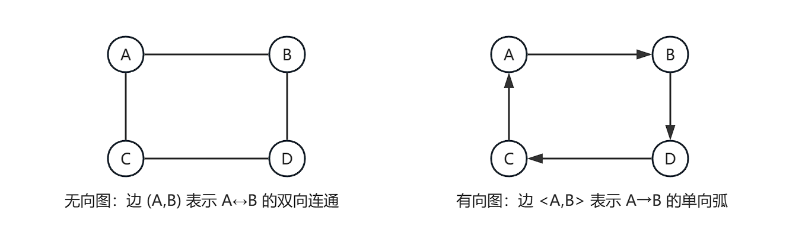

##### 2. 完全图

**任意两个顶点之间都有边的图**称为完全图。$n$ 个顶点的完全图记为 $K_n$。

- 无向完全图边数：$n(n-1)/2$（每对顶点间恰好一条边）
- 有向完全图弧数：$n(n-1)$（每对顶点间有方向相反的两条弧）

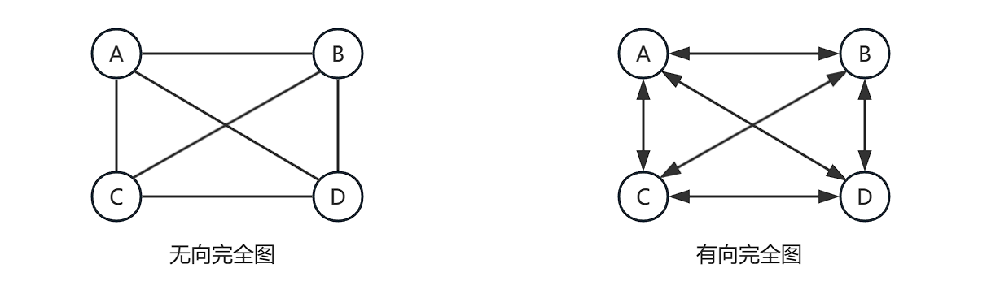

##### 3. 稠密图与稀疏图

根据**边数与顶点数的关系**对图分类：

- **稠密图**：$e$ 接近 $n^2$（如完全图 $e = n(n-1)/2 \approx n^2/2$），适合用**邻接矩阵**存储。
- **稀疏图**：$e$ 远小于 $n^2$（如 $e < n\log n$），适合用**邻接表**存储。

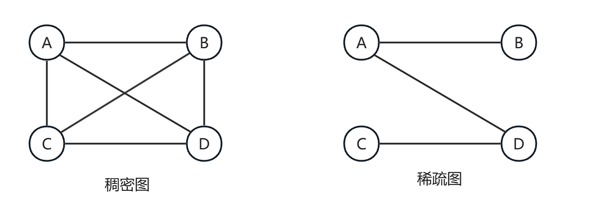

##### 4. 子图

设 $G=(V,E)$ 和 $G'=(V',E')$ 为两个图。若 $V' \subseteq V$ 且 $E' \subseteq E$，则称 $G'$ 为 $G$ 的**子图**。

- 子图可以从原图中删顶点、删边得到。
- 若 $V' = V$（保留所有顶点），则称为**生成子图**（见第5节）。

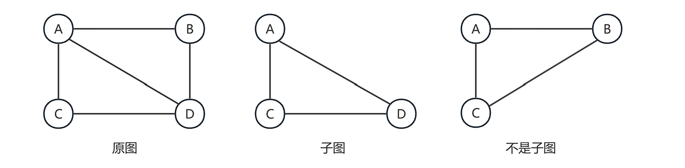

##### 5. 生成子图

**包含原图所有顶点**的子图（$V' = V$，$E' \subseteq E$）。与普通子图的区别：生成子图不能删顶点。

- **原图 G**：V={A,B,C,D}  5条边

- **生成子图 G'**：V'=V={A,B,C,D}（顶点全在）E'=4条边（删了对角线）    

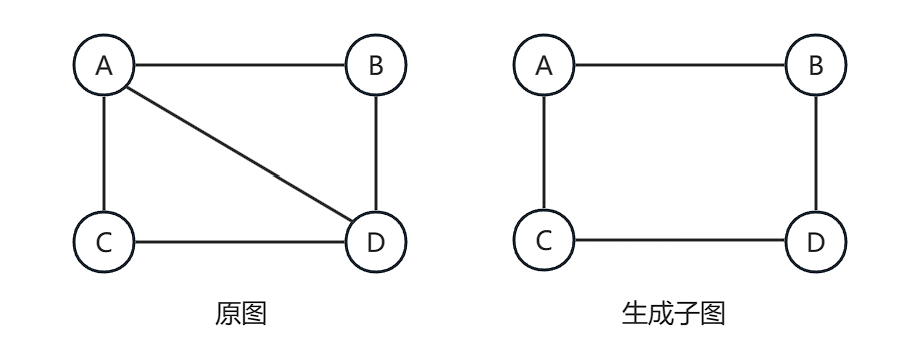

##### 6. 邻接与度

| 术语 | 含义 |
|:---|:---|
| **顶点 Vertex** | 图的数据元素 |
| **边 Edge** | 无向图中顶点对 `(u,v)`，u↔v 双向连通 |
| **弧 Arc** | 有向图中顶点序偶 `<u,v>`，u→v 单向 |
| **度 Degree** | 无向图：与该顶点相连的边数，记为 $\deg(v)$ |
| **入度 in-degree** | 有向图：指向该顶点的弧数，记为 $\text{in}(v)$ |
| **出度 out-degree** | 有向图：从该顶点出发的弧数，记为 $\text{out}(v)$ |
| **握手定理** | 无向图 $\sum\deg(v) = 2e$；有向图 $\sum\text{in}(v) = \sum\text{out}(v) = e$ |

<div style="display: flex; align-items: center; gap: 30px; margin-bottom: 20px;">

<table style="margin: 0; min-width: 300px;">
<thead>
<tr>
<th style="text-align: left;"></th>
<th style="text-align: center;">A</th>
<th style="text-align: center;">B</th>
<th style="text-align: center;">C</th>
<th style="text-align: center;">D</th>
</tr>
</thead>
<tbody>
<tr>
<td style="text-align: left;">无向图 deg</td>
<td style="text-align: center;">2</td>
<td style="text-align: center;">2</td>
<td style="text-align: center;">2</td>
<td style="text-align: center;">2</td>
</tr>
<tr>
<td style="text-align: left;">有向图 in</td>
<td style="text-align: center;">0</td>
<td style="text-align: center;">1</td>
<td style="text-align: center;">1</td>
<td style="text-align: center;">2</td>
</tr>
<tr>
<td style="text-align: left;">有向图 out</td>
<td style="text-align: center;">2</td>
<td style="text-align: center;">1</td>
<td style="text-align: center;">1</td>
<td style="text-align: center;">0</td>
</tr>
</tbody>
</table>
</div>

> **握手定理**：无向图 $\sum\deg = 2e$；有向图 $\sum\text{in} = \sum\text{out} = e$

##### 7. 路径与回路

| 术语 | 含义 |
|:---|:---|
| **路径 Path** | 顶点序列 $v_0 \to v_1 \to \dots \to v_k$，相邻顶点间均有边 |
| **路径长度** | 路径上的边数（无权图）或边权和（带权图） |
| **简单路径** | 路径中所有顶点互不重复 |
| **回路 / 环** | 起点与终点相同的路径（$v_0 = v_k$） |
| **简单回路** | 除起点终点外其余顶点不重复的回路 |

##### 8. 连通性与连通分量

| 术语 | 含义 |
|:---|:---|
| **连通** | 无向图中两顶点间存在路径 |
| **连通图** | 无向图中**任意**两个顶点都连通 |
| **连通分量** | 无向图的**极大连通子图**（不能再加顶点或边仍保持连通） |
| **强连通图** | 有向图中任意两点**双向都可达** |
| **强连通分量** | 有向图的极大强连通子图 |

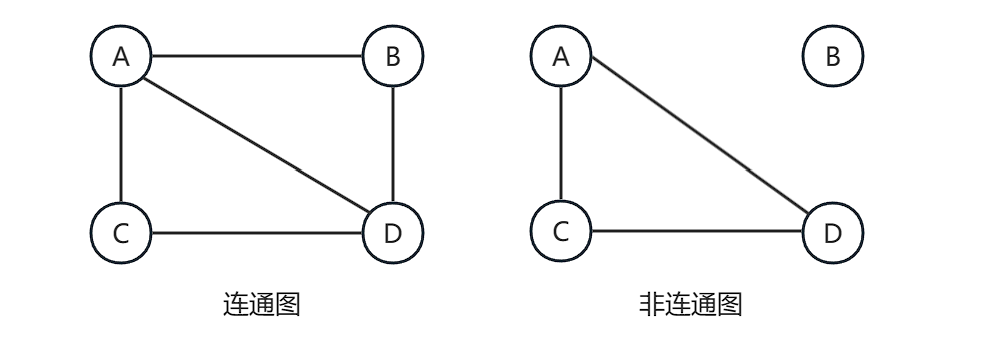

##### 9. 生成树与生成森林

| 术语 | 含义 |
|:---|:---|
| **有向树** | 首先是一个有向图。它有一个**特殊的顶点（根）**，没有边指向它；其余所有顶点都只有一条边指向它们。 |
| **生成树** | 包含所有 $n$ 个顶点的**极小连通子图**，恰有 $n-1$ 条边 |
| **生成森林** | 非连通图的每个连通分量各取一棵生成树，合起来就是生成森林 |

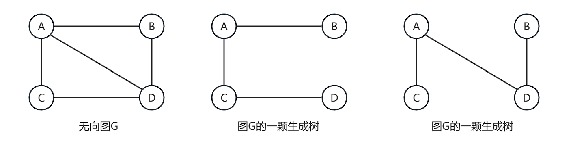

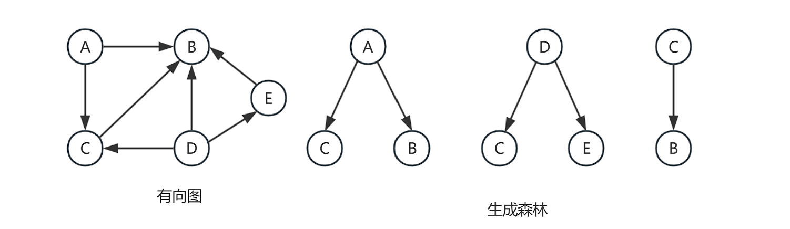

##### 10. 网

边上带有**权值**的图称为网（Network）。权值可以表示距离、费用、时间等。

<table style="width: 100%; border: none;">
  <tr style="border: none;">
    <td style="width: 27%; vertical-align: top; border: none; padding-right: 20px;">
      
    </td>
    <td style="width: 70%; vertical-align: top; border: none;">
      <table style="width: 100%; border-collapse: collapse;">
        <thead>
          <tr>
            <th style="border: 1px solid #dfe2e5; padding: 6px 13px; text-align: left; background-color: #f6f8fa;">术语</th>
            <th style="border: 1px solid #dfe2e5; padding: 6px 13px; text-align: left; background-color: #f6f8fa;">含义</th>
          </tr>
        </thead>
        <tbody>
          <tr>
            <td style="border: 1px solid #dfe2e5; padding: 6px 13px;">网（带权图）</td>
            <td style="border: 1px solid #dfe2e5; padding: 6px 13px;">每条边/弧附带一个数值（权值 weight）</td>
          </tr>
          <tr>
            <td style="border: 1px solid #dfe2e5; padding: 6px 13px;">AOE 网</td>
            <td style="border: 1px solid #dfe2e5; padding: 6px 13px;">顶点=事件、边=活动的带权有向无环图</td>
          </tr>
        </tbody>
      </table>
    </td>
  </tr>
</table>


##### 11. 图的数学性质

| # | 性质 | 公式 |
|:---|:---|:---|
| 1 | 无向图总度数 = 边数的两倍 | $\sum \deg(v) = 2|E|$ |
| 2 | 有向图入度之和 = 出度之和 | $\sum \text{in}(v) = \sum \text{out}(v) = |E|$ |
| 3 | 完全图边数（无向） | $n(n-1)/2$ |
| 4 | 完全图边数（有向） | $n(n-1)$ |
| 5 | 连通图最少边数 | $n-1$（生成树） |

---

#### 二、图的抽象数据类型定义

##### 1. 数据对象与数据关系

- **数据对象**：$G = (V, E)$，其中 $V = \{v_1, v_2, \dots, v_n\}$ 为顶点集，$E = \{(u,v) \mid u,v \in V\}$（无向）或 $E = \{<u,v> \mid u,v \in V\}$（有向）为边/弧集。
- **数据关系**：顶点之间通过边/弧建立的邻接关系。$n = |V|$，$e = |E|$。

##### 2. 基本操作 (Operations)

| 操作 | 前提 | 结果 |
|:---|:---|:---|
| `CreateGraph(&G, V, E)` | 无 | 根据顶点集 V 和边集 E 构造图 G |
| `DestroyGraph(&G)` | G 已存在 | 销毁图 G，释放内存 |
| `LocateVex(G, v)` | G 已存在 | 返回顶点 v 在图中的位置（下标） |
| `GetVex(G, i)` | G 已存在 | 返回图中第 i 个顶点的值 |
| `FirstAdjVex(G, v)` | G 已存在 | 返回 v 的第一个邻接点；若无则返回 -1 |
| `NextAdjVex(G, v, w)` | G 已存在，w 是 v 的邻接点 | 返回 v 的排在 w 之后的下一个邻接点；若无则返回 -1 |
| `InsertVex(&G, v)` | G 已存在 | 在图 G 中插入顶点 v |
| `DeleteVex(&G, v)` | G 已存在 | 删除顶点 v 及其关联的所有边/弧 |
| `InsertArc(&G, u, v)` | G 已存在 | 在图中插入边/弧 `<u,v>` 或 `(u,v)` |
| `DeleteArc(&G, u, v)` | G 已存在 | 删除边/弧 `<u,v>` 或 `(u,v)` |
| `DFSTraverse(G)` | G 已存在 | 深度优先遍历图 G |
| `BFSTraverse(G)` | G 已存在 | 广度优先遍历图 G |

> `FirstAdjVex` 和 `NextAdjVex` 是遍历所有邻接点的标准接口——无论底层是邻接矩阵还是邻接表，遍历代码都通过这两个函数隔离实现细节。

---

### （二）图的存储结构

#### 一、邻接矩阵

```c
#define MAX_VEX 100              // 最大顶点数
#define INF 0x3f3f3f3f           // 表示无边的"无穷大"

typedef enum {                   // 图的种类标志
    DG,      // 有向图
    AG,      // 无向图
    WDG,     // 有向网（带权）
    WAG      // 无向网（带权）
} GraphKind;

typedef struct {
    GraphKind kind;              // 图的种类标志
    int vexnum, arcnum;          // 当前顶点数和弧/边数
    int vexs[MAX_VEX];           // 顶点向量（存储顶点数据）
    int adj[MAX_VEX][MAX_VEX];   // 邻接矩阵（存储边/弧信息）
} MGraph;
```

> 两个数组分工：`vexs[]` 存顶点数据元素，`adj[][]` 存边/弧关系。`GraphKind` 枚举使得同一结构体可表示四种图。

##### 1. 无向图

- **元素值**：1 表示有边，0 表示无边
- **对称矩阵**：$A[i][j] = A[j][i]$（沿主对角线对称）
- **对角线**：全为 0（无自环）
- **第 $i$ 行非零数的个数** = 顶点 $v_i$ 的度 $\deg(v_i)$
- 矩阵中 1 的总数 = $2e$（每条边贡献两个 1）

$$
A[i][j] = \begin{cases}  1 & \text{若 } (v_i, v_j) \text{ 是图中的边} \\ 0 & \text{若 } (v_i, v_j) \text{ 不是图中的边，或 } i = j \end{cases}
$$

<table style="width: 100%; border: none;">
  <tr style="border: none;">
    <td style="width: 36%; vertical-align: top; border: none; padding-right: 20px;">
      
    </td>
    <td style="width: 50%; vertical-align: top; border: none;">
      <table style="width: 100%; border-collapse: collapse; text-align: center;">
        <thead>
          <tr>
            <th style="border: 1px solid #dfe2e5; padding: 6px 13px; background-color: #f6f8fa;"></th>
            <th style="border: 1px solid #dfe2e5; padding: 6px 13px; background-color: #f6f8fa;">A</th>
            <th style="border: 1px solid #dfe2e5; padding: 6px 13px; background-color: #f6f8fa;">B</th>
            <th style="border: 1px solid #dfe2e5; padding: 6px 13px; background-color: #f6f8fa;">C</th>
            <th style="border: 1px solid #dfe2e5; padding: 6px 13px; background-color: #f6f8fa;">D</th>
          </tr>
        </thead>
        <tbody>
          <tr>
            <th style="border: 1px solid #dfe2e5; padding: 6px 13px; background-color: #f6f8fa;">A</th>
            <td style="border: 1px solid #dfe2e5; padding: 6px 13px;">0</td>
            <td style="border: 1px solid #dfe2e5; padding: 6px 13px;">1</td>
            <td style="border: 1px solid #dfe2e5; padding: 6px 13px;">1</td>
            <td style="border: 1px solid #dfe2e5; padding: 6px 13px;">0</td>
          </tr>
          <tr>
            <th style="border: 1px solid #dfe2e5; padding: 6px 13px; background-color: #f6f8fa;">B</th>
            <td style="border: 1px solid #dfe2e5; padding: 6px 13px;">1</td>
            <td style="border: 1px solid #dfe2e5; padding: 6px 13px;">0</td>
            <td style="border: 1px solid #dfe2e5; padding: 6px 13px;">0</td>
            <td style="border: 1px solid #dfe2e5; padding: 6px 13px;">1</td>
          </tr>
          <tr>
            <th style="border: 1px solid #dfe2e5; padding: 6px 13px; background-color: #f6f8fa;">C</th>
            <td style="border: 1px solid #dfe2e5; padding: 6px 13px;">1</td>
            <td style="border: 1px solid #dfe2e5; padding: 6px 13px;">0</td>
            <td style="border: 1px solid #dfe2e5; padding: 6px 13px;">0</td>
            <td style="border: 1px solid #dfe2e5; padding: 6px 13px;">1</td>
          </tr>
          <tr>
            <th style="border: 1px solid #dfe2e5; padding: 6px 13px; background-color: #f6f8fa;">D</th>
            <td style="border: 1px solid #dfe2e5; padding: 6px 13px;">0</td>
            <td style="border: 1px solid #dfe2e5; padding: 6px 13px;">1</td>
            <td style="border: 1px solid #dfe2e5; padding: 6px 13px;">1</td>
            <td style="border: 1px solid #dfe2e5; padding: 6px 13px;">0</td>
          </tr>
        </tbody>
      </table>
    </td>
  </tr>
</table>
##### 2. 无向带权图（网）

- **元素值**：$w_{ij}$（边权值）或 $\infty$（无边）
- **对称矩阵**：$A[i][j] = A[j][i]$（沿主对角线对称）
- **对角线**：$\infty$（无自环）
- **第 $i$ 行非 $\infty$ 的个数** = 顶点 $v_i$ 的度 $\deg(v_i)$
- 矩阵中非 $\infty$ 元素总数 = $2e$（每条边贡献两个元素）
- 空间 $O(n^2)$，适合稠密图

$$
A[i][j] = \begin{cases}  w_{ij} & \text{若 } (v_i, v_j) \text{ 是图中的边，且权值为 } w_{ij} \\ \infty & \text{若 } i \neq j \text{ 且顶点 } v_i \text{ 到 } v_j \text{ 之间没有边}  \end{cases}
$$

<table style="width: 100%; border: none;">
  <tr style="border: none;">
    <td style="width: 50%; vertical-align: top; border: none; padding-right: 20px;">
      
    </td>
    <td style="width: 50%; vertical-align: top; border: none;">
      <table style="width: 100%; border-collapse: collapse; text-align: center;">
        <thead>
          <tr>
            <th style="border: 1px solid #dfe2e5; padding: 6px 10px; background-color: #f6f8fa;"></th>
            <th style="border: 1px solid #dfe2e5; padding: 6px 10px; background-color: #f6f8fa;">A</th>
            <th style="border: 1px solid #dfe2e5; padding: 6px 10px; background-color: #f6f8fa;">B</th>
            <th style="border: 1px solid #dfe2e5; padding: 6px 10px; background-color: #f6f8fa;">C</th>
            <th style="border: 1px solid #dfe2e5; padding: 6px 10px; background-color: #f6f8fa;">D</th>
            <th style="border: 1px solid #dfe2e5; padding: 6px 10px; background-color: #f6f8fa;">E</th>
          </tr>
        </thead>
        <tbody>
          <tr>
            <th style="border: 1px solid #dfe2e5; padding: 6px 10px; background-color: #f6f8fa;">A</th>
            <td style="border: 1px solid #dfe2e5; padding: 6px 10px;">&infin;</td>
            <td style="border: 1px solid #dfe2e5; padding: 6px 10px;">6</td>
            <td style="border: 1px solid #dfe2e5; padding: 6px 10px;">2</td>
            <td style="border: 1px solid #dfe2e5; padding: 6px 10px;">&infin;</td>
            <td style="border: 1px solid #dfe2e5; padding: 6px 10px;">&infin;</td>
          </tr>
          <tr>
            <th style="border: 1px solid #dfe2e5; padding: 6px 10px; background-color: #f6f8fa;">B</th>
            <td style="border: 1px solid #dfe2e5; padding: 6px 10px;">6</td>
            <td style="border: 1px solid #dfe2e5; padding: 6px 10px;">&infin;</td>
            <td style="border: 1px solid #dfe2e5; padding: 6px 10px;">3</td>
            <td style="border: 1px solid #dfe2e5; padding: 6px 10px;">4</td>
            <td style="border: 1px solid #dfe2e5; padding: 6px 10px;">3</td>
          </tr>
          <tr>
            <th style="border: 1px solid #dfe2e5; padding: 6px 10px; background-color: #f6f8fa;">C</th>
            <td style="border: 1px solid #dfe2e5; padding: 6px 10px;">2</td>
            <td style="border: 1px solid #dfe2e5; padding: 6px 10px;">3</td>
            <td style="border: 1px solid #dfe2e5; padding: 6px 10px;">&infin;</td>
            <td style="border: 1px solid #dfe2e5; padding: 6px 10px;">1</td>
            <td style="border: 1px solid #dfe2e5; padding: 6px 10px;">&infin;</td>
          </tr>
          <tr>
            <th style="border: 1px solid #dfe2e5; padding: 6px 10px; background-color: #f6f8fa;">D</th>
            <td style="border: 1px solid #dfe2e5; padding: 6px 10px;">&infin;</td>
            <td style="border: 1px solid #dfe2e5; padding: 6px 10px;">4</td>
            <td style="border: 1px solid #dfe2e5; padding: 6px 10px;">1</td>
            <td style="border: 1px solid #dfe2e5; padding: 6px 10px;">&infin;</td>
            <td style="border: 1px solid #dfe2e5; padding: 6px 10px;">5</td>
          </tr>
          <tr>
            <th style="border: 1px solid #dfe2e5; padding: 6px 10px; background-color: #f6f8fa;">E</th>
            <td style="border: 1px solid #dfe2e5; padding: 6px 10px;">&infin;</td>
            <td style="border: 1px solid #dfe2e5; padding: 6px 10px;">3</td>
            <td style="border: 1px solid #dfe2e5; padding: 6px 10px;">&infin;</td>
            <td style="border: 1px solid #dfe2e5; padding: 6px 10px;">5</td>
            <td style="border: 1px solid #dfe2e5; padding: 6px 10px;">&infin;</td>
          </tr>
        </tbody>
      </table>
    </td>
  </tr>
</table>
##### 3. 有向带权图

- **元素值**：$w_{ij}$（弧权值）或 $\infty$（无弧）
- **非对称**：$A[i][j] \neq A[j][i]$（有向，一般不对称）
- **对角线**：$\infty$（无自环）
- **第 $i$ 行非 $\infty$ 的个数** = 顶点 $v_i$ 的出度 $\text{out}(v_i)$
- **第 $j$ 列非 $\infty$ 的个数** = 顶点 $v_j$ 的入度 $\text{in}(v_j)$
- 矩阵中非 $\infty$ 元素总数 = $e$（弧数）

$$
A[i][j] = \begin{cases} 
w_{ij} & \text{若存在从顶点 } v_i \text{ 到 } v_j \text{ 的有向弧 } \langle v_i, v_j \rangle \text{，且权值为 } w_{ij} \\
\infty & \text{若从 } v_i \text{ 到 } v_j \text{ 没有直接的有向弧，或 } i = j
\end{cases}
$$

<table style="width: 100%; border: none;">
  <tr style="border: none;">
    <td style="width: 50%; vertical-align: top; border: none; padding-right: 20px;">
      
    </td>
    <td style="width: 50%; vertical-align: top; border: none;">
      <table style="width: 100%; border-collapse: collapse; text-align: center;">
        <thead>
          <tr>
            <th style="border: 1px solid #dfe2e5; padding: 6px 10px; background-color: #f6f8fa;"></th>
            <th style="border: 1px solid #dfe2e5; padding: 6px 10px; background-color: #f6f8fa;">A</th>
            <th style="border: 1px solid #dfe2e5; padding: 6px 10px; background-color: #f6f8fa;">B</th>
            <th style="border: 1px solid #dfe2e5; padding: 6px 10px; background-color: #f6f8fa;">C</th>
            <th style="border: 1px solid #dfe2e5; padding: 6px 10px; background-color: #f6f8fa;">D</th>
            <th style="border: 1px solid #dfe2e5; padding: 6px 10px; background-color: #f6f8fa;">E</th>
          </tr>
        </thead>
        <tbody>
          <tr>
            <th style="border: 1px solid #dfe2e5; padding: 6px 10px; background-color: #f6f8fa;">A</th>
            <td style="border: 1px solid #dfe2e5; padding: 6px 10px;">&infin;</td>
            <td style="border: 1px solid #dfe2e5; padding: 6px 10px;">6</td>
            <td style="border: 1px solid #dfe2e5; padding: 6px 10px;">2</td>
            <td style="border: 1px solid #dfe2e5; padding: 6px 10px;">&infin;</td>
            <td style="border: 1px solid #dfe2e5; padding: 6px 10px;">&infin;</td>
          </tr>
          <tr>
            <th style="border: 1px solid #dfe2e5; padding: 6px 10px; background-color: #f6f8fa;">B</th>
            <td style="border: 1px solid #dfe2e5; padding: 6px 10px;">&infin;</td>
            <td style="border: 1px solid #dfe2e5; padding: 6px 10px;">&infin;</td>
            <td style="border: 1px solid #dfe2e5; padding: 6px 10px;">&infin;</td>
            <td style="border: 1px solid #dfe2e5; padding: 6px 10px;">&infin;</td>
            <td style="border: 1px solid #dfe2e5; padding: 6px 10px;">3</td>
          </tr>
          <tr>
            <th style="border: 1px solid #dfe2e5; padding: 6px 10px; background-color: #f6f8fa;">C</th>
            <td style="border: 1px solid #dfe2e5; padding: 6px 10px;">&infin;</td>
            <td style="border: 1px solid #dfe2e5; padding: 6px 10px;">3</td>
            <td style="border: 1px solid #dfe2e5; padding: 6px 10px;">&infin;</td>
            <td style="border: 1px solid #dfe2e5; padding: 6px 10px;">1</td>
            <td style="border: 1px solid #dfe2e5; padding: 6px 10px;">&infin;</td>
          </tr>
          <tr>
            <th style="border: 1px solid #dfe2e5; padding: 6px 10px; background-color: #f6f8fa;">D</th>
            <td style="border: 1px solid #dfe2e5; padding: 6px 10px;">&infin;</td>
            <td style="border: 1px solid #dfe2e5; padding: 6px 10px;">4</td>
            <td style="border: 1px solid #dfe2e5; padding: 6px 10px;">&infin;</td>
            <td style="border: 1px solid #dfe2e5; padding: 6px 10px;">&infin;</td>
            <td style="border: 1px solid #dfe2e5; padding: 6px 10px;">5</td>
          </tr>
          <tr>
            <th style="border: 1px solid #dfe2e5; padding: 6px 10px; background-color: #f6f8fa;">E</th>
            <td style="border: 1px solid #dfe2e5; padding: 6px 10px;">&infin;</td>
            <td style="border: 1px solid #dfe2e5; padding: 6px 10px;">&infin;</td>
            <td style="border: 1px solid #dfe2e5; padding: 6px 10px;">&infin;</td>
            <td style="border: 1px solid #dfe2e5; padding: 6px 10px;">&infin;</td>
            <td style="border: 1px solid #dfe2e5; padding: 6px 10px;">&infin;</td>
          </tr>
        </tbody>
      </table>
    </td>
  </tr>
</table>


##### 4. 复杂度

| | 邻接矩阵 |
|:---|:---|
| 空间 | $O(n^2)$ |
| 判 `(i,j)` 是否有边 | $O(1)$ |
| 找 i 的所有邻接点 | $O(n)$ |
| 适合 | **稠密图**（边数接近 $n^2$） |

##### 5. 基本操作

###### ① 创建图 (CreateGraph)

```c++
void CreateGraph(MGraph &G) {
    printf("请输入图的种类标志 (0:DG 1:AG 2:WDG 3:WAG): ");
    scanf("%d", &G.kind);            // 读入图的种类
    G.vexnum = 0;                    // 顶点数初始为 0
    G.arcnum = 0;                    // 边数初始为 0
}
```

- 时间复杂度：$O(1)$

###### ② 定位顶点 (LocateVex)

```c++
int LocateVex(MGraph G, int v) {
    for (int i = 0; i < G.vexnum; i++)
        if (G.vexs[i] == v)
            return i;                // 找到，返回下标
    return -1;                       // 未找到
}
```

- 时间复杂度：$O(n)$

###### ③ 插入顶点 (InsertVex)

```c++
int InsertVex(MGraph &G, int v) {
    int k = G.vexnum;                  // 新顶点的下标
    G.vexs[G.vexnum++] = v;            // 存入顶点向量，vexnum 自增

    if (G.kind == DG || G.kind == AG) // 不带权：邻接矩阵新行列置 0
        for (int j = 0; j < G.vexnum; j++)
            G.adj[j][k] = G.adj[k][j] = 0;
    else                               // 带权（DN/UDN）：置 ∞
        for (int j = 0; j < G.vexnum; j++)
            G.adj[j][k] = G.adj[k][j] = INF;

    return k;                          // 返回新顶点的下标
}
```

- 时间复杂度：$O(n)$（初始化新行和列）
- 返回值：新插入顶点在数组中的下标

###### ④ 插入边/弧 (InsertArc)

```c++
typedef struct {
    int vex1, vex2;                        // 弧的两个端点
    int ArcVal;                            // 权值
} ArcType;

int InsertArc(MGraph *G, ArcType *arc) {
    int k = LocateVex(*G, arc->vex1);      // 定位弧尾下标
    int j = LocateVex(*G, arc->vex2);      // 定位弧头下标
    if (G->kind == DG || G->kind == WDG) {  // 有向图 / 有向网
        G->adj[k][j] = arc->ArcVal;
    } else {                                // 无向图 / 无向网：对称赋值
        G->adj[k][j] = arc->ArcVal;
        G->adj[j][k] = arc->ArcVal;
    }
    G->arcnum++;
    return 1;                               // 返回 1 表示插入成功
}
```

- 时间复杂度：$O(n)$（LocateVex 遍历顶点向量）

###### ⑤ 取顶点 (GetVex)

```c++
int GetVex(MGraph G, int i) {
    return G.vexs[i];                // 直接返回第 i 个顶点
}
```

- 时间复杂度：$O(1)$

###### ⑥ 求第一个邻接点 (FirstAdjVex)

```c++
int FirstAdjVex(MGraph G, int v) {
    int i = LocateVex(G, v);
    for (int j = 0; j < G.vexnum; j++)
        if (G.adj[i][j] != 0 && G.adj[i][j] != INF)
            return j;                // 返回第一个有边/弧的邻接点
    return -1;                       // 没有邻接点
}
```

- 时间复杂度：$O(n)$（遍历一行）

###### ⑦ 求下一个邻接点 (NextAdjVex)

```c++
int NextAdjVex(MGraph G, int v, int w) {
    int i = LocateVex(G, v);
    int j = LocateVex(G, w);
    for (int k = j + 1; k < G.vexnum; k++)
        if (G.adj[i][k] != 0 && G.adj[i][k] != INF)
            return k;                // 返回 w 之后第一个有边的邻接点
    return -1;
}
```

- 时间复杂度：$O(n)$

###### ⑧ 删除顶点 (DeleteVex)

```c++
void DeleteVex(MGraph &G, int v) {
    int k = LocateVex(G, v);
    for (int i = k; i < G.vexnum - 1; i++)    // ① 压缩 vexs[]
        G.vexs[i] = G.vexs[i + 1];
    for (int i = k; i < G.vexnum - 1; i++)    // ② 上移行
        for (int j = 0; j < G.vexnum; j++)
            G.adj[i][j] = G.adj[i + 1][j];
    for (int j = k; j < G.vexnum - 1; j++)    // ③ 左移列
        for (int i = 0; i < G.vexnum; i++)
            G.adj[i][j] = G.adj[i][j + 1];
    G.vexnum--;
}
```

- 时间复杂度：$O(n^2)$（双重循环压缩行列）

###### ⑨ 删除边/弧 (DeleteArc)

```c++
void DeleteArc(MGraph &G, int u, int v) {
    int i = LocateVex(G, u);
    int j = LocateVex(G, v);
    G.adj[i][j] = (G.kind >= 2) ? INF : 0;  // 有权图置 INF，无权置 0
    if (G.kind == AG || G.kind == WAG)
        G.adj[j][i] = (G.kind >= 2) ? INF : 0;
    G.arcnum--;
}
```

- 时间复杂度：$O(1)$

#### 二、邻接表

##### 1. 邻接表概述

**核心思想**：对图中每个顶点建立一个**单链表**，链表中结点存放该顶点的所有邻接点。$n$ 个顶点就有 $n$ 个链表。

- **顶点表**：一个一维数组 `vertices[]`，每个元素存储一个顶点及其出边链表的头指针。
- **边表**：每个顶点对应的单链表，链表中每个结点代表一条从该顶点出发的边/弧。

##### 2. 结点结构：

```
顶点表 (VNode)                边表结点 (ArcNode)
┌────────┬──────────┐         ┌──────┬──────┬──────┐
│  data  │ firstarc │────────→│adjvex│weight│ next │──→ ...
└────────┴──────────┘         └──────┴──────┴──────┘
```

> - `adjvex`：邻接点在顶点表中的**下标**（关键字段）
> - `weight`：边的权值（无权图可省略或置 1）
> - `next`：指向下一个边表结点（同一顶点的下一条出边）

##### 3.  有向图 vs 无向图

- **无向图**：每条边 $(u,v)$ 会出现两次——在 u 的链表里有一个指向 v 的结点，在 v 的链表里也有一个指向 u 的结点。边表结点总数 $= 2e$。

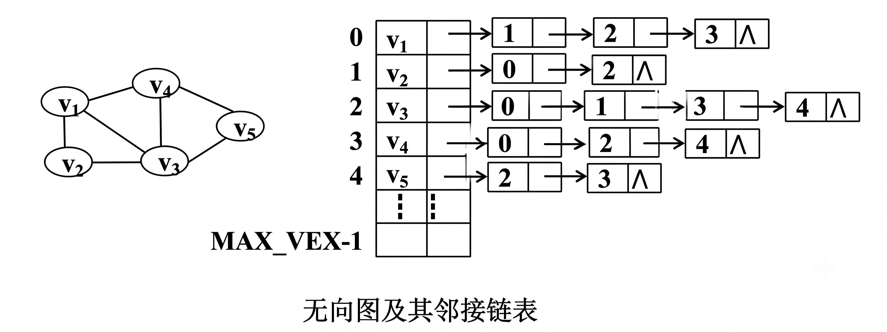

- **有向图**：每条弧 $<u,v>$ 只在弧尾 u 的链表里出现一次。边表结点总数 $= e$。

| <center>正邻接表：以“出度”为中心</center>                    | <center>逆邻接表：以“入度”为中心</center>                    |
| ------------------------------------------------------------ | ------------------------------------------------------------ |
| 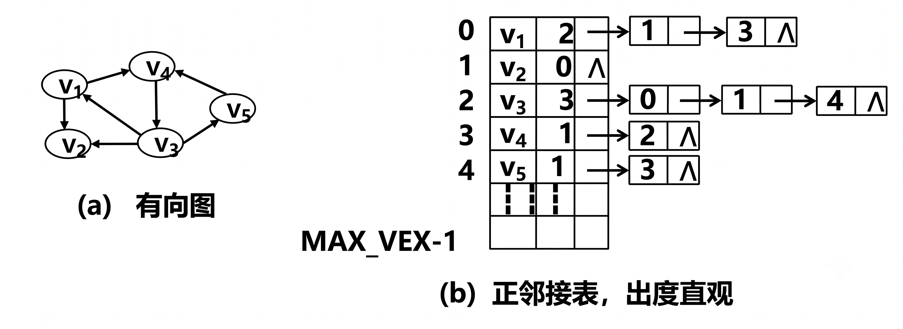 |  |

##### 4. 特点

- 空间有向图 $O(n+e)$ 无向图 $O(n+2e)$，**稀疏图**远比邻接矩阵省空间
- 遍历某个顶点的所有邻接点只需遍历其链表，$O(\deg)$
- 判边 $(i,j)$ 存在性需遍历 i 的链表，$O(\deg_i)$
- 有向图求**入度**困难，需遍历全部链表（可用**逆邻接表**解决）

##### 5. 实现：`边 -> 节点 -> 邻接表 -> 图`


```c
#define MAX_VEX 100
#define INF 0x3f3f3f3f

typedef int InfoType;                     // 与边/弧相关的信息类型（如权值）
typedef int VexType;                      // 顶点数据类型

/* ---- 弧/边的结构定义 ---- */
typedef struct {
    int vex1, vex2;                       // 弧或边所依附的两个顶点
    InfoType info;                        // 与边或弧相关的信息，如权值
} ArcType;

/* ---- 邻接表的结点定义 ---- */
typedef struct LinkNode {
    int adjvex;                           // 邻接点在头结点数组中的位置（下标）
    InfoType info;                        // 与边或弧相关的信息，如权值
    struct LinkNode *nextarc;             // 指向下一个表结点
} LinkNode;                               // 表结点类型定义

/* --- 顶点结点的结点定义 --- */
typedef struct {                          // 顶点结点（头结点）
    VexType data;                         // 顶点数据
    int degree;                           // 顶点的度（无向图）或出度（有向图）
    LinkNode *firstarc;                   // 第一条出边的链头
} VexNode;

/* ----- 图的结构定义 ----- */
typedef struct {
    GraphKind kind;                       // 图的种类标志
    int vexnum;                           // 顶点数
    VexNode AdjList[MAX_VEX];             // 邻接表（顶点数组）
} ALGraph;
```

| | 邻接表 |
|:---|:---|
| 空间 | $O(n+e)$ |
| 判 `(i,j)` 是否有边 | $O(\deg_i)$（需遍历链表） |
| 找 i 的所有邻接点 | $O(\deg_i)$ |
| 适合 | **稀疏图**（$e \ll n^2$） |

##### 6. 基本操作

###### ① 创建图 (CreateGraph)

```c++
ALGraph *CreateGraph(ALGraph *G) {
    printf("请输入图的种类标志 (0:DG 1:AG 2:WDG 3:WAG): ");
    scanf("%d", &G->kind);               // 读入图的种类
    G->vexnum = 0;                       // 初始化顶点个数为 0
    return G;                            // 返回图指针
}
```

- 时间复杂度：$O(1)$
- 返回图指针，便于链式调用

###### ② 定位顶点 (LocateVex)

```c++
int LocateVex(ALGraph *G, int *vp) {
    int k;
    for (k = 0; k < G->vexnum; k++)        // 遍历邻接表头结点数组
        if (G->AdjList[k].data == *vp)     // 比较顶点数据域
            return k;                      // 找到，返回下标
    return -1;                             // 图中无此顶点
}
```

- 时间复杂度：$O(n)$（遍历顶点数组）
- 与邻接矩阵版不同：参数用 `ALGraph *G` 和 `int *vp`，在 `AdjList[].data` 中查找

###### ③ 增加顶点 (AddVertex)

```c++
int AddVertex(ALGraph *G, VexType *vp) {
    int k;
    G->AdjList[G->vexnum].data = *vp;      // 在末尾存入顶点数据
    G->AdjList[G->vexnum].degree = 0;      // 初始入/出度为 0
    G->AdjList[G->vexnum].firstarc = NULL; // 边链表初始为空
    k = ++G->vexnum;                       // 顶点数 +1，记录新下标
    return k;                              // 返回新顶点的下标
}
```

- 时间复杂度：$O(1)$（直接在数组末尾追加）
- 返回值：新插入顶点的下标（与邻接矩阵版一致）

###### ④ 增加弧 (AddArc)

```c++
int AddArc(ALGraph *G, ArcType *arc) {
    int k, j;
    LinkNode *p, *q;
    k = LocateVex(G, &arc->vex1);            // 定位弧尾下标
    j = LocateVex(G, &arc->vex2);            // 定位弧头下标

    p = (LinkNode *)malloc(sizeof(LinkNode));
    p->adjvex = arc->vex1;                   // 弧尾顶点
    p->info = arc->info;                     // 弧信息（权值等）
    p->nextarc = NULL;                       // 边的起始表结点赋值

    q = (LinkNode *)malloc(sizeof(LinkNode));
    q->adjvex = arc->vex2;                   // 弧头顶点
    q->info = arc->info;                     // 弧信息（权值等）
    q->nextarc = NULL;                       // 边的末尾表结点赋值

    if (G->kind == AG || G->kind == WAG) {   // 无向图：头插入两个链表
        q->nextarc = G->AdjList[k].firstarc;
        G->AdjList[k].firstarc = q;          // 弧头插入弧尾顶点的边表
        p->nextarc = G->AdjList[j].firstarc;
        G->AdjList[j].firstarc = p;          // 弧尾插入弧头顶点的边表
    } else {                                  // 有向图：头插入弧尾链表
        q->nextarc = G->AdjList[k].firstarc;
        G->AdjList[k].firstarc = q;          // 建立正邻接链表
    }
    return 1;                                 // 返回 1 表示插入成功
}
```

- 时间复杂度：$O(n)$（LocateVex 遍历顶点数组）
- 头插法：新结点始终插入链表头部（$O(1)$），不依赖链表长度
- 无向图：需向两个顶点的边表各插入一个结点

#### 三、邻接矩阵 vs 邻接表

| 维度 | 邻接矩阵 | 邻接表 |
|:---|:---|:---|
| 空间 | $O(n^2)$ | $O(n+e)$ |
| 判边 | $O(1)$ | $O(\deg)$ |
| 遍历邻接点 | $O(n)$ | $O(\deg)$ |
| 入度（有向图） | 遍历列 $O(n)$ | 需逆邻接表 |
| 适合 | 稠密图 | 稀疏图 |

#### 四、邻接多重表

> 无向图的另一种链式存储。邻接表中每条边出现两次（两个顶点各一个结点），删除边需操作两个链表；邻接多重表**每条边只存一个结点**，处理边的操作更高效。

##### 1. 基本思想

每条边用一个结点表示，该结点同时挂在它的两个顶点的边链表中。每个顶点指向第一条依附于它的边。

##### 2. 结点结构

```
顶点结点 (VexBox)                    边结点 (EBox)
┌────────┬──────────┐       ┌──────┬──────┬──────┬──────┬──────┬──────┐
│  data  │firstedge │──→    │ mark │ ivex │ilink │ jvex │jlink │ info │
└────────┴──────────┘       └──────┴──────┴──────┴──────┴──────┴──────┘
```

| 字段 | 含义 |
|:---|:---|
| `mark` | 标志域，标记该边是否被访问过 |
| `ivex` / `jvex` | 该边依附的两个顶点在顶点数组中的下标 |
| `ilink` | 指向下一条依附于 `ivex` 的边（ivex 的边链表） |
| `jlink` | 指向下一条依附于 `jvex` 的边（jvex 的边链表） |
| `info` | 边的权值等信息 |

> 关键：一条边 $(u,v)$ 同时出现在顶点 u 的链表（通过 `ilink`）和顶点 v 的链表（通过 `jlink`）中，但**只有一份结点**。

##### 3. 结构定义

```c
#define MAX_VEX 100

typedef struct EBox {
    int mark;                          // 访问标记
    int ivex, jvex;                   // 边依附的两个顶点下标
    struct EBox *ilink;               // 指向下一条依附于 ivex 的边
    struct EBox *jlink;               // 指向下一条依附于 jvex 的边
    InfoType info;                    // 权值等信息
} EBox;

typedef struct {
    VexType data;                     // 顶点数据
    EBox *firstedge;                  // 指向第一条依附于该顶点的边
} VexBox;

typedef struct {
    VexBox AdjMulList[MAX_VEX];       // 顶点数组
    int vexnum, edgenum;             // 顶点数、边数
} AMLGraph;
```

##### 4. 示例

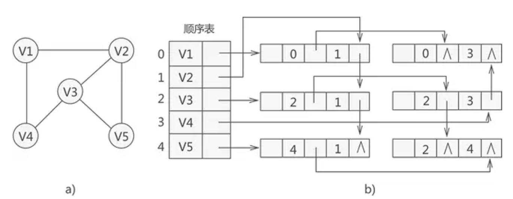

##### 5. 与邻接表的对比

| 维度 | 邻接表 | 邻接多重表 |
|:---|:---|:---|
| 边存储 | 每条边存两次（两个结点） | 每条边存一次（一个结点） |
| 判边 | $O(\deg)$ | $O(\deg)$ |
| 删除边 | 需从两个链表中分别删除 | 从一个结点出发操作两链 |
| 空间 | $O(n+2e)$ | $O(n+e)$（省约一半） |
| 适合 | 通用 | 无向图中**边操作频繁**的场景 |

#### 五、十字链表

> 有向图的链式存储。邻接表易求出度、难求入度（需逆邻接表）；十字链表**同时维护出弧和入弧链表**，出度和入度都能高效获取。

##### 1. 基本思想

每条弧用一个结点表示，该结点同时挂在弧尾顶点的**出弧链表**（`tlink`）和弧头顶点的**入弧链表**（`hlink`）中。

##### 2. 结点结构

```
顶点结点 (VexNode)                        弧结点 (ArcBox)
┌──────┬─────────┬─────────┐    ┌──────┬──────┬──────┬──────┬──────┬──────┐
│ data │firstout │ firstin │    │tailvex│headvex│hlink│tlink│ info │      │
└──────┴─────────┴─────────┘    └──────┴──────┴──────┴──────┴──────┴──────┘
```

| 字段 | 含义 |
|:---|:---|
| `tailvex` | 弧尾顶点下标（谁发出的） |
| `headvex` | 弧头顶点的数据域（指向谁） |
| `hlink` | 指向下一条**弧头相同**的弧（入弧链表，同一 `headvex`） |
| `tlink` | 指向下一条**弧尾相同**的弧（出弧链表，同一 `tailvex`） |
| `info` | 弧的权值等信息 |

> 顶点结点：`firstout` 指向第一条以该顶点为**弧尾**的弧（出度遍历入口），`firstin` 指向第一条以该顶点为**弧头**的弧（入度遍历入口）。

##### 3. 结构定义

```c
#define MAX_VEX 100

/* ---- 弧结点 ---- */
typedef struct ArcBox {
    int tailvex, headvex;              // 弧尾和弧头顶点的下标
    struct ArcBox *hlink, *tlink;      // hlink: 入弧链表  tlink: 出弧链表
    InfoType info;                     // 权值等信息
} ArcBox;

/* ---- 顶点结点 ---- */
typedef struct {
    VexType data;                      // 顶点数据
    ArcBox *firstout, *firstin;        // 第一条出弧 和 第一条入弧
} OLVexNode;

/* ---- 十字链表图结构 ---- */
typedef struct {
    OLVexNode AdjList[MAX_VEX];        // 顶点数组
    int vexnum, arcnum;                // 顶点数、弧数
} OLGraph;
```

##### 4. 示例

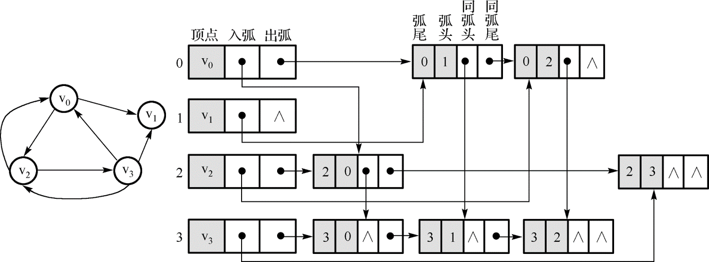

*出度：沿 tlink 链遍历；入度：沿 hlink 链遍历。每个弧结点只存储一次。*

##### 5. 与邻接表 / 多重表的对比

| 维度 | 邻接表 | 十字链表 | 邻接多重表 |
|:---|:---|:---|:---|
| 适用图 | 通用 | **有向图** | **无向图** |
| 出度 | $O(\deg)$ | $O(\text{out})$ | — |
| 入度 | 需逆邻接表 | $O(\text{in})$ | — |
| 弧/边存储 | 每条存 1~2 次 | 每条存 **1** 次 | 每条存 **1** 次 |
| 空间 | $O(n+e)$ / $O(n+2e)$ | $O(n+e)$ | $O(n+e)$ |

---

### （三）图的遍历

**辅助数组**：

```c++
BOOLEAN Visited[MAX_VEX];   // Visited[i] = FALSE 未访问，TRUE 已访问
```

#### 一、深度优先搜索 DFS

##### 1. 算法思想

- **类比**：树的**先序遍历**——访问顶点后，立即沿第一条边深入，走不通再退回
- **辅助结构**：**栈**（递归隐式使用系统栈）——后访问的顶点先被回溯
- **搜索方式**：从起始顶点出发，沿邻接点链"一条路走到黑"；当无未访问邻接点时**回溯**到上一个顶点，继续探索其他分支
- **核心步骤**：
  1. 访问当前顶点，标记已访问
  2. 找其第一个未访问邻接点，递归深入
  3. 若无未访问邻接点（死胡同），回溯到上一层
  4. 重复直至所有可达顶点均已访问

> DFS 按"深度优先、逐分支探索"的顺序访问顶点，适合**检测环、拓扑排序、强连通分量**等场景。

##### 2. 实例

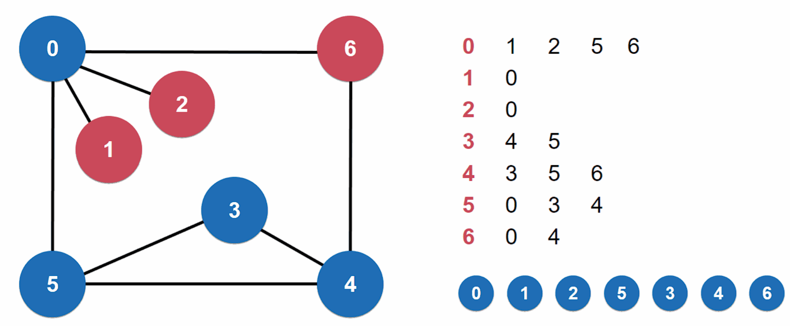

##### 3. 具体实现

**DFS 代码（递归）：**

```c++
typedef enum {FALSE, TRUE} BOOLEAN;           // 布尔类型定义
BOOLEAN Visited[MAX_VEX];                     // 全局访问标志数组

void DFS(ALGraph *G, int v) {
    LinkNode *p;
    Visited[v] = TRUE;                       // 置访问标志，访问顶点 v
    Visit(v);                                // 访问顶点 v（如 printf）

    p = G->AdjList[v].firstarc;              // 链表的第一个结点
    while (p != NULL) {
        if (!Visited[p->adjvex])             // 邻接点未被访问
            DFS(G, p->adjvex);               // 从该邻接点出发深度优先搜索
        p = p->nextarc;                      // 遍历下一个邻接点
    }
}
// 邻接表 O(n+e)   邻接矩阵 O(n²)
```

##### 4. DFS 遍历入口（处理非连通图）

```c++
void DFS_traverse_Graph(ALGraph *G) {
    int v;
    for (v = 0; v < G->vexnum; v++)
        Visited[v] = FALSE;              // 访问标志初始化

    for (v = 0; v < G->vexnum; v++)      // 逐一检查每个顶点
        if (!Visited[v])                 // 未访问则启动一次 DFS
            DFS(G, v);
}
```

> - 对于**无向图**：调用 `DFS()` 的次数 = **连通分量数**
> - 对于**连通图**：只需调用 1 次 `DFS(G, 0)` 即可遍历所有顶点
> - 每次 `DFS()` 调用遍历一个连通分量中的所有顶点

##### 5. 深度优先生成树（DFS Tree）

**定义**：对**连通图**进行 DFS 遍历时，所有顶点 + 所有引起递归的边（树边）构成一棵树，称为**深度优先生成树**。

- 包含全部 $n$ 个顶点，恰有 $n-1$ 条树边
- **树边（Tree Edge）**：DFS 过程中首次发现邻接点并引起递归的那条边
- **回边（Back Edge）**：图中其余未走过的边（不在生成树中）

**示例（连通图）**：


*原图 G（连通，n=4, e=4）*

DFS(A)：A → B → D → C（树边 3 条，回边 2 条）

```
深度优先生成树：
        A
       ╱ ╲
      B   C
     ╱
    D
回边：B─C、C─D（虚线，不在生成树中）
```

> **性质**：
> - DFS 树高度通常**高于** BFS 树（取决于搜索深度）
> - 回边 $(u,v)$ 连接的是**祖先-子孙**关系
> - 无向连通图的 DFS 树中**没有横跨边**（Cross Edge）

##### 6. 深度优先生成森林（DFS Forest）

**定义**：对**非连通图**进行 DFS 遍历时，每个连通分量各自产生一棵深度优先生成树，所有生成树合起来称为**深度优先生成森林**。

- 设图有 $k$ 个连通分量，则生成森林包含 $k$ 棵生成树
- 总边数 = $(n_1-1) + (n_2-1) + \dots + (n_k-1) = n-k$
- `DFS_traverse_Graph` 中 `DFS()` 的调用次数恰好等于 $k$

**示例（非连通图，2 个分量）**：

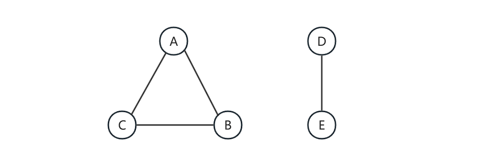

*原图 G（n=5, k=2：分量1={A,B,C}，分量2={D,E}）*

```
深度优先生成森林（2 棵树）：

  分量1 (n₁=3, 边=2):     分量2 (n₂=2, 边=1):
      A                      D
     ╱ ╲                    ╱
    B   C                  E

总边数 = 2+1 = 3 = n-k = 5-2 ✓
```

> `DFS_traverse_Graph(G)` 执行过程：
> 1. `Visited` 全初始化为 `FALSE`
> 2. v=0(A) 未访问 → `DFS(G, A)` → 遍历分量 1
> 3. v=1,2(B,C) 已访问 → 跳过
> 4. v=3(D) 未访问 → `DFS(G, D)` → 遍历分量 2
> 5. v=4(E) 已访问 → 结束
> 6. 共调用 `DFS()` **2 次** = 连通分量数 $k$

#### 二、广度优先搜索 BFS

##### 1. 算法思想

- **类比**：树的**层序遍历**——先访问完同一深度的所有顶点，再推进到下一深度
- **辅助结构**：**队列**（FIFO）——先被访问的顶点，其邻接点也先被探索
- **搜索方式**：从起始顶点出发，依次访问其所有未访问邻接点并入队；然后出队下一个顶点，重复此过程，直至队列为空
- **核心步骤**：
  1. 起始顶点入队，标记已访问
  2. 队头顶点出队 → 访问
  3. 将该顶点的所有**未访问**邻接点依次入队并标记
  4. 重复 ②③ 直至队列空

> BFS 按"距起点由近到远"的顺序访问顶点，因此可用于求**无权图最短路径**。


*BFS(A)：A → B → C → D*
*队列变化：[A]→出A入B,C→[B,C]→出B入D→[C,D]→出C→[D]→出D→[]*

**BFS 生成树：**
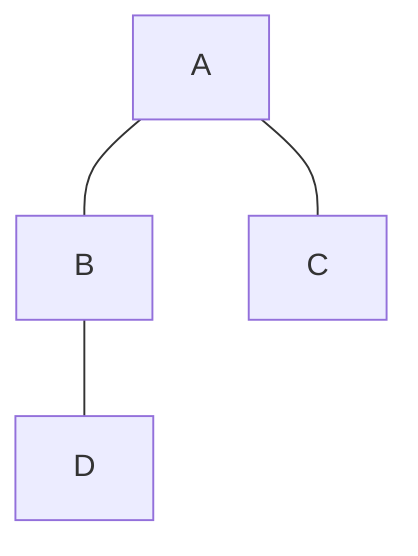

**BFS 代码：**
```c++
typedef enum {FALSE, TRUE} BOOLEAN;           // 布尔类型定义
BOOLEAN Visited[MAX_VEX];                     // 全局访问标志数组

typedef struct Queue {                        // 定义一个队列保存将要访问的顶点
    int elem[MAX_VEX];                        // 队列元素（存顶点下标）
    int front, rear;                          // 队头、队尾指针
} Queue;

void BFS(ALGraph *G, int v) {                 // v 是起始顶点在 AdjList 中的下标
    LinkNode *p;
    Queue *Q = (Queue *)malloc(sizeof(Queue));
    Q->front = Q->rear = -1;                  // 初始化空队列

    if (!Visited[v]) {                        // v 尚未访问
        Q->elem[++Q->rear] = v;               // v 入队
        while (Q->front != Q->rear) {         // 队列非空
            int w = Q->elem[++Q->front];      // 队头元素出队
            Visited[w] = TRUE;                // 置访问标志
            Visit(w);                         // 访问队首元素

            p = G->AdjList[w].firstarc;       // w 的第一个邻接点
            while (p != NULL) {
                if (!Visited[p->adjvex])      // 邻接点未被访问
                    Q->elem[++Q->rear] = p->adjvex;  // 入队
                p = p->nextarc;               // 遍历下一个邻接点
            }
        }
    }
}
// 邻接表 O(n+e)   邻接矩阵 O(n²)
```

##### 2. BFS 遍历入口（处理非连通图）

```c++
void BFS_traverse_Graph(ALGraph *G) {
    int k;
    for (k = 0; k < G->vexnum; k++)
        Visited[k] = FALSE;              // 访问标志初始化

    for (int i = 0; i < G->vexnum; i++)  // 逐一检查每个顶点
        if (!Visited[i])                 // 未访问则启动一次 BFS
            BFS(G, i);
}
```

> - 对于**无向图**：调用 `BFS()` 的次数 = **连通分量数**
> - 对于**连通图**：只需调用 1 次 `BFS(G, 0)` 即可遍历所有顶点
> - 每次 `BFS()` 调用遍历一个连通分量中的所有顶点

##### 3. 广度优先生成树（BFS Tree）

**定义**：对**连通图**进行 BFS 遍历时，所有顶点 + 所有首次发现邻接点的边（树边）构成一棵树，称为**广度优先生成树**。

- 包含全部 $n$ 个顶点，恰有 $n-1$ 条树边
- **树边（Tree Edge）**：BFS 过程中首次发现邻接点并入队的那条边
- **横跨边（Cross Edge）**：连接同一层或相邻层顶点、但不在生成树中的边

```
BFS(A) 生成树（树边实线，横跨边虚线）：
        A
       ╱ ╲
      B   C
     ╱
    D
（C─D 为横跨边，不在生成树中）
```

> **性质**：
> - BFS 树高度通常**低于** DFS 树（按层展开，宽度大、深度小）
> - 从根到任意顶点的路径对应**无权图最短路径**
> - 无向连通图的 BFS 树中**没有回边**（Back Edge），只有树边和横跨边

##### 4. 广度优先生成森林（BFS Forest）

**定义**：对**非连通图**进行 BFS 遍历时，每个连通分量各自产生一棵广度优先生成树，所有生成树合起来称为**广度优先生成森林**。

- 设图有 $k$ 个连通分量，则生成森林包含 $k$ 棵生成树
- 总边数 $= n-k$
- `BFS_traverse_Graph` 中 `BFS()` 的调用次数 $= k$

| 维度 | DFS 生成树/森林 | BFS 生成树/森林 |
|:---|:---|:---|
| 树高 | 高（沿一条路深入） | 低（按层展开） |
| 宽度 | 窄 | 宽 |
| 非树边类型 | 回边（Back Edge） | 横跨边（Cross Edge） |
| 根到顶点路径 | 不保证最短 | **最短路径**（无权图） |

#### 三、遍历总结

BFS 与 DFS 的唯一区别是**邻接点搜索次序不同**——因此两者时间复杂度相同：

| 存储结构 | 时间复杂度 |
|:---|:---|
| 邻接矩阵 | $O(n^2)$ |
| 邻接表 | $O(n+e)$ |

**五条重要结论**：

1. **辅助结构**：DFS 使用**栈**（递归隐式），BFS 使用**队列**
2. **连通分量**：每个连通分量调用一次遍历算法 → 调用次数 = 连通分量数
3. **遍历结果的唯一性**：
   - 邻接矩阵：遍历结果**唯一**（矩阵行列顺序固定）
   - 邻接表：遍历结果**不唯一**（链表插入顺序不定），但一旦给定邻接表，结果唯一（必须按链表顺序遍历）
4. **时间复杂度**：邻接矩阵 $O(n^2)$，邻接表 $O(n+e)$
5. **生成树**：两种遍历分别得到**深度优先生成树**和**广度优先生成树**

> 图的遍历是图的最基本、最重要的算法，许多有关图的操作（连通性判断、环检测、拓扑排序、强连通分量等）都是在遍历基础之上加以变化来实现的。

---

### （四）最小生成树 MST

#### 一、基本概念

**生成树（Spanning Tree）**：包含连通无向图所有 $n$ 个顶点的**极小连通子图**，恰有 $n-1$ 条边。

- 极小：少一条边就不连通
- 连通：任意两顶点间有路径
- 无环：$n$ 个顶点 $n-1$ 条边必无回路

**最小生成树（Minimum Spanning Tree, MST）**：在**带权连通无向图**中，所有生成树中**边权之和最小**的那棵。

| 概念 | 边数 | 权值和 | 是否唯一 |
|:---|:---|:---|:---|
| 生成树 | $n-1$ | 不固定 | 不唯一（一般有很多棵） |
| 最小生成树 | $n-1$ | **最小** | 可能不唯一（权值相等时可有多棵） |

**MST 性质（贪心理论基础）**：

> 设 $G=(V,E)$ 是带权连通无向图，$U$ 是 $V$ 的真子集。若边 $(u,v) \in E$ 满足 $u \in U$、$v \in V-U$，且 $(u,v)$ 在所有这样的边中权值最小，则必存在一棵 MST 包含 $(u,v)$。

*通俗理解：任取一个顶点子集，连接子集内外的**最小权边**一定属于某个 MST。这是 Prim 和 Kruskal 算法的共同理论基础。*

**两种经典算法**：

| 算法 | 策略 | 时间复杂度 | 适合 |
|:---|:---|:---|:---|
| Prim | **加点法**：从任意顶点出发，每次选跨越两集合的最小边 | $O(n^2)$ | 稠密图 |
| Kruskal | **加边法**：边按权排序，用并查集避免成环 | $O(e\log e)$ | 稀疏图 |

#### 二、Prim 算法

##### 1. 算法思想

- **类比**：向一棵"生长中的树"不断添加最近的顶点，直到覆盖全部 $n$ 个顶点
- **辅助结构**：维护两个顶点集合——已选入 MST 的 $U$ 和未选的 $V-U$，以及连接两集合的候选边
- **核心策略**（贪心）：每轮从候选边中选**权值最小**的一条 $(u,v)$（$u \in U, v \in V-U$），将 $v$ 纳入 $U$，并更新候选边
- **核心步骤**：
  1. 任选起始顶点 $v_0$，$U = \{v_0\}$
  2. 找连接 $U$ 与 $V-U$ 的最小权边 $(u,v)$
  3. 将 $v$ 加入 $U$，将 $(u,v)$ 加入 MST
  4. 用 $v$ 的新邻接边更新候选边集
  5. 重复 ②~④ 直至 $|U| = n$

> Prim 本质是 MST 性质的直接应用：每次贪心地选择跨越集合的最小边，共选 $n-1$ 次。

**策略**：从任意顶点开始，每轮选一条连接"树内"和"树外"的**最小权边**，将树外端点纳入。

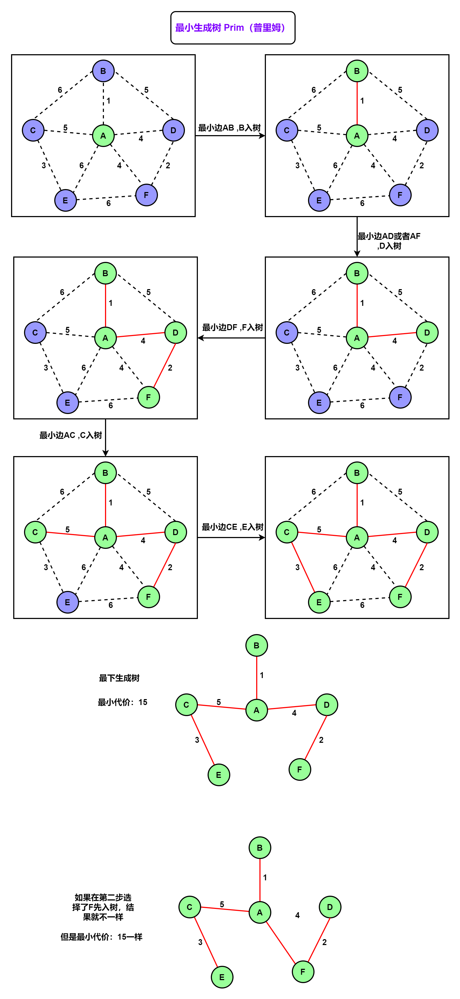

| **步骤**   | **刚入树的顶点** | **B 的状态** | **C 的状态** | **D 的状态** | **E 的状态** | **F 的状态** | **本步选出的最小边** |
| ---------- | ---------------- | ------------ | ------------ | ------------ | ------------ | ------------ | -------------------- |
| **初始**   | **A**            | A, 1         | A, 5         | A, 4         | A, 6         | A, 4         | **A-B (1)**          |
| **Step 1** | **B**            | 0            | A, 5         | A, 4         | A, 6         | A, 4         | **A-D (4)**          |
| **Step 2** | **D**            | 0            | A, 5         | 0            | A, 6         | **D, 2**     | **D-F (2)**          |
| **Step 3** | **F**            | 0            | A, 5         | 0            | A, 6         | 0            | **A-C (5)**          |
| **Step 4** | **C**            | 0            | 0            | 0            | **C, 3**     | 0            | **C-E (3)**          |
| **Step 5** | **E**            | 0            | 0            | 0            | 0            | 0            | *(生成树构建完成)*   |

| 时间复杂度 | 邻接矩阵 $O(n^2)$，堆优化 + 邻接表 $O(e\log n)$ |
|:---|:---|
| 适合 | 稠密图 |

#### 三、Kruskal 算法

##### 1. 算法思想

- **类比**：将图中所有边按权值从小到大排序，依次"试探"每条边——能加就加，不能加（会成环）就跳过
- **辅助结构**：**并查集（Union-Find）**——维护顶点所属的连通分量，快速判断两个顶点是否已在同一集合
- **核心策略**（贪心）：每次从剩余的边中选**权值最小**且**不会形成回路**的边加入 MST
- **核心步骤**：
  1. 将所有边按权值升序排序
  2. 初始化并查集，每个顶点自成一个集合
  3. 依次取出每条边 $(u,v)$：
     - 若 $u$ 和 $v$ **不在同一集合** → 加入 MST，合并两集合
     - 若 $u$ 和 $v$ **已在同一集合** → 跳过（加入会成环）
  4. 重复 ③ 直至选出 $n-1$ 条边

> Kruskal 本质：全局范围内贪心选最小边，用并查集保证不破坏树结构（无环）。

**策略**：所有边按权值升序排列，依次检查。若边的两端**不在同一连通分量**中则加入 MST。

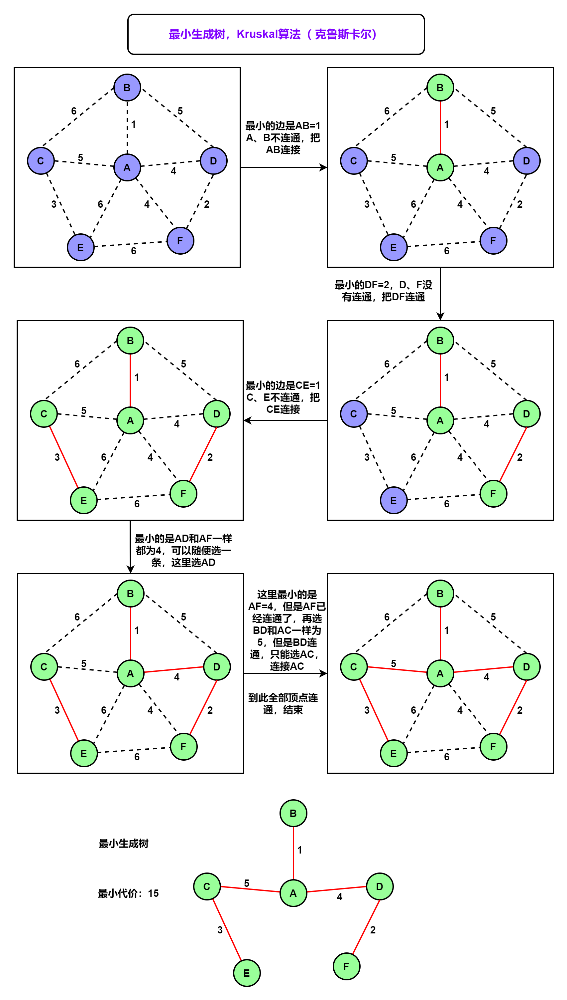

| 时间复杂度 | $O(e\log e)$（排序主导） |
|:---|:---|
| 适合 | 稀疏图 |

#### 四、Prim vs Kruskal

| 维度 | Prim | Kruskal |
|:---|:---|:---|
| 策略 | 加点（维护候选边集） | 加边（排序 + 并查集防环） |
| 时间 | $O(n^2)$ 或 $O(e\log n)$ | $O(e\log e)$ |
| 适合 | 稠密图 | 稀疏图 |

#### 五. MST 唯一性讨论

**MST 何时唯一？**

| 条件 | 唯一性 |
|:---|:---|
| 图中**所有边的权值互不相等** | MST **一定唯一** |
| 存在权值相等的边 | MST **不一定唯一**（可能有多棵权值和相等的 MST） |

**不唯一的典型案例**：

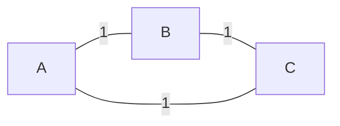
*三角形，三条边权值均为 1*

- 任意选两条边（$n-1=2$）都是一棵 MST，共 3 棵，总权均为 2
- 原因：存在权值相等的边，选择没有"强制力"

**408 考点**：

1. **唯一性判定**：若所有边权值互异 → MST 唯一（充分非必要条件）
2. **不唯一的后果**：虽然不同 MST 的边集可能不同，但**边权之和一定相等**
3. **算法输出**：Prim 和 Kruskal 在 MST 不唯一时，可能因顶点编号、边排序方式不同而输出不同的 MST
4. **严谨结论**：对带权连通无向图，若任意两条边的权值均不相等，则 MST 唯一；反之，存在权值相等的边时 MST 可能不唯一（但不一定，还需看这些等权边是否构成"可替换圈"）

> **核心记忆**：权值全不同 → MST 唯一；有权值相等的边 → 不一定不唯一，需具体分析。

---

### （五）最短路径

#### 一、Dijkstra 算法（单源最短路径）

**问题描述**：对于给定的有向图 $G = (V, E)$ 及单个源点 $V_s$，求 $V_s$ 到 $G$ 的其余各顶点的最短路径。

Dijkstra 提出了一个**按路径长度递增次序产生最短路径**的算法（迪杰斯特拉算法）。

##### 1. 基本思想

从源点到其他各个顶点之间客观上应存在一条最短路径。在这组最短路径中，按其长度的**递增次序**依次求出到各顶点的最短路径和路径长度——即先求出长度最小的一条，然后求出长度第二小的，依此类推，直到求出长度最大的最短路径。

**核心机制**：

- 设 $S$ 为**已求得最短路径的终点集**，初始 $S = \{V_s\}$
- 当求得第一条最短路径 $(V_s, V_i)$ 后，$S = \{V_s, V_i\}$
- **关键结论**：设下一条最短路径的终点为 $V_j$，则该路径满足：
  > 从 $V_s$ 出发到 $V_j$ 的这条最短路径所经过的所有**中间顶点必定在 $S$ 中**。即只有这条最短路径的最后一条弧才是从 $S$ 内某个顶点连接到 $S$ 外的顶点 $V_j$。

**算法流程**：

1. 初始化：$dist[V_s] = 0$，其余为 $\infty$；$S = \{V_s\}$
2. 每轮从 $V - S$ 中选 $dist[]$ 最小的顶点 $u$，将其加入 $S$（确定 $u$ 的最短路径）
3. 用 $u$ 更新其所有邻接点 $v$：若 $dist[u] + w(u,v) < dist[v]$，则更新 $dist[v]$
4. 重复 ②③ 直到 $S = V$

> **限制**：Dijkstra 算法**不允许负权边**——若存在负权，已确定的 $dist$ 可能被进一步缩小，贪心失效。

##### 2. 算法步骤

定义数组 $dist[n]$，每个 $dist[i]$ 分量保存从 $V_s$ 出发**中间只经过集合 $S$ 中的顶点**而到达 $V_i$ 的所有路径中，长度最小的路径长度值。

**核心公式**——下一条最短路径的终点 $V_j$ 必定是不在 $S$ 中且 $dist$ 值最小的顶点：

$$
dist[j] = \text{Min}\{\ dist[k]\ \mid\ V_k \in V - S\ \}
$$

利用上述公式依次找出每一条最短路径。

**算法步骤**：

① **初始化**

- 令 $S = \{V_s\}$，用带权邻接矩阵表示有向图
- 对图中每个顶点 $V_i$ 按以下原则置初值：

$$
dist[i] = \begin{cases}
0 & i = s \\[4pt]
w_{si} & i \neq s\ \text{且}\ \langle V_s, V_i \rangle \in E \\[4pt]
\infty & i \neq s\ \text{且}\ \langle V_s, V_i \rangle \notin E
\end{cases}
$$

其中 $w_{si}$ 为弧 $\langle V_s, V_i \rangle$ 上的权值。

② **选择**

选择一个顶点 $V_j$，使得：

$$
dist[j] = \text{Min}\{\ dist[k]\ \mid\ V_k \in V - S\ \}
$$

$V_j$ 就是求得的下一条最短路径的终点。将 $V_j$ 并入 $S$ 中，即 $S = S \cup \{V_j\}$。

③ **修改（松弛）**

对 $V - S$ 中的每个顶点 $V_k$，修改 $dist[k]$：

$$
\text{若}\ dist[j] + w_{jk} < dist[k]\text{，则}\ dist[k] = dist[j] + w_{jk}
$$

其中 $w_{jk}$ 为弧 $\langle V_j, V_k \rangle$ 上的权值。

④ **重复** ②③ 直到 $S = V$ 为止。

##### 3. 算法实现

```c++
BOOLEAN final[MAX_VEX];                      // 标记顶点是否已确定最短路径
int pre[MAX_VEX], dist[MAX_VEX];             // pre[] 记录前驱，dist[] 记录最短距离

void Dijkstra_path(AdjGraph *G, int v) {     // 从图 G 中的顶点 v 出发求到其余各顶点的最短路径
    int j, k, m, min;

    for (j = 0; j < G->vexnum; j++) {        // 各数组的初始化
        pre[j] = v;
        final[j] = FALSE;
        dist[j] = G->adj[v][j];              // 邻接矩阵：直接取源点行
    }
    dist[v] = 0;
    final[v] = TRUE;                         // 设置 S = {v}

    for (j = 0; j < G->vexnum - 1; j++) {    // 对其余 n-1 个顶点
        m = 0;
        while (final[m]) m++;                // 找不在 S 中的第一个顶点

        min = INFINITY;
        for (k = 0; k < G->vexnum; k++)      // 求出当前最小的 dist[k] 值
            if (!final[k] && dist[k] < min) {
                min = dist[k];
                m = k;
            }

        final[m] = TRUE;                     // 将第 m 个顶点并入 S 中

        for (k = 0; k < G->vexnum; k++)      // 修改 dist 和 pre 数组的值
            if (!final[k] && (dist[m] + G->adj[m][k] < dist[k])) {
                dist[k] = dist[m] + G->adj[m][k];
                pre[k] = m;                  // 记录前驱，用于回溯最短路径
            }
    }
}
// 邻接矩阵 O(n²)   邻接表+堆优化 O(e log n)
```

> `pre[]` 数组用于**回溯最短路径**：从终点沿 `pre[]` 反向追溯至源点，即可得到完整路径序列。

##### 4. 实例

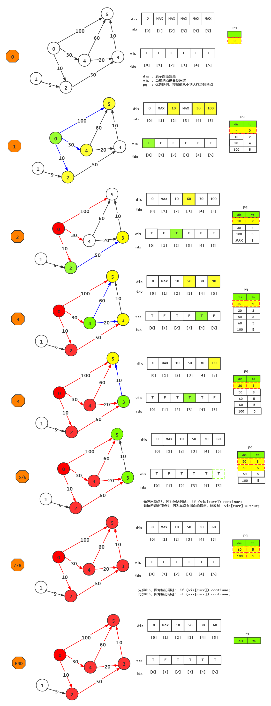

| **步骤**   | **弹出顶点** | <nobr>**锁定顶点**</nobr> | **0 ** | **1 ** | **2 ** | **3 **     | **4 ** | **5 **     | **触发的松弛与堆操作**                        |
| ---------- | ------------ | ------------------------- | ------ | ------ | ------ | ---------- | ------ | ---------- | --------------------------------------------- |
| **初始**   | -            | -                         | 0      | MAX    | MAX    | MAX        | MAX    | MAX        | 初始堆：`[0, 0]`                              |
| **Step 1** | `[0, 0]`     | **0**                     | 0      | MAX    | 10 (0) | MAX        | 30 (0) | 100 (0)    | 发现邻居，堆入：`[10,2]`, `[30,4]`, `[100,5]` |
| **Step 2** | `[10,2]`     | **2**                     | 0      | MAX    | 10 (0) | 60 (2)     | 30 (0) | 100 (0)    | 发现邻居，堆入：`[60,3]`                      |
| **Step 3** | `[30,4]`     | **4**                     | 0      | MAX    | 10 (0) | **50 (4)** | 30 (0) | **90 (4)** | 刷新更近路径！堆入：`[50,3]`, `[90,5]`        |
| **Step 4** | `[50,3]`     | **3**                     | 0      | MAX    | 10 (0) | 50 (4)     | 30 (0) | **60 (3)** | 再次刷新捷径！堆入：`[60,5]`                  |
| **Step 5** | `[60,3]`     | -                         | 0      | MAX    | 10 (0) | 50 (4)     | 30 (0) | 60 (3)     | `vis[3]`已为真，**冗余数据，直接 continue**   |
| **Step 6** | `[60,5]`     | **5**                     | 0      | MAX    | 10 (0) | 50 (4)     | 30 (0) | 60 (3)     | 锁定顶点 5 的最短路径                         |
| **Step 7** | `[90,5]`     | -                         | 0      | MAX    | 10 (0) | 50 (4)     | 30 (0) | 60 (3)     | `vis[5]`已为真，**冗余数据，直接 continue**   |
| **Step 8** | `[100,5]`    | -                         | 0      | MAX    | 10 (0) | 50 (4)     | 30 (0) | 60 (3)     | `vis[5]`已为真，**冗余数据，直接 continue**   |

##### 5. 复杂度分析

| 实现方式 | 时间复杂度 | 空间复杂度 | 说明 |
|:---|:---|:---|:---|
| 邻接矩阵 | $O(n^2)$ | $O(n)$（`dist[]` + `final[]`） | $n$ 轮，每轮 $O(n)$ 找最小 + $O(n)$ 松弛 |
| 邻接表 + 小根堆 | $O(e\log n)$ | $O(n+e)$ | 堆弹出 $n$ 次 + 松弛时堆调整 $e$ 次 |
| 邻接表（无堆优化） | $O(n^2)$ | $O(n+e)$ | 选最小仍需 $O(n)$ |

> **逐项拆解（邻接矩阵 $O(n^2)$）**：
> - ① 初始化：$O(n)$
> - ② 外层循环 $n$ 轮，每轮：
>   - 选 `dist` 最小顶点：扫描 $n$ 个 → $O(n)$
>   - 松弛其 $n$ 个邻接点：$O(n)$
> - 总计：$O(n) + n \times (O(n) + O(n)) = O(n^2)$

#### 二、Floyd 算法（多源最短路径）

> 求**每一对顶点之间**的最短路径。允许负权，**不允许负环**。
>
> 核心递推式：$dist[i][j] = \min(dist[i][j],\ dist[i][k] + dist[k][j])$

##### 1. 基本思想

Floyd 算法采用**动态规划**思想：依次尝试将每个顶点作为**中转点**，若从 $V_i$ 先到 $V_k$ 再到 $V_j$ 比当前已知的 $dist[i][j]$ 更短，则更新。

- 初始：$dist[i][j] = w_{ij}$（直接边的权值，无边则为 $\infty$）
- 第 $k$ 轮：允许中转点为 $\{V_0, V_1, \dots, V_k\}$，更新所有顶点对的最短距离
- $n$ 轮后，$dist[i][j]$ 即为 $V_i$ 到 $V_j$ 的最终最短路径长度

##### 2. 算法实现（仅求长度）

```c++
void Floyd(MGraph G, int dist[][MAXV]) {
    for (int i = 0; i < G.vexnum; i++)          // 初始化
        for (int j = 0; j < G.vexnum; j++)
            dist[i][j] = G.edges[i][j];

    for (int k = 0; k < G.vexnum; k++)          // 中转点
        for (int i = 0; i < G.vexnum; i++)       // 起点
            for (int j = 0; j < G.vexnum; j++)   // 终点
                if (dist[i][k] + dist[k][j] < dist[i][j])
                    dist[i][j] = dist[i][k] + dist[k][j];
}
// O(n³)  O(n²)
```

##### 3. 算法实现（记录路径）

定义二维数组 `Path[n][n]`，元素 `Path[i][j]` 保存从 $V_i$ 到 $V_j$ 的最短路径所经过的**中转顶点**。

> 若 `Path[i][j] = k`：从 $V_i$ 到 $V_j$ 经过 $V_k$，最短路径序列是 $(V_i, \dots, V_k, \dots, V_j)$。
>
> 则路径子序列 $(V_i, \dots, V_k)$ 和 $(V_k, \dots, V_j)$ 一定是从 $V_i$ 到 $V_k$ 和从 $V_k$ 到 $V_j$ 的最短路径。从而可根据 `Path[i][k]` 和 `Path[k][j]` 的值再找到该路径上所经过的其它顶点，依此类推（**递归回溯**）。

```c++
int A[MAX_VEX][MAX_VEX];                         // 最短距离矩阵
int Path[MAX_VEX][MAX_VEX];                      // 路径矩阵（记录中转顶点）

void Floyd_path(AdjGraph *G) {
    int j, k, m;
    for (j = 0; j < G->vexnum; j++)              // 各数组的初始化
        for (k = 0; k < G->vexnum; k++) {
            A[j][k] = G->adj[j][k];              // 邻接矩阵直接赋值
            Path[j][k] = -1;                     // -1 表示无中转顶点
        }

    for (m = 0; m < G->vexnum; m++)              // 中转点
        for (j = 0; j < G->vexnum; j++)          // 起点
            for (k = 0; k < G->vexnum; k++)      // 终点
                if ((A[j][m] + A[m][k]) < A[j][k]) {
                    A[j][k] = A[j][m] + A[m][k]; // 修改最短距离
                    Path[j][k] = m;              // 记录中转顶点
                }
}
// O(n³)  O(n²)
```

> `Path[j][k] = m`：从 $V_j$ 到 $V_k$ 的最短路径经过中转点 $V_m$。初始 `Path[j][k] = -1` 表示直接边（无需中转）。松弛成功时记录当前中转点 $m$。

**输出路径**（递归回溯）：

```c++
void PrintPath(int j, int k) {
    if (Path[j][k] == -1) {                      // 直接边，无中转
        printf(" → %d", k);
        return;
    }
    PrintPath(j, Path[j][k]);                    // 前半段：j → 中转点
    PrintPath(Path[j][k], k);                    // 后半段：中转点 → k
}
// 调用: printf("%d", start); PrintPath(start, end);
```

##### 4. 复杂度分析

| 实现方式 | 时间复杂度 | 空间复杂度 |
|:---|:---|:---|
| 邻接矩阵 | $O(n^3)$ | $O(n^2)$（`dist[n][n]` 矩阵） |

> **逐项拆解**：
> - 外层 $k$（中转点）：$n$ 轮
> - 中层 $i$（起点）：$n$ 轮
> - 内层 $j$（终点）：$n$ 轮
> - 每轮做一次比较 + 一次赋值：$O(1)$
> - 总计：$n \times n \times n \times O(1) = O(n^3)$
>
> Floyd 因其简洁的三重循环结构，虽然复杂度 $O(n^3)$ 较高，但常数因子小，适合 $n$ 较小（如 $n \leq 200$）的全源最短路径问题。

##### 4. 实例

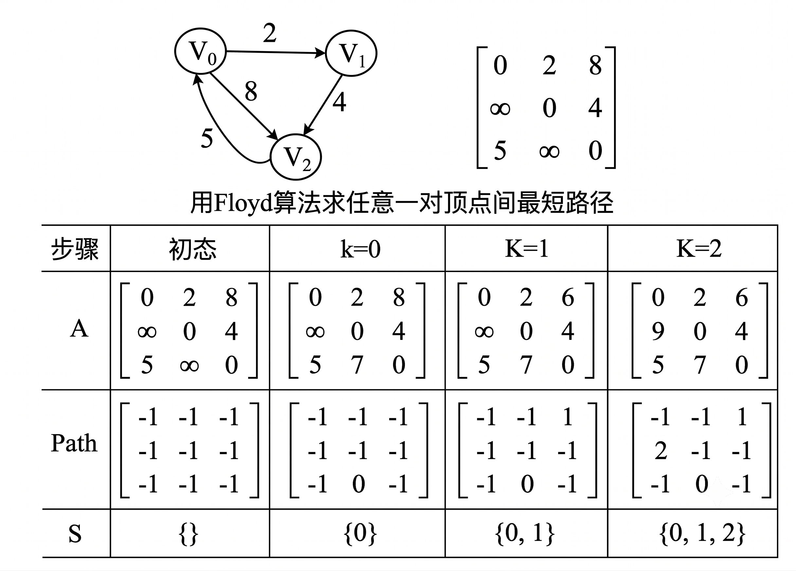

**Step 1 (k = 0)：允许 $V_0$ 作为中转站**

- 程序会检查所有人能不能通过 $V_0$ 抄近道。
- **奇迹发生**：看初始态中从 $V_2$ 到 $V_1$ 的距离是 $\infty$（没路）。但是如果经过 $V_0$ 中转：从 $V_2 \to V_0$ 是 5，$V_0 \to V_1$ 是 2，总距离 $5+2=7$。
- **结果**：因为 $7 < \infty$，所以矩阵 `A` 的左下角 $A[2][1]$ **由 $\infty$ 更新为 7**。同时，`Path[2][1]` 记录下恩人：**修改为 0**（表示借道了 $V_0$）。

**Step 2 (k = 1)：允许 $V_0, V_1$ 作为中转站**

- 这次程序以 $V_1$ 为中转站进行考察（注意：此时矩阵已经包含了 k=0 的成果）。
- **发现捷径**：原本 $V_0 \to V_2$ 的直达距离是 8。但如果借道 $V_1$：$V_0 \to V_1$ 是 2，$V_1 \to V_2$ 是 4，总距离 $2+4=6$。
- **结果**：因为 $6 < 8$，矩阵第一行末尾的 $A[0][2]$ **由 8 更新为 6**。`Path[0][2]` 记录下恩人：**修改为 1**。

**Step 3 (k = 2)：允许所有顶点作为中转站**

- 这次以 $V_2$ 为中转站。
- **最后更新**：原本 $V_1 \to V_0$ 的距离是 $\infty$。借道 $V_2$ 后：$V_1 \to V_2$ 是 4，$V_2 \to V_0$ 是 5，总距离 $4+5=9$。
- **结果**：$A[1][0]$ **由 $\infty$ 更新为 9**。`Path[1][0]` **修改为 2**。全图最短路径彻底计算完毕！

##### 5. 复杂度分析

| 实现方式 | 时间复杂度 | 空间复杂度                    |
| :------- | :--------- | :---------------------------- |
| 邻接矩阵 | $O(n^3)$   | $O(n^2)$（`dist[n][n]` 矩阵） |

> **逐项拆解**：
>
> - 外层 $k$（中转点）：$n$ 轮
> - 中层 $i$（起点）：$n$ 轮
> - 内层 $j$（终点）：$n$ 轮
> - 每轮做一次比较 + 一次赋值：$O(1)$
> - 总计：$n \times n \times n \times O(1) = O(n^3)$
>
> Floyd 因其简洁的三重循环结构，虽然复杂度 $O(n^3)$ 较高，但常数因子小，适合 $n$ 较小（如 $n \leq 200$）的全源最短路径问题。

#### 三、负权边与负权回路

##### 1. 负权边（Negative Edge）

权值为负数的边/弧。不是所有最短路径算法都能处理负权边。

| 算法 | 负权边 | 原因 |
|:---|:---:|:---|
| **Dijkstra** | ❌ | 贪心：已确定顶点不再更新；负权边可能进一步缩短已确定的 $dist$ |
| **Floyd** | ✅ | 动态规划：所有顶点轮流作中转点，反复松弛直至收敛 |
| **Bellman-Ford** | ✅ | 对所有边松弛 $n-1$ 轮，允许已被更新的顶点再次被修正 |

**Dijkstra 失效示例**：

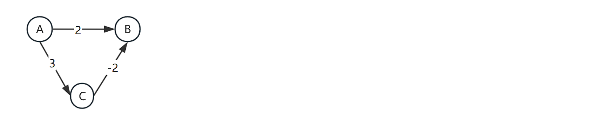

*源点 A：dist[A]=0, dist[B]=2, dist[C]=3 → 确定 B。但路径 A→C→B=3+(-2)=1 < 2，B 实际更短却已被"锁定"！*

##### 2. 负权回路（Negative Cycle）

图中存在一条**回路（环）**，其边权之和为**负数**。

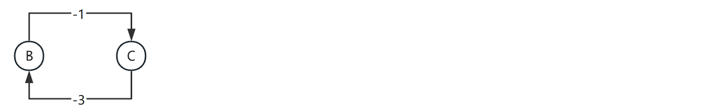

*回路 B→C→B：(-3)+(-1) = -4 < 0，每绕一圈路径长度减少 4*

**关键性质**：

| 问题 | 结论 |
|:---|:---|
| 有负权回路时是否存在最短路径？ | **不存在**——可以无限绕圈使路径长度趋近 $-\infty$ |
| 如何检测负权回路？ | Floyd：若某 $dist[i][i] < 0$（对角元为负），则存在负环 |
| Bellman-Ford | 第 $n$ 轮松弛仍有更新 → 存在负权回路 |
| Floyd 能否在有负环时使用？ | ❌ 不能——结果无意义（路径可无限缩短） |

> **408 核心记忆**：
> - Dijkstra：**不能有负权边**（贪心前提被破坏）
> - Floyd：**可以有负权边，不能有负权回路**（否则路径可无限缩短）
> - Bellman-Ford：**不能有负权回路，但可以检测负权回路**（第 $n$ 轮仍有更新则存在负环）

---

### （六）拓扑排序

##### 1. 基本概念

**拓扑排序（Topological Sort）**：由某个集合上的一个**偏序**得到该集合上的一个**全序**的操作。即有向图的拓扑排序——构造 AOV 网中顶点的一个拓扑线性序列 $(v'_1, v'_2, \dots, v'_n)$，使得该线性序列满足两点：

1. **保持**原来有向图中顶点之间的优先关系（偏序中的先后关系不变）
2. 对原图中**没有优先关系**的顶点之间，也建立一种（人为的）优先关系

本质：将集合上部分元素间的偏序关系，扩展为任意两元素均可比较的全序关系。

- **偏序（Partial Order）**：集合中仅有**部分**元素之间可以比较先后（图中只有部分顶点间有路径确定先后关系）
- **全序（Total Order）**：集合中**任意两个**元素之间都可以比较先后（拓扑排序后的线性序列）
- **AOV 网（Activity On Vertex）**：顶点表示活动，弧表示活动间的优先关系。拓扑排序常用于 AOV 网中确定活动的执行顺序。
- **前驱 / 后继**：若存在弧 $\langle i, j \rangle$，则 $i$ 是 $j$ 的**直接前驱**，$j$ 是 $i$ 的**直接后继**。推而广之，若从顶点 $i$ 到顶点 $j$ 有一条有向路径，则 $i$ 是 $j$ 的**前驱**，$j$ 是 $i$ 的**后继**。

**AOV 网不能有环**：若存在环，则某项活动能否进行是以自身的完成作为前提条件，这在逻辑上是不可能的。检查方法——对有向图的顶点进行拓扑排序，**若所有顶点都在其拓扑有序序列中，则无环**（否则存在环，拓扑排序失败）。

**拓扑序列的充要条件**（两个）：

1. 每个顶点出现且**只出现一次**
2. 若顶点 $A$ 在序列中排在顶点 $B$ 的前面，则在图中**不存在**从 $B$ 到 $A$ 的路径

**核心条件**：

| 条件 | 说明 |
|:---|:---|
| 图必须为 **DAG** | 有向无环图——若存在环，无法确定环上顶点的先后顺序 |
| 存在性 | DAG 的拓扑序列**一定存在**（至少一个） |
| 唯一性 | 拓扑序列通常**不唯一**（多入度为 0 时有多种选择） |

**应用场景**：课程先修关系排课、工程任务调度、编译依赖分析等。

##### 2. 算法思想

① 在 AOV 网中选择一个**没有前驱**的顶点（入度为 0）并**输出**；

② 在 AOV 网中**删除**该顶点以及从该顶点出发的所有有向弧（以该顶点为尾的弧），即邻接点入度 $-1$；

③ **重复** ①②，直到：
   - 图中**全部顶点都已输出** → 图中无环，拓扑排序成功
   - 图中**不存在无前驱的顶点**（但仍有顶点未输出） → 图中必有环，拓扑排序失败


##### 3. 算法实现

> 顶点结点需包含 `indegree` 字段：`typedef struct { VexType data; int indegree; LinkNode *firstarc; } VexNode;`

**(1) 统计各顶点入度的函数**

```c++
void count_indegree(ALGraph *G) {
    int k;
    LinkNode *p;
    for (k = 0; k < G->vexnum; k++)                  // 顶点入度初始化
        G->AdjList[k].indegree = 0;

    for (k = 0; k < G->vexnum; k++) {                 // 顶点入度统计
        p = G->AdjList[k].firstarc;
        while (p != NULL) {
            G->AdjList[p->adjvex].indegree++;         // 邻接点入度 +1
            p = p->nextarc;
        }
    }
}
```

**(2) 拓扑排序算法**

```c++
int TopologicSort(ALGraph *G, int topol[]) {         // topol[] 保存拓扑序列
    int k, no, vex_no, top = 0, count = 0, boolean = 1;
    int stack[MAX_VEX];                              // 用作堆栈
    LinkNode *p;

    count_indegree(G);                               // ① 统计各顶点的入度

    for (k = 0; k < G->vexnum; k++)                  // ② 入度为 0 的顶点入栈
        if (G->AdjList[k].indegree == 0)
            stack[++top] = G->AdjList[k].data;

    do {
        if (top == 0) boolean = 0;                   // 栈空 → 有环或无顶点可处理
        else {
            no = stack[top--];                       // 栈顶元素出栈
            topol[++count] = no;                     // 记录顶点序列

            p = G->AdjList[no].firstarc;
            while (p != NULL) {                      // ③ 删除以该顶点为尾的弧
                vex_no = p->adjvex;
                G->AdjList[vex_no].indegree--;       // 邻接点入度 -1
                if (G->AdjList[vex_no].indegree == 0)
                    stack[++top] = vex_no;           // 新的无前驱顶点入栈
                p = p->nextarc;
            }
        }
    } while (boolean == 0);

    if (count < G->vexnum) return -1;                // 有环，拓扑排序失败
    else return 1;                                    // 成功
}
```

##### 4. 算法分析

设 AOV 网有 $n$ 个顶点、$e$ 条边：

| 步骤 | 操作 | 时间复杂度 |
|:---|:---|:---|
| 统计各顶点入度 | 遍历所有顶点和边 | $O(n+e)$ |
| 入度为 0 的顶点入栈 | 遍历所有顶点 | $O(n)$ |
| 排序过程 | 顶点入栈/出栈 $n$ 次 + 入度减 1 共 $e$ 次 | $O(n+e)$ |
| **总计** | | **$O(n+e)$** |

> 空间复杂度：$O(n)$（栈 + 入度数组 / 顶点结点的 `indegree` 字段）。

---

### （七）关键路径 AOE 网

##### 1. 有向无环图及其应用

**有向无环图（DAG, Directed Acyclic Graph）**：图中没有回路（环）的有向图。是一类具有代表性的图，主要用于研究工程项目的工序问题、工程时间进度问题等。

对工程的活动加以抽象，有两种建模方式：

| 网类型 | 顶点 | 边/弧 | 研究问题 |
|:---|:---|:---|:---|
| **AOV 网** | 活动 | 活动间的优先关系 | 工程能否顺利完成？（拓扑排序） |
| **AOE 网** | 事件（Event） | 活动（Activity） | 最短工期？关键活动是什么？ |

一个工程可分为若干个称为**活动（Activity）**的子工程（工序），各子工程受约束：某子工程必须开始于另一个子工程完成之后。整个工程有一个**起点**和一个**终点**。

**人们关心的三个问题**：
1. 工程能否顺利完成？（→ 拓扑排序检测无环）
2. 影响工程的关键活动是什么？（→ 关键路径分析）
3. 估算整个工程完成所必须的**最短时间**是多少？（→ AOE 网关键路径）

##### 2. 关键路径

**AOE 网（Activity On Edge）**：边表示活动的有向无环图。顶点表示**事件**（Event），每个事件表示在其前的所有活动已经完成、其后的活动可以开始；弧表示**活动**，弧上的权值表示相应活动所需的时间或费用。

**与 AOE 有关的研究问题**：
- 完成整个工程**至少需要多少时间**？→ 从起点到终点的**最长路径长度**（路径上各活动持续时间之和）
- 哪些活动是**关键活动**？→ 长度最长的路径称为**关键路径**（Critical Path），其上的活动一天都不能延迟

##### 3. 相关概念

| 术语 | 计算 |
|:---|:---|
| **ve(k)** 事件最早发生 | 从源点正向递推，取 max（所有前驱事件完成才能开始） |
| **vl(k)** 事件最迟发生 | 从汇点反向递推，取 min（不推迟工期的前提下） |
| **e(i)** 活动最早开始 | = `ve(活动起点)` |
| **l(i)** 活动最迟开始 | = `vl(活动终点) - 活动时长` |
| **关键活动** | `e(i) == l(i)` 的活动——一天都不能延迟 |
| **关键路径** | 由关键活动组成的路径，决定工期 |
##### 4. 实例
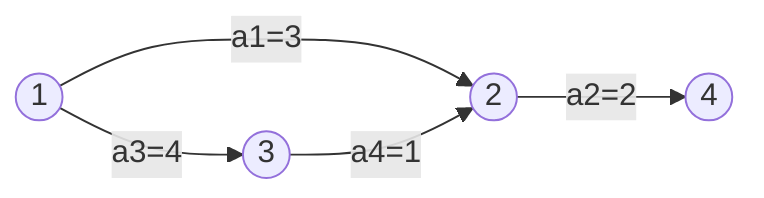
*顶点=事件（①~④），边=活动/天数*

| | ① | ② | ③ | ④ |
|:---|:---:|:---:|:---:|:---:|
| ve | 0 | 3 | 4 | 7 |
| vl | 0 | 3 | 4 | 7 |

*关键路径：①→③→②→④（长度=8天） 非关键活动 a1/a4 有松弛时间*


