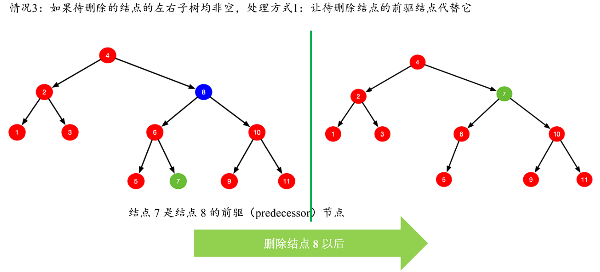
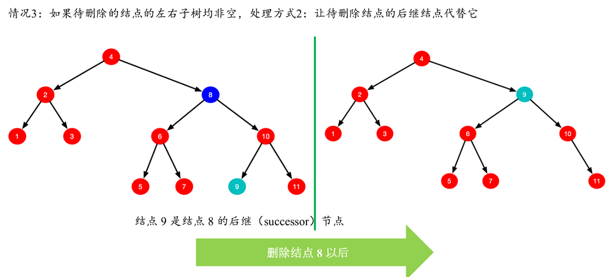
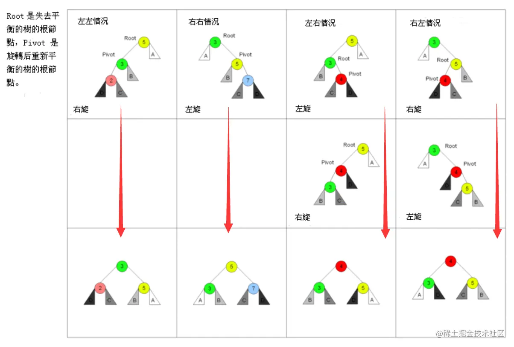
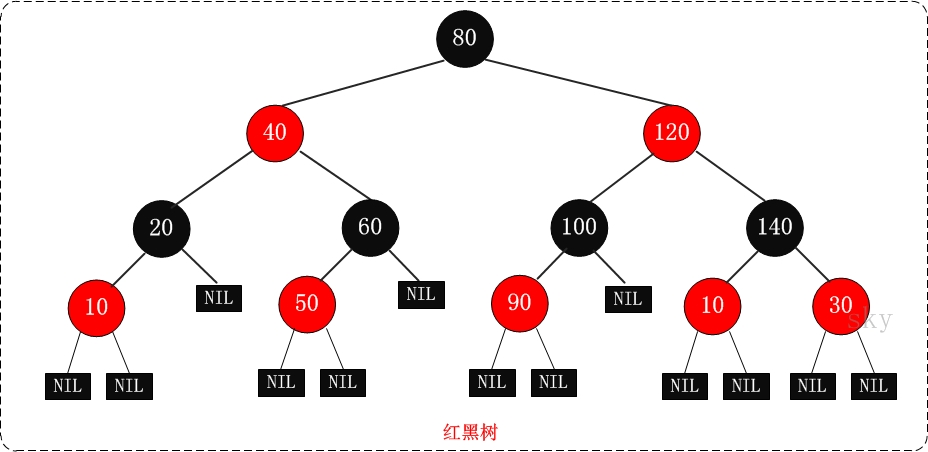
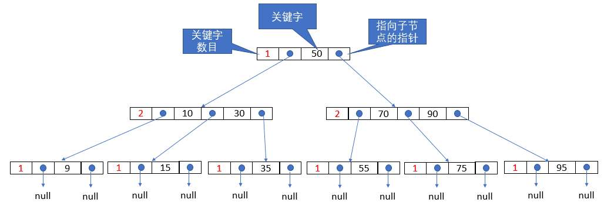
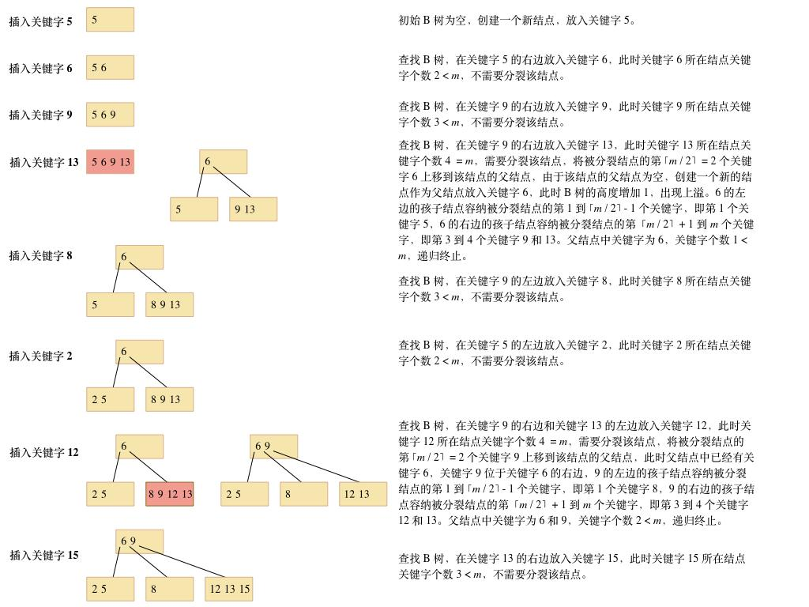
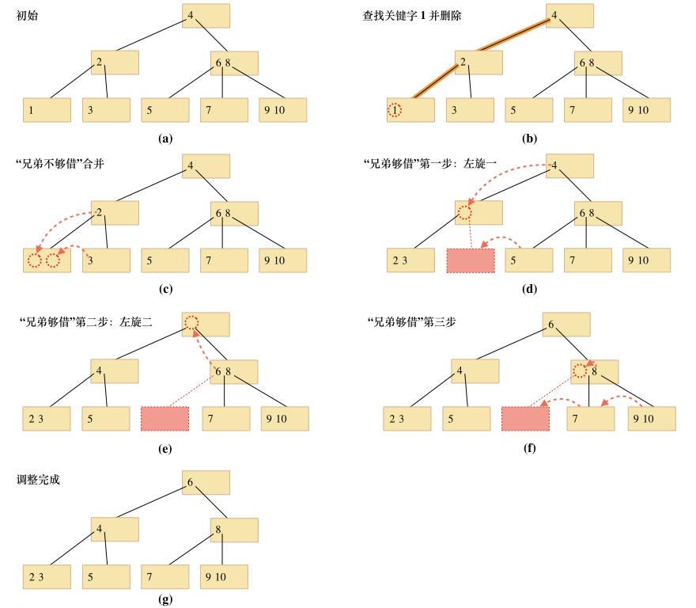
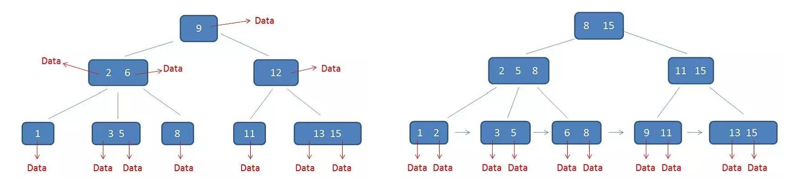
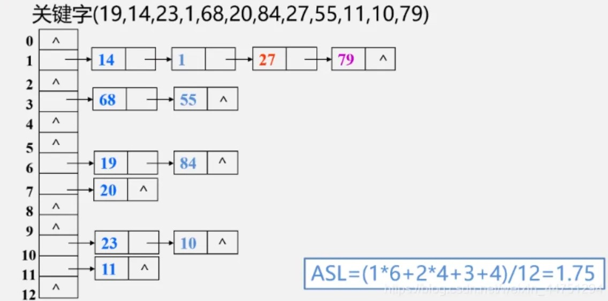

<h2 align="center">第七章 查找</h2>

### （一）查找的基本概念

##### 1. 定义

**查找（Searching）**：在数据元素集合中寻找满足给定条件的数据元素的过程。

| 术语 | 含义 |
|:---|:---|
| **查找表（Search Table）** | 由同一类型数据元素构成的集合 |
| **关键字（Key）** | 数据元素中可唯一标识该元素的某个数据项的值 |
| **主关键字（Primary Key）** | 可以**唯一**标识一个元素的关键字 |
| **次关键字（Secondary Key）** | 可以识别**若干**元素的关键字（不唯一） |
| **查找成功** | 在查找表中找到满足条件的数据元素 |
| **查找失败** | 查找表中不存在满足条件的数据元素 |

##### 2. 查找操作的分类

| 类型 | 说明 | 适用 |
|:---|:---|:---|
| **静态查找** | 只做查询和检索，不修改表 | 顺序查找、折半查找、分块查找 |
| **动态查找** | 查询 + 插入 + 删除 | BST、AVL、B树、哈希表 |

##### 3. 查找的性能指标

**平均查找长度（ASL, Average Search Length）**：在查找过程中，关键字和给定值进行比较的**平均次数**。

- 查找成功时的 ASL：$ASL_{succ} = \sum_{i=1}^{n} p_i \cdot c_i$（$p_i$ 为查找第 $i$ 个元素的概率，$c_i$ 为找到第 $i$ 个元素所需比较次数）
- 查找失败时的 ASL：$ASL_{fail} = \sum_{j=1}^{m} q_j \cdot c'_j$

##### 4. 查找算法的四个评价维度

| 维度 | 说明 |
|:---|:---|
| 时间复杂度 | 关键指标：$O(1)$ → $O(\log n)$ → $O(n)$ |
| 空间复杂度 | 是否需要额外存储结构 |
| 平均查找长度（ASL） | 408 最爱考：等概率假定下的 ASL 计算 |
| 适用性 | 是否支持动态操作、是否要求有序等 |

> **408 高频考点**：给出查找表长度 $n$ 和查找概率分布，计算 $ASL_{succ}$ 和 $ASL_{fail}$。

---

### （二）顺序查找与折半查找

#### 一、顺序查找

##### 1. 基本思想

从头到尾依次扫描，逐个比较关键字——最朴素的查找方法，**对表的结构不做任何要求**。

```
下标:     0   1   2   3   4   5
       ┌───┬───┬───┬───┬───┬───┐
       │ A │ B │ C │ D │ E │ F │     查找 C: 比较3次成功
       └───┴───┴───┴───┴───┴───┘
       ┌───┬───┬───┬───┬───┬───┐
       │ A │ B │ C │ D │ E │ F │     查找 X: 比较 n+1=7 次失败
       └───┴───┴───┴───┴───┴───┘
```

##### 2. 算法实现

```c++
// 不带哨兵的版本
int SeqSearch(int a[], int n, int key) {
    for (int i = 0; i < n; i++) {
        if (a[i] == key) {
            return i;                // 查找成功，返回下标
        }
    }
    return -1;                       // 查找失败
}

// 带哨兵的版本（把 key 放在 a[0]，从末尾向前找，省去边界判断）
int SeqSearch_Sentinel(int a[], int n, int key) {
    a[0] = key;                      // 哨兵
    int i = n;
    while (a[i] != key) {
        i--;                         // 无需判断 i >= 0
    }
    return i;                        // i=0 表示未找到
}
```

##### 3. 性能分析

| 情况 | 比较次数 | 说明 |
|:---|:---|:---|
| 最好 | $1$ | 第一个元素就是目标 |
| 最坏 | $n$ | 最后一个才是目标或不存在 |
| 平均 | $(n+1)/2$ | 等概率下每次比较均分布 |

**ASL 计算**（等概率 $p_i = 1/n$）：

$$ASL_{succ} = \sum_{i=1}^{n} \frac{1}{n} \cdot i = \frac{1}{n} \cdot \frac{n(n+1)}{2} = \frac{n+1}{2}$$

$$ASL_{fail} = n+1$$

> **示例**（$n=6$）：$ASL_{succ} = (1+2+3+4+5+6)/6 = 3.5$；$ASL_{fail} = 7$（$n+1$，含哨兵比较或退出条件判定）

**考虑查找成功/失败概率的 ASL**：

若成功与失败概率相等（各 $1/2$），且对每个记录的查找概率为 $P_i = 1/(2n)$，则：

$$ASL = \frac{1}{2} \cdot ASL_{succ} + \frac{1}{2} \cdot ASL_{fail}
    = \frac{1}{2} \cdot \frac{n+1}{2} + \frac{1}{2} \cdot (n+1)
    = \frac{n+1}{4} + \frac{2(n+1)}{4}
    = \frac{3(n+1)}{4}$$

| 时间复杂度 | $O(n)$ |
|:---|:---|
| 空间复杂度 | $O(1)$ |
| 优点 | 对表无结构要求，顺序存储和链式存储均可 |
| 缺点 | 慢——表中即使有序也需逐个比较 |

#### 二、折半查找

##### 1. 基本思想

每次取**中间位置**元素与关键字比较，每次将查找范围**缩小一半**，直到找到或区间为空。

> **前提**：查找表必须**有序**，且采用**顺序存储**（随机访问）。

```
有序表: [10, 20, 30, 40, 50, 60, 70]    查找 key = 40

第1轮: low=0   mid=3(40)   high=6
       ┌───┬───┬───┬───┬───┬───┬───┐
       │10 │20 │30 │40 │50 │60 │70 │    mid=40 == key → 成功!
       └───┴───┴───┴───┴───┴───┴───┘
                     ↑
```

```
查找 key = 25（失败）

第1轮: low=0   mid=3(40)   high=6     25 < 40, high = 2
第2轮: low=0   mid=1(20)   high=2     25 > 20, low = 2
第3轮: low=2   mid=2(30)   high=2     25 < 30, high = 1
第4轮: low=2 > high=1 → 查找失败
```

##### 2. 算法实现

```c++
int BinarySearch(int a[], int n, int key) {
    int low = 0, high = n - 1, mid;
    while (low <= high) {
        mid = (low + high) / 2;           // 折半
        if (a[mid] == key) {
            return mid;                   // 查找成功
        } else if (a[mid] > key) {
            high = mid - 1;               // 去左半区
        } else {
            low = mid + 1;                // 去右半区
        }
    }
    return -1;                            // 查找失败
}
```

> `mid = low + (high - low) / 2` 可防溢出；`mid = (low + high) / 2` 当 $n$ 较小时等价。

##### 3. 判定树（二叉判定树）

折半查找过程可描述为一棵**平衡二叉树**——每个结点对应一次比较，根据比较结果走向左子树或右子树。

```
有序表 [10,20,30,40,50,60,70] 的二叉判定树：

                  40
                /    \
              20      60
             /  \    /  \
           10   30  50   70
```

- 查找成功的比较次数 = 从根到该结点的路径长度
- 查找失败的比较次数 = 从根到失败结点（空子树）的路径长度
- 判定树是一棵**平衡二叉排序树**，高度为 $\lceil \log_2(n+1) \rceil$

##### 4. 性能分析

**等概率下的 ASL**：

设判定树有 $n$ 个内部结点，深度 $h = \lceil \log_2(n+1) \rceil$：

$$ASL_{succ} = \frac{1}{n} \sum_{i=1}^{n} level_i \approx \log_2(n+1) - 1$$

$$ASL_{fail} \leq \lceil \log_2(n+1) \rceil$$

| 时间复杂度 | $O(\lceil \log_2(n+1) \rceil)$ |
|:---|:---|
| 空间复杂度 | $O(1)$（非递归） |
| 优点 | 比顺序查找快得多 |
| 缺点 | **必须有序** + **必须顺序存储**（需要随机访问 `mid`） |

#### 三、分块查找

##### 1. 基本思想

将数据**分块**，块间有序但块内无序。建立**索引表**记录每块的最大关键字和起始地址。查找时分两步：**① 在索引表中折半（或顺序）确定所在块 → ② 在块内顺序查找。**

```
索引表:                 数据表（分3块，每块3个元素）:
┌────┬──────┐          ┌───┬───┬───┬───┬───┬───┬───┬───┬───┐
│max │ addr │          │30 │20 │10 │50 │40 │60 │90 │70 │80 │
├────┼──────┤          └───┴───┴───┴───┴───┴───┴───┴───┴───┘
│30  │  0   │           ←第1块(10~30)  ←第2块(40~60) ←第3块(70~90)
│60  │  3   │
│90  │  6   │
└────┴──────┘

查找 key = 40:
  ① 索引表: 30<40≤60 → 第2块, addr=3
  ② 从 a[3] 开始顺序找 → a[4]=40 找到
```

##### 2. 性能分析

| 查找阶段 | 方法 | 平均比较次数 |
|:---|:---|:---|
| ① 确定块 | 折半查找 | $\log_2(b+1)$（$b$ 为块数） |
| ② 块内查找 | 顺序查找 | $(s+1)/2$（$s$ 为块大小） |

$$ASL = \underbrace{\log_2(b+1)}_{\text{索引查找}} + \underbrace{\frac{s+1}{2}}_{\text{块内查找}}$$

| 时间复杂度 | $O(\sqrt{n})$（当 $s \approx \sqrt{n}$ 时最优） |
|:---|:---|
| 优点 | 兼具顺序查找简单 + 折半查找快速，**适合插入/删除** |
| 缺点 | 需要额外的索引表空间 |

#### 四、顺序查找 vs 折半查找

| 维度 | 顺序查找 | 折半查找 |
|:---|:---|:---|
| 表结构要求 | **无要求**（顺序/链式均可） | 必须**有序** + **顺序存储** |
| 时间复杂度 | $O(n)$ | $O(\log n)$ |
| ASL（$n$ 较大时） | $\approx n/2$ | $\approx \log_2 n - 1$ |
| 适用场景 | 小数据量 / 链表 / 无序表 | 大数据量 / 有序顺序表 |
| 插入/删除 | 方便（$O(1)$ 尾插） | 困难（需保持有序，移动元素） |
| 额外空间 | $O(1)$ | $O(1)$ |

> **选择依据**：表小或无序 → 顺序查找；表大且有序且顺序存储 → 折半查找；需要频繁插入删除 → 分块查找或 BST。

---

### （三）二叉排序树 BST

#### 一、算法思想

将查找表组织为一棵**有序的二叉树**——利用"左小右大"的性质，每次比较后可排除左子树或右子树，从而将查找范围缩小一半。本质上：将线性查找的 $O(n)$ 提升为树形查找的 $O(h)$（$h$ 为树高）。

- **查找**：从根开始，小于走左、大于走右，直到找到或走到空
- **插入**：类似查找——先定位到应插入的位置（空指针处），再挂入新结点
- **删除**：找到待删结点后，分三种情况处理（叶/单支/双支），核心是保持 BST 性质不变
- **核心问题**：BST 的形态取决于插入顺序——若按有序序列插入会**退化为单链表**（$h=n$），此时查找效率降为 $O(n)$

#### 2. 定义与性质

**二叉排序树（Binary Search Tree, BST）**：若左子树不空，则左子树上所有结点的值**均小于**根结点；若右子树不空，则右子树上所有结点的值**均大于**根结点；左右子树也是 BST。

| 性质 | 说明 |
|:---|:---|
| 中序遍历 BST | 得到**递增**有序序列 |
| 最小元素 | 最左下结点（沿左链走到底） |
| 最大元素 | 最右下结点（沿右链走到底） |

#### 3. 结构定义

```c
typedef int KeyType;                         // 关键字类型

typedef struct BSTNode {
    KeyType key;                             // 关键字
    struct BSTNode *Lchild, *Rchild;         // 左、右孩子指针
} BSTNode;
```

#### 4. 查找操作

**(1) 非递归实现**

```c++
BSTNode *BST_Search(BSTNode *T, KeyType key) {
    BSTNode *p = T;                      // 从根开始
    while (p != NULL && !EQ(p->key, key)) {
        if (LT(key, p->key)) {           // key 小于当前结点关键字
            p = p->Lchild;               // 走左子树
        } else {
            p = p->Rchild;               // 走右子树
        }
    }
    if (p != NULL && EQ(p->key, key)) {
        return p;                        // 查找成功
    }
    return NULL;                         // 查找失败
}
```
> `EQ(a,b)` 判断相等，`LT(a,b)` 判断小于——若 `key` 为结构体类型，需自定义比较宏。

**(2) 递归实现**

```c++
BSTNode *BST_Search(BSTNode *T, KeyType key) {
    if (T == NULL) {
        return NULL;                     // 查找失败（空树）
    }
    if (EQ(T->key, key)) {
        return T;                        // 查找成功
    } else if (LT(key, T->key)) {
        return BST_Search(T->Lchild, key);  // 递归搜左子树
    } else {
        return BST_Search(T->Rchild, key);  // 递归搜右子树
    }
}
```

**查找过程示例**：

```
BST:          12
             /  \
            4   24
               /  \
             15   27
               \
                18

查找 key = 18: 12→24→15→18（4次比较，成功）
查找 key = 20: 12→24→15→NULL（4次比较，失败）
```

#### 5. 插入操作

**插入思想**：在 BST 中插入一个新结点，要保证插入后仍满足 BST 的性质。插入过程本质是**先查找、后挂入**——找到应插入的位置（空指针处），再新建结点挂上去。

- 若 BST 为**空**，则新结点 $x$ 作为根结点
- 否则将 $x.key$ 与根结点 $T$ 的关键字比较：
  1. 若 **$x.key = T \to key$**：已存在，**不需要插入**（BST 关键字唯一）
  2. 若 **$x.key < T \to key$**：结点 $x$ 插入到 $T$ 的**左子树**中
  3. 若 **$x.key > T \to key$**：结点 $x$ 插入到 $T$ 的**右子树**中

```c++
void Insert_BST(BSTNode *&T, KeyType key) {
    if (T == NULL) {                          // 空树 → 新结点作为根
        BSTNode *x = (BSTNode *)malloc(sizeof(BSTNode));
        x->key = key;
        x->Lchild = x->Rchild = NULL;
        T = x;
    } else if (LT(key, T->key)) {             // key 小 → 插入左子树
        Insert_BST(T->Lchild, key);
    } else if (!EQ(T->key, key)) {            // key 大且不相等 → 插入右子树
        Insert_BST(T->Rchild, key);
    }
    // EQ 相等时：已存在，不插入，直接返回
}
```

#### 6. 构建操作

**BST 的构造**：利用插入操作，从空树开始逐个插入每个结点，即可建立一棵 BST。

```c++
BSTNode *Create_BST() {
    KeyType key;
    BSTNode *T = NULL;                     // 初始为空树
    scanf("%d", &key);
    while (key != 65535) {                 // 65535 为输入结束标志
        Insert_BST(T, key);                // 逐个插入
        scanf("%d", &key);
    }
    return T;                              // 返回构造好的 BST 根指针
}
```

> 通过改变插入顺序，同一组关键字可以构造出形态不同的 BST——这是影响查找效率的关键。

#### 7. 删除操作（三情况）

| 情况 | 被删结点的孩子 | 操作 |
|:---|:---|:---|
| ① | **叶子结点**（无孩子） | 直接删除 |
| ② | **只有一个孩子** | 用孩子替代该结点 |
| ③ | **有两个孩子** | 用**中序前驱**（左子树最大）或**中序后继**（右子树最小）替换，转而删除前驱/后继 |




```c++
void BST_Delete(BSTNode *&T, KeyType key) {
    if (T == NULL) {
        return;
    }
    if (LT(key, T->key)) {
        BST_Delete(T->Lchild, key);           // key 小 → 去左子树删
    } else if (LT(T->key, key)) {
        BST_Delete(T->Rchild, key);           // key 大 → 去右子树删
    } else {                                  // 找到待删结点
        if (T->Lchild == NULL) {              // 只有右孩子或无孩子
            BSTNode *p = T;
            T = T->Rchild;
            free(p);
        } else if (T->Rchild == NULL) {       // 只有左孩子
            BSTNode *p = T;
            T = T->Lchild;
            free(p);
        } else {                              // 有两孩子 → 找中序后继
            BSTNode *s = T->Rchild;
            while (s->Lchild != NULL) {
                s = s->Lchild;                // 右子树最左下
            }
            T->key = s->key;                  // 替换值
            BST_Delete(T->Rchild, s->key);    // 递归删后继
        }
    }
}
```

#### 8. 性能分析

| 情况 | ASL | 树高 |
|:---|:---|:---|
| 最好（平衡） | $O(\log n)$ | $\lceil \log_2(n+1) \rceil$ |
| 最坏（单支/退化为链表） | $O(n)$ | $n$ |
| 平均 | $O(\log n)$ | 取决于插入顺序 |

> **关键因素**：BST 的形状取决于**关键字的插入次序**——先插根、后插子树，同一组关键字按不同顺序插入会得到形态迥异的 BST。

---

### （四）平衡二叉树 AVL

#### 一、算法思想

BST 可能退化为单链表（$h=n$）→ 查找效率降为 $O(n)$。AVL 在 BST 基础上添加**平衡约束**：任意结点左右子树高度差不超过 1，从而将树高控制在 $O(\log n)$，保证查找始终高效。

- **核心操作**：插入/删除后若某结点失衡（$\|BF\|>1$），通过**旋转**（左旋/右旋/双旋）恢复平衡
- **四种失衡类型**：LL（左子左插）→ 右单旋；RR（右子右插）→ 左单旋；LR（左子右插）→ 先左旋再右旋；RL（右子左插）→ 先右旋再左旋
- **插入**：最多 1 次旋转即可恢复平衡（发生在**最小不平衡子树**的根处）
- **删除**：可能需要 $O(\log n)$ 次旋转（可能一路旋转到根）

#### 2. 结点类型定义

```c
typedef struct BSTNode {
    KeyType key;                             // 关键字域
    int Bfactor;                             // 平衡因子域（$h_L - h_R$）
    struct BSTNode *Lchild, *Rchild;         // 左、右孩子指针
} BSTNode;
```

> AVL 结点比普通 BST 结点多一个 `Bfactor` 字段，用于记录当前结点的平衡因子，插入/删除后沿路径向上更新。

#### 3. 定义

**平衡二叉树（AVL）**：一棵 BST，且任意结点的**左右子树高度差绝对值不超过 1**。

| 术语 | 定义 |
|:---|:---|
| **平衡因子（BF）** | $BF = h_L - h_R$，取值为 $\{-1, 0, 1\}$ |
| AVL 条件 | 所有结点的 $\|BF\| \leq 1$ |
| 最小不平衡子树 | 离插入点最近的、$\|BF\| > 1$ 的结点为根的子树 |

#### 4. AVL 树的查找

在平衡二叉排序树（AVL）上执行查找的过程与二叉排序树上的查找过程**完全一样**——同样从根开始，小于走左、大于走右。

- 在 AVL 树上执行查找时，和给定关键字 $ 值比较的次数**不超过树的深度**
- 含有 $ 个结点的 AVL 树最大深度为 $pprox 1.44\log_2(n+1)$
- 因此平均查找长度和 $\log_2 n$ 是一个数量级的

> **平均时间复杂度**：(\log_2 n)$

#### 5. 四种旋转（LL / RR / LR / RL）

一般的二叉排序树是不平衡的，若能通过某种方法使其既保持**有序性**又具有**平衡性**，就找到了构造平衡二叉排序树的方法，该方法称为**平衡化旋转**。

在对 AVL 树进行插入或删除一个结点后，通常会影响到从根结点到插入（或删除）结点的路径上的某些结点，这些结点的子树可能发生变化。平衡化旋转的本质是：在保持 BST 性质的前提下，通过调整**最小不平衡子树**的结构来恢复平衡。

插入/删除后:

1. 沿路径向上更新平衡因子（节点平衡因子= 左子树高度- 右子树高度）
2. 找到第一个 |BF| > 1 的结点 A（最小不平衡子树的根）
   - 删除的时候：站在失衡节点 A 上，看看它的左子树和右子树谁比较高？**比较高的那个孩子，就是 B**，再看 B 的左子树和右子树谁比较高？**比较高的那个孩子，就是 C**，如果 B 的两个孩子一样高怎么办？**选和 A 到 B 同方向的那个！**

3. 根据插入位置选择旋转类型（LL / RR / LR / RL）
4. 旋转后 A 的 BF 恢复为 -1/0/1，整个树恢复平衡


| 情况 | 插入位置 | 旋转方式 | 核心操作 |
|:---|:---|:---|:---|
| **LL** | 左子树的左子树 | 右单旋 | 新节点插入在失衡节点的**左**孩子的**左**子树上<br>树的左边太重，需要顺时针向右“掰” |
| **RR** | 右子树的右子树 | 左单旋 | 新节点插入在失衡节点的**右**孩子的**右**子树上<br/>树的右边太重，需要逆时针向左“掰” |
| **LR** | 左子树的右子树 | 先左后右双旋 | 新节点插入在失衡节点的**左**孩子的**右**子树上<br/>先把下面左旋捋直（变成 LL 型），再对上面整体右旋 |
| **RL** | 右子树的左子树 | 先右后左双旋 | 新节点插入在失衡节点的**右**孩子的**左**子树上<br/>先把下面右旋捋直（变成 RR 型），再对上面整体左旋 |
> **旋转法则：被挤掉的节点，直接挂到降级节点的空缺位置上**



**LL 旋转图解**：

```
旋转前（A的BF=2）:          右旋 →          旋转后（B的BF=0）:
        A                                      B
       / \                                    / \
      B   Ar                                Bl   A
     / \                                        / \
    Bl  Br                                     Br  Ar
插入Bl导致失衡
```

**LR 旋转图解**：

```
旋转前（A的BF=2）:    先左旋B子树（→LL）    再右旋A:
        A                  A                    C
       / \                / \                  / \
      B   Ar      →      C   Ar       →      B   A
     / \                / \                  / \ / \
    Bl  C              B  Cr               Bl Cl Cr Ar
       / \            / \
      Cl  Cr        Bl  Cl(?)
插入C的子树导致失衡
```

#### 5. AVL 树的查找

在平衡二叉排序树（AVL）上执行查找的过程与二叉排序树上的查找过程**完全一样**——同样从根开始，小于走左、大于走右。

- 在 AVL 树上执行查找时，和给定关键字 $K$ 值比较的次数**不超过树的深度**
- 含有 $n$ 个结点的 AVL 树最大深度为 $\approx 1.44\log_2(n+1)$
- 因此平均查找长度和 $\log_2 n$ 是一个数量级的

> **平均时间复杂度**：$O(\log_2 n)$

#### 6. 性能分析

| 项目 | 值 |
|:---|:---|
| 含有 $n$ 个结点的 AVL 最大高度 | $\approx 1.44\log_2(n+1)$ |
| 查找 | $O(\log_2 n)$ |
| 插入 | $O(\log_2 n)$（最多一次旋转） |
| 删除 | $O(\log_2 n)$（可能多次旋转直到根） |

> **408 高频考点**：给一组关键字，按顺序插入画出 AVL 构造过程（标注每次旋转的 BF 变化）。

---

### （五）红黑树

#### 一、算法思想

AVL 通过严格的平衡因子（$\|BF\| \leq 1$）保持平衡，但插入/删除可能需要多次旋转。红黑树采用**较为宽松的平衡条件**——通过给结点着色（红/黑）和一组规则来约束树的结构，插入最多 2 次旋转即可恢复，删除最多 3 次，实际效率通常高于 AVL。

#### 2. 定义

**红黑树**：一棵满足以下 5 条性质的二叉排序树（BST）：

| # | 性质 | 说明 |
|:---|:---|:---|
| ① | 每个结点是**红色**或**黑色** | 结点增加一个 `color` 字段 |
| ② | **根结点**是黑色 | 根必须为黑 |
| ③ | 每个**叶结点（NIL）**是黑色 | 外部结点统一视为黑 |
| ④ | **红结点不相邻** | 红色结点的父结点和子结点必须是黑色 |
| ⑤ | 对每个结点，从该结点到其所有后代叶结点的路径上，**黑色结点数相同** | 即黑高（Black-Height）相等 |



#### 3. 结点类型定义

```c
typedef enum { RED, BLACK } ColorType;

typedef struct RBNode {
    KeyType key;                             // 关键字
    ColorType color;                         // 结点颜色
    struct RBNode *Lchild, *Rchild;          // 左、右孩子
    struct RBNode *parent;                   // 父结点（旋转时需回溯）
} RBNode;
```

#### 4. 核心性质

| 性质 | 结论 |
|:---|:---|
| 从根到叶的最长路径 ≤ 2 × 最短路径 | 最长：红黑交替；最短：全黑 |
| 含有 $n$ 个结点的红黑树最大高度 | $\leq 2\log_2(n+1)$ |
| 查找时间复杂度 | $O(\log n)$ |
| 插入/删除 | $O(\log n)$，旋转次数**少于 AVL** |

#### 5. 插入操作（三类情况）

插入新结点初始为**红色**，然后根据父结点颜色判断是否需要调整：

| 情况 | 父结点 | 叔结点 | 处理 |
|:---|:---|:---|:---|
| ① | 黑色 | — | 不需调整（直接插入红色结点即可） |
| ② | 红色 | **红色** | 父和叔变黑，祖父变红 → 向上递归检查 |
| ③ | 红色 | **黑色** | 旋转 + 变色（LL/RR/LR/RL，类 AVL） |

> 插入最多进行 **2 次旋转**（情况 ③ 的双旋场景）即可恢复所有性质。

#### 6. 红黑树 vs AVL

| 维度 | AVL | 红黑树 |
|:---|:---|:---|
| 平衡条件 | $\|BF\| \leq 1$（严格） | 5 条颜色规则（宽松） |
| 树高 | $\approx 1.44\log_2 n$（更低） | $\leq 2\log_2 n$（略高） |
| 查找 | $O(\log n)$（更快，树更矮） | $O(\log n)$ |
| 插入旋转 | 最多 **1** 次 | 最多 **2** 次 |
| 删除旋转 | 最多 $O(\log n)$ 次 | 最多 **3** 次 |
| 适用场景 | 查询频繁 | **插入/删除频繁**（如 STL `map`、Java `TreeMap`） |

> **408 考点**：红黑树 5 条性质记忆、根必黑/红不相邻/黑高等高、与 AVL 的适用场景对比。

---

### （六）索引查找

#### 一、算法思想

**核心问题**：大型数据库中数据存储在磁盘，**磁盘 I/O 次数**是性能瓶颈。平衡 BST 虽能动态查找，但每次比较可能访问一个新结点（一次磁盘 I/O），$\log_2 n$ 次 I/O 无法接受。

**解决思路**：让一个结点容纳多个关键字 → **多路查找树**。一个结点大小 ≈ 一个磁盘页，一次 I/O 读取多个关键字，大幅降低树高。

> R. Bayer 和 E. McCreight（1972）提出 **B 树**（变体 B+ 树）——多路平衡查找树，专为外存索引设计。

**索引类型**：

| 类型 | 索引项与记录的关系 | 特点 |
|:---|:---|:---|
| **稠密索引** | 每个记录一个索引项 | 索引项数 = 记录数 |
| **稀疏索引** | 一组记录一个索引项 | 索引项数 < 记录数，数据必须有序 |
| **多级索引** | 索引的索引 | B 树即为此类——树形多级索引结构 |

**B 树的四个特征**：多路（$m$ 阶，$m\gg 2$）→ 树高 $O(\log_m n)$ / 绝对平衡（叶同层） / 结点内有序 / 满则分裂、少则借或合并

#### 二、B 树

##### 1. 定义

B-树主要用于**文件系统**中。在 B-树中，每个结点的大小为一个**磁盘页**，结点中所包含的关键字及其孩子的数目取决于页的大小。一棵**度为 $m$** 的 B-树称为 **$m$ 阶 B-树**，其定义是：

一棵 $m$ 阶 B-树，或者是空树，或者是满足以下性质的 $m$ 叉树：

**(1)** 根结点或者是叶子，或者至少有 **2** 棵子树，至多有 **$m$** 棵子树；

**(2)** 除根结点外，所有非终端结点至少有 **$\lceil m/2 \rceil$** 棵子树，至多有 **$m$** 棵子树；

**(3)** 所有叶子结点都在树的**同一层**上（绝对平衡）；

**(4)** 每个结点应包含如下信息：

$$
(n,\ A_0,\ K_1,\ A_1,\ K_2,\ A_2,\ \dots,\ K_n,\ A_n)
$$

其中：
- $K_i$（$1 \leq i \leq n$）是关键字，且 $K_i < K_{i+1}$（$1 \leq i \leq n-1$）
- $A_i$（$i=0,1,\dots,n$）为指向孩子结点的指针，且 $A_{i-1}$ 所指向的子树中所有结点的关键字都**小于** $K_i$，$A_i$ 所指向的子树中所有结点的关键字都**大于** $K_i$
- $n$ 是结点中关键字的个数

**(5)** 每个结点应包含的关键字个数 $n$ 满足：

$$
\lceil m/2 \rceil - 1 \leq n \leq m-1
$$

$n+1$ 为子树的棵数。

##### 2. 示例（每个结点最多 2 个关键字、3 个子树）：



##### 3. B 树查找

从树的根结点 $T$ 开始，在 $T$ 所指向的结点的关键字向量 `key[1..keynum]` 中查找给定值 $K$（用折半查找）：

① 若 $key[i] = K$（$1 \leq i \leq keynum$），则**查找成功**，返回结点及关键字位置；

② 否则，将 $K$ 与 `key[1..keynum]` 中的各个分量值比较，以选定查找的子树：
   - 若 $K < key[1]$：$T = T \to ptr[0]$（走最左子树）
   - 若 $key[i] < K < key[i+1]$（$i = 1, 2, \dots, keynum-1$）：$T = T \to ptr[i]$
   - 若 $K > key[keynum]$：$T = T \to ptr[keynum]$（走最右子树）

③ 转 ①，直到 $T$ 是叶子结点且未找到相等的关键字，则**查找失败**。

```c++
int BTree_Search(BTreeNode *T, KeyType K, int &pos) {
    int i;
    while (T != NULL) {
        i = 1;
        while (i <= T->keynum && K > T->key[i]) i++;  // 找到第一个 ≥ K 的位置
        if (i <= T->keynum && K == T->key[i]) {        // 命中
            pos = i;
            return 1;                                  // 查找成功
        }
        T = T->ptr[i - 1];                             // 沿子树继续查找
    }
    return 0;                                          // 查找失败
}
```

> 总结：插入看上界，超过看分裂，根分高一层

##### 4. B 树查找分析

B-树的查找次数等价于树高 $h$。含有 $n$ 个关键字的 $m$ 阶 B-树，其高度范围为：

$$
\log_m(n+1) \leq h \leq \log_{\lceil m/2 \rceil}\left(\frac{n+1}{2}\right) + 1
$$

**最小高度（每层最多结点）**：

| 层 | 最多结点数 | 最多关键字数 |
|:---|:---|:---|
| 第 1 层 | 1 | $m-1$ |
| 第 2 层 | $m$ | $m(m-1)$ |
| 第 3 层 | $m^2$ | $m^2(m-1)$ |
| ... | ... | ... |
| 第 $h$ 层 | $m^{h-1}$ | $m^{h-1}(m-1)$ |

总关键字数：$n \leq (m-1)(1+m+m^2+...+m^{h-1}) = m^h - 1$，故 $h \geq \log_m(n+1)$。

**最大高度（每层最少结点）**：

| 层 | 最少结点数 | 最少关键字数 |
|:---|:---|:---|
| 第 1 层 | 1 | 1 |
| 第 2 层 | 2 | $2(\lceil m/2 \rceil - 1)$ |
| 第 3 层 | $2\lceil m/2 \rceil$ | $2\lceil m/2 \rceil(\lceil m/2 \rceil - 1)$ |
| ... | ... | ... |
| 第 $h$ 层 | $2\lceil m/2 \rceil^{h-2}$ | $2\lceil m/2 \rceil^{h-2}(\lceil m/2 \rceil - 1)$ |

可得 $h \leq \log_{\lceil m/2 \rceil}((n+1)/2) + 1$。

> **结论**：$m$ 阶 B 树高度为 $O(\log_m n)$，因 $m \gg 2$，远低于 BST 的 $O(\log_2 n)$。

##### 5. B 树插入

B 树的生成也是从空树起，逐个插入关键字。插入时不是每插入一个关键字就添加一个叶子结点，而是首先在最低层的某个叶子结点中添加一个关键字，然后有可能"分裂"。

**(1) 插入思想**：**插入看上界**（$m-1$），**超过看分裂**（中间上移、左右分家），**根分高一层**。

① 在 B 树中查找关键字 $K$，若找到，表明关键字已存在，返回；否则，$K$ 的查找操作失败于某个叶子结点，转 ②；

② 将 $K$ 插入到该叶子结点中，插入时，若：
   - 叶子结点的关键字数 $< m-1$：**直接插入**；
   - 叶子结点的关键字数 $= m-1$：将结点**"分裂"**。

**(2) 分裂过程**（以 $m$ 阶 B 树为例，结点最多 $m-1$ 个关键字）：

当插入后关键字数达到 $m$（溢出）时：
1. 将结点中 $m$ 个关键字分为三部分：左半（$\lceil m/2 \rceil - 1$ 个）、**中间关键字** $K_{\lceil m/2 \rceil}$、右半（$m - \lceil m/2 \rceil$ 个）
2. 中间关键字**上移**到父结点
3. 左、右两部分各成为一个新结点（作为父结点中该关键字的左右子树）
4. 若父结点也因此溢出，**递归向上分裂**，最坏情况可能一直分裂到根

> 分裂是 B 树**向上生长**的唯一方式——根结点分裂时树高 $+1$。



##### 6. B 树删除

在 B-树上删除一个关键字 $K$，首先找到关键字所在的**结点 $N$**，然后在 $N$ 中进行关键字 $K$ 的删除操作。

**非叶子结点的处理** **$ \to $** **用右子树的最大值或者左子树的最小值代替**：若 $N$ 不是叶子结点，设 $K$ 是 $N$ 中的第 $i$ 个关键字，则将 $A_i$ 所指子树中的**最大关键字**（或 $A_{i-1}$ 所指子树中的最小关键字）$K'$ 放在 $K$ 的位置，然后删除 $K'$——而 $K'$ 一定在**叶子结点**上。因此，删除操作最终都归结为**从叶子结点中删除一个关键字**。

**从叶子结点中删除的三种情况**：

**(1) 直接删除**：结点 $N$ 的关键字个数 $> \lceil m/2 \rceil - 1$ → 在结点中直接删除关键字 $K$，树不做调整。

**(2) 向兄弟借**：结点 $N$ 的关键字个数 $= \lceil m/2 \rceil - 1$，且 $N$ 的左（或右）兄弟结点的关键字个数 $> \lceil m/2 \rceil - 1$ → 将兄弟结点中的最大（或最小）关键字**上移**到父结点，父结点中大于（或小于）且紧靠上移关键字的关键字**下移**到结点 $N$。本质是一次旋转操作。

**(3) 合并**：结点 $N$ 和其兄弟结点的关键字数都 $= \lceil m/2 \rceil - 1$ → 删除 $N$ 中的关键字，再将 $N$ 中的关键字、指针与其兄弟结点以及分割二者的父结点中的某个关键字 $K_i$，**合并**为一个结点。若因此使父结点关键字个数 $< \lceil m/2 \rceil - 1$，则依此类推向上递归合并。

> **一句话总结**：**自己够→直接删**；**不够找兄弟借**（旋转）；**都不够→合并**（父关键字下移，向上递归）。



#### 三、B+ 树

##### 1. 定义

在实际的文件系统中，基本上不使用 B-树，而是使用 B 树的一种变体，称为 **$m$ 阶 B+ 树**。它与 B 树的主要不同是**叶子结点中存储记录**。在 B+ 树中，所有的非叶子结点可以看成是**索引**，而其中的关键字是作为"分界关键字"，用来界定某一关键字的记录所在的子树。

一棵 $m$ 阶 B+ 树与 $m$ 阶 B 树的主要差异是：

**(1)** 若一个结点有 $n$ 棵子树，则必含有 **$n$ 个关键字**；且叶子结点按关键字的大小从小到大**顺序链接**（横向链表）；

**(2)** 所有**叶子结点**中包含了**全部记录**的关键字信息以及这些关键字记录的指针；

**(3)** 所有的**非叶子结点**可以看成是索引的部分，结点中只含有其子树的根结点中**最大（或最小）关键字**。

##### 2. B 树 vs B+ 树

两类树均是 $m$ 阶：

<table>
  <thead>
    <tr>
      <th rowspan="2"></th>
      <th colspan="2" style="width: 45%; text-align: center;">B- (B树)</th>
      <th colspan="2" style="width: 45%; text-align: center;">B+树</th>
    </tr>
    <tr>
      <th style="text-align: center;">子树个数</th>
      <th style="text-align: center;">关键字个数</th>
      <th style="text-align: center;">子树个数</th>
      <th style="text-align: center;">关键字个数</th>
    </tr>
  </thead>
  <tbody>
    <tr>
      <td align="center" style="white-space: nowrap;"><b>根结点</b></td>
      <td align="center">2~m</td>
      <td align="center">1~(m-1)</td>
      <td align="center">2~m</td>
      <td align="center">1~m</td>
    </tr>
    <tr>
      <td align="center" style="white-space: nowrap;"><b>中间结点</b></td>
      <td align="center">⌈m/2⌉~m</td>
      <td align="center">⌈m/2⌉-1 ~ m-1</td>
      <td align="center">⌈m/2⌉~m</td>
      <td align="center">⌈m/2⌉~m</td>
    </tr>
    <tr>
      <td align="center" style="white-space: nowrap;"><b>结点重复</b></td>
      <td colspan="2" align="center">否</td>
      <td colspan="2" align="center">是</td>
    </tr>
    <tr>
      <td align="center" style="white-space: nowrap;"><b>查找</b></td>
      <td colspan="2" align="center">只有随机方式</td>
      <td colspan="2" align="center">随机方式和顺序方式</td>
    </tr>
    <tr>
      <td align="center" style="white-space: nowrap;"><b>关键字</b></td>
      <td colspan="2">在B树中，各结点中包含的关键字是不重复的</td>
      <td colspan="2">叶结点包含全部关键字，非叶结点中出现过的关键字也会出现在叶结点中</td>
    </tr>
    <tr>
      <td align="center" style="white-space: nowrap;"><b>存储信息</b></td>
      <td colspan="2">B树的结点中都包含了关键字对应的记录的存储地址</td>
      <td colspan="2">叶结点包含信息，所有非叶结点仅起索引作用，非叶结点中的每个索引项只含有对应子树的最大关键字和指向该子树的指针，不含有该关键字对应记录的存储地址。</td>
    </tr>
    <tr>
      <td align="center" style="white-space: nowrap;"><b>n个关键字</b></td>
      <td colspan="2" align="center">对应n+1个子树</td>
      <td colspan="2" align="center">对应n个子树</td>
    </tr>
  </tbody>
</table>

> **核心差异**：B 树结点存数据，查找可能在任何层命中；B+ 树叶结点存全部数据并通过链表相连，支持范围查询和顺序遍历。.

##### 3. 结构示意



<center>B树  VS  B+树<center>

##### 4. B+ 树的查找

与 B 树相比，B+ 树有两种查找方式：

**(1) 从根结点开始**：与 B 树的查找方式相同——从根沿索引结点逐层向下，直到叶子结点。查找过程中，非叶结点上的关键字值等于给定值 $K$ 时并**不停止**，而是继续向下直到叶子结点。

**(2) 从最小关键字开始**：利用叶子结点的横向链表，从最小关键字起按顺序查找。这种方式适合**范围查询**和**全表扫描**。

> B+ 树的查找必须走到叶子结点才能获取数据——因为只有叶子结点存储了记录的指针。

> **408 考点**：B 树的高度公式、插入分裂过程、B 树 vs B+ 树区别、B+ 树的范围查询优势。

---

### （七）散列表（哈希表）

#### 一、算法思想

前面所有查找方法都依赖于"比较"——通过多次关键字比较逐步缩小查找范围。散列表另辟蹊径：设计一个**散列函数 $H(key)$**，将关键字直接映射为存储地址，理想情况下**一次计算**即可定位，无需比较，时间复杂度 $O(1)$。

- **核心思路**：以空间换时间——预设一个足够大的表，用散列函数将关键字"分散"到不同地址
- **冲突不可避免**：当 $H(k_1) = H(k_2)$ 且 $k_1 \neq k_2$ 时发生冲突——需要冲突处理方法（开放定址 / 拉链法）
- **性能关键**：装填因子 $\alpha = n/m$——$\alpha$ 越小冲突越少，查找越快；$\alpha$ 过大则性能退化
- **与比较查找的本质区别**：查找时间不依赖于 $n$（数据规模），只依赖于 $\alpha$（表满程度）

#### 2. 基本概念

**散列表（Hash Table）**：通过散列函数 $H(key)$ 将关键字**直接映射**到存储地址，理想情况下 $O(1)$ 即可完成查找。

| 术语 | 含义 |
|:---|:---|
| **散列函数 $H(key)$** | 关键字 → 存储地址的映射函数 |
| **冲突（Collision）** | 不同关键字映射到同一地址：$H(k_1) = H(k_2)$ 且 $k_1 \neq k_2$ |
| **同义词（Synonym）** | 发生冲突的两个不同关键字互称同义词 |
| **装填因子 $\alpha$** | $\alpha = \dfrac{\text{表中填入的记录数}}{\text{散列表长度}} = \dfrac{n}{m}$ |

#### 3. 常见散列函数

| 方法 | 公式 | 特点 |
|:---|:---|:---|
| **除留余数法** | $H(key) = key \bmod p$ | $p$ 取不大于 $m$ 的素数，最常用 |
| **直接定址法** | $H(key) = a \cdot key + b$ | 无冲突，空间大，适合关键字连续分布 |
| **数字分析法** | 取关键字中分布均匀的若干位 | 适合已知所有关键字的情况 |
| **平方取中法** | 取 $key^2$ 的中间几位 | 适合关键字分布不均匀 |

#### 4. 冲突处理方法

**(1) 开放定址法（Open Addressing）**

发生冲突时，按某种探测序列寻找下一个空位。

$$
H_i = (H(key) + d_i) \bmod m
$$

| 探测方式 | $d_i$ 序列 | 特点 |
|:---|:---|:---|
| **线性探测** | $d_i = 1, 2, 3, \dots$ | 简单，但**聚集现象**严重（同义词和非同义词争夺同一地址） |
| **二次探测** | $d_i = 1^2, -1^2, 2^2, -2^2, \dots$ | 减轻聚集，但需表长为素数 |
| **双散列** | $d_i = i \cdot H_2(key)$ | 两次散列，聚集最少 |
| **伪随机序列** | $d_i = random()$ | 依赖随机序列质量 |

**聚集（Clustering）**：非同义词也争抢同一探测序列中的地址，导致查找长度增长。

**(2) 拉链法（Separate Chaining）**

每个散列地址维护一个**链表**，所有同义词挂在该链上。



> 拉链法不会产生聚集，装填因子 $\alpha$ 可以 > 1。408 删除操作常考删除链中的一个结点。

**(3) 再哈希法（Rehashing）**

准备多个不同的散列函数 $H_1, H_2, H_3, \dots$，当 $H_1(key)$ 发生冲突时，依次尝试 $H_2(key), H_3(key), \dots$，直到找到空位或表满。

- 每次冲突后使用**完全不同的**散列函数重新计算地址
- 与开放定址法中的"双散列"不同：再哈希法是多个独立散列函数，而非增量序列
- 优点：不易产生聚集；缺点：增加了计算开销

> 当装填因子过大导致冲突频繁时，也常通过重新建立更大的散列表并重新散列所有关键字来降低 $\alpha$——这也是一种"再哈希"。

#### 5. 性能分析

| 冲突处理 | 查找成功 ASL | 查找失败 ASL |
|:---|:---|:---|
| 线性探测 | $\frac{1}{2}\left(1 + \frac{1}{1-\alpha}\right)$ | $\frac{1}{2}\left(1 + \frac{1}{(1-\alpha)^2}\right)$ |
| 平方探测 | $\approx -\frac{1}{\alpha}\ln(1-\alpha)$ | $\approx \frac{1}{1-\alpha}$ |
| 拉链法 | $1 + \frac{\alpha}{2}$ | $\alpha$ |

> **核心结论**：散列表平均查找长度**不依赖于 $n$**，只与装填因子 $\alpha$ 有关——$\alpha$ 越小，冲突越少，查找越快。

| 时间复杂度 | 平均 $O(1)$，最坏 $O(n)$ |
|:---|:---|
| 空间 | $O(m)$（表长 $m$） |

---

### （八）本章结构总结

```
查找
├── 基本概念（ASL / 静态 vs 动态 / 评价维度）
├── 顺序查找（哨兵法 / ASL=(n+1)/2 / O(n) / 对表无要求）
├── 折半查找（有序顺序表 / 二叉判定树 / ASL≈log₂n / O(log n)）
├── 分块查找（索引表 + 块内顺序 / 最优 s≈√n / O(√n)）
├── 二叉排序树 BST（左<根<右 / 插入删除三情况 / 退化风险）
├── 平衡二叉树 AVL（BF∈{-1,0,1} / LL RR LR RL 四旋转 / O(log n)）
├── 红黑树（5条颜色性质 / 宽松平衡 / 插入最多2次旋转）
├── 索引查找
│   ├── B 树（m阶多路平衡 / 分裂合并 / 外存索引 / O(log_m n)）
│   └── B+ 树（叶结点链表串连 / 非叶仅索引 / 支持范围查询）
└── 散列表（散列函数 / 开放定址+拉链法+再哈希法 / α决定性能 / 平均 O(1)）
```

**八种查找方法对比**：

| 查找方法 | 平均时间 | 空间 | 要求 | 动态 | 适用场景 |
|:---|:---|:---|:---|:---:|:---|
| 顺序查找 | $O(n)$ | $O(1)$ | 无 | — | 小数据/链表/无序 |
| 折半查找 | $O(\log n)$ | $O(1)$ | 有序 + 顺序存储 | ✗ | 有序顺序表 |
| 分块查找 | $O(\sqrt{n})$ | $O(b)$ | 块间有序 | ✓ | 兼顾增删与速度 |
| BST | $O(\log n) \sim O(n)$ | $O(n)$ | 无 | ✓ | 动态查找，慎防退化 |
| AVL | $O(\log n)$ | $O(n)$ | 无 | ✓ | 查询频繁，严格平衡 |
| 红黑树 | $O(\log n)$ | $O(n)$ | 无 | ✓ | 插入删除频繁 |
| B 树 / B+ 树 | $O(\log_m n)$ | $O(n)$ | 无 | ✓ | 外存索引/数据库 |
| 散列表 | 平均 $O(1)$ | $O(m)$ | 无 | ✓ | 快速 O(1) 查找 |

> **选择思路**：无结构要求且简单 → 顺序；有序顺序表 → 折半；插入删除多 → BST/AVL/红黑树；外存/大数据 → B+/B 树；追求 O(1) → 散列表。
