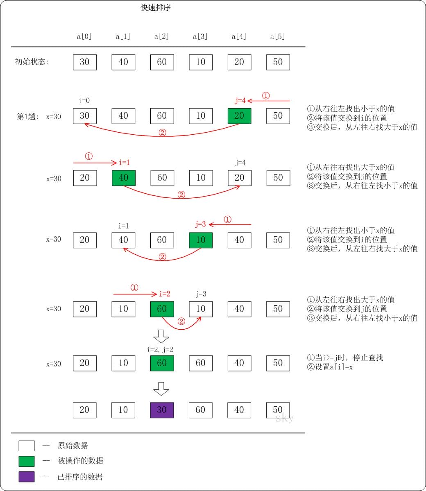
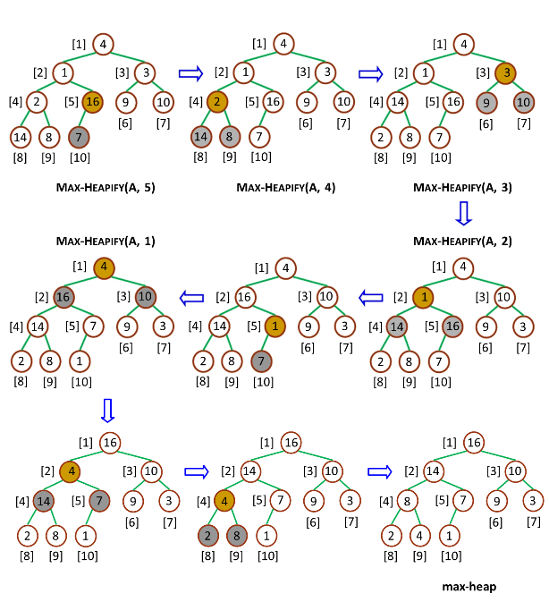

<h2 align="center">第八章 排序</h2>

### （一）排序的基本概念

#### 1. 定义

**排序（Sorting）**：将一组无序的记录序列调整为按关键字有序的记录序列。

| 术语 | 含义 |
|:---|:---|
| **关键字（Key）** | 作为排序依据的数据项 |
| **主关键字** | 唯一标识一个记录的关键字 |
| **次关键字** | 可能不唯一的关键字 |
| **稳定排序** | 关键字相同的记录在排序前后**相对次序不变** |
| **不稳定排序** | 关键字相同的记录在排序前后相对次序**可能改变** |

#### 2. 排序的分类

**排序的类型**：待排序的记录数量不同，排序过程中涉及的存储器不同，有不同的排序分类。

| 类型 | 条件 | 说明 |
|:---|:---|:---|
| **内部排序** | 待排序记录数不太多 | 所有记录都能存放在**内存**中进行排序 |
| **外部排序** | 待排序记录数太多 | 所有记录不可能全部存放在内存，排序过程中必须在**内、外存之间进行数据交换** |

| 分类方式 | 类别 | 示例 |
|:---|:---|:---|
| **按算法策略** | 插入 / 交换 / 选择 / 归并 / 基数 | 见后续各节 |
| **按时间性能** | $O(n^2)$ / $O(n\log n)$ / $O(n)$ | 简单排序 / 高级排序 / 基数排序 |

#### 3. 排序算法评价指标

| 指标 | 说明 |
|:---|:---|
| **时间复杂度** | 最好 / 平均 / 最坏 |
| **空间复杂度** | 是否原地排序 |
| **稳定性** | 408 高频考点 |
| **适用性** | 顺序存储 / 链式存储 / 数据规模 |

#### 4. 排序的基本操作

排序过程中涉及两种基本操作：

**(1) 比较**——比较两个关键字的大小：**必不可少的操作**。

**(2) 移动**——将记录从一个位置移到另一个位置：**不是必须的**，取决于记录的存储方式：

| 存储方式 | 逻辑顺序的体现 | 移动操作 |
|:---|:---|:---|
| **连续地址存储**（顺序表） | 物理存储位置的相邻 | **必须移动记录** |
| **链式存储**（链表） | 结点中的指针 | 仅需修改指针，**不需要移动记录** |

> 大多数排序算法针对顺序存储结构设计；链式存储下的排序只需调整指针，但算法实现会有所不同。

---

### （二）插入排序

#### 一、直接插入排序

##### 1. 排序思想

将待排序的记录 $R_i$ 插入到已排好序的记录表 $R_1, R_2, \dots, R_{i-1}$ 中，得到一个新的、记录数增加 1 的有序表，直到所有的记录都插入完为止。

设待排序的记录顺序存放在数组 `R[1..n]` 中，在排序的某一时刻，将记录序列分成两部分：

- `R[1..i-1]`：**已排好序的有序部分**
- `R[i..n]`：**未排好序的无序部分**

显然，在刚开始排序时，`R[1]` 是已经排好序的。

```
初始:  [49]  38   65   97   76   13   27    有序: [49]   无序: [38...27]
第1趟: [38   49]  65   97   76   13   27    插入 38
第2趟: [38   49   65]  97   76   13   27    插入 65
第3趟: [38   49   65   97]  76   13   27    插入 97
第4趟: [38   49   65   76   97]  13   27    插入 76
第5趟: [13   38   49   65   76   97]  27    插入 13
第6趟: [13   27   38   49   65   76   97]   插入 27，完成
```

##### 2. 算法实现

```c++
#define MAXSIZE 100

typedef struct {
    KeyType key;                             // 关键字
    // ... 其他数据项 ...
} RedType;                                   // 记录类型

typedef struct {
    RedType R[MAXSIZE + 1];                  // R[0] 用作哨兵，R[1..n] 存记录
    int length;                              // 顺序表长度
} Sqlist;

void Straight_Insert_Sort(Sqlist *L) {
    int i, j;
    for (i = 2; i <= L->length; i++) {       // 从第 2 个记录开始插入
        L->R[0] = L->R[i];                   // 设置哨兵
        j = i - 1;
        while (L->R[0].key < L->R[j].key) {  // 查找插入位置
            L->R[j + 1] = L->R[j];           // 记录后移
            j--;
        }
        L->R[j + 1] = L->R[0];               // 插入到相应位置
    }
}
```

**哨兵 `R[0]` 的作用**：算法中的 `R[0]` 开始时并不存放任何待排序的记录，引入的作用主要有两个：

1. **不需要增加辅助空间**：保存当前待插入的记录 $R_i$——$R_i$ 会因记录的后移而被占用，用 $R[0]$ 暂存避免了额外变量；
2. **起"哨兵监视"作用**：保证查找插入位置的内循环总可以在超出循环边界之前找到一个等于当前记录的记录，从而避免在内循环中每次都要判断 $j$ 是否越界（即不必写 `while (j >= 1 && R[0].key < R[j].key)`）。

##### 3. 性能分析

| 情况 | 时间复杂度 | 说明 |
|:---|:---|:---|
| 最好（正序） | $O(n)$ | 每趟只比较 1 次，不移动 |
| 最坏（逆序） | $O(n^2)$ | 比较 + 移动各 $\approx n^2/2$ |
| 平均 | $O(n^2)$ | |
| 空间 | $O(1)$ | 原地排序 |
| 稳定性 | **稳定** | `R[0].key < R[j].key` 不移动相等元素 |

#### 二、折半插入排序

##### 1. 排序思想

当将待排序的记录 $R_i$ 插入到已排好序的记录子表 $R[1..i-1]$ 中时，由于 $R_1, R_2, \dots, R_{i-1}$ 已排好序，则查找插入位置可以用**"折半查找"**实现，直接插入排序就变为折半插入排序。

- **比较次数**：折半查找定位 → $O(\log n)$ 每趟
- **移动次数**：不变（仍需逐个后移）
- **总体**：比较次数减少，移动次数不变，仍为 $O(n^2)$

##### 2. 算法实现

```c++
void Binary_Insert_Sort(Sqlist *L) {
    int i, j, low, high, mid;
    for (i = 2; i <= L->length; i++) {
        L->R[0] = L->R[i];                   // 设置哨兵
        low = 1; high = i - 1;
        while (low <= high) {                // 查找插入位置
            mid = (low + high) / 2;
            if (L->R[0].key < L->R[mid].key)
                high = mid - 1;
            else
                low = mid + 1;
        }
        for (j = i - 1; j >= high + 1; j--)  // 记录后移
            L->R[j + 1] = L->R[j];
        L->R[high + 1] = L->R[0];            // 插入到相应位置
    }
}
```

> 退出 while 时 `low = high + 1`，因此插入位置用 `high + 1` 等价于 `low`。教材两种写法均可。

##### 3. 实例

**完整算法过程**（关键字：30, 13, 70, 85, 39, 42, 6, 20）：

```
初始: [30]  |  13  70  85  39  42  6  20

i=2 (13): 折半定位 low=1 → 30 后移, 13 插入最前
        [13  30]  |  70  85  39  42  6  20

i=3 (70): 折半定位 low=3 → 无需移动
        [13  30  70]  |  85  39  42  6  20

i=4 (85): 折半定位 low=4 → 无需移动
        [13  30  70  85]  |  39  42  6  20

i=5 (39): 折半定位 low=3 → 70,85 后移
        [13  30  39  70  85]  |  42  6  20

i=6 (42): 折半定位 low=4 → 70,85 后移
        [13  30  39  42  70  85]  |  6  20

i=7 (6):  折半定位 low=1 → 全部后移
        [6  13  30  39  42  70  85]  |  20

i=8 (20): 折半查找详细过程:
  有序部分:  [6   13   30   39   42   70   85]  待插入: 20

  第1次:    [6   13   30   39   42   70   85]
             ↑              ↑              ↑
            low           mid=4           high
            R[4]=39 > 20 → high=mid-1=3

  第2次:    [6   13   30   39   42   70   85]
             ↑        ↑    ↑
            low    mid=2  high
            R[2]=13 < 20 → low=mid+1=3

  第3次:    [6   13   30   39   42   70   85]
                     ↑ ↑
                  mid=3 high
                     low
            R[3]=30 > 20 → high=mid-1=2

  → low=3 > high=2, 定位: 插入位置 high+1=3
    将 R[3..7] 全部后移一位, 20 插入 R[high+1]

最终: [6  13  20  30  39  42  70  85]
```

> i=8 插入 20 时，折半查找仅需 **3 次比较**即定位（直接插入需逐次比较 85, 70, 42, 39, 30, 13 共 6 次）。

##### 4. 算法分析

从时间上比较，折半插入排序仅仅减少了关键字的**比较次数**（由 $O(n)$ 降为 $O(\log n)$ 每趟），却没有减少记录的**移动次数**（仍需逐个后移，每趟平均移动 $i/2$ 个），故时间复杂度仍然为 $O(n^2)$。

| 项目 | 说明 |
|:---|:---|
| 时间复杂度 | $O(n^2)$（比较 $O(n\log n)$，移动 $O(n^2)$） |
| 空间复杂度 | $O(1)$（仅用哨兵 `R[0]`） |
| 稳定性 | **稳定** |
| 存储要求 | 必须采用**顺序存储**（需要随机访问做折半查找） |

#### 三、希尔排序

希尔排序（Shell Sort，又称**缩小增量法**）是一种分组插入排序方法。

##### 1. 排序思想

① 先取一个正整数 $d_1$（$d_1 < n$）作为第一个**增量**，将全部 $n$ 个记录分成 $d_1$ 组，把所有相隔 $d_1$ 的记录放在一组中，即对于每个 $k$（$k = 1, 2, \dots, d_1$），$R[k],\ R[d_1+k],\ R[2d_1+k],\ \dots$ 分在同一组中，在**各组内进行直接插入排序**。这样一次分组和排序过程称为**一趟希尔排序**；

② 取新的增量 $d_2 < d_1$，重复 ① 的分组和排序操作；

③ 直至所取的增量 $d_t = 1$ 为止，即所有记录放进一个组中排序为止。

```
初始:  49  38  65  97  76  13  27  48  55  4

d₁=5 (分5组):
初始:  49  38  65  97  76  13  27  48  55  4

[49--------------13]                → 13  38  65  97  76  49  27  48  55  4
[   38--------------27]             → 13  27  65  97  76  49  38  48  55  4
[       65--------------48]         → 13  27  48  97  76  49  38  65  55  4
[           97--------------55]     → 13  27  48  55  76  49  38  65  97  4
[               76--------------4]  → 13  27  48  55  4   49  38  65  97  76


  一趟后: 13  27  48  55  4  49  38  65  97  76

d₂=3 (分3组):
  组1: 13 ─── 55 ─── 38 ─── 76
  组2: 27 ───  4 ─── 65
  组3: 48 ─── 49 ─── 97
  组内分别插入排序...

d₃=1: 全体直接插入排序 → 最终有序
```

> 最后一趟 $d_t = 1$ 即全体直接插入排序。由于前期宏观调整，此时序列**基本有序**，插入排序接近 $O(n)$。

##### 2. 希尔排序分析

**希尔排序特点**：

- 子序列的构成不是简单的"逐段分割"，而是将相隔某个**增量**的记录组成一个子序列
- 每一组内采用**直接插入排序**方法

**增量序列取法**：

- 无除 **1** 以外的**公因子**（各增量互质）
- 最后一个增量值必须为 **1**

| 项目 | 说明 |
|:---|:---|
| 时间复杂度 | 取决于增量序列，平均 $O(n^{1.3}) \sim O(n^{1.5})$ |
| 空间 | $O(1)$ |
| 稳定性 | **不稳定**（同关键字可能分到不同子序列） |

---

### （三）交换排序

#### 一、冒泡排序

##### 1. 算法思想

每趟从头到尾依次比较相邻元素，若逆序则交换——每趟把最大值"冒"到末尾。若某趟无交换，则已有序，提前结束。

```
初始:  49  38  65  97  76  13  27

第1趟: 38↙49  65  76↙97  13↙97  27↙97   → 38  49  65  76  13  27  [97]
第2趟: 38  49  65  13↙76  27↙76 [76  97]  → 38  49  65  13  27  [76  97]
...
```

> "↙" 表示交换方向。

##### 2. 算法实现

```c++
void BubbleSort(int a[], int n) {
    for (int i = 0; i < n - 1; i++) {
        int swapped = 0;
        for (int j = 0; j < n - 1 - i; j++) {
            if (a[j] > a[j + 1]) {           // 逆序则交换
                int t = a[j]; a[j] = a[j + 1]; a[j + 1] = t;
                swapped = 1;
            }
        }
        if (!swapped) break;                 // 无交换 → 已有序
    }
}
```

##### 3. 性能分析

| 情况 | 时间 | 说明 |
|:---|:---|:---|
| 最好（正序） | $O(n)$ | 一趟无交换即结束 |
| 最坏（逆序） | $O(n^2)$ | |
| 平均 | $O(n^2)$ | |
| 空间 | $O(1)$ | |
| 稳定性 | **稳定** | `>` 不交换相等元素 |

#### 二、快速排序

##### 1. 算法思想（分治）

每次选一个**枢轴（pivot）**，将序列划分为左右两部分：左边全部 $\leq$ pivot，右边全部 $\geq$ pivot，然后递归排序左右子序列。



##### 2. 算法实现

```c++
int Partition(int a[], int low, int high) {
    int pivot = a[low];                      // 选第一个元素为枢轴
    while (low < high) {
        while (low < high && a[high] >= pivot) high--;
        a[low] = a[high];                    // 比 pivot 小的移到左边
        while (low < high && a[low] <= pivot) low++;
        a[high] = a[low];                    // 比 pivot 大的移到右边
    }
    a[low] = pivot;                          // 枢轴归位
    return low;
}

void QuickSort(int a[], int low, int high) {
    if (low < high) {
        int pos = Partition(a, low, high);   // 一趟划分
        QuickSort(a, low, pos - 1);          // 递归左半
        QuickSort(a, pos + 1, high);         // 递归右半
    }
}
```

> 递归调用栈深度 $O(\log n)$（平均），最坏 $O(n)$。

##### 3. 快速排序与二叉树

快速排序的递归过程与**二叉排序树（BST）**有着内在联系：

- 每一趟划分选定枢轴 $pivot$，相当于以 $pivot$ 为**根结点**
- 将小于 $pivot$ 的元素划分到左子序列 → 相当于**左子树**
- 将大于 $pivot$ 的元素划分到右子序列 → 相当于**右子树**
- 递归地对左右子序列继续划分 → 相当于递归构造左右子树

```
序列: [38  13  49  76  97  65  27]

以 49 为枢轴:
  左: [38  13  27]  →  右: [76  97  65]
  以 38 为枢轴:          以 76 为枢轴:
    左: [13  27]           左: [65]
    以 13 为枢轴:            右: [97]
      右: [27]

对应的 BST 结构:          49
                        /  \
                      38    76
                     /     /  \
                   13     65  97
                     \
                      27
```

> - 快速排序的**最好情况**（每次枢轴接近中位数）：生成的 BST 接近**平衡**，深度 $O(\log n)$
> - 快速排序的**最坏情况**（每次枢轴为最值）：生成的 BST 退化为**单链表**，深度 $O(n)$
> - 因此快排的时间复杂度等价于对应 BST 的**查找路径长度之和**
> - 树的高度为基于当前pivot所需进行的交换次数
> - 树的中序遍历即为以当前pivot完成一次排序的最终序列

##### 4. 性能分析

| 情况 | 时间 | 说明 |
|:---|:---|:---|
| 最好 | $O(n\log n)$ | 每次划分均匀（左右子序列长度接近） |
| 最坏 | $O(n^2)$ | 正序或逆序（每次枢轴在端点） |
| 平均 | $O(n\log n)$ | |
| 空间 | $O(\log n)$ | 递归调用栈 |
| 稳定性 | **不稳定** | 划分时跨越交换 |

> **408 考点**：快排最坏情况（正序/逆序）→ $O(n^2)$；优化方法：三者取中法选枢轴。

**算法的递归分析**：快速排序的主要时间是花费在**划分**上，对长度为 $k$ 的记录序列进行划分时关键字的比较次数是 **$k-1$**。

设长度为 $n$ 的记录序列进行排序的比较次数为 $C(n)$，则递推式：

$$C(n) = n - 1 + C(k) + C(n - k - 1)$$

**最好情况**：每次划分得到的子序列大致相等（$k \approx n/2$），则：

$$
\begin{aligned}
C(n) &\leq n + 2 \times C(n/2) \\
     &\leq n + 2 \times [n/2 + 2 \times C(n/4)] \\
     &\leq 2n + 4 \times C(n/4) \\
     &\leq \dots \\
     &\leq h \times n + 2^h \times C(n/2^h)
\end{aligned}
$$

当 $n / 2^h = 1$ 时排序结束，即 $h = \log_2 n$，$C(1)$ 看成常数因子，则：

$$C(n) \leq n \times \log_2 n + n \times C(1)$$

$$\therefore\ C(n) \leq O(n \log_2 n)$$

**最坏情况**：每次划分得到的子序列中有一个为**空**，另一个子序列的长度为 $n-1$。即每次划分所选择的基准是当前待排序序列中的**最小（或最大）关键字**（正序或逆序时发生）。

$$
\begin{aligned}
C(n) &= n - 1 + C(n - 1) \\
     &= (n - 1) + (n - 2) + \dots + 1 \\
     &= \frac{n(n-1)}{2}
\end{aligned}
$$

$$\therefore\ C(n) = O(n^2)$$

**空间复杂度**：从所需要的附加空间来看，快速排序算法是递归调用，系统内用**堆栈保存递归参数**。

| 情况 | 栈深度 | 说明 |
|:---|:---|:---|
| 最好（划分均匀） | $\lfloor \log_2 n \rfloor + 1$ | 递归深度 = 二叉树深度 |
| 最坏（每次只划出一个元素） | $O(n)$ | 退化为单链 |
| 平均 | $O(\log_2 n)$ | 平均接近于最好情况 |

$$\therefore\ S(n) = O(\log_2 n)$$

---

### （四）选择排序

#### 一、简单选择排序

##### 1. 算法思想

每趟从待排序部分中选出**最小元素**，与待排序部分的第一个元素交换。

```
初始:  [49  38  65  97  76  13  27]

第1趟: 选最小 13 → 与 49 交换 → [13]  38   65   97   76  49   27
第2趟: 选最小 27 → 与 38 交换 → [13   27]  65   97   76  49   38
第3趟: 选最小 38 → 与 65 交换 → [13   27   38]  97   76  49   65
第4趟: 选最小 49 → 与 97 交换 → [13   27   38   49]  76  97   65
第5趟: 选最小 65 → 与 76 交换 → [13   27   38   49   65]  97   76
第6趟: 选最小 76 → 与 97 交换 → [13   27   38   49   65   76]  97
完成:  [13  27  38  49  65  76  97]
```

##### 2. 算法实现

```c++
void SelectSort(int a[], int n) {
    for (int i = 0; i < n - 1; i++) {
        int minIdx = i;
        for (int j = i + 1; j < n; j++) {    // 找最小元素下标
            if (a[j] < a[minIdx]) minIdx = j;
        }
        if (minIdx != i) {                   // 交换
            int t = a[i]; a[i] = a[minIdx]; a[minIdx] = t;
        }
    }
}
```

##### 3. 算法分析

整个算法是二重循环：外循环控制排序的趟数，对 $n$ 个记录进行排序的趟数为 **$n-1$ 趟**；内循环控制每一趟的排序。进行第 $i$ 趟排序时，关键字的比较次数为 $n-i$，则：

$$\text{比较次数} = \sum_{i=1}^{n-1} (n-i) = \frac{n(n-1)}{2}$$

| 项目 | 说明 |
|:---|:---|
| 时间复杂度 | $T(n) = O(n^2)$（与初始顺序无关，每趟必找最小） |
| 空间复杂度 | $S(n) = O(1)$ |
| 稳定性 | **不稳定**（交换可能跳过中间等同元素） |

#### 二、堆排序（Heap Sort）

##### 1. 堆的定义

**堆**：一棵完全二叉树，满足任意非叶结点的关键字**大于等于**（大顶堆）或**小于等于**（小顶堆）其孩子结点的关键字。

**堆的四条性质**：

**(1)** 堆是一棵采用**顺序存储**结构的完全二叉树，$k_1$ 是根结点；

**(2)** 堆的根结点是关键字序列中的**最小**（或**最大**）值，分别称为**小根堆**（或**大根堆**）——即根到任意结点的路径上关键字值**非递减**（或**非递增**）；

**(3)** 从根结点到每一叶子结点路径上的元素组成的序列都是按元素值（或关键字值）非递减（或非递增）的；

**(4)** 堆中的**任一子树也是堆**。

利用堆顶记录的关键字值最小（或最大）的性质，从当前待排序的记录中依次选取关键字最小（或最大）的记录，就可以实现对数据记录的排序，这种排序方法称为**堆排序**。

```
大顶堆示例:              存储为数组:
        97              [97, 76, 65, 49, 38, 13, 27]
       /  \             i 的左孩子: 2i+1
     76    65           i 的右孩子: 2i+2
    /  \   / \
   49  38 13  27
```

##### 2. 排序思想

① 对一组待排序的记录，按堆的定义**建立堆**（大顶堆或小顶堆）；

② 将**堆顶记录和最后一个记录交换位置**，则前 $n-1$ 个记录是无序的，而最后一个记录是有序的（最大/最小已归位）；

③ 堆顶记录被交换后，前 $n-1$ 个记录不再是堆，需将前 $n-1$ 个待排序记录**重新组织成为一个堆**（向下调整），然后将堆顶记录和倒数第二个记录交换位置，即将整个序列中次小关键字值的记录调整（排除）出无序区；

④ **重复**上述步骤，直到全部记录排好序为止。



##### 3. 算法实现

```c++
// 将 a[k] 向下调整到正确位置（大顶堆）
void HeapAdjust(int a[], int k, int n) {
    int temp = a[k];
    for (int i = 2 * k + 1; i < n; i = 2 * i + 1) {
        if (i + 1 < n && a[i] < a[i + 1]) i++;   // i 指向较大的孩子
        if (temp >= a[i]) break;                   // 已满足堆定义
        a[k] = a[i];                               // 孩子上移
        k = i;                                     // 继续向下调整
    }
    a[k] = temp;
}

// 堆排序主函数
void HeapSort(int a[], int n) {
    // ① 建堆：从最后一个非叶结点开始逐个调整
    for (int i = n / 2 - 1; i >= 0; i--)
        HeapAdjust(a, i, n);

    // ② 排序：反复取堆顶
    for (int i = n - 1; i > 0; i--) {
        int t = a[0]; a[0] = a[i]; a[i] = t;   // 堆顶与堆尾交换
        HeapAdjust(a, 0, i);                    // 剩余元素调整
    }
}
```

##### 4. 性能分析

| 项目 | 说明 |
|:---|:---|
| 建堆时间 | $O(n)$（推导可为 $O(n)$，非 $O(n\log n)$） |
| 每次调整 | $O(\log n)$ |
| 总时间 | $O(n\log n)$（最好/最坏/平均均如此） |
| 空间 | $O(1)$（原地排序） |
| 稳定性 | **不稳定**（交换时可能打破同关键字顺序） |

---

### （五）归并排序

##### 1. 算法思想（分治）

将两个有序子序列合并为一个有序序列。初始时每个元素看作一个长度为 1 的有序子序列，然后两两合并，直到整个序列有序。

```
初始: 49  38  65  97  76  13  27         每个元素作为一个有序段

第1趟归并(段长=1): [38   49] [65   97] [13   76] [27]
第2趟归并(段长=2): [38   49   65   97] [13   27   76]
第3趟归并(段长=4): [13   27   38   49   65   76   97]
```

##### 2. 算法实现（二路归并）

**(1) 归并的算法（Merge）**

```c++
void Merge(RecType R[], RecType DR[], int low, int mid, int high) {
    int i, j, n;
    i = n = low;
    j = mid + 1;
    // 比较两个子序列: R[low..mid] 和 R[mid+1..high]
    while ((i <= mid) && (j <= high)) {
        if (R[i].key < R[j].key)
            DR[n++] = R[i++];
        else
            DR[n++] = R[j++];
    }
    // 将剩余子序列复制到结果序列中
    while (i <= mid)
        DR[n++] = R[i++];
    while (j <= high)
        DR[n++] = R[j++];
}
```

> 参数：`R` 为源数组，`DR` 为结果数组，`k` 为第一个子序列起始下标，`m` 为第一个子序列终止下标（第二个子序列从 $m+1$ 到 $h$）。归并结果存入 `DR[k..h]`。

**(2) 递归归并排序**

```c++
void MergeSort(RecType R[], RecType DR[], int low, int high) {
    if (low < high) {
        int mid = (low + high) / 2;
        MergeSort(R, DR, low, mid);          // 排序左半
        MergeSort(R, DR, mid + 1, high);     // 排序右半
        Merge(R, DR, low, mid, high);        // 合并
    }
}
```

**(3) 一趟归并排序**

```c++
void Merge_pass(RecType R[], RecType DR[], int d, int n) {
    int j = 1;
    while ((j + 2 * d - 1) <= n) {           // 子序列两两归并（每对长度均为 d）
        Merge(R, DR, j, j + d - 1, j + 2 * d - 1);
        j = j + 2 * d;
    }
    if (j + d - 1 < n)                        // 剩余元素个数超过一个子序列长度 d
        Merge(R, DR, j, j + d - 1, n);       // 归并最后两个不等长子序列
    else
        Merge(R, DR, j, n, n);               // 剩余子序列直接复制
}
```

> 参数：`d` 为当前子序列长度，初始 $d=1$，每趟后 $d$ 翻倍。一趟 `Merge_pass` 将相邻两个长为 $d$ 的子序列合并为一个长为 $2d$ 的有序段。

**(4) 归并排序的算法（迭代实现）**

开始归并时，每个记录是长度为 1 的有序子序列，对这些有序子序列逐趟归并，每一趟归并后有序子序列的长度均扩大一倍；当有序子序列的长度与整个记录序列长度相等时，整个记录序列就成为有序序列。

```c++
void Merge_sort(Sqlist *L, RecType DR[]) {
    int d = 1;
    while (d < L->length) {
        Merge_pass(L->R, DR, d, L->length);  // R → DR 归并
        d = 2 * d;
        Merge_pass(DR, L->R, d, L->length);  // DR → R 归并
        d = 2 * d;
    }
}
```

> 非递归实现避免了递归调用栈的 $O(\log n)$ 空间开销。每趟 `Merge_pass` 将子序列长度 $d$ 翻倍，经 $\lceil \log_2 n \rceil$ 趟后，整个序列有序。

##### 3. 算法分析

具有 $n$ 个待排序记录的归并次数是 **$\lceil \log_2 n \rceil$**，而一趟归并的时间复杂度为 $O(n)$，则整个归并排序的时间复杂度无论是最好还是最坏情况均为 **$O(n\log_2 n)$**。

在排序过程中，使用了辅助向量 `DR[]`，大小与待排序记录空间相同，则空间复杂度为 **$O(n)$**。

归并排序是**稳定**的（`R[i].key < R[j].key` 保证左半优先）。

| 项目 | 说明 |
|:---|:---|
| 时间复杂度 | $O(n\log n)$（最好/最坏/平均均如此） |
| 空间复杂度 | $O(n)$（辅助数组 `DR[]`） |
| 稳定性 | **稳定** |

> 归并排序是稳定排序中时间复杂度最优的 $O(n\log n)$ 算法。

---

### （六）基数排序

##### 1. 基数排序概述

基数排序（Radix Sorting，又称为**桶排序**或**数字排序**）：按待排序记录的关键字的组成成分（或"位"）进行排序。基数排序和前面的各种内部排序方法完全不同——**不需要进行关键字的比较和记录的移动**，借助于多关键字排序思想实现单逻辑关键字的排序。

##### 2. 多关键字排序

设有 $n$ 个记录 $\{R_1, R_2, \dots, R_n\}$，每个记录 $R_i$ 的关键字 $Key$ 是由若干项（数据项）组成：$(K_i^1, K_i^2, \dots, K_i^d)$（$d > 1$）。

记录 $R_1, R_2, \dots, R_n$ 是**有序**的，指的是 $\forall i, j \in [1, n]$，$i < j$，若记录的关键字满足：

$$(K_i^1, K_i^2, \dots, K_i^d) < (K_j^1, K_j^2, \dots, K_j^d)$$

即 $K_i^p \leq K_j^p$（$p = 1, 2, \dots, d$），逐级比较。

##### 3. 多关键字排序思想

**最高位优先（MSD, Most Significant Digit first）**：先按第一个关键字 $K^1$ 排序，将记录序列分成若干个子序列，每个子序列有相同的 $K^1$ 值；然后分别对每个子序列按第二个关键字 $K^2$ 排序，每个子序列又被分成若干个更小的子序列；如此重复，直到按最后一个关键字 $K^d$ 进行排序。最后，将所有的子序列依次联接成一个有序的记录序列。

**最低位优先（LSD, Least Significant Digit first）**：与 MSD 相反，排序的顺序是从**最低位开始**——先按 $K^d$ 排序，再按 $K^{d-1}$，直到 $K^1$。

##### 4. LSD 基数排序

从最低位开始，依次对每一位进行"分配 → 收集"，高位在后保证高位权重更大。

```
初始: 278  109  063  930  589  184  505  269  008  083

按个位分配:
  0: 930
  3: 063  083
  4: 184
  5: 505
  8: 278  008
  9: 109  589  269
收集 → 930  063  083  184  505  278  008  109  589  269

按十位分配:
  0: 505  008  109
  3: 930
  6: 063  269
  8: 083  184  589
收集 → 505  008  109  930  063  269  083  184  589  278

按百位分配收集 → 008  063  083  109  184  269  278  505  589  930
```

##### 5. 链式基数排序（LSD 实现）

**(1) 排序思想**

① 首先以**静态链表**存储 $n$ 个待排序记录，头结点指针指向第一个记录结点；

② 一趟排序的过程是：
   - **分配**：按 $K^d$ 值的升序顺序，改变记录指针，将链表中的记录结点分配到 $r$ 个链表（桶）中，每个链表中所有记录的关键字的最低位（$K^d$）的值都相等，用 `f[i]`、`e[i]` 作为第 $i$ 个链表的头结点和尾结点；
   - **收集**：改变所有非空链表的尾结点指针，使其指向下一个非空链表的第一个结点，从而将 $r$ 个链表中的记录重新链接成一个链表；

③ 如此依次按 $K^{d-1}, K^{d-2}, \dots, K^1$ 分别进行，共进行 $d$ 趟排序后排序完成。

**(2) 算法实现**

```c++
#define RADIX 10                           // 基数（如十进制为 10）

void RadixSort(RecType R[], int n, int d) {
    int f[RADIX], e[RADIX];                // 桶的头、尾指针
    int i, j, k, p;

    for (i = 1; i <= n; i++)               // 建立静态链表
        R[i].next = i + 1;
    R[n].next = 0;                         // 最后一个结点 next=0
    p = 1;                                 // p 指向链表中第一个结点

    for (i = 1; i <= d; i++) {             // 共 d 趟排序
        for (j = 0; j < RADIX; j++)        // 初始化桶指针
            f[j] = e[j] = 0;

        while (p != 0) {                   // 分配
            k = GetDigit(R[p].key, i);     // 取第 i 位数字
            if (f[k] == 0)
                f[k] = p;                  // 桶的第一个结点
            else
                R[e[k]].next = p;          // 链接到桶尾
            e[k] = p;                      // 更新桶尾
            p = R[p].next;
        }

        j = 0;
        while (f[j] == 0) j++;             // 找第一个非空桶
        p = f[j];                          // p 指向第一个非空桶头
        k = e[j];                          // k 指向当前桶尾
        for (j++; j < RADIX; j++) {        // 收集：链接所有桶
            if (f[j] != 0) {
                R[k].next = f[j];          // 前一桶尾 → 下一桶头
                k = e[j];                  // 指向新桶尾
            }
        }
        R[k].next = 0;                     // 最后一桶尾结束链
    }
}
```

> 一趟分配：遍历链表，按当前位的值分入 $r$ 个桶；一趟收集：将 $r$ 个桶首尾相连，重新形成链表。

##### 6. 性能分析

| 项目 | 说明 |
|:---|:---|
| 时间复杂度 | $O(d(n+r))$，$d$ 为位数，$r$ 为基数 |
| 空间 | $O(r + n)$（需要 $r$ 个队列） |
| 稳定性 | **稳定** |

> 基数排序适用于 $n$ 大但 $d$ 小的场景，且关键字能拆分为多个独立的"位"。

---

### （七）外部排序

##### 1. 基本概念

当数据量大到无法全部放入内存时，需要进行**外部排序**。外排序的基本方法是**归并排序法**，分为以下两个步骤：

**(1) 生成若干初始归并段（顺串）**——这一过程也称为文件预处理：

①把含有 $n$ 个记录的文件，按内存大小 $w$ 分成若干长度为 $w$ 的子文件（归并段）

②分别将各子文件（归并段）调入内存，采用有效的内排序方法排序后送回外存。产生 $m = \lceil n / w \rceil$ 个初始归并段。

**(2) 多路归并**：对这些初始归并段反复进行归并，直到得到整个有序文件。

[演示](external-sort-simulator.html)

##### 2. 多路平衡归并与败者树

增加归并路数 $k$ 可以减少归并趟数，从而减少磁盘 I/O 次数。

| 概念 | 说明 |
|:---|:---|
| 归并趟数 | $s = \lceil \log_k m \rceil$（$m$ 为初始归并段数） |
| 最佳归并树 | 用哈夫曼树思想构造 I/O 次数最少的归并顺序 |

**利用败者树实现 $K$ 路平衡归并**：[演示](Loser_Tree.html)

在 $k$ 路归并中，每次需从 $k$ 个归并段的当前第一个记录中选出最小值。若每次简单比较，需 $k-1$ 次比较。**败者树**将 $k$ 个归并段组织为一棵完全二叉树，每次选最小仅需 $\lceil \log_2 k \rceil$ 次比较。

**(1) 初始化**：假设有 $k$ 个归并段，每个叶子结点代表一个归并段，其值为该归并段的当前最小关键字。这些叶子结点组织成一棵完全二叉树，**非叶结点存储"败者"**（即比较中较大值对应的段号），**根结点之上再设一个结点存储"冠军"**。

```
5 路归并的败者树（k=5）:

                    champion=ls[0]=3（胜者）
                         ↓
              ┌───────── [3] ← 附加结点
              │
       ┌──────┴──────┐
      [1]          [0]         ← ls[2], ls[3] 存败者
     ┌──┴──┐      ┌──┴──┐
    [2]   [4]    [3]   [0]     ← ls[4], ls[5]
   ┌─┴─┐  ┌─┴─┐  ┌─┴─┐  ┌─┴─┐
   0   1  2   3  4   5  6   7   ← 叶子结点（归并段）
  10   9 20   6 12   ?  ?   ?   ← 各段当前最小值
```

**(2) 比较过程**：从叶子开始两两比较，**败者（较大值）存入父结点**，胜者继续向上。

```
段0=10, 段1=9, 段2=20, 段3=6, 段4=12:

叶子层:  10(0) vs 9(1) → 败者10存入ls[2]=0, 胜者9↑
         20(2) vs 6(3) → 败者20存入ls[3]=2, 胜者6↑
         12(4)         → 直接上升

上一层:  9(1)  vs 12(4) → 败者12存入ls[1]=4, 胜者9↑
         6(3)           → 直接上升

顶层:    9(1)  vs 6(3)  → 败者9存入ls[0]=1, 胜者6成为champion
结果: champion=3（段3的6最小）
```

**(3) 重构**：输出最小值后，读入该段下一个记录，沿路径向上更新败者。

```
段3输出6后读入15:
  ls[3]存败者20(段2), 胜者15↑
  15 vs ls[1]=4(段4=12) → 15败存入ls[1]=1, 12↑
  12 vs ls[0]=0(段0=10) → 12败存入ls[0]=4, 10成为champion
结果: champion=0
```

> 每选一个最小记录仅 $\lceil \log_2 k \rceil$ 次比较（vs $k-1$ 次），总比较 $n \lceil \log_2 k \rceil$。

##### 3. 置换-选择排序

常规方法生成的初始归并段长度受限于内存大小 $w$，产生 $m = \lceil n/w \rceil$ 个段。**置换-选择排序**可以在内存大小不变的前提下，生成**更长**的初始归并段，从而减少段数 $m$ 和归并趟数。

**算法思想**：

- 利用一个大小为 $w$ 的内存工作区（败者树 / 小顶堆）
- 每次选出当前工作区中 $\geq$ 上一个输出值的最小关键字输出
- 若所有剩余关键字都 $<$ 上一个输出值，则该归并段结束，开始新的一段

**算法步骤**：

1. 从输入文件读入 $w$ 个记录到内存工作区
2. 从工作区选出最小关键字的记录输出，作为当前归并段的第一个记录
3. 从输入文件再读入一个记录替换输出者
4. 从工作区选出 $\geq$ 上一个输出值的最小关键字输出；若找不到（即所有都 < 上一个输出），则该归并段结束，从当前工作区重新选出最小关键字开始新的一段
5. 重复 ③④，直到输入文件读完且工作区为空

**示例**：[演示](Replacement_Selection.html)

> 常规方法（$w=3$）产生 $\lceil 9/3 \rceil = 3$ 个段；置换-选择排序仅产生 **2** 个段，且 Run1 长度达 8。

##### 4. 最佳归并树

置换-选择排序产生的各初始归并段**长度可能不相等**。在 $k$ 路归并时，若简单按顺序归并，总 I/O 次数不一定最少。**最佳归并树**利用**哈夫曼树**思想：将权值（段长）越小的归并段放在越靠近根的位置进行归并，使总 I/O 量最小。

**构造方法**（以 $k=3$ 路归并为例，5 个归并段长 $[2,3,6,9,12]$）：

```
段长:  2   3   6   9   12

哈夫曼归并过程:
  ① 选最小 2 个: 2+3=5, 剩余 [5,6,9,12]
  ② 选最小 2 个: 5+6=11, 剩余 [9,11,12]
  ③ 选最小 2 个: 9+11=20, 剩余 [12,20]
  ④ 最后归并: 12+20=32

最佳归并树（3 路）:
               [32]
              /    \
           [11]    [12(段4)]
          /    \
       [5]     [9(段3)]
      /   \
  [2(段0)] [3(段1)]
       \
      [6(段2)]

总 I/O 量 = 5 + 11 + 20 + 32 = 68（最小）
```

**虚段处理**：当初始归并段数 $m$ 不满足 $(m-1) \bmod (k-1) = 0$ 时，需补充虚段（长度为 0）。虚段数 $= (k-1) - (m-1) \bmod (k-1)$（除余为 0 时不补）。

> **408 考点**：给定段长和 $k$，画出最佳归并树并计算总 I/O 量；虚段个数的计算。

---

### （八）本章结构总结

```
排序
├── 基本概念（稳定性 / 内外排序 / 评价维度）
├── 插入排序
│   ├── 直接插入（O(n²) / 稳定 / 哨兵）
│   ├── 折半插入（比较 O(nlog n) / 稳定）
│   └── 希尔排序（O(n^1.3) / 不稳定 / 增量序列）
├── 交换排序
│   ├── 冒泡排序（O(n²) / 稳定 / 提前终止）
│   └── 快速排序（O(nlog n) / 不稳定 / 分治）
├── 选择排序
│   ├── 简单选择（O(n²) / 不稳定）
│   └── 堆排序（O(nlog n) / 不稳定 / 完全二叉树）
├── 归并排序（O(nlog n) / 稳定 / 辅助数组 O(n)）
├── 基数排序（O(d(n+r)) / 稳定 / 多关键字）
└── 外部排序（k路归并 / 败者树 / 置换-选择 / 最佳归并树）
```

**主要内部排序方法的性能**：

| 方法 | 平均时间 | 最坏所需时间 | 附加空间 | 稳定性 |
|:---|:---|:---|:---|:---:|
| 直接插入 | $O(n^2)$ | $O(n^2)$ | $O(1)$ | 稳定的 |
| Shell 排序 | $O(n^{1.3})$ | $O(n^2)$ | $O(1)$ | 不稳定的 |
| 直接选择 | $O(n^2)$ | $O(n^2)$ | $O(1)$ | 不稳定的 |
| 堆排序 | $O(n\log_2 n)$ | $O(n\log_2 n)$ | $O(1)$ | 不稳定的 |
| 冒泡排序 | $O(n^2)$ | $O(n^2)$ | $O(1)$ | 稳定的 |
| 快速排序 | $O(n\log_2 n)$ | $O(n^2)$ | $O(\log_2 n)$ | 不稳定的 |
| 归并排序 | $O(n\log_2 n)$ | $O(n\log_2 n)$ | $O(n)$ | 稳定的 |
| 基数排序 | $O(d(n+r))$ | $O(d(n+r))$ | $O(n+r)$ | 稳定的 |

> **408 核心记忆**：
> - 唯一不稳定 + 平均 $O(n\log n)$：**快排、堆排、希尔**
> - 稳定 + $O(n\log n)$：**归并**
> - 最好能 $O(n)$ 的：直接插入、冒泡（正序时）
> - 空间非 $O(1)$ 的：快排（递归栈 $O(\log n)$）、归并（辅助数组 $O(n)$）、基数（队列 $O(n+r)$）

**排序算法中的特殊情形总结**：

**(1) 每趟排序能否确定元素最终位置**：
- 每趟**不能**确定：插入类（直接插入、折半插入、希尔）、归并类、基数类
- 每趟**均能**确定一个：交换类（冒泡、快排）、选择类（简单选择、堆）

**(2) 存储结构要求**：
- 一般要求**顺序存储**：归并排序、堆排序、快速排序、折半插入排序
- 顺序和链式均可：其他算法

**(3) 时间复杂度与初始状态关系**：
- **无关**（最好=最坏=平均）：基数排序、简单选择排序、折半插入排序
- **有关**：其余算法

**(4) 比较次数与初始状态关系**：
- **无关**：基数排序、简单选择排序
- **有关**：其余算法

**(5) 排序趟数与初始状态关系**：
- **有关**：快速排序、冒泡排序、基数排序、希尔排序
- **无关**：直接插入排序、折半插入排序、简单选择排序、堆排序、归并排序

**(6) 元素基本有序时**：直接插入排序最快 $O(n)$；此时快速排序的时间复杂度退化为 $O(n^2)$。

**(7) 取前 $k$ 个元素（$n \gg k$）**：可以用冒泡排序、简单选择排序和堆排序，其中**堆排序性能最好**。

**(8) 简单选择排序的比较次数**是 $\dfrac{n(n-1)}{2}$ 次；**基数排序不依赖于比较**。
