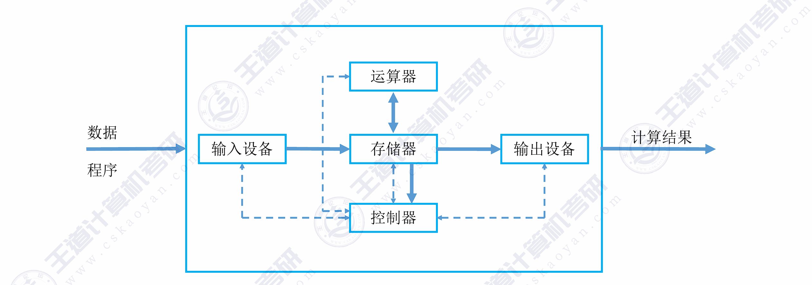
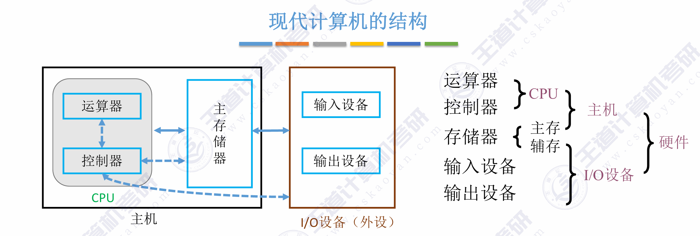
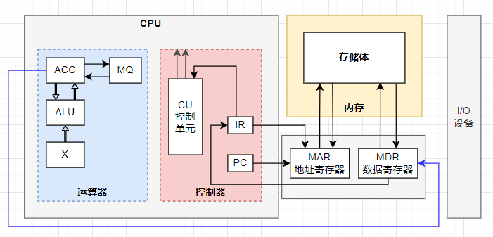
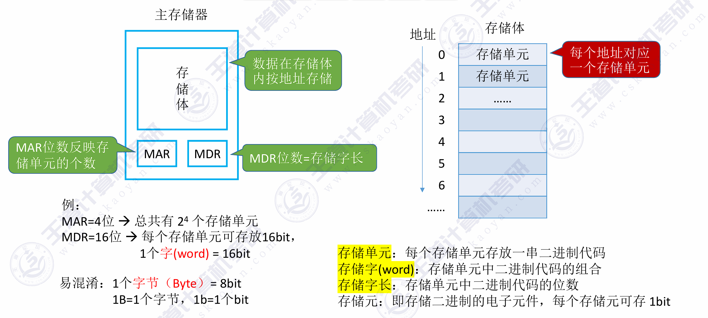
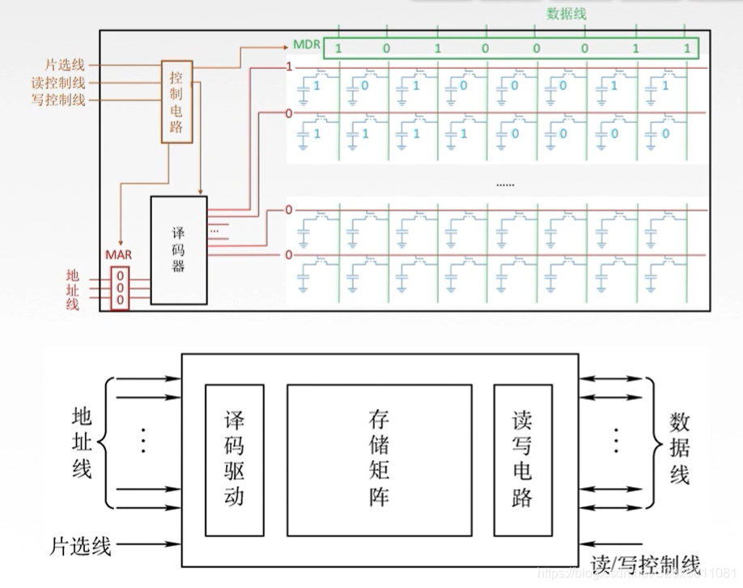
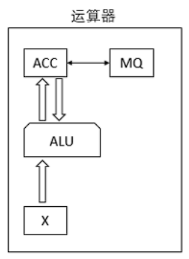
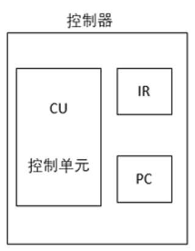
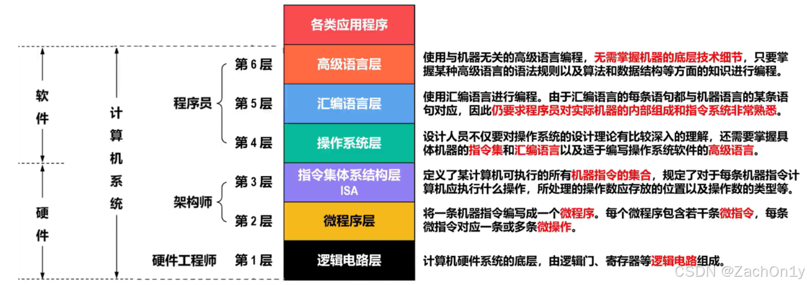
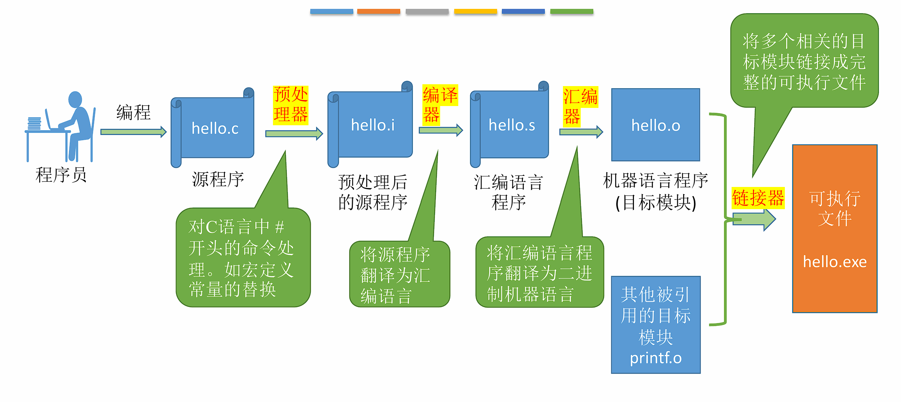

<h2 align="center">第一章 计算机系统概述</h2>


> **408 高频考点提醒**：
> - 冯·诺依曼架构的核心思想（"存储程序"）
> - MAR/MDR 位数与寻址范围、存储容量的关系
> - CPI、主频、CPU 执行时间的计算
> - 计算机层次结构中 ISA 作为"软硬件分界面"的地位
> - 区分系统软件和应用软件
> - 编译 vs 解释的区别
---
### （一）计算机发展历程

> **408 大纲说明**：本节内容已从考纲中删除，简要了解即可，不作为考试重点。

#### 一、计算机的发展阶段

| 阶段 | 年代 | 主要器件 | 特点 |
|:---|:---|:---|:---|
| <nobr>**第一代**</nobr> | <nobr>1946–1957</nobr> | 电子管 | 体积大、功耗高、可靠性差，使用机器语言 |
| <nobr>**第二代**</nobr> | <nobr>1958–1964</nobr> | 晶体管 | 体积缩小、功耗降低，出现高级语言（FORTRAN） |
| <nobr>**第三代</nobr>** | <nobr>1965–1971</nobr> | 中小规模集成电路 | 出现操作系统、微型计算机雏形 |
| <nobr>**第四代**</nobr> | <nobr>1972–至今</nobr> | 大规模/超大规模集成电路 | 微处理器诞生、PC 普及、网络时代 |

- **1946 年**：第一台通用电子数字计算机 **ENIAC** 诞生于宾夕法尼亚大学。
- **冯·诺依曼**：1945 年提出"存储程序"概念，奠定了现代计算机体系结构的基础。

#### 二、摩尔定律

集成电路上可容纳的晶体管数目，约每隔 **18~24 个月**便会增加一倍，性能也将提升一倍。

---

### （二）计算机硬件的基本组成

#### 一、冯·诺依曼架构

##### 1. 五大部件

冯·诺依曼计算机由**五大部件**组成：

| 部件 | 功能 |
|:---|:---|
| **输入设备** | 将程序和数据转换成计算机能识别的形式（如键盘、鼠标） |
| **输出设备** | 将计算机处理结果转换成人类能识别的形式（如显示器、打印机） |
| **存储器** | 存放**指令和数据**（两者以同等地位存放） |
| **运算器** | 执行**算术运算**和**逻辑运算** |
| **控制器** | 控制各部件协调工作，按顺序从存储器取指令并执行 |



##### 2. 核心理念："存储程序"

- **指令和数据**以同等地位、用**二进制**形式事先输入主存储器
- 按**地址**寻访，从存储器中逐条取出指令**顺序执行**
- 程序执行过程就是**不断取指令、分析指令、执行指令**的循环

##### 3. 冯·诺依曼架构的特点

| 特点 | 说明 |
|:---|:---|
| **五大部件** | 输入设备、输出设备、存储器、运算器、控制器 |
| **存储程序** | 指令和数据均以二进制存放在同一存储器中 |
| **以运算器为中心** | I/O 设备与存储器之间的数据传送需经过运算器 |
| **指令顺序执行** | 按地址顺序取指执行，由程序计数器 PC 指示下条指令地址 |
| **二进制表示** | 指令和数据均用二进制编码 |

#### 二、现代计算机架构

现代计算机将冯·诺依曼架构进行了两方面优化：

##### 1. 以存储器为中心

传统冯·诺依曼机以**运算器**为中心，I/O 操作需要经过运算器，效率低下。现代计算机优化为以**存储器**为中心，I/O 设备可直接与存储器交换数据（**DMA 方式**）。


##### 2. CPU = 运算器 + 控制器

- **CPU（中央处理器）**：将运算器和控制器集成在一个芯片内
- **主机** = CPU + 主存储器（内存）
- **I/O 设备（外设）** = 输入设备 + 输出设备 + 辅助存储器（外存）



#### 三、各个硬件的工作原理



##### 1. 主存储器

主存储器（内存）由大量**存储单元**组成，每个存储单元有唯一的**地址**。



| 部件 | 全称 | 功能 | 位数 |
|:---|:---|:---|:---|
| **MAR** | 存储器地址寄存器 | 存放要访问的存储单元地址 | MAR 位数 = 地址线位数 → 决定最大寻址范围 |
| **MDR** | 存储器数据寄存器 | 存放从/向存储器读出/写入的数据 | MDR 位数 = 数据线位数 → 通常等于存储字长 |

> - **存储单元**：每个存储单元存放一串二进制代码，称为**存储字**，位数称为**存储字长**。
> - **寻址范围**：若 MAR 有 $n$ 位，则可寻址 $2^n$ 个存储单元。
> - **容量**：存储容量 = 存储单元个数 × 存储字长（如 $2^{16} \times 16$ 位）。

**存储器的基本结构**：



##### 2. 运算器

运算器用于进行**算术运算**和**逻辑运算**，核心部件：

<table style="width: 100%; border: none;">
  <tr style="border: none;">
    <td style="width: 20%; vertical-align: top; border: none; padding-right: 20px;">
      
    </td>
    <td style="width: 80%; vertical-align: top; border: none;">
      <table style="width: 100%; border-collapse: collapse; text-align: left;">
        <thead>
          <tr>
            <th style="border: 1px solid #dfe2e5; padding: 6px 13px; background-color: #f6f8fa;">寄存器</th>
            <th style="border: 1px solid #dfe2e5; padding: 6px 13px; background-color: #f6f8fa;">全称</th>
            <th style="border: 1px solid #dfe2e5; padding: 6px 13px; background-color: #f6f8fa;">功能</th>
          </tr>
        </thead>
        <tbody>
          <tr>
            <td style="border: 1px solid #dfe2e5; padding: 6px 13px;"><strong>ACC</strong></td>
            <td style="border: 1px solid #dfe2e5; padding: 6px 13px;">累加器 (Accumulator)</td>
            <td style="border: 1px solid #dfe2e5; padding: 6px 13px;">存放操作数或运算结果</td>
          </tr>
          <tr>
            <td style="border: 1px solid #dfe2e5; padding: 6px 13px;"><strong>MQ</strong></td>
            <td style="border: 1px solid #dfe2e5; padding: 6px 13px;">乘商寄存器 (Multiplier-Quotient)</td>
            <td style="border: 1px solid #dfe2e5; padding: 6px 13px;">乘除法时存放操作数或结果</td>
          </tr>
          <tr>
            <td style="border: 1px solid #dfe2e5; padding: 6px 13px;"><strong>X</strong></td>
            <td style="border: 1px solid #dfe2e5; padding: 6px 13px;">通用操作数寄存器</td>
            <td style="border: 1px solid #dfe2e5; padding: 6px 13px;">存放操作数</td>
          </tr>
          <tr>
            <td style="border: 1px solid #dfe2e5; padding: 6px 13px;"><strong>ALU</strong></td>
            <td style="border: 1px solid #dfe2e5; padding: 6px 13px;">算术逻辑单元 (Arithmetic Logic Unit)</td>
            <td style="border: 1px solid #dfe2e5; padding: 6px 13px;">执行算术/逻辑运算</td>
          </tr>
        </tbody>
      </table>
    </td>
  </tr>
</table>


> PSW（程序状态字寄存器）/ FR（标志寄存器）：存放运算结果的状态标志（如进位 CF、零标志 ZF、符号 SF、溢出 OF 等），通常属于控制器部分。

##### 3. 控制器

控制器是计算机的**指挥中心**，负责：

- 正确的分析和指向每条指令：取指令  $ \to $ 分析指令  $ \to $ 执行指令。
- 保证指令按照规定序列自动连续的执行。
- 对各种异常情况和请求及时响应和处理。

<table style="width: 100%; border: none;">
  <tr style="border: none;">
    <td style="width: 20%; vertical-align: top; border: none; padding-right: 20px;">
      
    </td>
    <td style="width: 80%; vertical-align: top; border: none;">
      <table style="width: 100%; border-collapse: collapse; text-align: left;">
        <thead>
          <tr>
            <th style="border: 1px solid #dfe2e5; padding: 6px 13px; background-color: #f6f8fa;"><nobr>部件</nobr></th>
            <th style="border: 1px solid #dfe2e5; padding: 6px 13px; background-color: #f6f8fa;">全称</th>
            <th style="border: 1px solid #dfe2e5; padding: 6px 13px; background-color: #f6f8fa;">功能</th>
          </tr>
        </thead>
        <tbody>
          <tr>
            <td style="border: 1px solid #dfe2e5; padding: 6px 13px;"><strong>PC</strong></td>
            <td style="border: 1px solid #dfe2e5; padding: 6px 13px;">程序计数器 (Program Counter)</td>
            <td style="border: 1px solid #dfe2e5; padding: 6px 13px;">存放<strong>下一条</strong>要执行指令的地址，具有"自动 +1"功能</td>
          </tr>
          <tr>
            <td style="border: 1px solid #dfe2e5; padding: 6px 13px;"><strong>IR</strong></td>
            <td style="border: 1px solid #dfe2e5; padding: 6px 13px;">指令寄存器 (Instruction Register)</td>
            <td style="border: 1px solid #dfe2e5; padding: 6px 13px;">存放<strong>当前</strong>正在执行的指令</td>
          </tr>
          <tr>
            <td style="border: 1px solid #dfe2e5; padding: 6px 13px;"><strong>ID</strong></td>
            <td style="border: 1px solid #dfe2e5; padding: 6px 13px;">指令译码器 (Instruction Decoder)</td>
            <td style="border: 1px solid #dfe2e5; padding: 6px 13px;">对 IR 中的指令操作码进行译码</td>
          </tr>
          <tr>
            <td style="border: 1px solid #dfe2e5; padding: 6px 13px;"><strong>CU</strong></td>
            <td style="border: 1px solid #dfe2e5; padding: 6px 13px;">控制单元 (Control Unit)</td>
            <td style="border: 1px solid #dfe2e5; padding: 6px 13px;">根据译码结果产生控制信号，协调各部件工作</td>
          </tr>
        </tbody>
      </table>
    </td>
  </tr>
</table>


##### 4. I/O 设备

I/O 设备是计算机与外界进行数据交换的桥梁。

| 部件 | 功能 |
|:---|:---|
| **输入设备** | 将外界信息转换为计算机能识别的电信号（键盘、鼠标、扫描仪等） |
| **输出设备** | 将计算机处理结果转换为外界能识别的形式（显示器、打印机、音箱等） |
| **外存/辅存** | 长期保存大量程序和数据（磁盘、固态硬盘、光盘等） |

##### 5. 五大部件工作流程总结

以一条指令 `ADD M`（将地址 M 中的数据与 ACC 相加）为例：

```
① 取指令：PC → MAR → 存储器 → MDR → IR（同时 PC+1）
② 分析指令：IR（操作码部分）→ ID → CU 产生控制信号
③ 取操作数：IR（地址码部分 M）→ MAR → 存储器 → MDR → X
④ 执行运算：CU 控制 ALU 执行 (ACC) + (X) → ACC
⑤ 取下一条指令：重复①
```

```
      PC ──▶ MAR ──▶ 存储器 ──▶ MDR ──▶ IR
                                          │
     ┌────────────────────────────────────┘
     │      操作码 → ID → CU
     │      地址码 ──────────▶ MAR ──▶ 存储器 ──▶ MDR ──▶ X
     │                                                      │
     └── CU 控制信号 ─────────────────────────────────▶ ALU ◀─┘
                                                          │
                                                          ▼
                                                         ACC（结果）
```

---

### （三）计算机软件

#### 一、软件的分类

$$
\\text{计算机软件} 
\\begin{cases}
  \\text{系统软件}  \\begin{cases}
    \\text{操作系统（OS）} \\\\
    \\text{编译程序 / 解释程序} \\\\
    \\text{汇编程序} \\\\
    \\text{数据库管理系统（DBMS）} \\\\
    \\text{网络软件} \\\\
    \\text{各种服务性程序（调试程序、诊断程序等）}
  \\end{cases} \\\\
  \\text{应用软件}  \\begin{cases}
    \\text{科学计算程序} \\\\
    \\text{数据处理程序} \\\\
    \\text{办公软件} \\\\
    \\text{各种专用软件}
  \\end{cases}
\\end{cases}
$$

| 类别 | 定义 | 举例 |
|:---|:---|:---|
| **系统软件** | 管理、监控和维护计算机资源，为应用软件提供运行平台的软件 | 操作系统、编译器、DBMS |
| **应用软件** | 用户为解决特定应用领域的实际问题而编写的程序 | Word、Excel、浏览器 |

> **408 常见考点**：区分某个软件属于系统软件还是应用软件。数据库管理系统（DBMS）属于**系统软件**。

#### 二、三种级别的语言

| 语言 | 说明 | 特点 |
|:---|:---|:---|
| **机器语言** | 二进制代码，计算机唯一可直接执行的语言 | 可读性差、难以编写调试、不同机型不同 |
| **汇编语言** | 用助记符代替二进制操作码（如 `ADD`、`MOV`） | 需经**汇编程序**翻译成机器语言才能执行 |
| **高级语言** | 接近人类自然语言和数学表达式（如 C、Java、Python） | 需经**编译/解释**翻译成机器语言 |

**三种语言的翻译过程**：

```
高级语言 ──▶ 编译程序 ──▶ 汇编语言 ──▶ 汇编程序 ──▶ 机器语言
   │              │              │
   │              └── 解释程序（逐句翻译执行，不产生目标代码）
   │
   └── 或直接：高级语言 ──▶ 编译程序 ──▶ 机器语言
```

**编译 vs 解释**：

| 比较维度 | 编译程序 | 解释程序 |
|:---|:---|:---|
| **工作方式** | 将整个源程序一次性翻译成目标代码 | 逐句翻译、逐句执行 |
| **是否产生目标代码** | 是（可独立运行） | 否（每次执行都需要解释程序） |
| **执行速度** | 快 | 慢 |
| **典型语言** | C/C++、Fortran | Python、JavaScript、BASIC |

#### 三、指令集体系结构（ISA）

软件和硬件之间的**接口/契约**——定义了软件如何控制硬件。

- **ISA 定义的内容**：指令格式、操作类型、寻址方式、寄存器组织、存储空间、中断机制等。
- **ISA 的作用**：实现了软件和硬件的**解耦**——同一 ISA 上可运行所有兼容软件，同一 ISA 可有不同硬件实现（微架构）。

---

### （四）计算机系统的层次结构

#### 一、层次结构图

计算机系统是一个**软硬件结合的层次化系统**，从底层硬件到上层应用分为多个层次：



#### 二、各层说明

| 层次 | 名称 | 实现方式 | 说明 |
|:---|:---|:---|:---|
| 第 1 层 | 数字逻辑层 | 硬件 | 最基本的逻辑门电路、触发器、寄存器的组合 |
| 第 2 层 | 微程序/硬布线层 | 硬件 | 用微指令/时序逻辑实现指令的执行 |
| 第 3 层 | 指令集体系结构层 (ISA) | **软硬件分界面** | 定义了机器语言指令集合，是软件与硬件的接口 |
| 第 4 层 | 操作系统层 | 软件 + 硬件 | 向上提供系统调用，向下管理硬件资源 |
| 第 5 层 | 汇编语言层 | 软件（虚拟机器） | 助记符形式的低级语言 |
| 第 6 层 | 高级语言层 | 软件（虚拟机器） | 面向用户应用的高级语言 |

> **核心理解**：除第 1~2 层由硬件实现外，其他层次均可视为**虚拟机器**——对上层屏蔽底层实现细节。第 2 层（ISA）是**软硬件之间的分界面/契约**。

#### 三、层次之间的关系

- **下层为上层服务**：下层向上层提供接口，上层通过调用下层接口实现功能。
- **上层对下层透明**：上层用户/程序员无需了解下层具体实现。
- **翻译 vs 解释**：
  - **翻译**：将上层程序**整体**转换为下层程序再执行（如编译）
  - **解释**：对上层程序的每一条语句，逐条转换为下层指令并立即执行

---

### （五）计算机系统的工作原理

#### 一、计算机的工作过程



##### 1. 预处理 (Preprocessing)

- **转换过程：** 源程序 `hello.c` -> 预处理后的源程序 `hello.i`
- **核心动作：** 预处理器拦截并处理所有以 `#` 开头的命令。它会将 `#include` 指定的头文件内容直接插入到代码中，并完成所有宏定义（Macro）的文本替换。经过预处理后，文件仍然是人类可读的文本格式，但代码量通常会显著增加。

##### 2. 编译 (Compilation)

- **转换过程：** `hello.i` -> 汇编语言程序 `hello.s`
- **核心动作：** 编译器对代码进行词法分析、语法分析和语义分析，经过一定的优化后，将其翻译成汇编代码。这是高级语言逻辑向底层硬件架构转换的最关键一步。针对不同的 ISA（指令集架构，如 x86 或 ARM），这一步会生成截然不同的汇编指令集。

##### 3. 汇编 (Assembly)

- **转换过程：** `hello.s` -> 机器语言程序（目标模块）`hello.o`
- **核心动作：** 汇编器将汇编代码几乎“一对一”地翻译成 CPU 能够直接解析执行的二进制机器指令，并将其打包成可重定位的目标文件（Object File）。此时的文件已经是纯粹的 0 和 1，无法再用普通的文本编辑器直接阅读。

##### 4. 链接 (Linking)

- **转换过程：** `hello.o` + 其他被引用的目标模块（如 `printf.o`） -> 可执行文件 `hello.exe`
- **核心动作：** 链接器负责将你编写的代码与标准的系统库函数或其他独立的模块“缝合”起来。它会合并各个目标文件的段（如代码段、数据段），解析并重定位所有的外部符号（比如确定 `printf` 函数在内存中的确切地址），最终打包成操作系统可以加载运行的可执行文件。

#### 二、"存储程序"工作方式

计算机工作的本质就是**不断从内存取指令、执行指令**的循环。程序启动前，指令和数据必须先装入主存储器。

#### 三、指令执行过程

每条指令的执行可分为以下阶段：

```
┌──────────┐    ┌──────────┐    ┌──────────┐    ┌───────────┐
│  取指令   │───▶│  译码    │───▶│  执行    │───▶│  中断      │
│ (Fetch)  │    │ (Decode) │    │(Execute) │    │(Interrupt)│
└──────────┘    └──────────┘    └──────────┘    └───────────┘
     ▲                                                  │
     └──────────────────────────────────────────────────┘
                     取下一条指令
```

| 阶段 | 操作 | 涉及部件 |
|:---|:---|:---|
| **① 取指令 (Fetch)** | PC → MAR → 存储器 → MDR → IR；PC + 1 | PC, MAR, 存储器, MDR, IR |
| **② 译码 (Decode)** | IR 的操作码 → ID → CU 产生控制信号 | IR, ID, CU |
| **③ 执行 (Execute)** | 根据操作类型执行：取操作数 → ALU 运算 → 存结果 | CU, MAR, MDR, ALU, ACC |
| **④ 中断 (Interrupt)** | 检查是否有中断请求，若有则转入中断处理程序 | CU, PC |

#### 四、以一段 C 代码为例看程序执行过程

```c
int a = 3, b = 5, c;
c = a + b;
```

**从源程序到执行的全过程**：

```
C 源程序
  │ ① 编译（compiler 翻译）
  ▼
汇编代码
  │ ② 汇编（assembler 翻译）
  ▼
机器语言（目标代码）
  │ ③ 链接（linker 链接库函数）
  ▼
可执行文件（装入内存）
  │ ④ 加载（loader 装入内存）
  ▼
CPU 逐条取指令、译码、执行
```

**对应的指令序列（伪汇编）**：

```asm
① LOAD  R1, [a]    ; 从内存地址 a 取 3，放入寄存器 R1
② LOAD  R2, [b]    ; 从内存地址 b 取 5，放入寄存器 R2
③ ADD   R3, R1, R2 ; R3 ← R1 + R2 = 8
④ STORE [c], R3    ; 将 R3 的值 8 存回内存地址 c
```

**硬件层面的执行过程**（以 `ADD R3, R1, R2` 为例）：

```
1. 取指：PC → MAR，存储器读出指令 → MDR → IR（PC+1）
2. 译码：IR 操作码 "ADD" → ID → CU 识别为加法指令
3. 执行：CU 控制 R1→ALU_A, R2→ALU_B, ALU做加法, ALU输出→R3
```

> **理解要点**：程序运行 = CPU 不断进行"取指→译码→执行→中断检查"的循环，直到程序结束或遇到停机指令。

---

### （六）计算机的性能指标

#### 一、机器字长

**CPU 一次能处理的二进制数据的位数**。

| 指标 | 说明 | 示例 |
|:---|:---|:---|
| **机器字长** | CPU 内部数据通路宽度、ALU 一次运算的位数 | 32 位机 → 字长 = 32 bit |
| **存储字长** | 一个存储单元存放的二进制位数 | 通常 = 机器字长，也可为机器字长的整数倍 |
| **指令字长** | 一条指令的二进制位数 | 可等于机器字长，也可为机器字长的整数倍 |

> 字长越长，计算精度越高、寻址范围越大，但硬件成本也相应提高。

#### 二、存储容量

| 指标 | 含义 | 公式 |
|:---|:---|:---|
| **主存容量** | 主存储器能存放的二进制信息总量 | 存储单元个数 × 存储字长 |
| **辅存容量** | 外存储器能存放的二进制信息总量 | 以字节（Byte）为单位 |

> **容量单位**：
> - 1 KB = $2^{10}$ B = 1024 B
> - 1 MB = $2^{20}$ B
> - 1 GB = $2^{30}$ B
> - 1 TB = $2^{40}$ B

**与 MAR/MDR 的关系**：

```
若 MAR 为 16 位 → 存储单元个数 ≤ 2¹⁶ = 65536 = 64K
若 MDR 为 32 位 → 存储字长 = 32 bit = 4 B
→ 主存最大容量 = 64K × 4 B = 256 KB
```

**存储器带宽**：单位时间内存储器所能传输的数据量，反映存储器的数据传输速率。
$$
\\text{存储器带宽} = \\text{数据总线宽度} \\times \\text{存储器工作频率}
$$

若每个存储周期可传输多次数据（如 DDR），则：
$$
\\text{存储器带宽} = \\text{数据总线宽度} \\times \\text{工作频率} \\times \\text{每周期传输次数}
$$
| 指标 | 含义 | 单位 | 公式 |
|:---|:---|:---|:---|
| **存储器带宽** | 每秒可从存储器读/写的最大数据量 | B/s、MB/s、GB/s | 数据总线宽度 × 频率 × 每周期传输次数 |

**示例**：某 DDR4-3200 内存，数据总线宽度 64 bit（8 B），工作频率 1600 MHz，每周期传输 2 次：

$$存储器带宽 = 8\ \text{B} \times 1600 \times 10^6 \times 2 = 25.6\ \text{GB/s}$$

#### 三、运算速度

##### 1. 主频与时钟周期

| 指标 | 定义 | 关系 |
|:---|:---|:---|
| **主频 ($f$)** | CPU 内数字脉冲信号的振荡频率 | 单位：Hz（如 3.0 GHz） |
| **时钟周期 ($T$)** | 主频的倒数，即一个时钟脉冲的时间 | $T = 1/f$ |

> 例如主频 3.0 GHz → 时钟周期 $T = 1/(3 \\times 10^9) \\approx 0.333$ ns

##### 2. CPI（Clock cycles Per Instruction）

**执行一条指令所需的平均时钟周期数**。

$$CPI = \frac{\text{总时钟周期数}}{\text{总指令条数}}$$

| 情况 | 说明 |
|:---|:---|
| CPI 小 | 指令执行快 |
| 不同指令 CPI 不同 | 加法 CPI 可能为 1，乘法 CPI 可能为 3~5 |

##### 3. 执行时间（CPU 时间）

**CPU 执行一段程序所花费的时间**。

$$\text{CPU 执行时间} = \text{指令条数} \times CPI \times T$$

$$= \frac{\text{指令条数} \times CPI}{f}$$

> **408 常考**：三个因素——指令条数（算法/编译器决定）、CPI（指令集和微架构决定）、时钟周期 $T$（工艺决定）。

##### 4. MIPS（Million Instructions Per Second）

**每秒执行多少百万条指令**。

$$MIPS = \frac{\text{指令条数}}{\text{执行时间} \times 10^6} = \frac{f}{CPI \times 10^6}$$

##### 5. MFLOPS / GFLOPS / TFLOPS

**每秒执行多少百万/十亿/万亿次浮点运算**。

| 单位 | 含义 |
|:---|:---|
| **MFLOPS** | $10^6$ 次浮点运算/秒 |
| **GFLOPS** | $10^9$ 次浮点运算/秒 |
| **TFLOPS** | $10^{12}$ 次浮点运算/秒 |

#### 四、其他性能指标

| 指标 | 含义 | 单位 | 关系 |
|:---|:---|:---|:---|
| **响应时间** | 从提交请求到获得第一个结果的时间 | ms / s | = CPU 时间 + I/O 时间 + 等待时间 |
| **吞吐量** | 单位时间内系统完成的作业数量 | 作业数/秒（TPS、QPS） | 系统整体性能 |
| **利用率** | 资源（CPU、存储器等）实际使用时间占总时间的比例 | 百分比（%） | = 实际使用时间 / 总时间 × 100% |
| **带宽** | 单位时间内传输的数据量 | bit/s（bps）、B/s | 受总线宽度、频率影响 |
| **基准测试** | 运行一组标准测试程序来衡量性能 | 无量纲（相对分数） | SPEC 是最常用的 CPU 基准测试套件 |

#### 五、性能指标总结表

| 指标 | 公式 | 单位 | 决定因素 |
|:---|:---|:---|:---|
| 时钟周期 | $T = 1/f$ | 秒 (s) | 制造工艺 |
| 主频 | $f = 1/T$ | Hz | 制造工艺 |
| CPI | $CPI = \\text{总时钟数} / \\text{总指令数}$ | — | ISA + 微架构 |
| CPU 执行时间 | $t = \\text{指令数} \\times CPI \\times T$ | 秒 (s) | 指令数 × CPI × T |
| MIPS | $f / (CPI \\times 10^6)$ | 百万条/秒 | f + CPI |

> **优化方向**：
> - 减少指令条数 → 改进算法、优化编译器
> - 降低 CPI → 改进微架构（流水线、超标量）
> - 缩短时钟周期 → 提升半导体工艺、降低电路延迟

---

### （七）本章总结

```
第一章 计算机系统概述
├── 计算机发展历程（了解即可）
│   ├── 电子管 → 晶体管 → 集成电路 → 大规模集成电路
│   └── 摩尔定律
├── 硬件基本组成
│   ├── 冯·诺依曼架构（五大部件 + 存储程序 + 以运算器为中心）
│   ├── 现代计算机架构（以存储器为中心 + CPU = 运算器 + 控制器）
│   └── 各部件工作原理
│       ├── 主存储器：MAR、MDR、存储体
│       ├── 运算器：ACC、MQ、X、ALU
│       ├── 控制器：PC、IR、ID、CU
│       └── I/O 设备：输入/输出/辅存
├── 计算机软件
│   ├── 系统软件 vs 应用软件
│   └── 三种语言：机器语言 → 汇编语言 → 高级语言
├── 层次结构
│   ├── 数字逻辑 → 微程序 → ISA（分界面）→ OS → 汇编 → 高级语言
│   └── 翻译 vs 解释
├── 工作原理
│   ├── 存储程序 = 不断取指→译码→执行
│   └── 源程序 → 编译 → 汇编 → 链接 → 可执行文件
└── 性能指标
    ├── 机器字长
    ├── 存储容量（与 MAR/MDR 位数相关）
    ├── 运算速度（主频、CPI、MIPS、FLOPS）
    └── CPU 执行时间 = 指令数 × CPI × T
```
