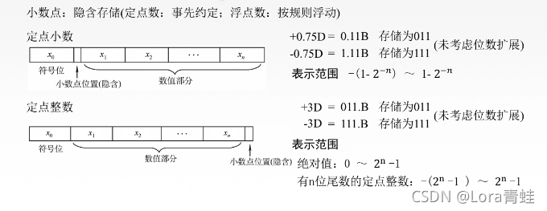
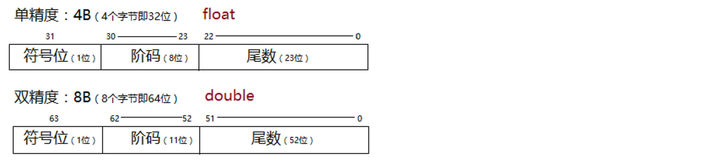
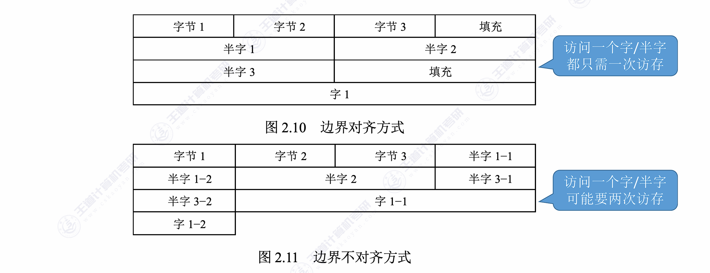
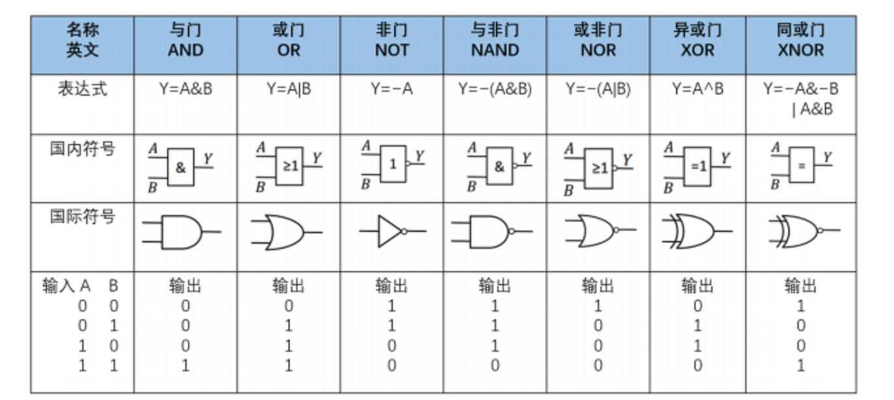
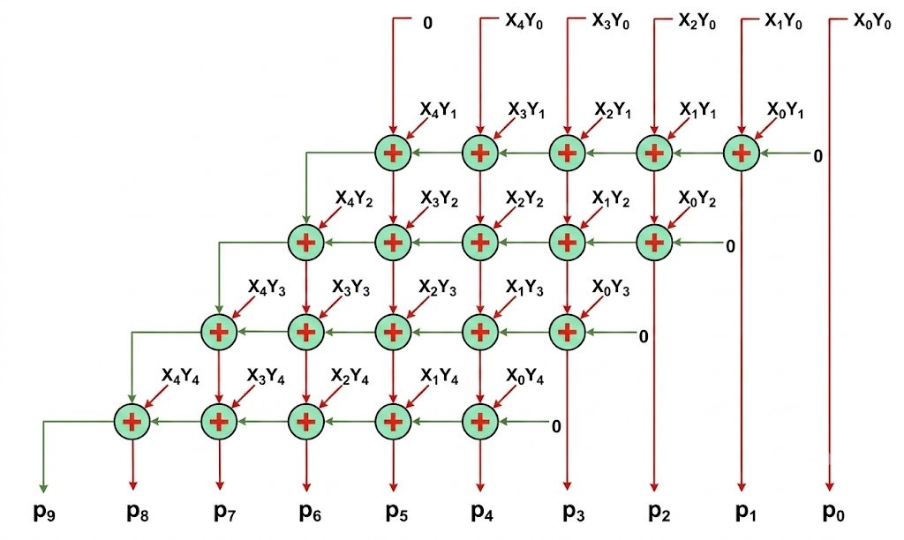
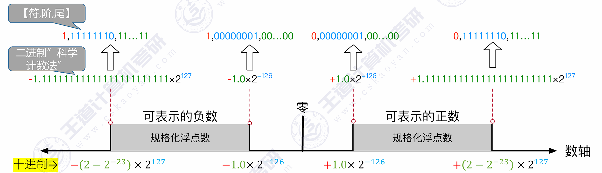

<h2 align="center">第二章 数据的表示和运算</h2>

---

### （一）数据与文字的表示方法

#### 一、进位计数制及其相互转换

1. **基本概念**

   - **基数 ($r$)**：r进制数的基数为r，每个数码位可能出现r种字符。
   - **进位原则**：逢 $r$进 1。
   - **位权**：每个数码位对应的权重（如十进制的 $10^n$，二进制的 $2^n$）。
   - **r进制数值**：各数码位与其位权的乘积之和。
   - 公式：$K_nK_{n-1}...K_0.K_{-1}...K_{-m} = K_n \times r^n + ... + K_0 \times r^0 + K_{-1} \times r^{-1} + ... + K_{-m} \times r^{-m}$。

2. **为什么计算机使用二进制？**

   - 可以使用两个稳定状态的物理器件方便地表示。
   - 0和1正好对应逻辑值“假”和“真”，方便实现逻辑运算。
   - 可以很方便地使用逻辑门电路实现算术运算 。

3. **不同进制间的相互转换**

   - **任意进制 $\rightarrow$十进制**：按权展开相加 。
   - **二进制 $\leftrightarrow$八进制/十六进制**：
     - 二进制转八进制：每3个二进制位对应1个八进制位（3位一组） 。
     - 二进制转十六进制：每4个二进制位对应1个十六进制位（4位一组） 。
     - *注意：转换时要注意以小数点为中心向两边补位。*
   - **十进制 $\rightarrow$任意进制 ($r$进制)**：
     - **整数部分**：除基取余法。先取得的“余”是低位 。
     - **小数部分**：乘基取整法。先取得的“整”是高位 。
     - 注意：有的十进制小数（如0.3）无法用二进制精确表示，会产生无限循环 。

---

#### 二、数据格式

计算机中表示数值数据有两种基本格式：**定点格式**和**浮点格式**。

##### 1. 定点数

小数点位置固定不变的数称为**定点数**。根据小数点位置不同，分为两类：

| 类型 | 小数点位置 | 表示范围（n+1位，1位符号） | 典型应用 |
|:---|:---|:---|:---|
| **定点整数** | 隐含在数值位最后（最低位之后） | $-(2^n-1) \sim 2^n-1$（原码） | 普通整数运算、地址计算 |
| **定点小数** | 隐含在符号位之后、数值位之前 | $-(1-2^{-n}) \sim 1-2^{-n}$（原码） | 浮点数尾数部分、DSP |



> 定点数的优点是运算简单、硬件实现成本低；缺点是表示范围有限。

##### 2. 浮点数（IEEE 754 标准）

小数点位置可以**浮动**的数。现代计算机普遍采用 **IEEE 754 标准**表示浮点数。

**基本格式**：

$$N = M \times r^E$$

| 符号 | 名称 | 含义 |
|:---|:---|:---|
| M | 尾数 (Mantissa) | 定点小数，用原码表示 |
| E | 阶码 (Exponent) | 定点整数，**用移码表示**（便于比较大小） |
| r | 基数 (Radix) | 通常 r=2 |

**浮点数的一般存储格式**：

```
┌─────┬──────────┬──────────────────────┐
│  S  │    E     │          M           │
│(1位)│  (阶码)   │       (尾数)          │
└─────┴──────────┴──────────────────────┘
符号位  用移码表示   用原码表示（隐含最高位1）
```



**IEEE 754 两种基本格式**：

| 格式 | 总位数 | 符号位 S | 阶码 E | 尾数 M | 偏置常数 (Bias) |
|:---|:---|:---|:---|:---|:---|
| **单精度 (float)** | 32 位 | 1 位 | 8 位 | 23 位 | **127** ($2^7-1$) |
| **双精度 (double)** | 64 位 | 1 位 | 11 位 | 52 位 | **1023** ($2^{10}-1$) |

**关键约定**：

- **阶码用移码**：$E = e + Bias$（单精度 Bias=127，双精度 Bias=1023）
- **尾数用原码**，且**规格化**——隐含最高位的 1（即 $1.xxx$ 中整数部分的 1 不存储）
- **真值公式**：$N = (-1)^S \times (1.M) \times 2^{E - Bias}$

> **为什么阶码用移码？** 移码将阶码的真值 $e$ 统一加上一个偏置常数，使所有阶码都变成**非负数**。这样两个浮点数比较大小时，可以从符号位→阶码→尾数按**无符号整数**方式逐位比较，硬件只需一套无符号比较器即可完成——因为阶码全 0 时真值最小、全 1 时真值最大，移码保持了数值的单调性。

**示例**：将 $-12.625$ 表示为 IEEE 754 单精度浮点数：

```
① 12.625 = 1100.101（二进制）
② 规格化：1100.101 = 1.100101 × 2³
③ S = 1（负号）
④ E = 3 + 127 = 130 = 1000 0010
⑤ M = 100101 00000 00000 00000 00（小数部分，隐含最高位 1）

IEEE 754: 1 10000010 10010100000000000000000
         = C1 A4 00 00 (十六进制)
```

**规格化数与特殊值**：

| 类型 | 阶码 | 尾数 | 含义 | 真值公式 |
|:---|:---|:---|:---|:---|
| **规格化数** | 1~254 | 任意 | 正常浮点数 | $(-1)^S \times 1.M \times 2^{E-127}$ |
| **非规格化数** | 0 | ≠0 | 接近 0 的极小数 | $(-1)^S \times 0.M \times 2^{-126}$ |
| **零** | 0 | 0 | 真值 0 | $(-1)^S \times 0$（有 $+0$ 和 $-0$） |
| **无穷大 ∞** | 全1 (255) | 0 | 溢出 | $(-1)^S \times \infty$ |
| **NaN** | 全1 (255) | ≠0 | 非数 | 如 $0/0$、$\sqrt{-1}$ 的结果 |

> **非规格化数的作用**：填补了 0 和最小规格化数之间的"间隙"，实现**逐渐下溢（Gradual Underflow）**。

---

#### 三、数的机器码表示

##### 1. 机器数

- **真值**：实际的带正负号的数值，符合人类习惯的表示（如 +15, -8） 。
- **机器数**：数字实际存到机器里的形式，正负号被数字化（通常 0 表示正，1 表示负） 。

##### 2. 原码、反码、补码、移码

1. **原码**

- **定义**：用尾数表示真值的绝对值，符号位”0/1”对应”正/负” 。
- **特点**：真值0有两种表现形式（+0 和 -0的编码不同） 。
- **表示范围**（以字长n+1位为例）：
  - 整数：$-(2^n-1) \sim 2^n-1$（关于原点对称） 。
  - 小数：$-(1-2^{-n}) \sim 1-2^{-n}$。

**示例**（8 位字长）：

```
[+0]原 = 0000 0000     [−0]原 = 1000 0000
[+5]原 = 0000 0101     [−5]原 = 1000 0101
[+127]原 = 0111 1111   [−127]原 = 1111 1111
```

> 原码直观，但**加减法需分别处理符号位和数值位**，硬件实现复杂——加法器还得配减法器。

2. **反码**

- **定义**：正数反码与原码相同；负数反码，符号位不变，数值位全部取反 。
- **特点**：真值0同样有 +0 和 -0 两种表示 。它主要作为原码转补码的中间状态，实际中用处不大 。

**示例**（8 位字长）：

```
[+0]反 = 0000 0000     [−0]反 = 1111 1111
[+5]反 = 0000 0101     [−5]反 = 1111 1010
[+127]反 = 0111 1111   [−127]反 = 1000 0000
```

> 负数反码 = 原码符号位不变，数值位”见 1 变 0、见 0 变 1”。反码加减法仍需处理**循环进位**（最高位进位加到最低位），不如补码方便。

3. **补码**

- **定义**：正数补码 = 原码；负数补码 = 反码末位 + 1（数值位取反加1，溢出位舍弃） 。
- **特点**：
  - **真值0只有一种表示形式**（$[-0]*{补}$和$[+0]*{补}$均为全0） 。
  - **比原码和反码多表示一个负数**。例如8位字长补码可表示 -128 。
  - **$[[x]_补]_补 = [x]_原$**
  - **$[x]_补-[y]_补=[x]_补+[-y]_补$**
- **表示范围**（以字长n+1位为例）：
  - 整数：$-2^n \sim 2^n-1$。
  - 小数：$-1 \sim 1-2^{-n}$。
- **由 $[x]_补$求 $[-x]_补$技巧**：符号位、数值位全部取反，末位+1 。

| **补码形式**   | **二进制表示** | **对应的十进制真值**   | **记忆口诀/意义**            |
| -------------- | -------------- | ---------------------- | ---------------------------- |
| **全 0**       | `0000 0000`    | **0**                  | 真值0唯一                    |
| **全 1**       | `1111 1111`    | **-1**                 | 全1即负1                     |
| **1 领头全 0** | `1000 0000`    | **-128**（即 $-2^7$）  | **规定最小的负数**，无原反码 |
| **0 领头全 1** | `0111 1111`    | **+127**（即 $2^7-1$） | **最大的正数**               |

**示例**（8 位字长，原码→反码→补码的转换过程）：

```
        原码         → 反码       → 补码
+0    0000 0000     0000 0000    0000 0000  (0唯一)
−0    1000 0000     1111 1111    0000 0000  (溢出丢弃，归为0)
+5    0000 0101     0000 0101    0000 0101
−5    1000 0101     1111 1010    1111 1011  (反码+1)
+127  0111 1111     0111 1111    0111 1111
−127  1111 1111     1000 0000    1000 0001
−128  无法表示       无法表示      1000 0000  (补码专属)
```

> **原码→补码口诀**：正数不变；负数"符号位不动，数值位取反加 1"。

4. **移码**

- **定义**：只能用于表示整数。在补码的基础上，将符号位取反 。
- **特点**：
  - 真值0只有一种表示（例如8位字长，0的移码为 10000000） 。
  - 表示范围与补码整数相同：$-2^n \sim 2^n-1$。
  - **方便对比大小**：移码全0真值最小，全1真值最大，数值随着移码的增大而增大 。

**示例**（8 位字长，与补码对比）：

```
       真值        补码       移码     (补码符号位取反)
      −128      1000 0000    0000 0000  ← 全0 = 最小
      −127      1000 0001    0000 0001
        ...         ...         ...
        −1      1111 1111    0111 1111
         0      0000 0000    1000 0000  (0唯一)
        +1      0000 0001    1000 0001
        ...         ...         ...
      +127      0111 1111    1111 1111  ← 全1 = 最大
```

> 移码与补码**仅符号位相反**，其余位完全相同。沿数轴方向移码递增，方便硬件用无符号比较器比较浮点数阶码的大小。

---

#### 四、字符和字符串（非数值）的表示方法

计算机中除了数值数据，还需要表示**字符、字符串、汉字**等非数值数据。

##### 1. ASCII 码

**ASCII（American Standard Code for Information Interchange）** 是最基础的字符编码标准：

- 用 **7 位二进制**表示一个字符，共 128 个字符
- 计算机中通常用 1 字节（8 位）存储，**最高位为 0**
- 分类：

| 范围（十六进制） | 内容 | 示例 |
|:---|:---|:---|
| 00H ~ 1FH | 控制字符（不可打印） | 换行 LF (0AH)、回车 CR (0DH) |
| 20H ~ 7EH | 可打印字符 | 空格(20H)、'0'(30H)、'A'(41H)、'a'(61H) |
| 7FH | 删除 DEL | |

**关键记忆码**：

```
'0' = 30H = 48    'A' = 41H = 65    'a' = 61H = 97
'9' = 39H = 57    'Z' = 5AH = 90    'z' = 7AH = 122

大小写转换：'a' - 'A' = 20H = 32（bit5 置1/清0即可切换）
```

##### 2. 扩展 ASCII 与 Latin-1

- **扩展 ASCII**：利用字节的最高位（bit7=1），可表示 128~255 共 128 个额外字符
- **ISO 8859-1 (Latin-1)**：最常用的扩展 ASCII 标准，覆盖西欧语言字符

##### 3. Unicode 与 UTF-8

**Unicode**：为全世界所有文字分配唯一编码（码点），解决 ASCII 不能表示中文等问题。

**UTF-8**：Unicode 的变长编码实现，与 ASCII 兼容：

| Unicode 码点范围 | UTF-8 编码（二进制） | 字节数 |
|:---|:---|:---|
| U+0000 ~ U+007F | `0xxxxxxx` | 1 字节 |
| U+0080 ~ U+07FF | `110xxxxx 10xxxxxx` | 2 字节 |
| U+0800 ~ U+FFFF | `1110xxxx 10xxxxxx 10xxxxxx` | 3 字节 |
| U+10000 ~ U+10FFFF | `11110xxx 10xxxxxx 10xxxxxx 10xxxxxx` | 4 字节 |

**示例**：

```
'A' (U+0041) → UTF-8: 01000001 (1字节, 与ASCII完全相同)
'中' (U+4E2D) → UTF-8: 11100100 10111000 10101101 (3字节)
```

> **408 考点**：ASCII 编码范围、UTF-8 的变长特性、与 ASCII 的兼容性。

##### 4. 中文编码

| 编码 | 全称 | 特点 |
|:---|:---|:---|
| **GB 2312** | 国标简体汉字编码 | 收录 6763 个汉字，双字节编码 |
| **GBK** | 汉字内码扩展规范 | GB 2312 扩展，收录 21003 个汉字 |
| **GB 18030** | 国家标准 | 变长编码，与 Unicode 映射，强制标准 |
| **Big5** | 大五码 | 繁体中文（台湾、香港） |

##### 5. 字符串的存储

| 方式 | 描述 | C语言示例 |
|:---|:---|:---|
| **以空字符结尾** | 字符串末尾存放 `\0` 标记结束 | `"hello"` → `'h','e','l','l','o','\0'` |
| **带长度字段** | 用额外字节/字记录字符串长度 | Pascal 风格：首字节存长度 |
| **定长存储** | 所有字符串固定长度，不够的补空格 | 数据库 CHAR(n) 类型 |

> C 语言采用**空字符结尾**方式，`strlen()` 统计的字符数不包括结尾的 `\0`。

---

#### 五、C语言中的整数类型及类型转换

在C语言中，整数类型及其相互转换是理解底层数据表示和避免程序Bug的核心基础。C语言的整数转换不仅涉及数值的改变，更涉及底层二进制位（比特位）的重新解释、截断或扩展。

##### 1. C语言的整数类型

C语言提供了多种不同长度的整数类型，并通过 `signed`（有符号，默认）和 `unsigned`（无符号）关键字来区分是否包含负数。

**① 基本整数类型**

标准C语言定义了以下基本整数类型（具体字节数取决于编译器和操作系统，通常遵循ILP32或LP64数据模型）：

- **`char`**：通常为 1 字节（8位）。用于存储字符或小整数。

- **`short` (或 `short int`)**：通常为 2 字节（16位）。

- **`int`**：最常用的整数类型，通常为 4 字节（32位），对应处理器的高效字长。

- **`long` (或 `long int`)**：在32位系统中通常为 4 字节，在64位系统（如Linux/macOS）中通常为 8 字节。

- **`long long` (或 `long long int`)**：C99标准引入，至少为 8 字节（64位）。

**② 定宽整数类型** (`<stdint.h>`)

为了解决不同平台数据宽度不一致的问题，C99引入了 `<stdint.h>` 头文件，提供了明确位宽的类型，强烈建议在底层开发和跨平台开发中使用：

- **有符号**：`int8_t`, `int16_t`, `int32_t`, `int64_t`
- **无符号**：`uint8_t`, `uint16_t`, `uint32_t`, `uint64_t`

##### 2. 整数的底层表示

在现代计算机中，**有符号数一律采用补码（Two's Complement）表示**，而**无符号数采用纯原码（二进制形式）表示**。理解这一点是掌握类型转换的关键。

##### 3. 整数类型转换的核心规则

C语言中的类型转换分为**隐式转换**（编译器自动完成）和**显式转换**（强制类型转换，如 `(int)x`）。无论哪种方式，其底层的位级处理规则是一致的：

**① 等长类型的转换（有符号 ↔ 无符号）**

**规则：底层二进制机器码保持不变，仅仅改变对这些位的”解释方式”。**

```
int8_t x = -1;           // 补码：1111 1111
uint8_t y = (uint8_t)x;  // 机器码不变：1111 1111，但解释为 255

uint8_t a = 128;         // 二进制：1000 0000
int8_t b = (int8_t)a;    // 机器码不变：1000 0000，解释为 −128
```

| 8 位机器码 | 解释为 `int8_t` | 解释为 `uint8_t` |
|:---|:---|:---|
| `0000 0000` | 0 | 0 |
| `0000 0001` | +1 | 1 |
| `0111 1111` | +127 | 127 |
| `1000 0000` | **−128** | **128** |
| `1111 1111` | **−1** | **255** |

> 从中间 `1000 0000` 开始，有符号与无符号的解释分道扬镳。同一个位模式，最高位为 1 时，有符号为负、无符号为大正数。

**② 长字长 → 短字长（截断 / 降级）**

**规则：高位直接丢弃（截断），只保留低位。**

```
int32_t x = 0x12345678;  // 32位
int16_t y = (int16_t)x;  // 截断为16位：保留低16位 → 0x5678

uint32_t a = 300;        // 二进制：0000 0000 0000 0000 0000 0001 0010 1100
uint8_t b = (uint8_t)a;  // 截断为8位：保留低8位 → 0010 1100 = 44
```

| 截断情况 | 原值 | 截断后 | 结果 |
|:---|:---|:---|:---|
| `int` → `short` | 65536 (0x00010000) | 保留低 16 位: 0x0000 | **0** |
| `int` → `short` | 32767 (0x00007FFF) | 保留低 16 位: 0x7FFF | **32767** |
| `int` → `short` | 32768 (0x00008000) | 保留低 16 位: 0x8000 | **−32768**（符号变了！） |

> **注意**：截断可能导致数值改变（如 65536→0），甚至**改变符号**（32768→−32768）。

**③ 短字长 → 长字长（扩展 / 升级）**

当小范围类型扩展为大范围类型时，为保证”数值相等”，需对高位填充：

- **无符号数 → 零扩展**：高位全部填 `0`
- **有符号数 → 符号扩展**：高位全部填原数据的**符号位**

```
无符号扩展（零扩展）：
  uint8_t  a = 255;       // 1111 1111
  uint16_t b = (uint16_t)a;  // 0000 0000 1111 1111 = 255 ✓

有符号扩展（符号扩展）：
  int8_t  x = -1;         // 1111 1111（补码）
  int16_t y = (int16_t)x; // 1111 1111 1111 1111 = −1 ✓

  int8_t  p = 127;        // 0111 1111（符号位=0）
  int16_t q = (int16_t)p; // 0000 0000 0111 1111 = 127 ✓

  int8_t  m = -128;       // 1000 0000（符号位=1）
  int16_t n = (int16_t)m; // 1111 1111 1000 0000 = −128 ✓
```

| 8 位原值 | 符号位 | 扩展方式 | 16 位结果 | 数值 |
|:---|:---|:---|:---|:---|
| `0111 1111` (127) | 0 | 高位补 0 | `0000 0000 0111 1111` | 127 |
| `0000 0001` (1) | 0 | 高位补 0 | `0000 0000 0000 0001` | 1 |
| `1111 1111` (−1) | 1 | 高位补 1 | `1111 1111 1111 1111` | −1 |
| `1000 0000` (−128) | 1 | 高位补 1 | `1111 1111 1000 0000` | −128 |

> **核心原则**：扩展后数值不变——正数永远高位补 0，负数永远高位补 1，把符号位”复制”到所有高位。

##### 4. 表达式中的隐式转换陷阱

在进行算术运算或比较时，C语言有一套复杂的“常规算术转换（Usual Arithmetic Conversions）”规则：

1. **整型提升（Integer Promotion）**：

   在任何表达式中，所有长度小于 `int` 的类型（如 `char`、`short`），在参与运算前都会**自动被提升为 `int`**。如果 `int` 无法表示其范围，则提升为 `unsigned int`。

2. **向宽类型看齐**：

   如果两个操作数类型不同，较窄的类型会自动转换为较宽的类型（例如 `int` 遇到 `double` 会转为 `double`）。

3. **⚠️ 致命陷阱：有符号与无符号的混合运算**：

   当 `int`（有符号）与 `unsigned int`（无符号）进行运算（加减乘除、比较大小）时，**有符号数会被隐式强制转换为无符号数**！

   - **经典易错代码**：

     ```c
     int a = -1;
     unsigned int b = 1;
     if (a > b) {
         printf("-1 居然大于 1！\n");
     }
     ```

     **解释**：由于 `b` 是 `unsigned int`，`a` 会被隐式提升为 `unsigned int`。`-1` 的底层补码全为1（`0xFFFFFFFF`），被解释为无符号数时等于 4294967295。因此 `a > b` 的结果为真。

##### 5. 总结建议

1. **明确位宽**：在涉及位运算、网络协议、文件读写等对长度敏感的场景，坚决使用 `<stdint.h>` 中的 `int32_t`、`uint8_t` 等定宽类型。
2. **避免混用**：尽量不要在同一个表达式（特别是循环条件和比较操作中）混合使用 `signed` 和 `unsigned` 整数，以防止隐式转换带来的越界或逻辑错误。如果必须混用，请使用显式强制转换 `( )` 明确你的意图。

---

#### 六、数据的存储和排列

##### 1. 大小端存储（字节序）

多字节数据在内存中有两种存放顺序：

| 方式 | 描述 | 特点 | 使用场景 |
|:---|:---|:---|:---|
| **大端 (Big-Endian)** | 最高有效字节 (MSB) 存在最低地址 | 符合人类阅读习惯（高位在前） | TCP/IP 网络字节序、Java 虚拟机 |
| **小端 (Little-Endian)** | 最低有效字节 (LSB) 存在最低地址 | 便于低位运算、类型转换 | x86/x64、ARM（可配置） |

```
数据 0x12345678 (32位) 在内存中的存放：

         低地址 ────────────────▶ 高地址
大端：    ┌──────┬──────┬──────┬──────┐
         │  12  │  34  │  56  │  78  │
         └──────┴──────┴──────┴──────┘

小端：    ┌──────┬──────┬──────┬──────┐
         │  78  │  56  │  34  │  12  │
         └──────┴──────┴──────┴──────┘
```

> **408 常考**：给定内存字节序列，判断是大端还是小端存储；或给定大小端模式，写出某地址处存放的字节内容。

##### 2. 边界对齐（内存对齐）

##### **① 为什么需要对齐？**

现代计算机通常是按字节编址，即每个字节对应1个地址

通常也支持按字、按半字、按字节寻址。 

假设存储字长为32位，则1个字=32bit，半字=16bit。每次访存只能读/写1个字

```
不对齐示例（32位字长）：
    ┌────────┬────────┬────────┬────────┐
    │ Word 0 │ Word 1 │ Word 2 │ Word 3 │
    └────────┴────────┴────────┴────────┘
            ↑
      4字节 int 跨 Word 0 和 Word 1 → 需 2 次访存！

对齐后：
    ┌────────┬────────┬────────┬────────┐
    │ Word 0 │ Word 1 │ Word 2 │ Word 3 │
    └────────┴────────┴────────┴────────┘
     ↑             ↑
  4字节 int    4字节 int → 每次只需 1 次访存
```

**② 对齐规则**

| 数据类型 | 对齐要求（x86-64） | 说明 |
|:---|:---|:---|
| `char` | 1 字节边界 | 任意地址均可 |
| `short` | 2 字节边界 | 地址为 2 的倍数 |
| `int` / `float` | 4 字节边界 | 地址为 4 的倍数 |
| `double` / `long long` | 8 字节边界 | 地址为 8 的倍数 |
| 结构体 | 按**最大成员**的对齐要求 | 总大小为最大对齐的倍数 |

> **结构体内存对齐示例**：
> ```c
> struct S {
>     char  a;   // 1B, offset 0
>     // padding 3B (offset 1~3)
>     int   b;   // 4B, offset 4~7
>     char  c;   // 1B, offset 8
>     // padding 3B (offset 9~11, 对齐到 4 的倍数)
> };  // sizeof(S) = 12
> ```

- **3. 对齐 vs 不填充的权衡**

| 方式 | 优点 | 缺点 |
|:---|:---|:---|
| **边界对齐** | 访存速度快（1 次取数据） | 浪费部分存储空间（padding） |
| **边界不对齐** | 存储空间利用率高 | 跨边界数据需 2 次访存，速度慢 |

> 现代计算机普遍选择**用空间换时间**——边界对齐。

---

#### 七、校验码

数据在存储和传输过程中可能因干扰而发生**位错误**（0 变 1 或 1 变 0）。校验码通过添加冗余位来**检测甚至纠正**这些错误。

##### 1. 基本概念

| 术语 | 含义 |
|:---|:---|
| **码字** | 编码后的完整位串（数据位 + 校验位） |
| **码距（汉明距离）** | 两个合法码字之间**不同位的个数** |
| **最小码距 $d_{min}$** | 所有合法码字两两之间码距的最小值 |

**码距与检错/纠错能力的关系**：

| 最小码距 $d_{min}$ | 能力 | 公式 |
|:---|:---|:---|
| $d_{min} \geq e + 1$ | 可检 $e$ 个错 | 检错 |
| $d_{min} \geq 2t + 1$ | 可纠 $t$ 个错 | 纠错 |
| $d_{min} \geq e + t + 1$（$e > t$） | 可检 $e$ 个错 + 纠 $t$ 个错 | 检纠结合 |

> **通俗理解**：码距越大，合法码字越"稀疏"，一个码字跳变几位后仍落不到另一个合法码字上，于是能被检测或纠正。

##### 2. 奇偶校验码

在数据位后添加**1 位校验位**，使整个码字中"1"的个数为奇数或偶数。

| 类型 | 规则 | 最小码距 |
|:---|:---|:---|
| **奇校验** | 含校验位在内，"1"的总数为**奇数** | 2 |
| **偶校验** | 含校验位在内，"1"的总数为**偶数** | 2 |

**示例**（数据位 `1011 0110`，共 5 个 1）：

```
奇校验：数据 1011 0110 → 已有 5 个 1（奇数）→ 校验位 = 0 → 码字 1011 0110 0
偶校验：数据 1011 0110 → 已有 5 个 1（奇数）→ 校验位 = 1 → 码字 1011 0110 1
```

> **能力**：$d_{min}=2$，可检测**奇数个**位错误，无法检测偶数个位错误，也无法纠错。

**交叉奇偶校验**：将数据排成矩阵，每行每列各设一个校验位，能定位单个错误位置并纠正。

##### 3. 海明码（Hamming Code）

海明码通过多组奇偶校验的**交叉定位**，能够**纠正单个位错误**（$d_{min}=3$）。

**核心思想**：将 $k$ 个校验位编排在码字的特定位置（$2^0, 2^1, 2^2, \dots$），每个校验位负责一组数据位的奇偶校验。出���错误时，所有出错组的交集指向错误位的位置。

**确定校验位个数**（设数据位 $n$ 位，校验位 $k$ 位）：

$$2^k \geq n + k + 1$$

| 数据位数 $n$ | 最少校验位 $k$ | 总码长 $n+k$ |
|:---|:---|:---|
| 1 | 2 | 3 |
| 2~4 | 3 | 5~7 |
| 5~11 | 4 | 9~15 |
| 12~26 | 5 | 17~31 |

**编码步骤**（以 4 位数据 $D_4D_3D_2D_1 = 1010$ 为例，$k=3$）：

```
① 确定位置：校验位 P₁P₂P₃ 放在 2⁰=1, 2¹=2, 2²=4 位
   码字位号：1    2    3    4    5    6    7
   内容：   P₁   P₂   D₄   P₃   D₃   D₂   D₁
              ?    ?    1    ?    0    1    0

② 分组（每个校验位负责"位号对应二进制位为 1"的那些位）：
   P₁(位1=001)：负责位 1,3,5,7 → 即 P₁,D₄,D₃,D₁
   P₂(位2=010)：负责位 2,3,6,7 → 即 P₂,D₄,D₂,D₁
   P₃(位4=100)：负责位 4,5,6,7 → 即 P₃,D₃,D₂,D₁

③ 偶校验求 P 值（各组的"1"应为偶数）：
   P₁ 组：P₁ ⊕ 1 ⊕ 0 ⊕ 0 = 0  → P₁ = 1
   P₂ 组：P₂ ⊕ 1 ⊕ 1 ⊕ 0 = 0  → P₂ = 0
   P₃ 组：P₃ ⊕ 0 ⊕ 1 ⊕ 0 = 0  → P₃ = 1

④ 最终海明码：1 0 1 1 0 1 0
   位号：     1 2 3 4 5 6 7
```

**纠错过程**（假设接收码字第 6 位出错，`1 0 1 1 0 0 0`）：

```
重新计算各组校验（偶校验）：
  S₁ = P₁ ⊕ D₄ ⊕ D₃ ⊕ D₁ = 1 ⊕ 1 ⊕ 0 ⊕ 0 = 0 (无错)
  S₂ = P₂ ⊕ D₄ ⊕ D₂ ⊕ D₁ = 0 ⊕ 1 ⊕ 0 ⊕ 0 = 1 (有错!)
  S₃ = P₃ ⊕ D₃ ⊕ D₂ ⊕ D₁ = 1 ⊕ 0 ⊕ 0 ⊕ 0 = 1 (有错!)

指错字 S₃S₂S₁ = 110 = 6 → 第 6 位出错！取反纠正即可。
```

> **能力**：$d_{min}=3$，可纠 1 位错、检 2 位错。若再增加一位全局奇偶校验位，$d_{min}=4$，可纠 1 位错且同时检 2 位错。

##### 4. 循环冗余校验码（CRC）

CRC 广泛用于**网络传输和外部存储**（如以太网、磁盘），能检测**突发性连续多位错误**。

**核心思想**：将数据视为一个二进制多项式 $M(x)$，除以一个生成多项式 $G(x)$，得到的余数 $R(x)$ 作为校验码。

**编码步骤**：

```
① 将 n 位数据左移 k 位（k = 生成多项式次数），即 M(x) · x^k
② 用生成多项式 G(x) 做模 2 除法：M(x) · x^k ÷ G(x)
③ 得到 k 位余数 R(x) 即为校验码
④ 发送码字 = M(x) · x^k + R(x)（即原数据拼接校验码）
```

**示例**（数据 `101001`，$G(x)=x^3+x+1$，即 `1101`，$k=3$）：

```
① 数据左移 3 位：101001000
② 模 2 除（异或，不借位）：

        110101     (商)
   ┌──────────
1101│101001000
     1101
     ────
      1110
      1101
      ────
       0111
       0000  (不够除，商0，不减)
       ────
        1110
        1101
        ────
         0110
         0000
         ────
          1100
          1101
          ────
           0001 → 余数 R = 001 (3位)

③ 发送码字 = 101001 001
```

**校验过程**：接收方用同一 $G(x)$ 除接收到的码字，若余数为 0 则无错，否则有错。

| 生成多项式 $G(x)$ | 常用场景 |
|:---|:---|
| $x^3+x+1$ (`1101`) | 简单示例 |
| $x^{16}+x^{15}+x^2+1$ (CRC-16) | 磁盘、UART |
| $x^{32}+x^{26}+x^{23}+x^{22}+x^{16}+x^{12}+x^{11}+x^{10}+x^8+x^7+x^5+x^4+x^2+x+1$ (CRC-32) | 以太网、ZIP、PNG |

> **能力**：选择合适的 $G(x)$，CRC 可检测所有单错、双错、奇数个错以及长度 $\leq k$ 的突发错。

##### 5. 三种校验码对比

| 校验码 | 最小码距 | 检错能力 | 纠错能力 | 典型应用 |
|:---|:---|:---|:---|:---|
| **奇偶校验** | 2 | 奇数个错 | 无 | 内存（每个字节 1 位） |
| **海明码** | 3 | 2 个错 | **1 个错** | ECC 内存 |
| **CRC** | 取决于 $G(x)$ | 突发错、随机错 | 无（通常只检不纠） | 网络、磁盘、压缩文件 |

---

### （二）定点加法、减法运算

#### 一、补码加减法

不论是定点整数还是定点小数，补码加减法的运算规则完全一致。

##### 1. 补码加法

**$[A + B]_补 = [A]_补 + [B]_补 \pmod{2^{n+1}}$**

> **符号位**：含符号位，符号位与数值位**一起参与运算**。符号位产生的进位**直接丢弃**（即模 $2^{n+1}$ 运算的自然结果）。

##### 2. 补码减法

$[A - B]_补 = [A]_补 + [-B]_补$

> **符号位**：含符号位，求 $[-B]_补$ 时**连同符号位在内的所有位**按位取反、末位 +1。减去一个数，等于加上这个数的相反数的补码。由 $[B]_补$ 求 $[-B]_补$ ：**连同符号位在内的所有位按位取反，末位 +1**。

**示例**（8 位字长）：

```
求 5 − 3 = ？

[5]补  = 0000 0101
[3]补  = 0000 0011

求 [−3]补：
  [3]补 = 0000 0011
  ↓ 连同符号位全部取反
       = 1111 1100
  ↓ 末位 +1
  [−3]补 = 1111 1101

[5 − 3]补 = [5]补 + [−3]补
          = 0000 0101 + 1111 1101
          = 1 0000 0010  (进位丢弃，模 2⁸)
          = 0000 0010 = [2]补 → 真值 = 2 ✓
```

```
求 (−5) − (−3) = ？

[−5]补 = 1111 1011
[−3]补 = 1111 1101

求 [−(−3)]补 = [3]补：
  [−3]补 = 1111 1101
  ↓ 全部取反
        = 0000 0010
  ↓ 末位 +1
  [3]补 = 0000 0011

[−5 − (−3)]补 = [−5]补 + [3]补
              = 1111 1011 + 0000 0011
              = 1111 1110 = [−2]补 → 真值 = −2 ✓
```

**硬件实现对应**：

```
Sub=1 时 → 送入一排非门对 B 取反 → 向最低位输入进位 C_in=1
从而完成 [A]补 + [¬B]补 + 1 = [A]补 + [−B]补
```

##### 3. 无符号数的加减法

无符号数加减法与补码加减法**共用同一套加法器硬件**，区别仅在于对结果的**解释方式**：

| 维度 | 补码运算 | 无符号运算 |
|:---|:---|:---|
| 结果解读 | 带符号数（最高位为符号） | 纯数值 |
| 越界判断 | 看 **OF**（溢出标志） | 看 **CF**（进位/借位标志） |
| CF 的含义 | 加法：进位；减法：借位取反 | 同左 |

---

#### 二、溢出概念与检测方法

在使用有限的字长进行加减运算时，如果结果超出了该字长能表示的范围，就会发生**溢出（Overflow）**。

**注意前置条件**：只有在**“两个同号数相加”**或**“两个异号数相减”**时，才有可能发生溢出。一正一负相加绝对不可能溢出。

判断溢出有三种极其经典的方法，必须熟练掌握：

1. **单符号位逻辑判断法**

根据操作数和结果的符号位直接观察：

- **正溢出（上溢）**：正数 + 正数 = 负数（符号位 $0 + 0 \rightarrow 1$）。结果超出了最大正数范围。

- **负溢出（下溢）**：负数 + 负数 = 正数（符号位 $1 + 1 \rightarrow 0$）。结果超出了最小负数范围。

- *逻辑表达式*：设 $A$的符号为 $A_S$，$B$的符号为 $B_S$，结果的符号为 $S_S$。

  **$V = A_S B_S \overline{S_S} + \overline{A_S} \overline{B_S} S_S$** （V=1 表示溢出）。

2. **最高有效位进位判断法（底层硬件 ALU 最常用）**

这就是我们之前讲“带标志加法器”时提到的 **OF 标志位** 的生成逻辑。

- **规则**：观察**符号位产生的进位（$C_S$）\**和\**最高数值位产生的进位（$C_1$）**。
- **判断公式**：**$V = C_S \oplus C_1$**
  - 如果 $C_S$和 $C_1$只有一个是 1，说明发生了溢出（$V=1$）。
  - 如果 $C_S$和 $C_1$同为 0 或同为 1，说明没有溢出（$V=0$）。
- *原理解释*：以正溢出为例，两个正数相加，符号位本没有进位（$C_S=0$），但数值位太大了，向符号位进了一个 1（$C_1=1$），导致符号位变成了 1（变成负数），此时 $0 \oplus 1 = 1$，成功检测出溢出。

3. **双符号位法（变形补码 / 模4补码）**

这是专门为了方便硬件检测溢出而发明的一种编码，将单个符号位扩展为两个符号位：`00` 表示正，`11` 表示负。

- **运算规则**：两个符号位一起参与运算。
- **溢出判断**：运算完成后，观察结果的两个符号位 $S_{S1} S_{S2}$：
  - **`00`**：结果为正，无溢出。
  - **`11`**：结果为负，无溢出。
  - **`01`**：**正溢出**。最高位 0 代表最终本来应该是正数，但次高位 1 说明数值位进位破坏了符号位。
  - **`10`**：**负溢出**。
- *注意*：在双符号位中，真实的符号永远以**第一位（最高位）**为准。硬件上实现这种判断同样只需要一个异或门：$V = S_{S1} \oplus S_{S2}$。

**示例**（5 位双符号位，即 $n=3$ 位数值 + 2 位符号）：

```
① 正 + 正 = 正（无溢出）：
   00 011  (+3)
  +00 010  (+2)
  ────────
   00 101  (+5)  → S_S1=S_S2=00，无溢出 ✓

② 正 + 正 = 负（正溢出）：
   00 101  (+5)
  +00 100  (+4)
  ────────
   01 001  → S_S1=0, S_S2=1 → 01 = 正溢出！(5+4=9 > +7)

③ 负 + 负 = 正（负溢出）：
   11 011  (−5)
  +11 100  (−4)
  ────────
   10 111  → S_S1=1, S_S2=0 → 10 = 负溢出！(−5−4=−9 < −8)

④ 正 + 负 = 正（无溢出）：
   00 101  (+5)
  +11 110  (−2)
  ────────
   00 011  (+3)  → S_S1=S_S2=00，无溢出 ✓
   (进位 1 丢弃，模 4 运算)
```

> **记忆口诀**：双符号位看两位——`01` 正太大（上溢），`10` 负太小（下溢），`00`/`11` 一切正常。

---

#### 三、基本的二进制加法/减法器

##### 1. 基本逻辑门电路

加法器由**逻辑门电路**组合而成，以下是构成运算电路的基本门：

> **与非门**和**或非门**被称为"通用门"——单独使用其中任一种，即可组合出所有其他逻辑功能。实际硬件中与非门速度最快、面积最小，因此应用最广。

**加法器的基本逻辑单元**：

**半加器（Half Adder）**：只考虑本位两个数相加，不考虑低位进位。用于加法器的**最低位**（因为最低位没有来自更低位的进位）。

| 输入 | | 输出 | |
|:---|:---|:---|:---|
| $A_i$ | $B_i$ | $S_i$（和） | $C_i$（进位） |
| 0 | 0 | 0 | 0 |
| 0 | 1 | 1 | 0 |
| 1 | 0 | 1 | 0 |
| 1 | 1 | 0 | 1 |

$$S_i = A_i \oplus B_i \qquad C_i = A_i \cdot B_i$$

> 半加器 = 1 个异或门（求和）+ 1 个与门（求进位）。它只能处理没有低位进位的**最低位加法**。

**全加器（Full Adder）**：在半加器基础上增加低位进位输入 $C_{i-1}$，三个输入求和。

$$S_i = A_i \oplus B_i \oplus C_{i-1} \qquad C_i = A_iB_i + (A_i \oplus B_i)C_{i-1}$$

> 全加器 = **两个半加器级联** + 一个或门：第一个半加器算 $A_i+B_i$，第二个半加器算前一步结果 + $C_{i-1}$，两次进位通过或门合并。

##### 2. 一位全加器

- 一位全加器它有 3 个输入端，2 个输出端：
- **3 个输入：** 
  - $A_i$：本位加数
  - $B_i$：本位被加数
  - $C_{i-1}$：来自低位的进位输入（Carry-in）
- **2 个输出：**
  - $S_i$：本位和（Sum）
  - $C_i$：向高位的进位输出（Carry-out）


- 本位和 $S_i$的表达式：$S_i$的特点是：当三个输入中有奇数个 1 时，$S_i$为 1。这完美契合**异或（XOR，$\oplus$）**的逻辑。
  - **公式**：**$S_i = A_i \oplus B_i \oplus C_{i-1}$**

- 进位输出 $C_i$的表达式：产生向高位进位（$C_i = 1$）的情况有两种：要么 $A_i$和 $B_i$都是 1（自己就产生进位），要么 $A_i$和 $B_i$中有一个是 1，且低位又传了一个进位过来。

  - **基本公式**：$C_i = A_iB_i + A_iC_{i-1} + B_iC_{i-1}$

  - **提取公因式后的常用公式**：**$C_i = A_iB_i + (A_i \oplus B_i)C_{i-1}$**

##### 3. 串行进位加法器

如果要实现一个 $n$位的串行进位加法器，只需要将 $n$个一位全加器串联起来即可。 

   - **连接方式**：第 $i$位的进位输出 $C_i$，直接连接到第 $i+1$位的进位输入 $C_i$端。
   - **数据流向**：最低位（第 0 位）的进位输入通常记为 $C_{-1}$（在做纯加法时为 0，在做减法变补码时为 1）。进位信号就像水波的涟漪（Ripple）一样，从最低位一层一层向最高位传递。
   - **优点**：
     - **结构简单**：就是单纯的“复制 + 粘贴”全加器单元。
     - **硬件成本极低**：使用的逻辑门数量最少，占用芯片面积小。
   - **缺点**：
     - **运算速度极慢**：高位运算必须等待低位进位，整体延迟与字长 $n$成正比。字长越长，加法器越慢。
   - **溢出检测**：在串行进位加法器中，溢出判断依赖于最高位的进位和次高位的进位：

     - **带符号数溢出（OF）**：$OF = C_n \oplus C_{n-1}$，即最高位的进位输出 $C_n$（符号位的进位）与次高位进位 $C_{n-1}$（最高数值位向符号位的进位）异或。
     - **无符号数溢出（CF）**：$CF = C_n$（做加法时），最高位有进位说明无符号结果超出表示范围。

     **示例**（4 位补码加法）：

     ```
     ① 正+正 无溢出   ② 正+正 有溢出   ③ 负+负 有溢出
       0 0 1 1 (+3)     0 1 0 1 (+5)     1 1 0 1 (−3)
     + 0 0 1 0 (+2)   + 0 1 0 0 (+4)   + 1 0 1 0 (−6)
       ────────          ────────          ────────
       C3 C2 C1         C3 C2 C1         C3 C2 C1
       0  0  1          0  1  0          1  0  0
     
     ① C3=0, C2=0 → 0⊕0=0  无溢出 ✓
     ② C3=0, C2=1 → 0⊕1=1  正溢出！(5+4=9>+7)
     ③ C3=1, C2=0 → 1⊕0=1  负溢出！(−3−6=−9<−8)
     ```

     > 串行进位加法器天然提供了 $C_n$ 和 $C_{n-1}$ 信号，因此一个异或门即可完成带符号数溢出检测。

我们需要对一位加法器中 $C_i$的公式进行极其重要的抽象，提取出两个关键的中间变量：

   - **进位产生函数（Generate）：$G_i = A_i B_i$**
     - 含义：只要 $A_i$和 $B_i$都是 1，无论低位有没有进位，本位**必定**会产生一个向高位的进位。
   - **进位传递函数（Propagate）：$P_i = A_i \oplus B_i$** （也有教材用 $P_i = A_i + B_i$，两者在实际进位逻辑中等效）
     - 含义：如果 $A_i$和 $B_i$中有一个是 1，那么只要低位有进位传过来（$C_{i-1}=1$），这个进位就会顺着本位**传递**到高位去。
     
     在串行加法器中，我们是老老实实地一层一层代入计算的。但在并行加法器中，我们直接**在数学上把这个公式暴力展开**（以 4 位 CLA 为例，初始进位为 $C_{-1}$）：
     
   - $C_0 = G_0 + P_0 C_{-1}$

   - $C_1 = G_1 + P_1 C_0$

     $\rightarrow$代入 $C_0$：**$C_1 = G_1 + P_1 G_0 + P_1 P_0 C_{-1}$**

   - $C_2 = G_2 + P_2 C_1$

     $\rightarrow$代入 $C_1$：**$C_2 = G_2 + P_2 G_1 + P_2 P_1 G_0 + P_2 P_1 P_0 C_{-1}$**

   - $C_3 = G_3 + P_3 C_2$

     $\rightarrow$代入 $C_2$：**$C_3 = G_3 + P_3 G_2 + P_3 P_2 G_1 + P_3 P_2 P_1 G_0 + P_3 P_2 P_1 P_0 C_{-1}$**
     
     在这四个公式的最右侧，**没有任何一个高位进位依赖前一个低位进位**
     
     所有的 $C_0, C_1, C_2, C_3$，它们的计算只依赖于：
     
     1. 本位的 $A$和 $B$（隐藏在 $G$和 $P$中）
     2. 最低位的初始进位 $C_{-1}$

##### 5. 带符号加法器

在真实的 CPU 中，程序需要做判断（比如 `if (a > b)`），这就要求硬件在算完加减法之后，不仅要给出一个数值结果，还要给出这次运算的**“状态报告”**。

这就是**带标志加法器（Adder with Flags）\**的由来。它是在 $n$位加法器的基础之上，外挂了一套\**标志位生成逻辑**。它是组成原理“数据运算”向“指令系统（尤其是条件转移指令）”过渡的最核心部件。

- 带标志加法器的核心输入与输出

  - **输入端**：
    - **$A$**（$n$位被加数/被减数）
    - **$B$**（$n$位加数/减数）
    - **$Sub$（加减控制信号）**：这是灵魂所在。$Sub=0$时做加法，$Sub=1$时做减法。

  - **输出端**：
    - **$F$**（$n$位运算结果，即 $S$）
      - **四个状态标志（Flags）**：**OF、CF、SF、ZF**。

- 四大核心标志位的生成逻辑

1. **SF（Sign Flag，符号标志）**

- **逻辑**：**$SF = F_{n-1}$** （直接取结果的最高位）
- **含义**：表示运算结果的符号。$SF=1$表示结果为负，$SF=0$表示结果为正。
- *注意：SF 只有在进行带符号数（补码）运算时才有意义。对于无符号数，最高位只是一个普通的数值位，看 SF 毫无意义。*

2. **ZF（Zero Flag，零标志）**

- **逻辑**：**$ZF = \overline{F_{n-1} + F_{n-2} + ... + F_0}$** （将结果的所有位进行**或非**运算）
- **含义**：只有当结果的每一位全都是 0 时，或门输出才为 0，取反后 $ZF=1$。只要有任何一位是 1，$ZF=0$。用于判断结果是否为 0，或者比较两个数是否相等（$A - B == 0$）。

3. **OF（Overflow Flag，溢出标志）**

- **逻辑**：**$OF = C_{n} \oplus C_{n-1}$** （最高位的进位输出 $C_n$异或 次高位的进位 $C_{n-1}$）
- **含义**：专用于**带符号数（补码）**的溢出判断。
  - 如果发生“正溢出”（正+正=负），符号位没有进位（$C_n=0$），但数值最高位向符号位进位了（$C_{n-1}=1$），异或结果为 1。
  - 如果发生“负溢出”（负+负=正），符号位有进位（$C_n=1$），但数值最高位没有向符号位进位（$C_{n-1}=0$），异或结果为 1。

4. **CF（Carry Flag，进位/借位标志）**

- **逻辑**：**$CF = C_{out} \oplus Sub$** （加法器最高位产生的实际进位 $C_{out}$异或 减法控制信号 $Sub$）
- **含义**：专用于**无符号数**。
  - **做加法时（$Sub=0$）**：$CF = C_{out} \oplus 0 = C_{out}$。最高位有进位，说明无符号数加法越界了。
  - **做减法时（$Sub=1$）**：$CF = C_{out} \oplus 1 = \overline{C_{out}}$。这里极其容易绕晕！在补码减法中，如果没有产生进位（$C_{out}=0$），反而说明**不够减，发生了借位**，此时 $CF=1$。如果产生了进位，说明够减，没有借位，$CF=0$。

---

### （三）定点乘法运算

#### 一、定点数的移位运算

定点数的移位运算主要分为三大类：**算术移位**、**逻辑移位**和**循环移位**。它们分别针对不同的数据类型和应用场景。

##### 1. 算术移位（Arithmetic Shift）

针对**带符号数**，算术移位后**符号不变**。

- 算术左移：高位丢弃，低位补0
- 算术右移：低位抛弃，**高位补符号位**

<table>
  <thead>
    <tr>
      <th align="center">真值</th>
      <th align="center">码 制</th>
      <th align="center">添补代码</th>
    </tr>
  </thead>
  <tbody>
    <tr>
      <td align="center">正数</td>
      <td align="center">原码、补码、反码</td>
      <td align="center">0</td>
    </tr>
    <tr>
      <td align="center" rowspan="4">负数</td>
      <td align="center">原 码</td>
      <td align="center">0</td>
    </tr>
    <tr>
      <td align="center" rowspan="2">补 码</td>
      <td align="center">左移 添 0</td>
    </tr>
    <tr>
      <td align="center">右移 添 1</td>
    </tr>
    <tr>
      <td align="center">反 码</td>
      <td align="center">1</td>
    </tr>
  </tbody>
</table>

> **规律总结**：正数（原/补/反）移位均补 0，符号不变；负数：原码补 0、反码补 1、补码左移补 0、右移补 1。

**示例**（8 位补码）：

```
算术左移（×2 效果）：
  [+6]补 = 0000 0110  → 左移1位 → 0000 1100 = [+12]补 = 12 ✓
  [−6]补 = 1111 1010  → 左移1位 → 1111 0100 = [−12]补 = −12 ✓
  [+64]补 = 0100 0000 → 左移1位 → 1000 0000 = [−128]补 ≠ 128 ✗（溢出！符号位被破坏）

算术右移（÷2 效果，向下取整）：
  [+12]补 = 0000 1100 → 右移1位 → 0000 0110 = [+6]补 = 6 ✓
  [−12]补 = 1111 0100 → 右移1位 → 1111 1010 = [−6]补 = −6 ✓
  [+1]补 = 0000 0001  → 右移1位 → 0000 0000 = [0]补 = 0（1÷2 向下取整=0）
```

##### 2. 逻辑移位（Logical Shift）

**逻辑移位的对象是“无符号整数”（Unsigned）或纯粹的二进制位串（比如 IP 地址、RGB 颜色值）。**

它的核心原则是：**不区分什么符号位和数值位，把整个字长看作一个整体一起移动。**

规则极其简单粗暴，没有任何弯弯绕绕：

- **逻辑左移（SHL）**：整体左移，高位丢弃，**低位补 0**。
- **逻辑右移（SHR）**：整体右移，低位丢弃，**高位补 0**。

**示例**（8 位无符号数）：

```
逻辑左移：
  0110 1100 (108)  → 左移1位 → 1101 1000 (216)  高位0被丢弃，低位补0 ✓
  1101 1000 (216)  → 左移1位 → 1011 0000 (176)  高位1被丢弃！216×2=432≠176 ✗（溢出）

逻辑右移：
  1011 0000 (176)  → 右移1位 → 0101 1000 (88)   = 176÷2 ✓
  0000 1011 (11)   → 右移1位 → 0000 0101 (5)    = 11÷2 向下取整 ✓
```

> **算术 vs 逻辑的关键区别**：算术右移补**符号位**（保持正负），逻辑右移补 **0**（纯位串操作）。左移两者完全一样——都是低位补 0。

---

#### 二、原码并行乘法（阵列乘法器）

> **符号位**：原码乘法中符号位**不参与阵列运算**，符号位通过异或门单独计算，阵列只处理数值部分的绝对值。

并行乘法器用**纯组合逻辑**在一个时钟周期内完成乘法运算，不需要移位和累加的迭代过程。

##### 1. 基本思想

将手工乘法的每一位乘积用**与门**产生，再用**全加器阵列**完成所有累加。

```
以 4 位 × 4 位原码乘法为例：

                    a3   a2   a1   a0     (被乘数 A)
                 ×  b3   b2   b1   b0     (乘数 B)
───────────────────────────────────────
                   a3b0 a2b0 a1b0 a0b0   ← 部分积第0行 (与门产生)
              a3b1 a2b1 a1b1 a0b1        ← 部分积第1行
         a3b2 a2b2 a1b2 a0b2             ← 部分积第2行
    a3b3 a2b3 a1b3 a0b3                  ← 部分积第3行
──────────────────────────────────────
p7   p6   p5   p4   p3   p2   p1   p0    ← 用全加器阵列求和
```

两个问题：

- 机器通常只有 $n$ 位长，两个 $n$ 位数的乘积可能为 $2n$ 位，通常保留后 $n$ 位。
- 只有两个操作数输入的加法器难以胜任将 $n$ 个位积一次相加的运算

##### 2. 阵列乘法器结构

阵列乘法器的全加器排列（5位×5位）：

- **输入端 ($X_iY_j$)**：图中最上方和每一层斜向插入的 $X_4Y_0$ 到 $X_0Y_4$，代表的是**部分积 (Partial Products)**。在硬件上，每一个 $X_iY_j$ 都是由一个简单的与门 (AND Gate) 瞬间并行生成的。

- **计算核心 (绿色的圈 ➕)**：这些是**全加器 (Full Adder)** 或 **半加器 (Half Adder)**。图的最右侧一列（只接收两个输入的地方）通常是半加器，而其他接收三个输入（两个加数 + 进位）的地方则是全加器。

- **信号流向（关键看懂箭头）**：

  - **红色箭头（垂直向下）**：传递的是本位计算出来的**和 (Sum)**。它直接被丢给下一层的同权重位继续参与累加。

  - **绿色箭头（水平向左）**：传递的是**进位 (Carry)**。注意看，进位信号是向高位（左侧）传递的，这与我们之前讨论的加法器进位逻辑完全一致。

- **输出端 ($p_9 \sim p_0$)**：两个 $5$ 位的二进制数相乘，最大会产生 $10$ 位的结果。底部的输出直接就是最终的乘积。


> 阵列乘法器的延迟由**最长进位链**决定，n 位乘法大约需要 $2n-1$ 级全加器延迟。

##### 3. 带符号阵列乘法器

> **符号位**：含符号位——输入为补码时需先用求补电路转换为原码，符号位单独处理后再由阵列计算数值乘积。

对于补码乘法，阵列乘法器需要在基本结构上添加**求补电路**：

```
补码阵列乘法器工作流程：
① 输入操作数均为补码 → 先转换为原码（求补电路）
② 用原码阵列乘法器计算数值部分的乘积
③ 符号位异或处理 → 结果再转换为补码（若结果为负）
```

> 现代 CPU 中的乘法器通常是**流水线化**的阵列乘法器，每个时钟周期可完成一条乘法。

---

#### 三、定点原码一位乘法

**核心思想**：符号位和数值位**分开处理**（符号位不参与数值运算，通过异或单独计算）。

- **符号位**：Pₛ = Xₛ ⊕ Yₛ（异或：同号得正，异号得负）
- **数值位**：取绝对值后按无符号乘法计算

```
① 符号位单独处理：Pₛ = Xₛ ⊕ Yₛ
② |X| × |Y| → 按无符号乘法得出 2(n-1) 位的数值结果
③ 结果加上符号位
```

> 原码乘法只影响数值位，符号位通过异或门单独计算。

---

#### 四、定点补码一位乘法（Booth 算法）

**为什么需要 Booth 算法？** 补码的符号位直接参与运算（含符号位，符号位与数值位一起移位和加减），但乘数中连续的 1 需要特殊处理。

**Booth 算法核心规则**（由 Yᵢ 和 Yᵢ₋₁ 两位共同决定）：

| Yᵢ | Yᵢ₋₁ | 操作 | 含义 |
|:---|:---|:---|:---|
| 0 | 0 | 部分积右移 1 位 | 连续的 0，无操作 |
| 0 | 1 | 部分积 + [X]补，再右移 1 位 | 遇 0→1 上升沿，加 |
| 1 | 0 | 部分积 − [X]补，再右移 1 位 | 遇 1→0 下降沿，减 |
| 1 | 1 | 部分积右移 1 位 | 连续的 1，无操作 |

> **记忆口诀**：降加升减——Yᵢ₋₁→Yᵢ 为 0→1（上升沿）则加 X；1→0（下降沿）则减 X。

**Booth 算法硬件结构**：

```
     被乘数 X ────▶ ┌─────────────┐
                    │  ±X 选择器   │ ←── Booth 译码 (Y_i, Y_{i-1})
                    └──────┬──────┘
                           ▼
              ┌─────────────────────┐
   部分积 P ←─│     n位 ALU 加法器   │
              └──────────┬──────────┘
                         ▼
              ┌─────────────────────┐
              │  P + Y 联合右移寄存器 │──▶ 检查最低两位 Y_i, Y_{i-1}
              └─────────────────────┘
```

**示例**（n=4 位，X = −3，[X]补 = 1101；Y = 3，[Y]补 = 0011）：

```
初始：P=0000, Y=0011, Yᵢ₋₁=0

步骤1：Y₀=1, Y₋₁=0 → 上升沿 → P=P+[-X]补
       [-X]补 = 0011 (即+3)
       P = 0000 + 0011 = 0011
       右移：P=0001, Y=1001, Yᵢ₋₁=1

步骤2：Y₀=1, Y₋₁=1 → 连续1 → 只右移
       右移：P=0000, Y=1100, Yᵢ₋₁=1

步骤3：Y₀=0, Y₋₁=1 → 下降沿 → P=P+[X]补
       [X]补 = 1101 (即-3)
       P = 0000 + 1101 = 1101
       右移：P=1110, Y=1110, Yᵢ₋₁=0

步骤4：Y₀=0, Y₋₁=0 → 连续0 → 只右移
       右移：P=1111, Y=0111, Yᵢ₋₁=0

结果：P+Y = 1111 0111 = [-9]补 → 真值 = -9
```

| 方式 | 硬件 | 速度 | 说明 |
|:---|:---|:---|:---|
| **① 一位乘** | 1 个加法器 + 移位寄存器 | 慢（n 个时钟周期） | 经典实现，硬件最简单 |
| **② 阵列乘法器** | n×n 个全加器组成的阵列 | 快（1 个时钟周期） | 纯组合逻辑，面积大 |
| **③ 流水线乘法器** | 多级锁存器 + 部分阵列 | 吞吐率高 | 每拍可启动一条新乘法 |

> **408 重点**：一位乘的 Booth 算法过程和原码一位乘的过程。

---

### （四）定点除法运算

#### 一、定点原码一位除

> **符号位**：原码除法中符号位**不参与运算**——被除数与除数的符号位异或得商的符号，数值部分取绝对值后做无符号除法。

##### 1. 算法思想

除法本质是**试商 + 减法 + 移位**。给定被除数 D 和除数 d，求商 Q 和余数 R：

D = Q × d + R  (0 ≤ R < d)

```
除法运算流程：

  被除数 D (2n位或n位)
  ┌─────────────────────┐
  │  余数寄存器 R        │ ←── 左移 ←── 被除数从高位逐位移入
  │  (n+1位,含符号)      │
  └──────────┬──────────┘
             │ 减除数 d
             ▼
  ┌─────────────────────┐
  │  ALU: R - d          │
  └──────────┬──────────┘
             │
        ┌────┴────┐
    够减│         │不够减
        ▼         ▼
   商位上1     商位上0
   保留减法    恢复余数(R+d)
```

##### 2. 恢复余数法

每次先用余数减去除数：
- **够减（余数 ≥ 0）**：商 1，保留新余数
- **不够减（余数 < 0）**：商 0，把除数加回去（恢复原余数）

> 每次迭代可能需要 1~2 次加法（够减 1 次，不够减 2 次），平均速度慢。

**示例**（D=01101 (13)，d=0011 (3)，n=4）：

```
初始化：R = 0000 1101 (左半余数，右半被除数)

步骤1：左移 → R=0001 1010, R=R−d=0001−0011=1110<0 → 商0, 恢复R=0001
步骤2：左移 → R=0011 0100, R=R−d=0011−0011=0000≥0 → 商1, R=0000
步骤3：左移 → R=0000 1000, R=R−d=0000−0011=1101<0 → 商0, 恢复R=0000
步骤4：左移 → R=0001 0001, R=R−d=0001−0011=1110<0 → 商0, 恢复R=0001

结果：Q=0100 (4), R=0001 (1) → 13÷3=4...1
```

##### 3. 不恢复余数法（加减交替法）

对恢复余数法的改进——不够减时**不恢复**，下一步直接加除数：

| 当前状态 | 下一步操作 |
|:---|:---|
| 余数 Rᵢ ≥ 0（够减） | 商 1，左移，Rᵢ₊₁ = Rᵢ − d（减除数） |
| 余数 Rᵢ < 0（不够减） | 商 0，左移，Rᵢ₊₁ = Rᵢ + d（加除数） |

> **核心改进**：每一步只需 1 次加法，速度比恢复余数法快一倍。

**公式推导**：恢复余数法 Rᵢ<0 → 先恢复 (Rᵢ+d) → 左移 → 再减d → 2(Rᵢ+d)-d=2Rᵢ+d；不恢复余数法直接 2Rᵢ+d，结果相同。

---

#### 二、定点补码一位除（加减交替法）

补码除法也采用**加减交替法**，但商符和商值的确定规则与原码除法不同。

##### 1. 算法思想

补码除法的核心：**被除数和除数都用补码表示**，符号位直接参与运算（含符号位，符号位与数值位一起参加加减交替）。

##### 2. 商符的确定

| 情况 | 操作 | 说明 |
|:---|:---|:---|
| 被除数与除数**同号** | 第一次做**减法**（被除数 − 除数） | 若余数与除数同号 → 够减，商 1 |
| 被除数与除数**异号** | 第一次做**加法**（被除数 + 除数） | 若余数与除数同号 → 够减，商 1 |

> **商的符号**：第一次运算后，若余数与除数**同号**则商 1（够减），**异号**则商 0（不够减）。最终商符由运算自然产生。

##### 3. 上商规则（加减交替）

| 当前余数 Rᵢ 与除数 B 的关系 | 商 | 下一步操作 |
|:---|:---|:---|
| **Rᵢ 与 B 同号**（够减） | 商 1 | $R_{i+1} = 2R_i - B$（左移后减除数） |
| **Rᵢ 与 B 异号**（不够减） | 商 0 | $R_{i+1} = 2R_i + B$（左移后加除数） |

> 与原码除法的区别：原码除法中"够不够减"看余数正负（余数 ≥ 0 为够减），补码除法中看**余数是否与除数同号**。

##### 4. 末位恒置 1

补码除法的最后一位商**恒置为 1**（无论实际商是 0 还是 1），以减小最大误差。

##### 5. 示例

```
设 X = −9, Y = 2（均为4位补码）

[X]补 = 10111 (−9)
[Y]补 = 00010 (2)
[−Y]补 = 11110 (−2)

① 被除数 X 与除数 Y 异号 → 第一次做加法：
   R = X + Y = 10111 + 00010 = 11001
   R(11001) 与 Y(00010) 异号 → 商 0

② 左移：R = 10010，R 与 Y 异号 → 加除数：
   R = 10010 + 00010 = 10100
   R(10100) 与 Y(00010) 异号 → 商 0

③ 左移：R = 01000，R 与 Y 同号 → 减除数：
   R = 01000 + 11110 = 00110
   R(00110) 与 Y(00010) 同号 → 商 1

④ 左移：R = 01100，R 与 Y 同号 → 减除数：
   R = 01100 + 11110 = 01010
   R(01010) 与 Y(00010) 同号 → 商 1

⑤ 末位恒置 1（实际商为 0，末位修正为 1）

结果：商 = 10101（补码）→ 真值 = −5（商）
     余数 = −1（需要根据最后一次余数调整）

验证：−9 ÷ 2 = −4.5 → 商 −4 或 −5 → 补码除法得 −5（向下取整）
```

> **补码除法特点总结**：
> - 符号位参与运算，商符自然形成
> - 够不够减看**余数与除数是否同号**（不是看余数正负！）
> - 末位恒置 1

---

### （五）定点运算器的组成

#### 一、逻辑运算

ALU 除了算术运算外，还支持**按位逻辑运算**。

##### 1. 基本逻辑运算

| 运算 | 符号 | 规则 | 真值表示例 (A=1010, B=1100) |
|:---|:---|:---|:---|
| **逻辑与 (AND)** | ∧ / & | 全 1 才为 1 | 1010 ∧ 1100 = 1000 |
| **逻辑或 (OR)** | ∨ / \| | 有 1 即为 1 | 1010 ∨ 1100 = 1110 |
| **逻辑非 (NOT)** | ¬ / ~ | 按位取反 | ¬1010 = 0101 |
| **逻辑异或 (XOR)** | ⊕ / ^ | 不同为 1 | 1010 ⊕ 1100 = 0110 |

##### 2. 逻辑运算的应用

| 操作 | 实现方式 | 示例 |
|:---|:---|:---|
| **某位清零** | AND 0 | `x & 0xFE` → 最低位清零 |
| **某位置 1** | OR 1 | `x | 0x01` → 最低位置 1 |
| **某位取反** | XOR 1 | `x ^ 0x0F` → 低 4 位取反 |
| **提取某位** | AND 1 | `x & 0x80` → 提取最高位 |
| **测试是否为 0** | OR 所有位 | 结果=0 则 ZF=1 |

> 逻辑运算属于**按位运算**，各位之间相互独立（含符号位——所有位等同对待，无符号/数值之分）。不产生进位。

---

#### 二、多功能算术/逻辑运算单元（ALU）

5. ALU(算术逻辑单元)

- 输入与输出

  - **数据输入**：
    - **输入端 A 和 B**：通常是两个 $n$位的操作数（来自通用寄存器、暂存器等）。

  - **控制输入**：
    - **ALUop（操作控制信号）**：这通常是一组由**控制器（CU，Control Unit）**发出的几位二进制信号（例如 3 位或 4 位）。它决定了 ALU 当前这一步到底要做什么（是加、是减、是与、还是或）。我们在上一节提到的 `Sub` 信号，其实就是 ALUop 的其中一位。

  - **数据输出**：
    - **输出端 F（或 Y）**：$n$位的运算结果。

  - **状态输出**：
    - **标志位（Flags）**：就是我们刚刚讲过的 **OF, CF, SF, ZF**。它们会被送入标志寄存器（PSW / CC），供后续的条件转移指令使用。

ALU 是运算器的核心，能完成**算术运算**和**逻辑运算**。

##### 1. ALU 的基本结构

```
                    ALUop (来自控制器)
                         │
                    ┌────▼─────┐
         A ────────▶│           │
                    │   ALU     │────▶ F (结果)
         B ────────▶│           │
                    └─────┬─────┘
                          │
                    ┌─────▼──────┐
                    │  标志寄存器  │────▶ OF, CF, SF, ZF
                    └────────────┘
```

##### 2. 四位 ALU (74181) 的功能组织

74181 是经典的 4 位 ALU 芯片，通过控制信号 S₃S₂S₁S₀ 和模式控制 M 可选择不同运算：

| M | 功能 |
|:---|:---|
| M = 0 | 算术运算（16 种：加、减、加 1、减 1 等） |
| M = 1 | 逻辑运算（16 种：与、或、非、异或等） |

> 多片 74181 + 一片 74182（超前进位发生器）可构成任意位宽的 ALU。

---

#### 三、内部总线

##### 1. 总线的概念

**内部总线**是 CPU 内部连接各功能部件（寄存器、ALU、控制单元）的数据通路。

##### 2. 总线结构类型

| 结构 | 描述 | 特点 |
|:---|:---|:---|
| **单总线结构** | 所有部件挂在一组总线上，分时使用 | 结构简单、成本低，但速度慢（总线瓶颈） |
| **双总线结构** | 两条独立总线（如操作数总线 + 结果总线） | 可同时传输两个操作数，速度提升 |
| **三总线结构** | 三条独立总线（两输入 + 一输出） | 速度最快，但硬件复杂、成本高 |

```
单总线结构：
  ┌──────┬──────┬──────┬──────┬──────┐
  │  PC  │  IR  │  ACC │ ALU  │ MAR  │ ...
  └──┬───┴──┬───┴──┬───┴──┬───┴──┬───┘
     │      │      │      │      │
     └──────┴──────┴──────┴──────┘
                    │
              内部总线（单组）

三总线结构：
  ┌────────────────────────────────────┐
  │  总线A (操作数1)  ──────────────────│
  ├────────────────────────────────────┤
  │  总线B (操作数2)  ──────────────────│
  ├────────────────────────────────────┤
  │  总线C (结果)     ──────────────────│
  └────────────────────────────────────┘
```

> **408 考点**：单总线结构下，一次加法需要**三步**微操作（A→ACC, B→暂存, ALU加法→ACC），三总线可一步完成。

---

#### 四、定点运算器的基本结构

定点运算器由 **ALU**、**寄存器组**、**内部总线**、**多路选择器**等组成。

##### 1. 运算器的典型结构

```
              ┌─────────────────────────────┐
              │           运算器             │
              │                             │
  数据总线    │  ┌──────────────────────┐    │
 ◄───────────┼──│     寄存器组 (RegFile)  │    │
              │  │  R0 R1 R2 ... Rn     │    │
              │  └──┬──────────┬────────┘    │
              │     │ A端口     │ B端口      │
              │     ▼           ▼            │
              │  ┌──────────────────────┐    │
              │  │   多路选择器 (MUX)     │    │
              │  └──┬──────────┬────────┘    │
              │     ▼           ▼            │
              │  ┌──────────────────────┐    │
              │  │        ALU           │    │
              │  └──────────┬───────────┘    │
              │             ▼               │
              │  ┌──────────────────────┐    │
              │  │    结果总线 → 写回     │    │
              │  └──────────────────────┘    │
              └─────────────────────────────┘
```

##### 2. 运算器的基本操作（以加法为例）

```
① 从寄存器组读取操作数 A → ALU 输入端口 A
② 从寄存器组读取操作数 B → ALU 输入端口 B（通过 MUX）
③ ALU 执行加法运算
④ 结果写回目标寄存器
⑤ 更新标志寄存器（OF, CF, SF, ZF）
```

> **运算器的设计要素**：寄存器数量、总线宽度、ALU 功能集合、是否支持流水线。

---

### （六）浮点运算

> IEEE 754 格式定义详见数据格式中的 [浮点数（IEEE 754 标准）](#2-浮点数ieee-754-标准)。本节聚焦浮点数的**表示范围**和**运算方法**。

#### 一、浮点数的表示范围



```
   负溢出     负规格化数      负下溢    零   正下溢    正规格化数      正溢出
  ←──────┬───────────────┬──────────┬───┬───────────┬─────────────┬──────→
 −∞ −(2−2⁻²³)×2¹²⁷    −2⁻¹²⁶        0   0          2⁻¹²⁶     (2−2⁻²³)×2¹²⁷   +∞
         │←    规格化    →│← 非规格化→│    │← 非规格化 →│←   规格化   →│
```

| 极值 | 单精度（32 位） | 双精度（64 位） |
|:---|:---|:---|
| 最大正数 | $(2-2^{-23}) \times 2^{127} \approx 3.40 \times 10^{38}$ | $(2-2^{-52}) \times 2^{1023} \approx 1.80 \times 10^{308}$ |
| 最小正规格化数 | $1.0 \times 2^{-126} \approx 1.18 \times 10^{-38}$ | $1.0 \times 2^{-1022} \approx 2.23 \times 10^{-308}$ |
| 最小正非规格化数 | $2^{-23} \times 2^{-126} \approx 1.40 \times 10^{-45}$ | $2^{-52} \times 2^{-1022} \approx 4.94 \times 10^{-324}$ |

#### 二、浮点数的加减运算

**浮点加减五步法**：

```
① 对阶（小阶向大阶看齐）
   - 求阶差 ΔE = |E_A − E_B|
   - 阶小的尾数右移 ΔE 位，阶码加 ΔE

② 尾数加减
   - 做 M_A ± M_B 的定点小数加减

③ 规格化
   - 左规：结果形如 0.00...1xx → 尾数左移，阶码减小，直到最高位为 1
   - 右规：结果形如 1x.xx（溢出） → 尾数右移 1 位，阶码 +1

④ 舍入
   - 0舍1入法：被舍去的最高位为 1 则在保留末位 +1
   - 恒置1法：无论舍去什么，保留末位恒置 1
   - 截断法（朝零舍入）：直接丢弃多余位

⑤ 判溢出
   - 阶码上溢 → 置溢出标志，结果记为 ∞
   - 阶码下溢 → 结果记为 0（非规格化数或机器零）
```

**示例**：$X = 0.5 = 1.0 \times 2^{-1}$，$Y = -0.4375 = -1.11 \times 2^{-2}$

```
IEEE 754 单精度：
  [X]浮 = 0 01111110 000...0   (E=126, M=0)
  [Y]浮 = 1 01111101 110...0   (E=125, M=110...0)

① 对阶：|E_X−E_Y| = 1，Y 的尾数右移 1 位，E_Y = 126
   M_Y' = 0.0110...0 (右移1位)

② 尾数减法：
   M_X − M_Y' = 1.00...0 − 0.0110...0 = 0.1010...0

③ 规格化：0.101... → 左移 1 位 → 1.01... × 2¹²⁵
   (阶码从 126 减到 125)

④ 舍入：无多余位

⑤ 结果：E=125, M=010...0 → 真值 = 1.01 × 2⁻² = 0.0625 ✓
```

### （七）本章总结

```
第二章 数据的表示与运算
│
├── 2.1 数据与文字的表示方法
│   ├── 2.1.0 进位计数制及其相互转换
│   ├── 2.1.1 数据格式（定点数 / 浮点数）
│   ├── 2.1.2 数的机器码表示（原码 / 反码 / 补码 / 移码）
│   ├── 2.1.3 字符和字符串表示（ASCII / Unicode / UTF-8 / 中文编码）
│   ├── 2.1.4 C语言整数类型及类型转换
│   └── 2.1.5 数据的存储和排列（大小端 / 边界对齐）
│
├── 2.2 定点加法、减法运算
│   ├── 2.2.1 补码加减法（[A+B]补 = [A]补+[B]补 / [A−B]补 = [A]补+[−B]补）
│   ├── 2.2.2 溢出检测（单符号位 / 进位异或 / 双符号位）
│   └── 2.2.3 加法/减法器（全加器 / 串行进位 / 并行进位 CLA / 带标志加法器）
│
├── 2.3 定点乘法运算
│   ├── 2.3.1 移位运算（算术移位 / 逻辑移位）
│   ├── 2.3.2 原码并行乘法（阵列乘法器）
│   ├── 2.3.3 定点原码一位乘法
│   └── 2.3.4 定点补码一位乘法（Booth 算法）
│
├── 2.4 定点除法运算
│   ├── 2.4.1 定点原码一位除（恢复余数法 / 不恢复余数法）
│   └── 2.4.2 定点补码一位除（加减交替法）
│
├── 2.5 定点运算器的组成
│   ├── 2.5.1 逻辑运算（AND / OR / NOT / XOR）
│   ├── 2.5.2 多功能 ALU（74181 / 标志寄存器）
│   ├── 2.5.3 内部总线（单总线 / 双总线 / 三总线）
│   └── 2.5.4 定点运算器基本结构（寄存器组 + MUX + ALU）
│
└── 2.6 浮点运算
    ├── IEEE 754 标准（单精度/双精度 / 移码 / 隐含位）
    ├── 特殊值（规格化 / 非规格化 / 0 / ∞ / NaN）
    ├── 表示范围
    └── 浮点加减运算（对阶 → 尾数运算 → 规格化 → 舍入 → 判溢出）
```

---

> **408 高频考点提醒**：
> - 补码表示范围和特殊值（全 0 = 0，全 1 = −1，100…0 = −2ⁿ）
> - Booth 算法的推导（YᵢYᵢ₋₁ 两位判断的四种情况）
> - IEEE 754 浮点数与真值的互转（阶码 = 真值指数 + Bias）
> - 浮点加减五步法（对阶→尾数运算→规格化→舍入→判溢出）
> - 溢出的三种检测方法（单符号位 / Cₙ⊕Cₙ₋₁ / 双符号位）
> - 大小端字节序判断 + 结构体边界对齐 sizeof
> - 单/双/三总线结构的性能对比
