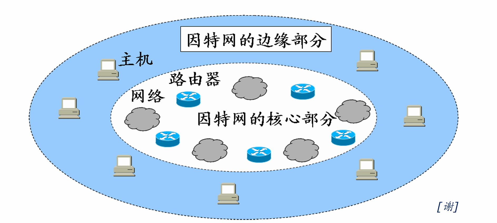
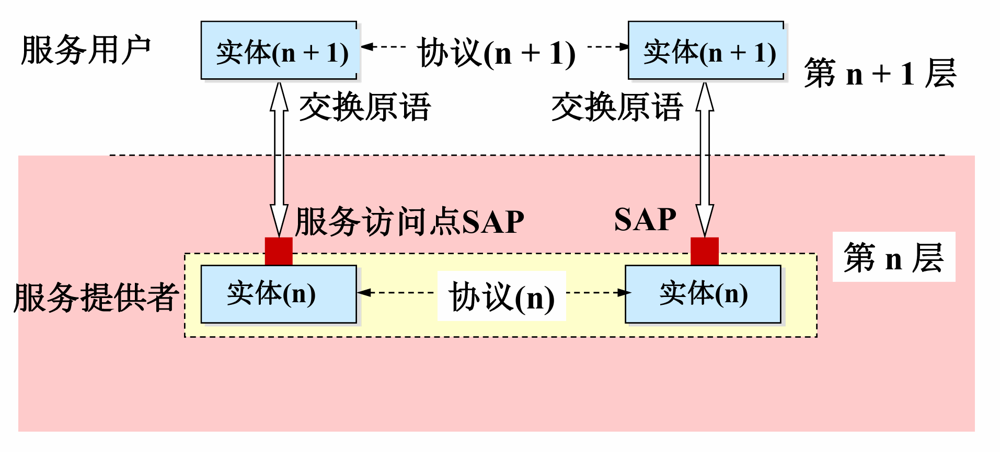
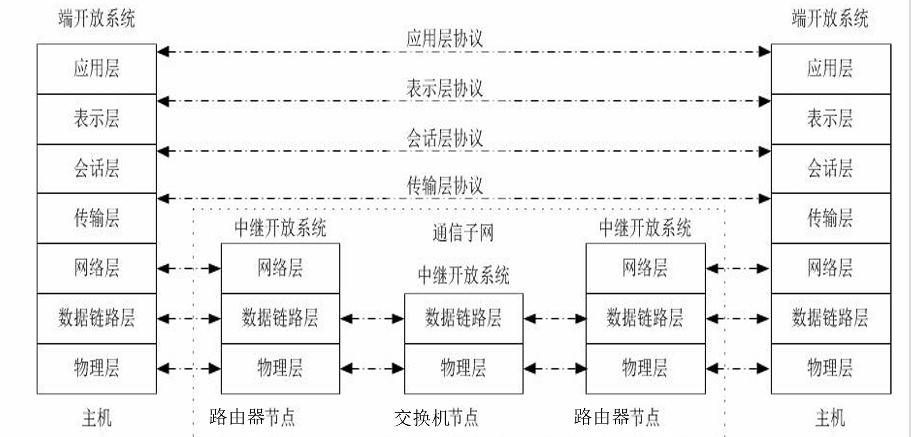
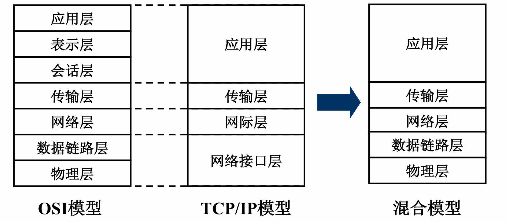

## 第一章 计算机网络概述

### 一、概念与功能

- **概念**：计算机网络是将分散且具有独立功能的**计算机系统**，通过**通信设备与线路**连接，由软件实现**资源共享和信息传递**的系统 。它是互连的、自治的计算机集合 。
- **主要功能**：
  - **数据通信**：最基本的功能 。
  - **资源共享**：包括硬件、软件和数据共享 。
  - **分布式处理**：多台计算机承担同一任务的不同部分（如 Hadoop）。
  - **提高可靠性**：通过替代机实现 。
  - **负载均衡**：在各计算机之间分配工作 。

### 二、组成与分类

- **组成部分**：硬件(主机，通信链路，交换设备)、软件、**协议(计算机网络核心)** 。

- **工作方式**：分为**边缘部分**（用户直接使用，包括 C/S 和 P2P 方式，用于通信和资源共享）和**核心部分**（网络+路由器，为边缘部分服务）。

  

- **功能组成**：

  - **通信子网**：负责数据通信（对应 OSI 低三层）。
  - **资源子网**：负责资源共享/数据处理（对应 OSI 高三层）。

- **分类方式**：

  - **按分布范围**：广域网 (WAN)、城域网 (MAN)、局域网 (LAN)、个人区域网 (PAN) 。
  - **按交换技术**：电路交换、报文交换、分组交换 。
  
  | **交换方式** | **主要特点**                                                 | **优点**                                                     | **缺点**                                                     |
  | ------------ | ------------------------------------------------------------ | ------------------------------------------------------------ | ------------------------------------------------------------ |
  | **电路交换** | 建立专用物理通路；通话期间独占资源 建立连接 $\rightarrow$传输数据 $\rightarrow$释放连接 | 1. 传输时延小  2. 有序传输  3. 没有冲突  4. 实时性强 | 1. 建立连接时间长  2. 线路利用率低  3. 缺乏灵活性  4. 不同终端难以互通 |
  | **报文交换** | 以报文为单位；采用**存储转发**机制                           | 1. 无需建立连接  . 线路利用率高  3. 可动态分配线路  4. 多目标服务 | 1. 引起转发时延（存储转发过程）  2. 节点需要大容量缓冲区  3. 对报文大小有限制 |
  | **分组交换** | 将报文拆分为**分组**；采用**存储转发**机制                   | 1. 无需建立连接  2. 线路利用率极高  3. 简化存储管理（分组定长）  4. 减少出错概率和重传数据量 | 1. 引起转发时延   2. 需要传输额外的信息（首部开销）  3. 可能出现失序、丢失或重复分组 |
  
  - **按拓扑结构**：总线型、星型、环型、网状型（常用于广域网）。
  - **按传输技术**：广播式网络（共享信道）、点对点网络（分组存储转发）。

### 三、性能指标

- **速率**：数据率或比特率，单位为 b/s, kb/s, Mb/s 等 。注意速率单位换算通常以 $10^3$为底，而存储容量单位换算以 $2^{10}$为底 。

- **带宽**：网络中通信线路传送数据的能力，即单位时间内能通过的“最高数据率” 。

- **吞吐量**：单位时间内通过某个网络的数据量，受带宽或额定速率限制 。

- **时延**：数据从网络一端传到另一端所需的时间，包括：

  - **发送时延**（传输时延）：数据长度 / 信道带宽 。

  - **传播时延**：信道长度 / 电磁波传播速率 。

  - **排队时延**与**处理时延** 。

- **时延带宽积**：$\text{传播时延} \times \text{带宽}$，表示以比特为单位的链路容量 。

- **往返时延 (RTT)**：从发送数据到收到确认经历的时延 。

- **利用率**：分为信道利用率和网络利用率。利用率过高会引起时延急剧增大 。

### 四、体系结构与参考模型

体系结构and实现：**体系结构是抽象的，实现是具体的**

* 网络的体系结构：计算机网络的各层及其协议的集合，是对该网络及其实现的功能的精确定义
* 实现：在遵循这种体系结构的前提下，用何种软件硬件实现的问题

#### 1.分层基本原则

*	每层功能相对独立 。

* 界面自然清晰，交流少 。

* 下层为相邻上层提供**服务**，上层使用下层**接口** 。

* 协议是“水平”的，服务是“垂直”的 。

#### 2.协议

* 定义：控制对等实体之间通信的规则的集合
* **三要素：语法，语义，同步(时序)**
  * 语法：规定数据与控制信息的格式，比如TCP报文段结构由其语法决定
  * 语义：规定需要发出何种信息、完成何种动作以及做出何种应答，比如TCP连接建立过程中每次握手执行的操作
  * 同步：规定各操作的条件及事件发生的先后顺序，例如TCP连接过程中三次握手的时序关系

#### 3.服务

* 定义：下层为紧邻的上层提供的功能调用，是垂直的
* 分类

| **分类标准**   | **服务类型**     | **定义与特点**                                               |
| -------------- | ---------------- | ------------------------------------------------------------ |
| **连接状态**   | **面向连接服务** | 传输前必须先发出建立连接请求，成功后才能开始传输，结束后释放连接（如 TCP） 。 |
|                | **无连接服务**   | 不需要预先建立连接，直接进行数据传输，每个分组独立选择路由（如 UDP） 。 |
| **可靠性程度** | **可靠服务**     | 网络具有纠错、检错和确认机制，确保数据正确、无误地到达接收方 。 |
|                | **不可靠服务**   | 尽力而为（Best Effort）地传输，不保证数据准确到达，可靠性由高层处理 。 |
| **确认机制**   | **有确认服务**   | 接收方收到数据后必须发回确认信号，发送方收到确认后才认为发送成功 。 |
|                | **无确认服务**   | 接收方收到数据后不发回确认，通常用于实时性要求高但对错误不敏感的场景 。 |
| **功能层次**   | **通信子网服务** | 物理层、数据链路层和网络层负责数据通信任务 。                |
|                | **资源子网服务** | 会话层、表示层和应用层负责数据处理和资源共享 。              |

#### 4.三个概念

- 协议数据单元(PDU)：对等层之间传送的数据单元，由服务数据单元(SDU)和协议控制信息(PCI)组成。

- 服务数据单元(SDU)：对等层之间传送的数据单元，为完成上一层所要求的功能而提供的数据。

- 协议控制信息(PCI)：对等层之间传送的控制协议操作信息，包括协议号、序列号、确认号、窗口大小等。

#### 5.OSI 七层参考模型

- **各层核心功能**：

  - **物理层**：实现比特流的透明传输，定义接口特性 。

  - **数据链路层**：成帧、差错控制、流量控制，传输单位为帧 。

  - **网络层**：路由选择、拥塞控制，实现异构网络互联，单位为数据报 。

  - **传输层**：主机中进程间的通信（端到端），可靠/不可靠传输，复用分用 。

  - **会话层**：建立、管理、终止会话，设置校验点同步 。

  - **表示层**：数据格式变换、加密解密、压缩恢复 。

  - **应用层**：用户与网络的界面，典型协议有 FTP, SMTP, HTTP 。

#### 6.TCP/IP 模型与五层模型

- **TCP/IP 四层模型**：应用层、传输层、网际层、网络接口层 。
- **五层参考模型**：综合 OSI 和 TCP/IP 优点，分为应用层、传输层、网络层、数据链路层、物理层 。
- **数据封装**：从上层到下层依次添加首部 (PCI)，形成各层协议数据单元 (PDU)，物理层最终转为比特流 。

