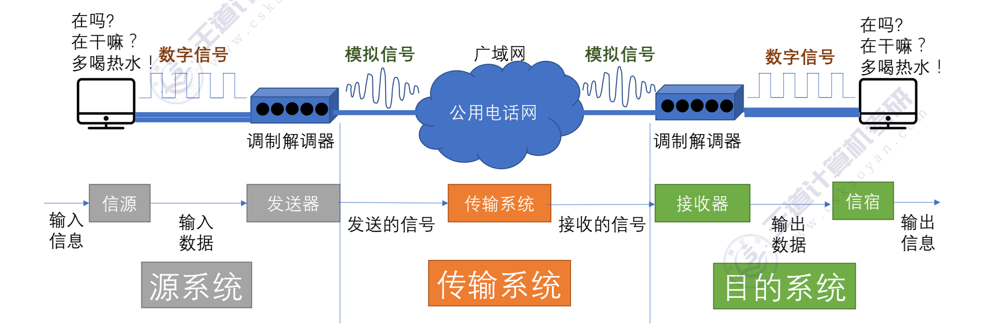
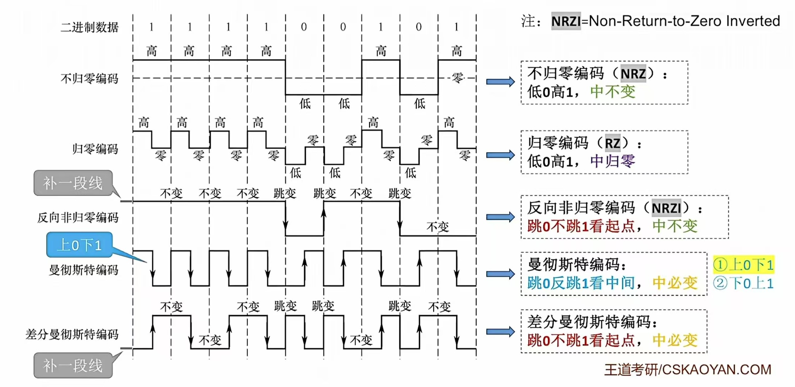
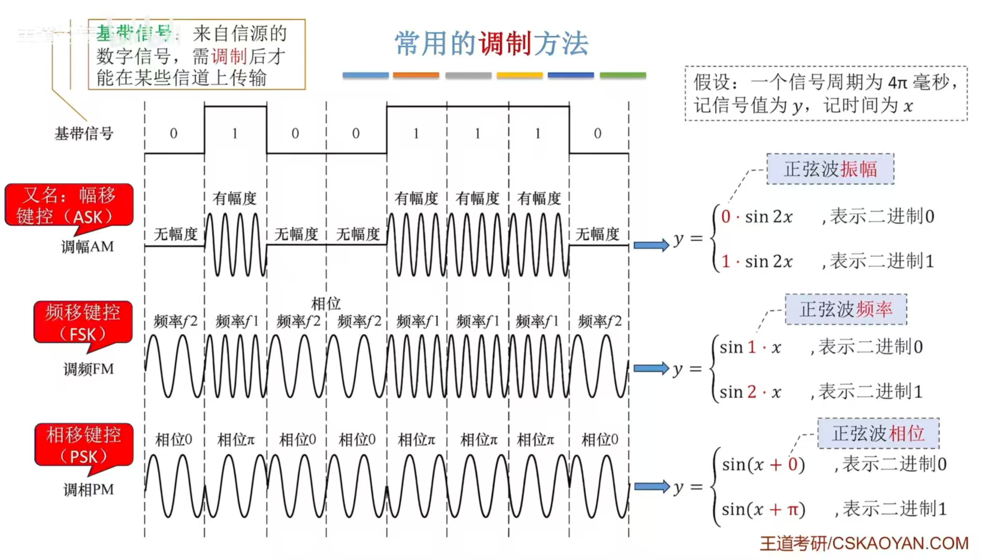

## 第二章 物理层

### 第一节 通信基础

#### 一、基础概念

1. 信源/新宿/信道：

- 信源：产生和发送数据的源头。
- 新宿：接收数据的终点
- 信号：信源发出的某种波形，可以是连续的或离散的。
    - 模拟信号：模拟信号的波形是**连续**的，可以是连续的脉冲信号、连续的电压信号、连续的光信号等。
    - 数字信号：数字信号的波形是**离散**的，可以是脉冲信号、二进制编码信号、调制信号等。
- 信道：信号传输的媒介，可以是导体、绝缘体、电介质、光介质等。
    - 一条物理线路通常包含两条信道：**发送信道、接收信道**。

2. 数据/信号/码元

- 数据：信息的载体，可以是数字信号、模拟信号、文字信号等。
- 信号：数据的电气/电磁表现，是数据在传输过程中的存在形式，可以是连续的或离散的。
    - 模拟信号：模拟信号的波形是**连续**的，可以是连续的脉冲信号、连续的电压信号、连续的光信号等。
    - 数字信号：数字信号的波形是**离散**的，可以是脉冲信号、二进制编码信号、调制信号等。
- 码元：一个固定时长的信号波形（数字脉冲）。
    - 在这个时长内的信号称为k进制码元，而这个时长本身被称为**码元宽度** 。
    - 当码元的离散状态有 $M$个时（$M$大于2），此时码元被称为 **$M$进制码元** 。
    - 1个码元可以携带多个比特的信息量 。
    - $1码元=\log_2M bit$。

3. 速率/带宽/波特

- 速率：单位时间内传输的数据量。
    - 码元传输速率：也称为波特率/调制速率，数字通信系统在单位时间内传输的码元数，单位是波特(Baud)。**与进制无关**
    - 信息传输速率：也称为数据率/比特率，单位时间内传输的比特数，单位是比特/秒(bit/s)。
- 带宽：信道的最大数据传输能力，单位是赫兹(Hz)。
#### 二、信道的极限容量
信道的极限容量主要由两个著名的定理来决定，具体取决于信道是否存在噪声：
1. 奈氏准则（奈奎斯特定理）—— 用于无噪声信道
    奈氏准则指出了在理想低通（无噪声，带宽受限）条件下，为了避免码间串扰，信道传输速率的上限 。

   * **极限码元传输速率**：$2W$Baud，其中 $W$是信道带宽，单位是Hz 。

  * **极限数据传输率（信道容量）公式**：$C=2W\log_{2}V$(b/s)。

  * **参数说明**：$W$代表带宽（Hz），$V$代表几种码元或信号的级数（即码元的离散电平数目） 。

2. 香农定理（Shannon公式）—— 用于有噪声信道
    香农定理给出了在带宽受限且有噪声的信道中，为了不产生误差，信息的数据传输速率的上限值 。

   * **信道的极限数据传输速率（信道容量）公式**：$C=W\log_{2}(1+S/N)$(b/s) 或 $C=B\times \log_{2}(1+\frac{S}{N})$。
  * **参数说明**：
      * $W$或 $B$代表信道带宽（Hz） 。
      * $S$是信道所传信号的平均功率 。
      * $N$是信道内的高斯噪声功率 。
      * $S/N$代表信噪比 。

#### 三、编码与调制
##### 1. 数字数据编码为数字信号

这是将计算机内部的二进制数字数据转换为数字信号的过程。常见编码方式如下：

* **非归零编码（NRZ）**：高电平代表1，低电平代表0 。
    * **特点**：编码容易实现，但没有检错功能，且无法判断一个码元的开始和结束，难以让收发双方保持同步 。
* **曼彻斯特编码（Manchester）**：将一个码元分成两个相等的间隔，在每个码元的中间出现电平跳变 。前高后低表示1，前低后高表示0（或相反的规定），是以太网的默认编码方式。
    * **特点**：位中间的跳变既作时钟信号（可实现自同步），又作数据信号 。缺点是所占的频带宽度是原始基带宽度的两倍，数据传输速率只有调制速率的 $1/2$。
* **差分曼彻斯特编码**：常用于局域网传输，规则为“同1异0” 。若码元为1，则前半个码元的电平与上一个码元的后半段电平相同；若为0，则相反 。
    * **特点**：每个码元中间都有一次电平跳转，可以实现自同步，且抗干扰性强于曼彻斯特编码 。
* **归零编码（RZ）**：信号电平在一个码元之内都要恢复到零 。
* **反向不归零编码（NRZI）**：通过信号电平是否发生翻转来表示0和1 。
* **4B/5B编码**：用5个比特来编码4个比特的数据，插入额外的比特以打破一连串的0或1 。
    * **特点**：编码效率为 $80\%$。

| **编码方式**| **自同步能力**| **浪费带宽情况**| **抗干扰能力**|
| --------------------- | ---------------------------- | ----------------------------- | ------------------------ |
| **非归零 (NRZ)**      | **无**                       | 无浪费                        | 较差                     |
| **反向不归零 (NRZI)** | **差**（可通过增加冗余实现） | 浪费有限                      | 较差                     |
| **归零 (RZ)**         | **强**（自带时钟跳变）       | **浪费严重**（占用频带较宽）  | 弱                       |
| **曼彻斯特**          | **强**（中间必跳变）         | **浪费严重**（编码效率仅50%） | 强                       |
| **差分曼彻斯特**      | **强**（中间必跳变）         | **浪费严重**（编码效率仅50%） | **最强**（常用于局域网） |
| **4B/5B编码**         | **较强**（打破连续同电平）   | **轻微浪费**（编码效率80%）   | 一般                     |

##### 2. 数字数据调制为模拟信号
在发送端将数字信号转换为模拟信号，在接收端再解调还原为数字信号 。

* **基本调制方法**：
    * **调幅（ASK/AM）**：通过改变载波信号的振幅来表示数字数据 。
    * **调频（FSK/FM）**：通过改变载波信号的频率来表示数字数据 。
    * **调相（PSK/PM）**：通过改变载波信号的相位来表示数字数据 。

* **多级调制方法（QAM）**：正交振幅调制（QAM）是将调幅和调相相结合的调制技术 。它可以让一个码元携带多位数据 。

  * 若设计m种幅值，n种相位，则可调制出mn种信号，$1码元 = \log_2 mn $bit。
  * QAM-16的含义是"采用QAM调制技术，有16种码元"。

##### 3. 模拟数据编码为数字信号

计算机处理数字音频时，需要将连续的模拟信号转换为有限个数字表示的离散序列（音频数字化） 。最典型的方法是**脉码调制（PCM）** ，包含三个步骤：

* **抽样**：对模拟信号周期性扫描，把时间上连续的信号变成时间上离散的信号 。为了无失真地代表模拟数据，**采样频率必须 $\ge 2f_{max}$**（信号最高频率） 。
* **量化**：把抽样取得的电平幅值转化为对应的数字值，并取整数 。
* **编码**：把量化的结果转换为与之对应的二进制编码 。

##### 4. 模拟数据调制为模拟信号

为了实现传输的有效性或进行远距离传输，会将模拟的声音数据加载到频率较高的模拟载波信号中传输 。这种调制方式常结合**频分复用（FDM）**技术，以充分利用带宽资源 。

#### 四、传输介质

传输媒体并不属于物理层，而是在体系结构的最底层（常被称为“第0层”） 。传输媒体内部只传输不知其意义的信号，而物理层通过规定电气特性来识别传送的比特流 。

传输介质主要分为**导向性传输介质（有线）**和**非导向性传输介质（无线）**两大类 。

1. **导向性传输介质**

电磁波被导向沿着固体媒介（如铜线、光纤）传播 。

- **双绞线 (Twisted Pair)**：
  - **结构**：由两根相互绝缘的铜导线按一定规则绞合而成，绞合的作用是减少相邻导线的电磁干扰 。
  - **分类**：分为非屏蔽双绞线 (UTP) 和带有金属编织屏蔽层的屏蔽双绞线 (STP) 。
  - **特点与应用**：价格便宜，是最常用的传输介质，可用于传输模拟信号和数字信号（如固定电话线、计算机网线） 。
- **同轴电缆 (Coaxial Cable)**：
  - **结构**：由内导体铜质芯线、绝缘层、外导体屏蔽层和塑料外层构成 。
  - **分类**：$50\Omega$同轴电缆（用于传送基带数字信号，常见于局域网）和 $75\Omega$ 同轴电缆（用于传送宽带模拟信号，常见于有线电视系统） 。
  - **特点**：抗干扰特性比双绞线好，传输距离更远、速率更高，但价格更贵 。
- **光纤 (Optical Fiber)**：
  - **原理**：利用光脉冲通信（有光脉冲表示1，无表示0） 。利用光波在纤芯（高折射率）和包层（低折射率）的交界面不断发生全反射来传输 。
  - **分类**：分为单模光纤（光源为激光二极管，衰耗小，适合远距离）和多模光纤（光源为发光二极管，易失真，适合近距离） 。
  - **特点**：超高带宽、传输损耗小、抗干扰性能极好、保密性强、重量轻 。

2. **非导向性传输介质**

指自由空间，如空气、真空、海水等 。主要利用无线电磁波进行通信：

- **无线电波 (Radio Frequency)**：信号向全方位传播，穿透能力较强，广泛应用于手机通信、WLAN、蓝牙等领域，但存在抗干扰能力差等缺点 。
- **微波 (Microwave)**：信号沿直线、固定方向传播，频段宽、数据率高 。
  - **地面微波接力**：不能穿透建筑物，受天气影响大，长距离需要中继器 。
  - **卫星通信**：以卫星作中继器，覆盖面广且支持广播，但传播时延大（约250-270ms）、受气候和太阳黑子等影响大、成本高 。
- **红外线与激光**：将信号转换为红外光或激光信号在空间中沿固定方向传播，具有容量大、距离远的优点 。

#### 五、物理层接口特性

物理层的主要任务是确定与传输媒体接口有关的一些特性 。关于物理层接口的特性，主要可以总结为以下四个方面：

1. **机械特性**：规定物理连接时所采用的规格、接口形状、引线数目、引脚数量和排列情况等 。
2. **电气特性**：规定在接口电缆的各条线上的电压范围 。例如，规定传输二进制位时线路上信号的电压范围、阻抗匹配、传输速率和距离限制等 。
3. **功能特性**：指明某条线上出现的某一电平表示何种意义 ，以及接口部件的信号线的用途 。
4. **过程特性（也称规程特性）**：定义各条物理线路的工作规程和时序关系 ，即规定各种可能事件的出现顺序 。

#### 六、物理层设备

根据您提供的课件资料，物理层的主要互连设备包括 **中继器（Repeater）和集线器（Hub）** 。它们的具体功能和特点如下：

1. **中继器 (Repeater)**

   - **产生原因**：由于存在损耗，线路上传输的信号功率会逐渐衰减，导致信号失真和接收错误 。

   - **主要功能**：对信号进行再生和还原，对衰减的信号进行放大，以增加信号传输的距离，延长网络的长度 。
     - **工作特点**：
       - 它连接两个局域网网段（Segment） 。
       - 中继器仅作用于信号的电气部分，不管数据中是否有错误 。
       - 中继器两端的网段一定要是同一个协议（它不会存储转发） 。

   - **5-4-3规则**：在以太网标准中，对信号延迟有严格规定，即最多允许有5个网段、4个中继器，其中最多3个网段可以连接主机 。

   - **冲突域**：中继器连接的两个网段属于同一个冲突域 。

2. **集线器 (Hub)**

   - **基本概念**：集线器本质上是一个**多口中继器**，用于将主机连接起来组成局域网（LAN） 。

   - **主要功能**：对衰减的信号进行再生放大，并转发到除输入端口外的其他所有处于工作状态的端口上 。

   - **工作特点**：
     - **拓扑结构**：物理拓扑结构为星形，但逻辑拓扑结构为总线形 。
       - **共享式通信**：它是一个共享式设备，不具备信号的定向传送能力，采用广播信道的方式发送数据 。
       - **冲突域与带宽**：集线器不能分割冲突域（所有端口同属一个冲突域），且连接在集线器上的工作主机需要平分带宽 。
