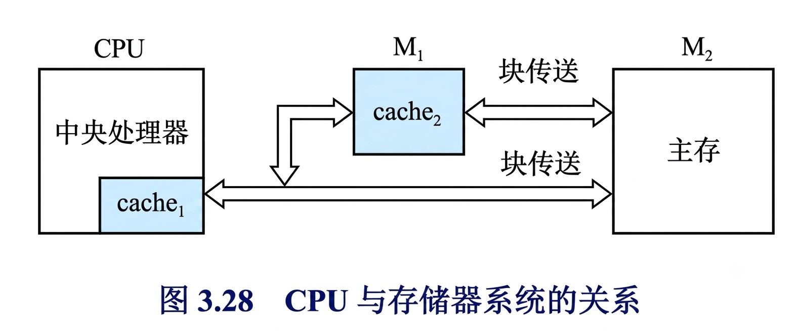
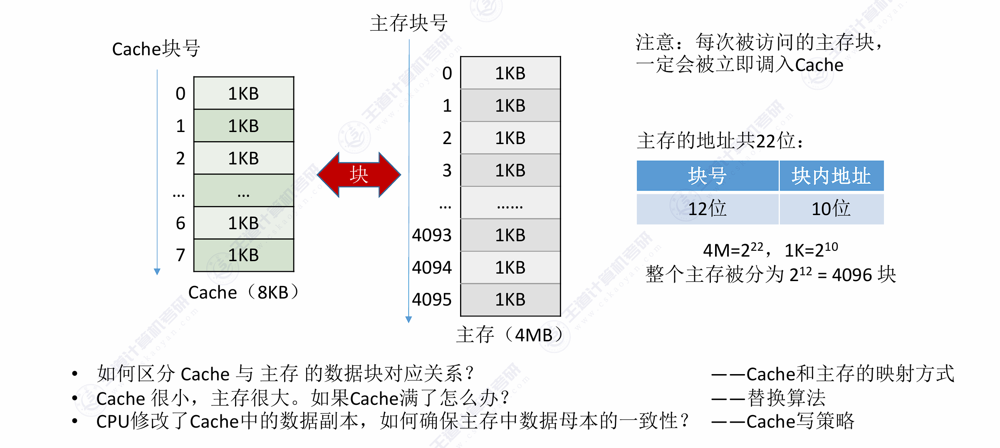
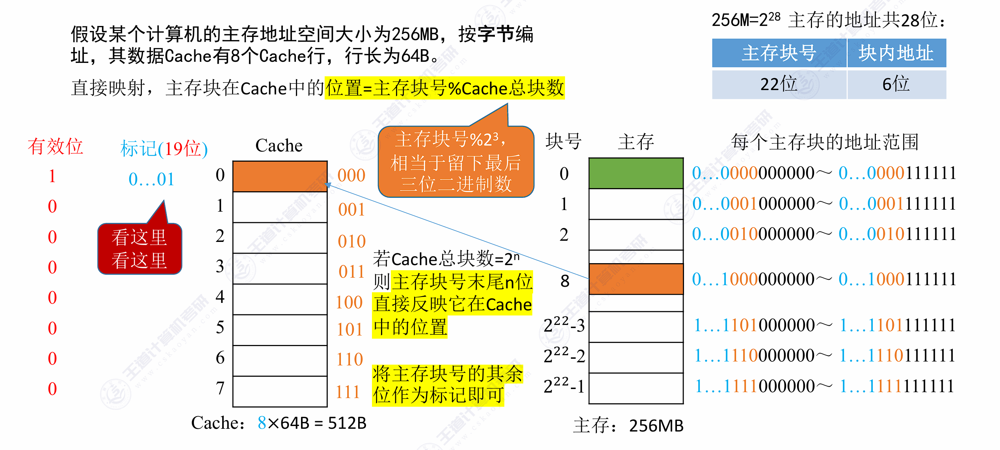
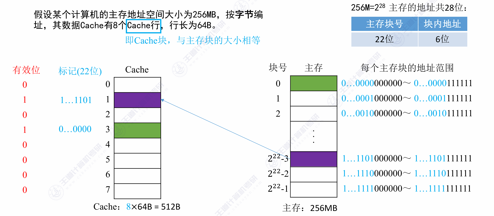
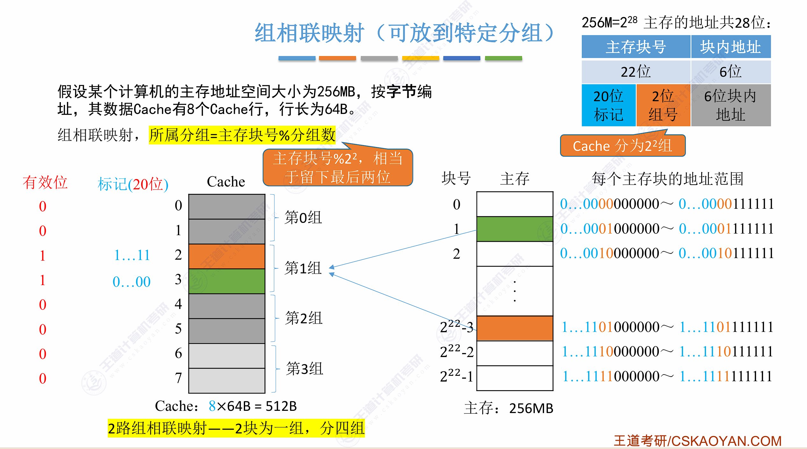
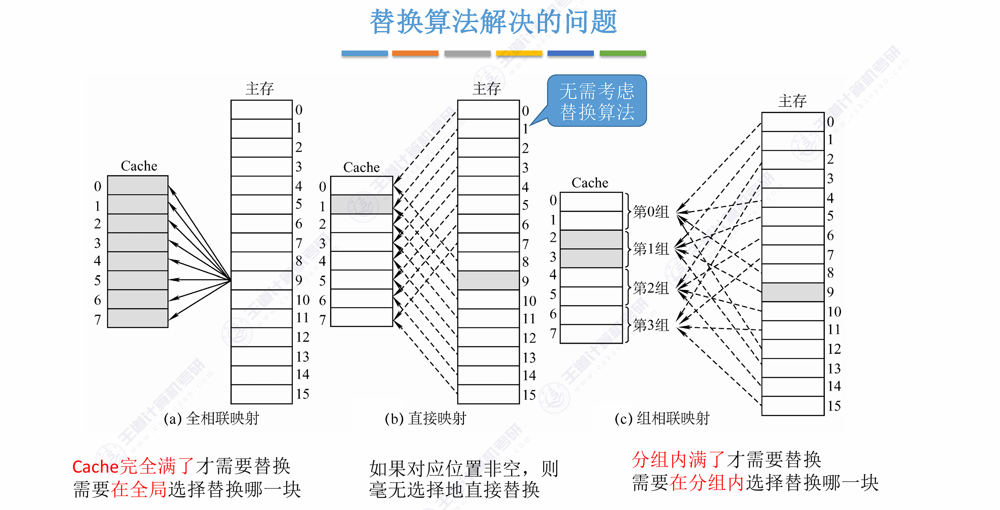
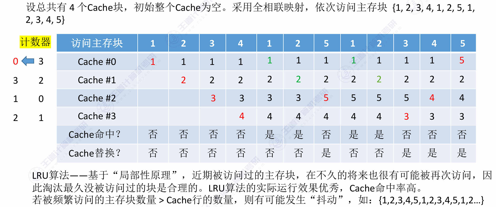
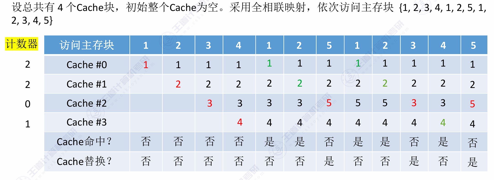

程序访问的局部性（Locality of Reference）是计算机科学的核心原理：程序在执行时，倾向于访问内存中临近的区域，或重复访问相同的数据。它分为**时间局部性**（重复访问相同数据）和**空间局部性**（访问相邻数据）两类。了解该原理可助你写出更高效、缓存命中率更高的代码。

- **时间局部性**：如果一个内存位置今天被引用，那么它不久后极可能再次被引用。
  - *场景*：循环中的计数器 `i`、累加器 `sum` 或频繁读取的热门变量。
- **空间局部性**：如果一个内存位置被引用，那么程序很可能在不久后引用它附近的内存位置。
  - *场景*：顺序读取数组元素、遍历连续内存块。

## 一、Cache 的基本原理

### 1. Cache 的功能

CPU 与主存之间加入一个容量小但速度快的 **SRAM Cache**，其核心功能：

- **弥补 CPU 与主存的速度差距**：CPU 速度远超 DRAM，Cache 以接近 CPU 的速度提供数据
- **利用局部性原理减少平均访存时间**：将频繁访问的指令和数据缓存在 SRAM 中
- **对上层透明**：CPU 只发出访存地址，由硬件自动判断数据是否在 Cache 中



Cache 与主存之间**以块（Block / Cache Line）为单位**交换数据。

### 2. Cache 的基本原理

**两个关键的数据传送单位**：

| 传送路径         | 传送单位                     | 原因                                           |
| :--------------- | :--------------------------- | :--------------------------------------------- |
| **CPU ↔ Cache**  | **字（Word）**               | CPU 每次只请求一个字的指令或数据               |
| **Cache ↔ 主存** | **块（Block / Cache Line）** | 利用空间局部性——一次调入连续多个字，提高命中率 |

- **命中（Hit）**：CPU 访问的数据在 Cache 中找到 → 直接返回，无需访问主存。

- **缺失（Miss）**：CPU 访问的数据不在 Cache 中 → 从主存调入包含该数据的整个块到 Cache，可能需要替换某一行。

- **CPU 读主存的完整流程**：
  1. CPU 将访存地址**同时**发送给 Cache 和主存。
  1. Cache 控制逻辑依据地址判断此字是否在 Cache 中。
  1. 若**命中**：此字立即从 Cache 传送给 CPU，无需访问主存。
  1. 若**缺失**：用主存读周期把此字从主存读出送到 CPU；与此同时，把含有这个字的**整个数据块**从主存读出送到 Cache 中保存。


- Cache 能有效工作的**理论基础**是程序访问的**局部性原理**：

  - **时间局部性**：刚访问过的数据不久后可能再次被访问 → Cache 保留它

  - **空间局部性**：刚访问过的数据附近的数据可能紧接着被访问 → Cache 一次调入一整块


### 3. 命中率与平均访问时间

设 $N_c$ 为 Cache 命中次数，$N_m$ 为 Cache 缺失次数（需访问主存的次数）：

$$H = \frac{N_c}{N_c + N_m}$$

$H$ 越接近 1，Cache 效率越高。现代 CPU 的 Cache 命中率通常 > 95%。

设 $T_c$ 为 Cache 访问时间，$T_m$ 为主存访问时间，则平均访问时间：

$$T_{avg} = H \times T_c + (1-H) \times T_m$$

**示例**：$H=0.95$，$T_c=10$ ns，$T_m=100$ ns

$$T_{avg} = 0.95 \times 10 + 0.05 \times 100 = 14.5 \text{ ns}$$

> 命中率 95% 时，平均访问时间 14.5 ns，远快于直接访问主存的 100 ns。

---

## 二、主存与 Cache 的地址映射

映射方式决定了**主存块可以放入 Cache 的哪些位置**——这是 Cache 设计中最关键的决策之一，直接影响命中率和硬件复杂度。



### 1. 直接映射（Direct Mapped）

**规则**：每个主存块只能放到 Cache 中**唯一固定的一个位置**：

$$\text{Cache 行号} = \text{主存块号} \bmod \text{Cache 总行数}$$

**地址结构**：

```
主存地址 =  
┌─────────────┬──────────────┬────────────────┐
│  标记 Tag    │  行号 Index  │ 块内偏移 Offset  │
└─────────────┴──────────────┴────────────────┘
```

**原理**：多个主存块映射到同一个 Cache 行，用 Tag 区分当前 Cache 行中存放的是哪一块。



**硬件实现**：用 Index 选中一行 → 比较 Tag 和有效位 → 匹配则命中。

| 优点                        | 缺点                                         |
| :-------------------------- | :------------------------------------------- |
| 硬件最简单：只需 1 个比较器 | 冲突缺失多：不同块映射到同行互相淘汰（抖动） |
| 查找最快                    | Cache 利用率低                               |

**示例**：主存 64KB，Cache 4KB，块大小 16B。

```
主存 64KB = 2^16 B, 共 2^16/2^4 = 2^12 = 4096 块
Cache 4KB = 2^12 B, 共 2^12/2^4 = 2^8 = 256 行
块内偏移: 4 位 (2^4=16)
行号: 8 位  (2^8=256)
标记: 12−8=4 位 (多对一映射，需区分是哪块)

主存地址 (16位): Tag(4位) │ Index(8位) │ Offset(4位)
```

> 主存块 0、256、512…都映射到 Cache 行 0——靠 Tag 区分。

### 2. 全相联映射（Fully Associative）

**规则**：每个主存块可以放到 Cache 的**任意位置**，没有任何限制。

**地址结构**：

```
主存地址 = 
┌─────────────┬───────────────┐
│  标记 Tag    │ 块内偏移 Offset│
└─────────────┴───────────────┘
```

**原理**：没有 Index 字段，整个地址高位都是 Tag。查找时需与 Cache 中**所有行的 Tag 同时比较**。



**CPU 访问流程示例**（主存地址 1...1101001110）：

1. 主存地址的前 22 位作为 Tag，与 Cache 中**所有行**的标记同时比较
2. 若某行标记匹配且有效位 = 1 → **Cache 命中**，访问块内偏移 001110 对应单元
3. 若所有行都不匹配或有效位 = 0 → **缺失**，从主存调入

**硬件实现**：需要**相联存储器（CAM）**——所有行的 Tag 同时并行比较。成本极高，只适用于小容量 Cache（如 TLB）。

| 优点                 | 缺点                                 |
| :------------------- | :----------------------------------- |
| 最灵活，冲突缺失最少 | 硬件最复杂（需 CAM，并行比较所有行） |
| Cache 空间利用率最高 | 每行需一个比较器，成本随容量剧增     |

### 3. 组相联映射（Set Associative）

**规则**：Cache 分成多个**组（Set）**，每组含若干行（路）。主存块先映射到固定组，在组内可任意放。

$$\text{Cache 组号} = \text{主存块号} \bmod \text{Cache 组数}$$

**地址结构**：

```
主存地址 = 
┌─────────────┬──────────────┬───────────────┐
│  标记 Tag    │  组号 Index   │ 块内偏移 Offset│
└─────────────┴──────────────┴───────────────┘
```

**原理**：Index 定位到固定组 → 组内多路（如 2/4/8 路）任意放 → 只需比较组内若干路的 Tag。



**示例**：主存 1MB，Cache 64KB，块大小 32B，4 路组相联。

```
主存 1MB = 2^20 B, 共 2^20/2^5 = 2^15 = 32768 块
Cache 64KB, 共 2^16/2^5 = 2^11 = 2048 行
4 路组相联: 2048/4 = 512 组
块内偏移: 5 位  (2^5=32)
组号: 9 位       (2^9=512)
标记: 15−9=6 位

主存地址 (20位): Tag(6位) │ Index(9位) │ Offset(5位)
```

|     路数     | 等价于   | Tag 比较数 | 冲突缺失 | 硬件复杂度 |
| :----------: | :------- | :--------: | :------: | :--------: |
|     1 路     | 直接映射 |     1      |   最多   |    最低    |
|    2~4 路    | 组相联   |    2~4     |    少    |     中     |
|     8 路     | 组相联   |     8      |   很少   |    较高    |
| N 路（全组） | 全相联   |     N      |   最少   |    最高    |

> **408 常考**：给定 Cache 容量、块大小、路数，反推地址结构各字段的位数。组相联 = 直接映射（Index 定组）+ 全相联（组内任意），兼具二者优势，**现代 CPU 主流**。

### 4. 三种映射方式总结

| 维度         | 直接映射      | 全相联映射            | 组相联映射              |
| :----------- | :------------ | :-------------------- | :---------------------- |
| **映射规则** | 块号 mod 行数 | 任意行                | 块号 mod 组数，组内任意 |
| **Tag 比较** | 1 次          | 全部行并行比较        | 组内全部路比较          |
| **硬件**     | 1 个比较器    | **CAM（相联存储器）** | 组内 N 个比较器         |
| **冲突缺失** | 多（抖动）    | 无                    | 少                      |
| **命中率**   | 低            | **最高**              | 高                      |
| **成本**     | 低            | **极高**              | 中等                    |
| **实际应用** | 早期小 Cache  | TLB、小容量专用 Cache | **现代 CPU 主流**       |

---

## 三、替换策略



| 算法            | 规则                 | 硬件成本         | 命中率   |
| :-------------- | :------------------- | :--------------- | :------- |
| **随机 (RAND)** | 随机选一行           | 低               | 较低     |
| **FIFO**        | 替换最早进入的行     | 低               | 较低     |
| **LRU**         | 替换最久未使用的行   | 高               | **最高** |
| **LFU**         | 替换访问次数最少的行 | 较高（需计数器） | 较高     |
| **伪 LRU**      | LRU 近似（二叉树）   | 中等             | 接近 LRU |

**LFU（最不经常使用）**：为每行维护一个访问计数器，每次命中该行计数器 +1。替换时选择计数值最小的行（即历史上被访问次数最少的）。

- **优点**：能保留经常被访问的"热门"数据——计数器大的行不会被轻易替换。
- **缺点**：刚调入的新行计数值低，即使可能即将被频繁访问也会被淘汰（**"旧数据霸占"问题**）。硬件需维护每行的计数器，成本高于 LRU。

> LFU 关注的是**累计访问频率**（历史上被访问了多少次），而 LRU 关注的是**最近访问时间**（最近一次是什么时候）。LFU 适合访问频率稳定、无明显时间突变的场景。

**LRU 示例**：



**LFU 示例**：



---

## 四、写操作策略

### 1. 写命中（Write Hit）—— 数据已在Cache中

当CPU要写一个地址，且这个地址已经在Cache里（命中），有两种处理方式：

| 策略                    | 操作方式                                                     | 优点                                                         | 缺点                                                         |
| :---------------------- | :----------------------------------------------------------- | :----------------------------------------------------------- | :----------------------------------------------------------- |
| <nobr>**写直达**</nobr> | **同时写入Cache和主存**。数据一修改，立刻同步到慢速的DRAM里。 | **数据一致性极好**（主存永远是最新的），硬件实现简单，非常适合多核共享数据场景。 | **速度极慢**（每次写都要访问慢速DRAM），消耗大量总线带宽，成为性能瓶颈。 |
| **写回**                | **只写入Cache**，并在Cache行上打一个 **“脏位（Dirty Bit）”** 标记。只有当该Cache行**被替换出去**时，才将修改后的数据**一次性写回**主存。 | **速度极快**（写入像读取一样快），大幅减少对主存的访问次数。 | **实现复杂**（需维护脏位），且**一致性风险高**（主存数据可能过时，多核间需额外嗅探协议）。 |

> **现代CPU的主流选择**：L1/L2/L3缓存几乎**全部采用“写回（Write-Back）”**，因为写入速度太关键了。只有少数对一致性要求极高的场景（如显存中的特定区域）才用写直达。

### 2. 写失效（Write Miss）—— 数据不在Cache中

当CPU要写一个地址，但这个地址没在Cache里（失效），有两种处理方式：

| 策略                      | 操作方式                                                     | 适用场景                                                     |
| :------------------------ | :----------------------------------------------------------- | :----------------------------------------------------------- |
| **写分配**                | **先把主存中的这一整块数据加载进Cache**，然后**在Cache里修改**它（就像处理写命中一样，通常配合写回策略）。 | **绝大多数情况**。因为赌你马上还要读写这个数据（利用了时间局部性和空间局部性）。 |
| <nobr>**非写分配**</nobr> | **不加载进Cache，直接绕过Cache，把数据写入主存**。           | 适用于**写特大块数据**（如视频流）或**只写一次的数据**。如果强行加载进Cache，会污染缓存空间且毫无意义。 |

### 3. 实际硬件中的“黄金组合”

现代CPU通常不会单独选一个，而是搭配使用：

1.  **写回（Write-Back） + 写分配（Write-Allocate）** —— **最主流组合**。
    -   **写命中**：只改Cache，标记脏位。
    -   **写失效**：先把整块从主存搬到Cache（分配），再在Cache里改。
    -   **结果**：写入速度极快，且写操作几乎都发生在Cache内部，极大减轻DRAM压力。

2.  **写直达（Write-Through） + 非写分配（No-Write-Allocate）** —— **老式或特殊场景组合**。
    -   **写命中**：同时写Cache和主存。
    -   **写失效**：直接写主存，不进Cache。
    -   **结果**：实现简单，但性能差，现在很少用。

### 4. 硬件配套：必不可少的“写缓冲器（Write Buffer）”

为了弥补“写回”策略中，**脏块被替换时才写回主存带来的突发阻塞**，硬件引入了一个**写缓冲器（Write Buffer）**。

-   **作用**：当脏块被替换时，数据不直接写入DRAM（太慢），而是**先丢进这个FIFO（先进先出）缓冲器**。CPU立刻继续执行，由缓冲器在后台慢慢把数据“吐”给DRAM。
-   **关键**：这大大降低了写回操作的等待惩罚。只有当缓冲器满了，CPU才会被强制暂停（等待）。

### 5. 总结对比表

| 场景               | 策略选项                                   | 现代CPU的选择                  |
| :----------------- | :----------------------------------------- | :----------------------------- |
| **写命中（Hit）**  | 写直达（慢、简单） vs **写回（快、复杂）** | ✅ **写回（Write-Back）**       |
| **写失效（Miss）** | **写分配（预取）** vs 非写分配（旁路）     | ✅ **写分配（Write-Allocate）** |
| **脏块替换**       | 直接写主存（阻塞） vs **写缓冲器（异步）** | ✅ **写缓冲器（Write Buffer）** |