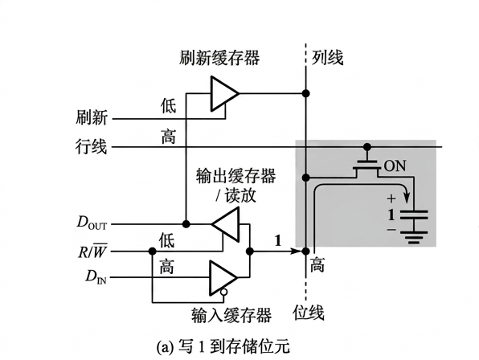
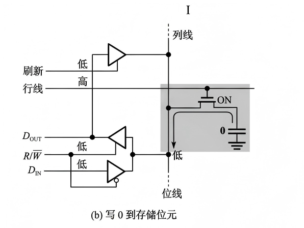
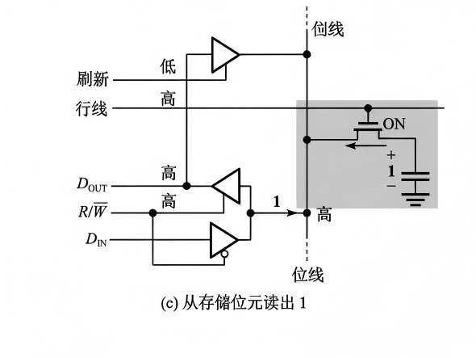
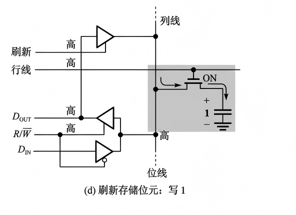
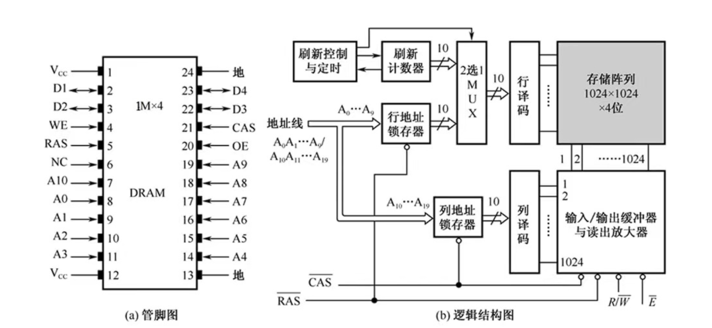
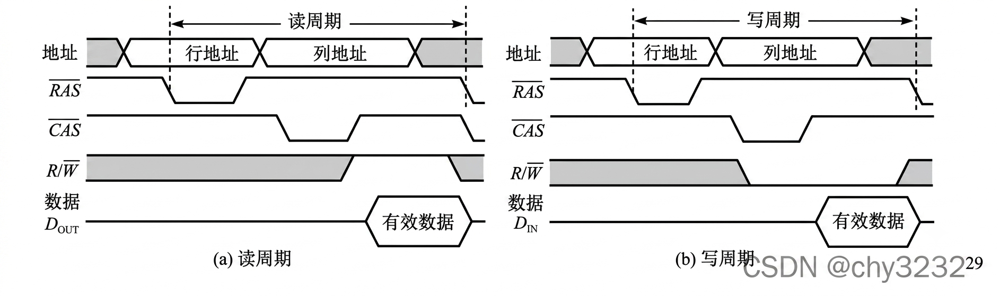
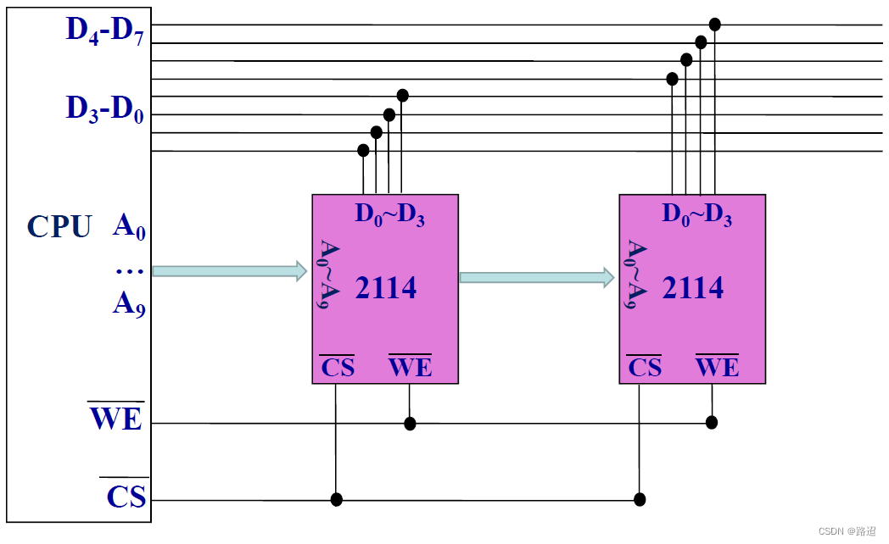
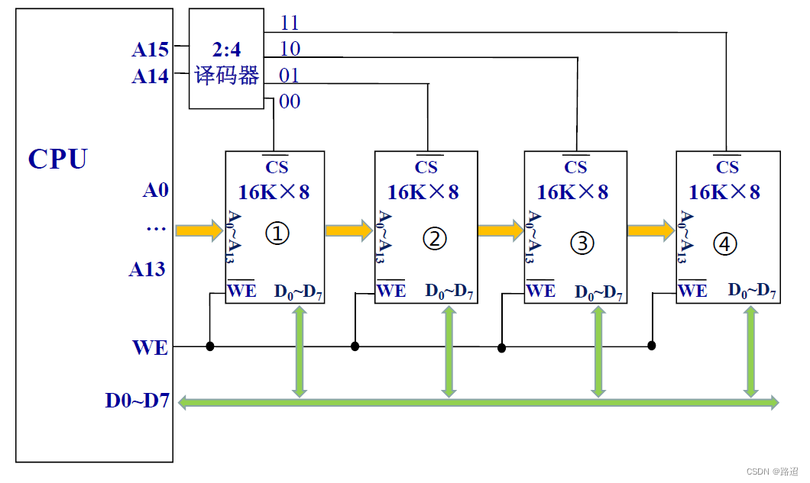
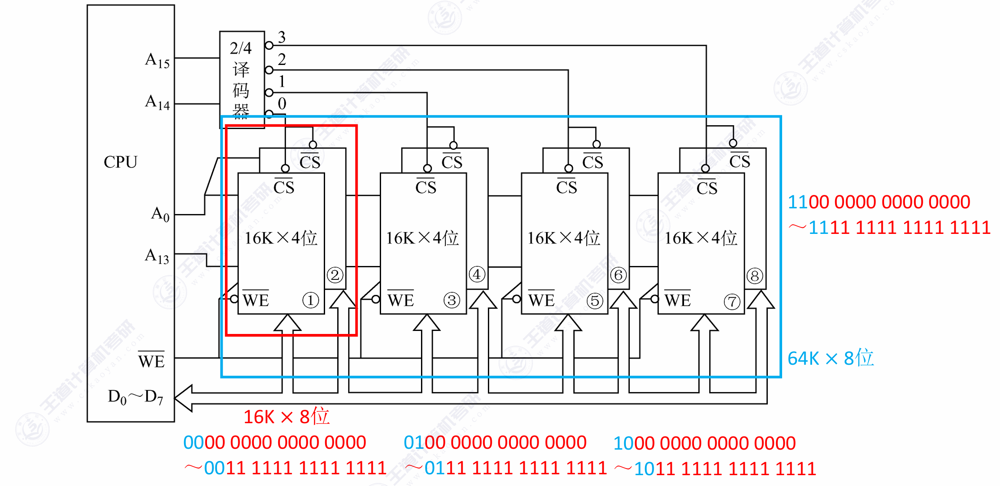

#### 一、DRAM 存储元的记忆原理

DRAM 靠**电容存储电荷**来记忆信息：电容充有电荷 → "1"，无电荷 → "0"。结构为 1 个 MOS 管 + 1 个电容（1T1C）。

##### 1. 核心元件与控制信号：

在分析具体过程前，我们先明确电路中的几个关键部分：

- **存储位元（灰色区域）**：由一个 **MOS管（开关）** 和一个 **电容（存储介质）** 组成。电容充满电荷代表“1”，放完电代表“0”。

- **行线（Row Line / 字线）**：控制MOS管的导通。行线为**高电平**时，MOS管导通（ON），允许电容与位线进行电荷交换。

- **列线/位线（Bit Line）**：数据传输的通道。

- **三态缓冲器（三个三角形元件）**：
  1. **输入缓冲器（最下方）**：写操作时启用。受 R/W# 信号控制（低电平有效，带控制端圆圈），当 R/W# 为**低电平**时导通，将输入数据 DIN 送到位线上。
  2. **输出缓冲器/读放（中间）**：读操作时启用。受 R/W# 控制（高电平有效），当 R/W# 为**高电平**时导通，将位线上的信号放大并输出到 DOUT。
  3. **刷新缓冲器（最上方）**：刷新操作时启用。受“**刷新**”信号控制（高电平有效），导通时将输出端的数据重新送回位线。

##### 2. 四种工作状态详解

<table style="width: 100%; border: none;">
  <tr style="border: none;">
    <td style="width: 45%; vertical-align: top; border: none; text-align: center;">
      <strong>DRAM 写入操作（1T1C 电路示意）</strong> 
      
    </td>
    <td style="width: 55%; vertical-align: top; border: none; padding-left: 20px;">
      <strong>控制信号</strong>
      <ul style="margin-top: 6px; padding-left: 20px;">
        <li><strong>行线</strong>：<strong>高电平</strong>（MOS 管导通，通道打开）。</li>
        <li><strong>R/W#</strong>：<strong>低电平</strong>（写使能，输入缓冲器打开，输出和刷新缓冲器关闭）。</li>
        <li><strong>刷新</strong>：<strong>低电平</strong>（关闭）。</li>
      </ul>
      <strong>数据流向</strong>
      <ul style="margin-top: 4px; padding-left: 20px;">
        <li>输入数据 DIN 为<strong>高电平</strong>（1），通过输入缓冲器使<strong>位线</strong>呈现高电平。</li>
        <li>电荷通过导通的 MOS 管流入电容，电容充电，存储状态变为 <strong>"+1"</strong>。</li>
      </ul>
    </td>
  </tr>
</table>

---

<table style="width: 100%; border: none;">
  <tr style="border: none;">
    <td style="width: 45%; vertical-align: top; border: none; text-align: center;">
      <strong>写 0 到存储位元</strong> 
      
    </td>
    <td style="width: 55%; vertical-align: top; border: none; padding-left: 20px;">
      <strong>控制信号</strong>
      <ul style="margin-top: 6px; padding-left: 20px;">
        <li><strong>行线</strong>：<strong>高电平</strong>（MOS 管导通）。</li>
        <li><strong>R/W#</strong>：<strong>低电平</strong>（写使能，输入缓冲器打开）。</li>
        <li><strong>刷新</strong>：<strong>低电平</strong>（关闭）。</li>
      </ul>
      <strong>数据流向</strong>
      <ul style="margin-top: 4px; padding-left: 20px;">
        <li>输入数据 DIN 为<strong>低电平</strong>（0），使<strong>位线</strong>呈现低电平。</li>
        <li>电容中的电荷通过导通的 MOS 管流向位线并泄放至地，电容放电，存储状态变为 <strong>"0"</strong>。</li>
      </ul>
    </td>
  </tr>
</table>

---

<table style="width: 100%; border: none;">
  <tr style="border: none;">
    <td style="width: 45%; vertical-align: top; border: none; text-align: center;">
      <strong>从存储位元读出 1</strong> 
      
    </td>
    <td style="width: 55%; vertical-align: top; border: none; padding-left: 20px;">
      <strong>控制信号</strong>
      <ul style="margin-top: 6px; padding-left: 20px;">
        <li><strong>行线</strong>：<strong>高电平</strong>（MOS 管导通）。</li>
        <li><strong>R/W#</strong>：<strong>高电平</strong>（读使能，输出缓冲器打开，输入缓冲器关闭）。</li>
        <li><strong>刷新</strong>：<strong>低电平</strong>（关闭）。</li>
      </ul>
      <strong>数据流向</strong>
      <ul style="margin-top: 4px; padding-left: 20px;">
        <li>电容中存储的电荷（+1）通过导通的 MOS 管释放到位线上，位线电压微幅上升（高电平）。</li>
        <li>微弱信号经<strong>输出缓冲器（读出放大器）</strong>放大后，DOUT 输出<strong>高电平（1）</strong>。</li>
      </ul>
      <strong>重要考点（破坏性读出）</strong>
      
读出过程中，电容的电荷因流向位线而流失，称为<strong>破坏性读出</strong>。因此 DRAM 读出后必须紧跟<strong>再生（重写）</strong>操作，将电荷重新补满。

    </td>
  </tr>
</table>

---

<table style="width: 100%; border: none;">
  <tr style="border: none;">
    <td style="width: 45%; vertical-align: top; border: none; text-align: center;">
      <strong>刷新存储位元（读后再生）</strong> 
      
    </td>
    <td style="width: 55%; vertical-align: top; border: none; padding-left: 20px;">
      <strong>控制信号</strong>
      <ul style="margin-top: 6px; padding-left: 20px;">
        <li><strong>行线</strong>：<strong>高电平</strong>（MOS 管导通）。</li>
        <li><strong>R/W#</strong>：<strong>高电平</strong>（输出缓冲器打开，维持读出）。</li>
        <li><strong>刷新</strong>：<strong>高电平</strong>（刷新缓冲器打开，建立反馈通路）。</li>
      </ul>
      <strong>数据流向（闭环反馈回路）</strong>
      
电容/位线 → 输出缓冲器 → 刷新缓冲器 → 位线 → 电容

      <ul style="padding-left: 20px;">
        <li>读出的高电平信号（1）经输出缓冲器后，通过<strong>刷新缓冲器</strong>重新送回位线。</li>
        <li>强信号重新驱动位线，经导通 MOS 管对电容<strong>重新充电</strong>，恢复到饱满的 <strong>"+1"</strong> 状态。</li>
      </ul>
    </td>
  </tr>
</table>

**特点**：

- **破坏性读出**：读出时电容上的电荷被位线共享，需要**读后重写**恢复
- **必须刷新**：电容会漏电，电荷约在 **2ms** 内消失 → 必须在 2ms 内刷新所有行
- 每次刷新 = 读出一行 → 放大 → 写回（无需输出到数据端口）

#### 二、DRAM 芯片的逻辑结构

**DRAM 地址的分时复用**：

- **RAS#**（Row Address Strobe，行地址选通）：低有效时锁存行地址
- **CAS#**（Column Address Strobe，列地址选通）：低有效时锁存列地址
- 同一组地址引脚分两次送入行地址和列地址，**节省引脚数**

#### 三、读/写周期、刷新周期

##### 1. 读/写周期

**核心前提：RAS和CAS的“锁存”作用**

- **RAS（行选通）的下降沿**：芯片把当前地址线上的值“咔嚓”锁存为**行地址**。
- **CAS（列选通）的下降沿**：芯片把当前地址线上的值“咔嚓”锁存为**列地址**。
- **地址线复用**：可以看到，地址信号在时间轴上先后出现了 **“行地址”** 和 **“列地址”** 两段，它们共用相同的物理引脚。

**（1）读周期（读出数据）**

这是一个“CPU问芯片要数据”的过程，芯片内部需要时间来感应电荷。

1. **地址建立（行）**：CPU先将行地址放到地址总线上。
2. **RAS变低（↓）**：RAS信号的下降沿触发，芯片将当前地址线上的值锁存为**行地址**。内部开始选通对应的字线（一整行）。
3. **地址切换（列）**：总线上的地址切换为**列地址**。
4. **CAS变低（↓）**：经过一段必要的时间间隔（tRCD，即RAS到CAS延迟）后，**CAS**信号的下降沿触发，锁存**列地址**。此时，具体的存储单元（交叉点）被选中。
5. **数据输出（Dout）**：存储单元的电容将微弱的电荷放到位线上，经读出放大器放大后，从 **Dout** 引脚输出。图中标注的**“有效数据”**，就是在CAS变低后等待了一段存取时间（tCAC或tRAC）才稳定出现的。
6. **结束**：数据读取完毕，CAS和RAS先后恢复高电平。

**（2）写周期（写入数据）**

这是一个“CPU给芯片塞数据”的过程，关键在于数据必须先于CAS结束前稳定。

1. **地址建立**：同样，先送**行地址**，再送**列地址**（波形与读周期完全一致）。
2. **RAS与CAS锁存**：RAS和CAS依次变低，锁存行列地址（与读周期前半段相同）。
3. **R/W变为低电平**：这是写操作的关键标志。在CAS变低之前或与之同时，**R/W（读写控制线）必须被拉低（写使能）**。这告诉芯片：“这次是往里存，不是往外读”。
4. **数据输入（DIN）**：CPU在**DIN**引脚上放好要写的**有效数据**。注意，这个数据必须在CAS变低之前就稳定下来（满足数据建立时间tDS），并保持到CAS变高之后（满足数据保持时间tDH）。
5. **锁存写入**：在CAS低电平期间，芯片内部将DIN上的电平强行写入被选中的存储电容中。
6. **结束**：R/W先恢复高电平，然后CAS和RAS依次结束。

##### 2. 刷新周期

**（1）刷新的基本规则与特点**

- **刷新的单位是“行”**：DRAM 刷新时，**仅需要行地址**。译码器每次选中一整行，该行上所有芯片的感荷放大器（读出放大器）同时工作，读出该行数据并立刻重新写入，从而完成整行的电荷补充。整个过程**不需要列地址**参与。  

- **刷新周期（最大刷新间隔）**：电容电荷一般只能维持 **$2\text{ms}$**（较新的技术可达 $64\text{ms}$）。也就是说，**必须在 $2\text{ms}$ 内对所有行全部刷新一遍**。这 $2\text{ms}$ 就称为**刷新间隔**（或最大刷新周期）。  

- **刷新周期 vs 存取周期**：刷新一行的实质是只读不输出的“假读”。因此，**刷新一行所需要的时间通常等于一个正常的存取周期（读/写周期）**。  

- **刷新 vs 重写（再生）**：  

  - **重写**：是**随机的**，仅在**破坏性读出**后发生，针对被读出的那个单元。  

  - **刷新**：是**定时的**、全员性的，不管有没有被读写，时间到了就必须对**整行**进行电荷补充。  

**（2）三种经典刷新方式**

| <nobr>刷新方式</nobr>     | 操作                                               | 特点                                                 |
| :------------------------ | :------------------------------------------------- | :--------------------------------------------------- |
| <nobr>**集中刷新**</nobr> | 在固定时间段内集中刷新所有行                       | 有"死区"（CPU 等待），控制简单                       |
| <nobr>**分散刷新**</nobr> | 将刷新分散到每个存取周期后（如每次读写后刷新一行） | 无死区，但存取周期 = 存取时间 + 刷新时间             |
| <nobr>**异步刷新**</nobr> | 在 2ms 内均匀分散刷新各行                          | 折中，死区小——仅在刷新某行时短暂阻塞，现代 DRAM 主流 |

> **死区（Dead Zone）**：集中刷新期间 CPU 无法访问存储器的时间段。异步刷新将死区分摊到各个刷新时刻，使每次阻塞最短。

#### 四、主存储器容量的扩充

**（1）位扩展**：位宽不够 → 多片并联；**并联地址，共享控制，拆分数据**

|                  **连接对象**                   | <nobr>**连接方式**</nobr> | **物理意义**                                                 |
| :---------------------------------------------: | :-----------------------: | ------------------------------------------------------------ |
|               **地址线 ($A_i$)**                |       **全部并联**        | 所有的芯片接收完全相同的地址。当 CPU 给出某个地址时，所有芯片同时选中该地址对应的存储单元。 |
|         **片选信号 ($\overline{CS}$)**          |       **全部并联**        | 所有的芯片同时被选中、同时工作，它们共同组成一个完整的“大字”。 |
| <nobr>**读写控制信号 ($\overline{WE}$)**</nobr> |       **全部并联**        | 所有的芯片同时进行读操作，或同时进行写操作。                 |
|               **数据线 ($D_i$)**                |       **分别连接**        | **唯一需要分开连接的部分。** 比如两片 $4$ 位芯片扩展为 $8$ 位，芯片 A 的 $4$ 位数据线接系统总线的 $D_0 \sim D_3$，芯片 B 的 $4$ 位数据线接系统总线的 $D_4 \sim D_7$。 |

**（2）字扩展**：地址空间不够 → 高位地址译码选片

|                **连接对象**                 |                 **连接方式**                  | 
**物理意义**
                                |
| :-----------------------------------------: | :-------------------------------------------: | :----------------------------------------------------------- |
|               **低位地址线**                |                 **全部并联**                  | 用于选中芯片内部具体的存储单元。                             |
|             **数据线 ($D_i$)**              |                 **全部并联**                  | 因为任何时刻只有一片芯片被片选导通，其他芯片处于高阻态，所以它们可以安全地共享同一组数据总线。 |
| <nobr>**读写控制 ($\overline{WE}$)**</nobr> |                 **全部并联**                  | 所有芯片接收相同的读写控制信号。                             |
|       **片选信号 ($\overline{CS}$)**        | <nobr>**分别连接（由译码器输出控制）**</nobr> | **最核心的区别。** 每一片（或每一组）芯片的 $\overline{CS}$ 引脚，分别连接到译码器的不同输出端（如 $Y_0, Y_1 \dots$）。 |

**（3）字位同时扩展**：先位扩展组成所需位宽，再字扩展组成所需容量

#### 五、SRAM 和 DRAM 的区别

|     维度     |      SRAM       |              DRAM               |
| :----------: | :-------------: | :-----------------------------: |
|  存储元结构  | 6T 双稳态触发器 |        1T1C（1管1电容）         |
|  破坏性读出  |       否        |      **是**（读后需重写）       |
|     刷新     |   **不需要**    |       **必须**（2ms 内）        |
|     速度     |       快        |              较慢               |
|    集成度    |       低        |             **高**              |
|     功耗     |       低        |        较高（刷新电路）         |
|     成本     |       高        |               低                |
| 地址送入方式 |    一次送入     | **分时复用**（行地址 + 列地址） |
|     用途     |    **Cache**    |            **主存**             |
