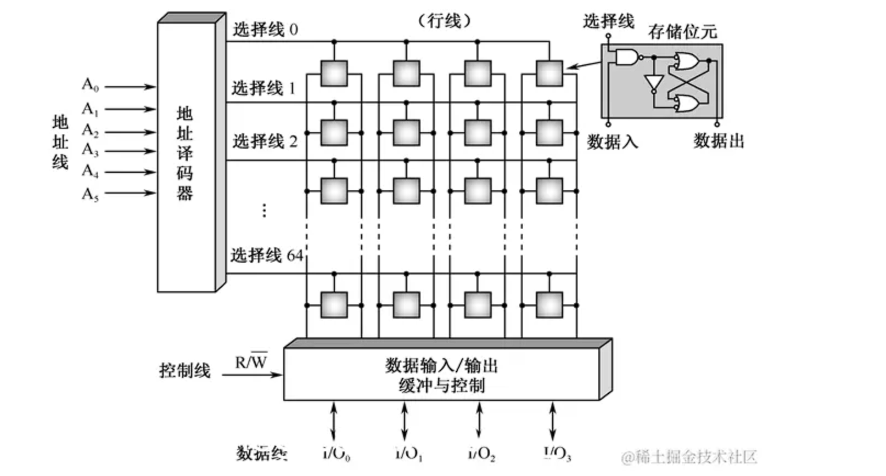
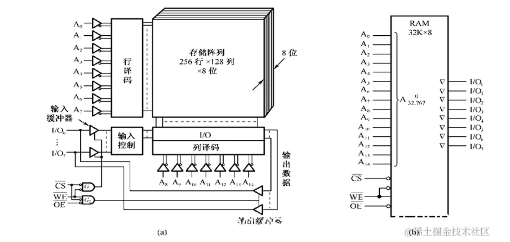
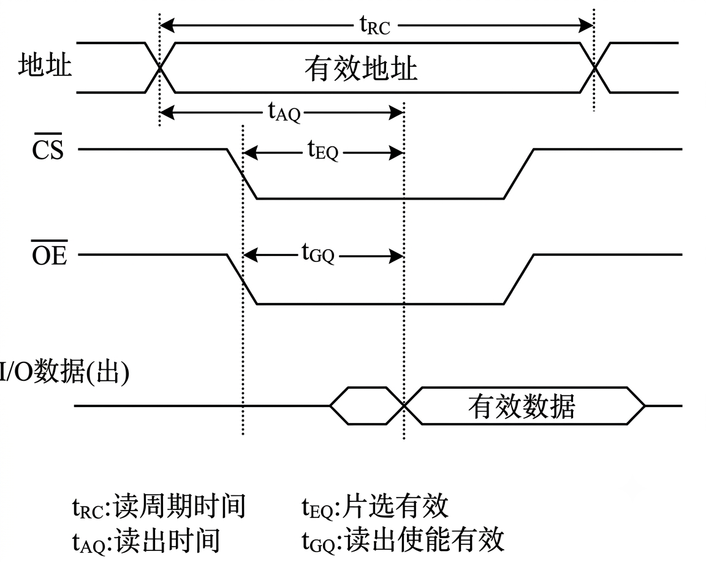
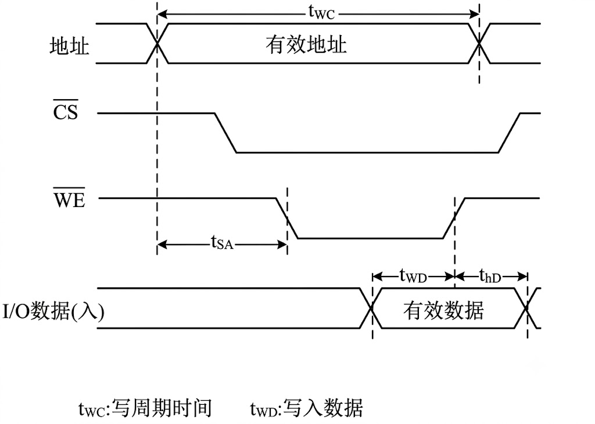

**SRAM（静态随机存取存储器）** 是计算机中一种极为关键的**易失性**存储器。它的名字“静态”源于其核心特性：**只要保持通电，存储的数据就能稳定保存，无需像DRAM那样频繁刷新**

## 一、基本的静态存储元阵列

- **存储位元**:一个锁存器（触发器）。只要直流供电电源一直加到这个记忆电路上，它就无限期地保持记忆的1状态或0状态。如果电源**断电，那么存储的数据（1或0）就会丢失**。
- **三组信号线（重点）** ：**地址线**、**数据线**（行线、列线）、**控制线**
- **地址线**：若为6条，则指定了存储器的容量为26 = 64个**存储单元**
- **数据线**：若为4条，则制定了存储器的**字长**为4位，因此**存储位元总数为64×4 = 256**。
- **控制线**：R/~W控制线，指定了对存储器进行读还是写

地址译码器输出有64条选择线，我们称之为行线，它的作用是打开每个存储位元的输入与非门。

大量 6T 单元按行/列排列构成**静态存储元阵列**，配合行译码器、列译码器、灵敏放大器、读写控制电路构成完整的 SRAM 芯片。

## 二、基本的 SRAM 逻辑结构

- 存储阵列与容量计算

  - **芯片容量**：图右侧标明该 RAM 规格为 $32\text{K} \times 8$ 位。这意味着它有 $32\text{K}$（即 $32 \times 1024 = 32768$）个存储单元，每个单元可以存储 **8 位（1 字节）** 的数据。

  - **双译码结构（矩阵排列）**：为了避免译码器输出线过多，存储阵列采用了二维交叉矩阵排列。
    - **行数**：256 行
    - **列数**：128 列
    - **位深**：8 位（即每次选中某行某列，实际上是同时选中了 8 片叠在一起的阵列，对应 8 位数据）
    - 验证总体积：$256 \times 128 \times 8 \text{ 位} = 32768 \times 8 \text{ 位} = 32\text{K} \times 8 \text{ 位}$。

- 地址总线与译码机制:该存储器共有 **15 根地址线**（$A_0 \sim A_{14}$），正好对应 $2^{15} = 32768$ 个寻址地址（0 ~ 32,767）。这 15 根地址线被分成了两部分：

  - **行译码器（Row Decoder）**：
    - 输入为 $A_0 \sim A_7$ 共 **8 根**地址线。
    - $2^8 = 256$，正好对应驱动存储阵列的 **256 行**。

  - **列译码器（Column Decoder）**：
    - 输入为 $A_8 \sim A_{14}$ 共 **7 根**地址线。
    - $2^7 = 128$，通过多路复用开关选择阵列中的 **128 列**。

- 控制信号与读写逻辑：左下角的逻辑门（$G_1$ 和 $G_2$）展示了控制信号是如何协同工作的。所有控制信号均为**低电平有效**（带有上划线 $\overline{\quad}$ 或引脚上的小圆圈）

  - **CS#（Chip Select，片选信号）**：
    - 当 $\overline{CS} = 1$ 时，芯片未被选中，处于高阻抗/休眠状态。
    - 当 $\overline{CS} = 0$ 时，芯片启动，允许进行读写操作。

  - **WE#（Write Enable，写允许信号）**：
    - 当 $\overline{WE} = 0$ 时，控制门 $G_1$ 打开，输入缓冲器工作，数据从 $I/O_0 \sim I/O_7$ 被**写入**选中的存储单元。

  - **OE#（Output Enable，输出允许信号）**：
    - 当 $\overline{WE} = 1$ 且 $\overline{OE} = 0$ 时，控制门 $G_2$ 打开，输出缓冲器（三态门）开启，选中的存储单元数据被**读出**到 $I/O_0 \sim I/O_7$ 总线上。

- 数据输入/输出（$I/O_0 \sim I/O_7$）：由于采用了**三态双向缓冲器**，数据的输入和输出共用了相同的 8 根引脚。

  - **写数据**时，双向引脚充当输入端，数据流入输入控制电路。

  - **读数据**时，双向引脚充当输出端，数据通过输出缓冲器传出。

## 三、读/写周期波形图

<table style="width: 100%; border: none;">
  <tr style="border: none;">
    <td style="width: 40%; vertical-align: top; border: none; text-align: center;">
      <strong>读周期波形图</strong> 
      
    </td>
    <td style="width: 60%; vertical-align: top; border: none; padding-left: 20px;">
      <strong>一次完整的读操作流程（对照时序图）</strong>
      <ol style="margin-top: 6px; padding-left: 20px;">
        <li><strong>地址建立</strong>：CPU 将目标地址放到地址总线上，<strong>地址信号有效</strong>。内部译码器开始工作（<strong>tAQ</strong> 计时开始）。</li>
        <li><strong>片选选中</strong>：<strong>CS拉低</strong>，芯片被激活（<strong>tEQ</strong> 计时开始）。</li>
        <li><strong>输出使能</strong>：<strong>OE拉低</strong>，芯片内部驱动电路接通（<strong>tGQ</strong> 计时开始）。</li>
        <li><strong>数据稳定</strong>：经过一段延迟（取上述三个时间的最大值），数据总线上的 <strong>I/O 数据(出)</strong> 变为<strong>有效数据</strong>。</li>
        <li><strong>结束操作</strong>：CPU 读取数据总线上的值。之后 OE#、CS# 恢复高电平，地址可改变，准备下一次操作。</li>
      </ol>
    </td>
  </tr>
</table>

---

<table style="width: 100%; border: none;">
  <tr style="border: none;">
    <td style="width: 40%; vertical-align: top; border: none; text-align: center;">
      <strong>写周期波形图</strong> 
      
    </td>
    <td style="width: 60%; vertical-align: top; border: none; padding-left: 20px;">
      <strong>一次完整的写入操作流程（对照时序图）</strong>
      <ol style="margin-top: 6px; padding-left: 20px;">
        <li><strong>地址建立</strong>：CPU 将目标地址放到地址总线上（<strong>地址有效</strong>），并保持稳定，以确保 tSA 的时间要求。</li>
        <li><strong>激活芯片与写模式</strong>：<strong>CS# 拉低</strong>（选中芯片），<strong>WE# 拉低</strong>（告知芯片要写入）。</li>
        <li><strong>数据上线</strong>：CPU 将要写入的数据放到 I/O 引脚上（<strong>I/O 数据(入) 有效</strong>），并确保在 WE# 变高之前满足 tWD 的建立时间。</li>
        <li><strong>锁存写入</strong>：当 WE# 信号由低变高（上升沿）时，芯片内部电路将数据总线上的<strong>有效数据</strong>锁存到地址线指定的存储单元中。</li>
        <li><strong>数据保持</strong>：WE# 变高后，数据线需继续维持一段时间，满足 thD 的要求，然后才能撤走（变为无效）。</li>
        <li><strong>结束操作</strong>：CS# 拉高，地址信号撤走，一次完整的写入操作完成。</li>
      </ol>
    </td>
  </tr>
</table>