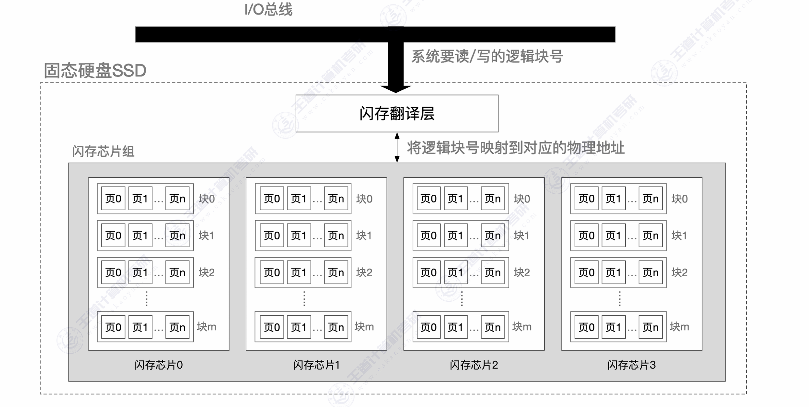

## 一、只读存储器 ROM

ROM 正常工作时只能读出，结构简单，断电后不丢失数据（**非易失性**）。

| 类型       | 全称               | 编程方式               | 擦除方式                             |
| :--------- | :----------------- | :--------------------- | :----------------------------------- |
| **MROM**   | 掩膜 ROM           | 出厂时掩膜固定         | 不可改写                             |
| **PROM**   | 可编程 ROM         | 用户一次性编程（熔丝） | 不可擦除                             |
| **EPROM**  | 可擦除可编程 ROM   | 用户编程               | 紫外线擦除（需从设备取出，开窗照射） |
| **EEPROM** | 电可擦除可编程 ROM | 用户编程               | 电擦除（无需取出，在线擦写）         |

## 二、FLASH 存储器

FLASH 是 EEPROM 的改进型——可以**按块擦除**而非逐字节擦除，速度快、成本低。

| 类型           | 特点                               | 典型应用                       |
| :------------- | :--------------------------------- | :----------------------------- |
| **NOR Flash**  | 支持随机读取，可按字节读取代码     | BIOS/UEFI 固件、嵌入式代码存储 |
| **NAND Flash** | 按页读写、按块擦除，密度高、成本低 | U 盘、SSD、存储卡              |

> NOR Flash 可"就地执行（XIP, Execute In Place）"——CPU 可直接从 NOR Flash 执行代码，无需先复制到 RAM。NAND Flash 不能 XIP。

## 三、SSD（固态硬盘）

SSD 本质上是一个集成了**NAND Flash 阵列 + 主控制器 + DRAM 缓存**的大容量存储设备。

| 特性     | SSD                 | HDD          |
| :------- | :------------------ | :----------- |
| 速度     | 几百 MB/s ~ 几 GB/s | 100~200 MB/s |
| 随机访问 | 极快（无物理寻道）  | 慢           |
| 功耗     | 低                  | 较高         |
| 抗震     | 好（无机械部件）    | 差           |
| 写入寿命 | 有限（P/E 周期数）  | 几乎无限     |

**SSD 的核心技术**：

- **按页读写、按块擦除**：页 = 最小读写单位（4KB/8KB/16KB），块 = 最小擦除单位（数百页）
- **写入前必须先擦除**：已写过的页不能直接重写，需整个块擦除后再写
- **垃圾回收（GC）**：将块中的有效页搬移到新块，擦除旧块以回收空间
- **磨损均衡（Wear Leveling）**：均衡各块的擦写次数，避免热点块过早失效
- **写放大（Write Amplification）**：实际写入的 NAND 数据量 > 用户写入量（因 GC 需额外搬移）