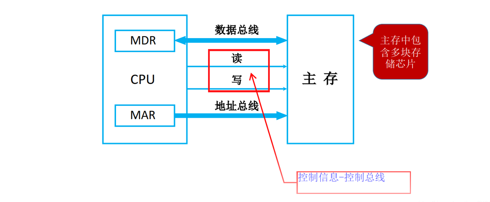

## 一、存储器的分类

### 1. 按存储介质分类

| 类型             | 介质         | 特点                      | 示例                        |
| :--------------- | :----------- | :------------------------ | :-------------------------- |
| **半导体存储器** | 半导体器件   | 体积小、速度快、功耗低    | 内存（DRAM）、Cache（SRAM） |
| **磁表面存储器** | 磁性材料涂层 | 非易失、容量大、速度慢    | 硬盘（HDD）                 |
| **光存储器**     | 光学介质     | 非易失、可移动、只读/可写 | CD、DVD、蓝光               |

### 2. 按存取方式分类

| 类型                      | 存取方式                           | 特点                 | 示例                       |
| :------------------------ | :--------------------------------- | :------------------- | :------------------------- |
| **随机存取存储器（RAM）** | 按地址访问，存取时间与物理位置无关 | 可读可写，易失       | DRAM、SRAM                 |
| **只读存储器（ROM）**     | 正常工作时只能读不能写             | 非易失，断电保持     | BIOS、固件                 |
| **顺序存取存储器（SAM）** | 按顺序读写，存取时间与位置相关     | 速度慢               | 磁带                       |
| **直接存取存储器（DAM）** | 先定位区域再顺序搜索               | 介于 RAM 和 SAM 之间 | 磁盘（硬盘）               |
| **相联存储器（CAM）**     | 按**内容**检索而非按地址           | 并行比较，速度快     | Cache 的 Tag 存储器（TLB） |

### 3. 按在计算机中的作用分类

```
存储器层次
├── 主存储器（内存）
│   ├── RAM（DRAM 为主）
│   └── ROM（BIOS、固件）
├── 辅助存储器（外存）
│   ├── 硬盘（HDD）
│   ├── 固态硬盘（SSD）
│   └── 光盘、U 盘
├── 高速缓冲存储器（Cache）
│   └── SRAM（集成在 CPU 内或 CPU 附近）
└── 寄存器
    └── CPU 内部，速度最快、容量最小
```


## 二、存储器的分级

### 1. 存储器层次结构

**矛盾**：程序员希望存储器容量大、速度快、价格低——但三者不可兼得。

| 层次 | 存储器       | 速度      | 容量          | 价格 | 用途               |
| :--- | :----------- | :-------- | :------------ | :--- | :----------------- |
| L0   | 寄存器       | ns 级     | 几十~几百 B   | 最高 | CPU 内部暂存       |
| L1   | Cache (SRAM) | 1~10 ns   | 几十 KB~几 MB | 很高 | 指令/数据缓存      |
| L2   | 主存 (DRAM)  | 50~100 ns | 几 GB~几百 GB | 中等 | 运行中的程序和数据 |
| L3   | 磁盘/SSD     | ms 级     | 几百 GB~几 TB | 低   | 永久存储           |
| L4   | 光盘/磁带    | 更慢      | TB 级         | 最低 | 备份/归档          |

```
     ┌──────────────────────────────┐
     │  寄存器 (CPU 内部，最快)        │
     ├──────────────────────────────┤
     │  L1 Cache (SRAM)             │
     ├──────────────────────────────┤
     │  L2/L3 Cache (SRAM)          │  ← 越往上越快、越小、越贵
     ├──────────────────────────────┤
     │  主存 (DRAM)                  │
     ├──────────────────────────────┤
     │  磁盘 / SSD                   │  ← 越往下越慢、越大、越便宜
     └──────────────────────────────┘
```

### 2. 局部性原理

| 类型           | 含义                                   | 示例               |
| :------------- | :------------------------------------- | :----------------- |
| **时间局部性** | 刚被访问过的数据不久后可能再次被访问   | 循环中的指令和变量 |
| **空间局部性** | 刚被访问数据附近的数据可能紧接着被访问 | 顺序执行、数组遍历 |

### 3. 命中与平均访问时间

- **命中（Hit）**：CPU 访问的数据在高层存储器中找到
- **缺失（Miss）**：未找到，需从下一层调入
- **命中率 $H$** = 命中次数 / 总访问次数
- **平均访问时间**：$$T_{avg} = H \times T_{hit} + (1-H) \times T_{miss}$$

---

## 三、主存储器的技术指标

| 指标                 | 含义                                   | 单位               |
| :------------------- | :------------------------------------- | :----------------- |
| **存储容量**         | = 存储单元个数 × 存储字长              | 字×位 或 字节（B） |
| **存取时间 $T_a$**   | 从启动一次存储器操作到完成该操作的时间 | ns                 |
| **存取周期 $T_m$**   | 连续两次独立存取操作的最小间隔         | ns                 |
| **存储器带宽 $B_m$** | 单位时间内存储器传输的数据量           | B/s、MB/s、GB/s    |

> **$T_m > T_a$**：一次存取后需要恢复时间（尤其 DRAM 需预充电），所以存取周期 > 存取时间。
>
> **存储器带宽公式**：$B_m = W / T_m$（$W$ 为存储器字长），即每秒可并行读出的数据量。

---

## 四、存储器与 CPU 的连接

主存通过**地址总线、数据总线、控制总线**与 CPU 连接。



| 总线         | 功能                            | 方向           | 位数决定因素                |
| :----------- | :------------------------------ | :------------- | :-------------------------- |
| **地址总线** | CPU → 主存，传输要访问的地址    | 单向           | MAR 位数 → 决定最大寻址范围 |
| **数据总线** | CPU ↔ 主存，传输数据            | 双向           | MDR 位数 → 决定存储字长     |
| **控制总线** | CPU → 主存，传输读/写等控制信号 | 每根线方向固定 | —                           |

**芯片容量扩展**：

| 扩展方式         | 用途             | 连接方式                                     |
| :--------------- | :--------------- | :------------------------------------------- |
| **位扩展**       | 数据位宽不够     | 多片并联：共用地址线和控制线，数据线各自独立 |
| **字扩展**       | 地址空间不够     | 多片串联：高位地址经译码产生片选信号         |
| **字位同时扩展** | 容量和位宽均不够 | 先位扩展拼成所需位宽，再字扩展拼成所需容量   |

---

## 五、内存条

内存条（DIMM, Dual In-line Memory Module）是将多个 DRAM 芯片焊接在一块小电路板上的**标准化模块**，通过内存插槽与主板连接。

### 1. 内存条的基本组成

- 一块内存条上有**多颗 DRAM 芯片**并联，构成 64 bit 数据位宽（现代 PC 标准）
- 内存条上有 **SPD（Serial Presence Detect）** 芯片——一片小 EEPROM，存储该内存条的时序参数和容量信息，供 BIOS 初始化时读取

### 2. 内存条的信号线

| 信号线     | 功能                                                       |
| :--------- | :--------------------------------------------------------- |
| **地址线** | 传送行/列地址（分时复用）                                  |
| **数据线** | 64 bit（标准 DIMM）                                        |
| **控制线** | RAS#（行选通）、CAS#（列选通）、WE#（写使能）、CS#（片选） |
| **时钟线** | 同步时钟信号（SDRAM 及之后的标准）                         |
| **SPD 线** | I²C 总线，读取 SPD 信息                                    |

### 3. 内存条的发展

| 类型          | 全称               | 特点                             | 工作电压    |
| :------------ | :----------------- | :------------------------------- | :---------- |
| **SIMM**      | 单列直插内存模块   | 32 bit 位宽，已淘汰              | 5V          |
| **DIMM**      | 双列直插内存模块   | 64 bit 位宽，现代 PC 主流        | —           |
| **SDRAM**     | 同步 DRAM          | 与系统时钟同步（第一个同步标准） | 3.3V        |
| **DDR SDRAM** | 双倍数据速率 SDRAM | 时钟上升沿/下降沿各传一次数据    | 2.5V        |
| **DDR2/DDR3** | —                  | 提高预取位宽、降低电压           | 1.8V / 1.5V |
| **DDR4/DDR5** | —                  | 更高频率、更低电压、更大容量     | 1.2V / 1.1V |

> **DDR 的命名含义**："Double Data Rate"——每个时钟周期在上升沿和下降沿各传输一次数据，因此数据传输率 = 内存时钟频率 × 2。