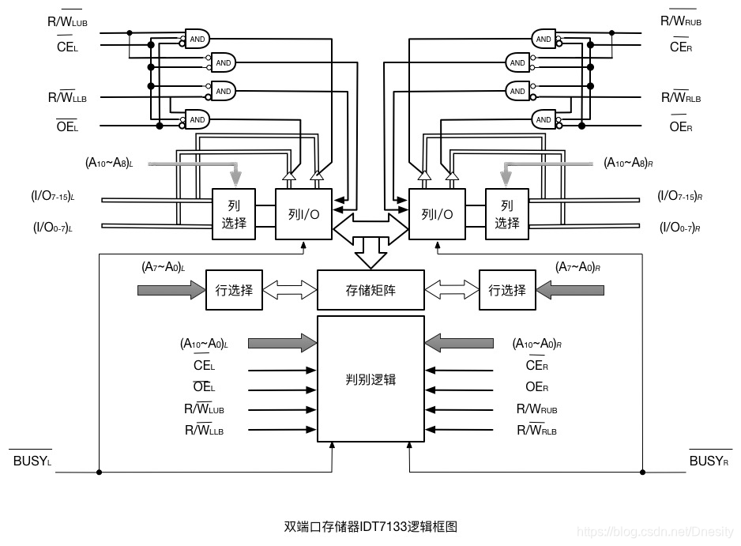
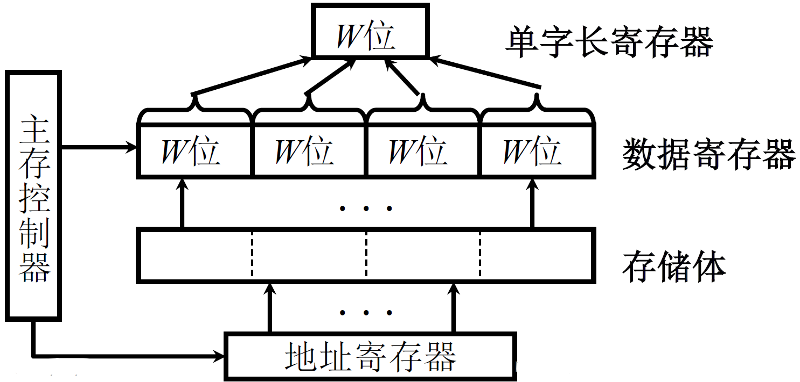
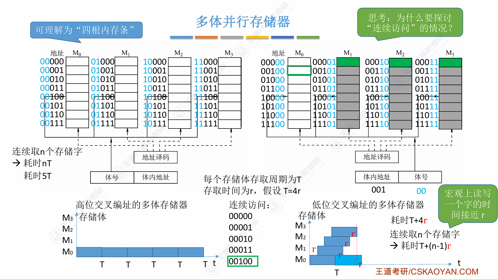

## 一、双端口存储器

同一个存储体具有**两套独立的读写端口**（各自的地址线、数据线和控制线）。



- **无冲突**：两端口访问不同地址 → 可并行工作
- **写冲突**：两端口同时写同一地址 → 数据不确定，通过$\overline{\text{BUSY}}$ 标志决定哪个端口优先读写
- **读写冲突**：一读一写同一地址 → 读出值不确定（可能是旧值或新值）

## 二、多模块存储器

### 1. 多模块存储器的结构

将主存划分为多个独立的**存储模块**（存储体），每个模块有独立的地址寄存器、译码电路和读写电路。各模块可以**并行工作**，提高整体访存带宽。

```
+-------------------------------------------------------------+
|                             CPU                             |
+-------------------------------------------------------------+
                              ▲ |
                              | | (双向总线)
                              ▼ ▼
+-------------------------------------------------------------+
|                        存储器控制部件                         |
+-------------------------------------------------------------+
      ▲                ▲                ▲                ▲
      |                |                |                |  (双向总线)
      ▼                ▼                ▼                ▼ 
   +-----+          +-----+          +-----+          +-----+
 0 |     |        1 |     |        2 |     |        3 |     |
   |-----|          |-----|          |-----|          |-----|
 4 |     |        5 |     |        6 |     |        7 |     |
   |-----|          |-----|          |-----|          |-----|
   | M0  |          | M1  |          | M2  |          | M3  |
   +-----+          +-----+          +-----+          +-----+
```

### 2. 单体多字存储器

**单体多字**：一个存取周期内，从**同一模块**中一次读出**多个连续存储字**。



> 单体多字**不增加模块数**，只是加宽了数据通路。缺点是灵活性差——只能读连续的几个字，若只要一个字也会浪费带宽。

### 3. 多体并行存储器



**模块的编址方式**决定其工作模式和适用场景：

|   编址方式   | 规则                                 | 地址分布           | 适用场景     |
| :----------: | :----------------------------------- | :----------------- | :----------- |
| **高位交叉** | 高位地址选模块，低位选模块内单元     | 同一模块内地址连续 | 独立并发任务 |
| **低位交叉** | **低位地址选模块**，高位选模块内单元 | 连续地址跨不同模块 | 顺序流水访问 |