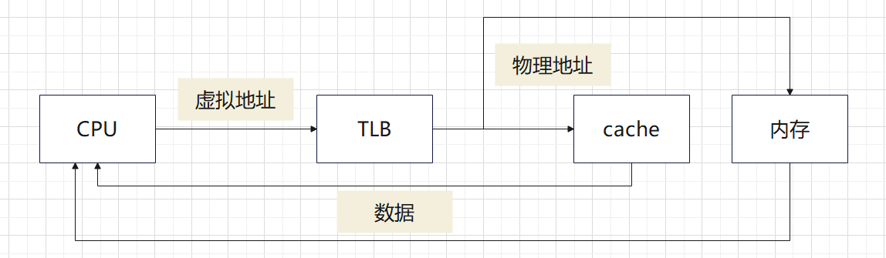
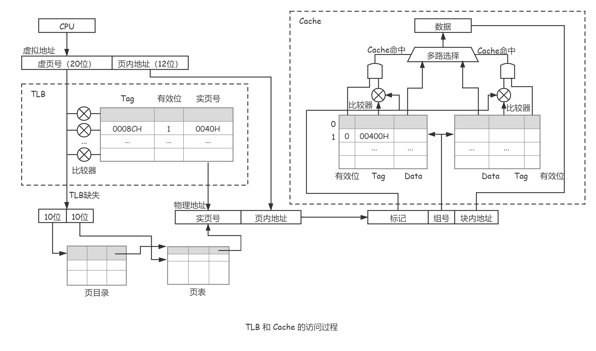
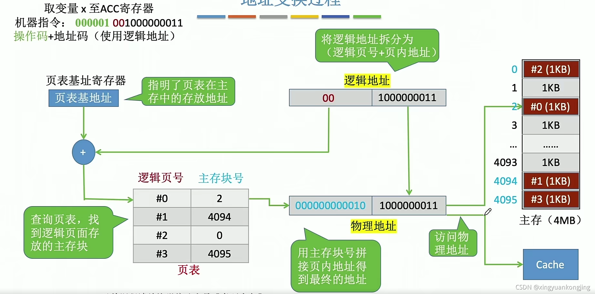
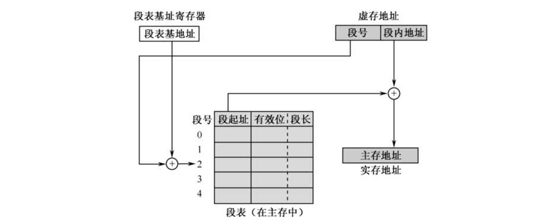
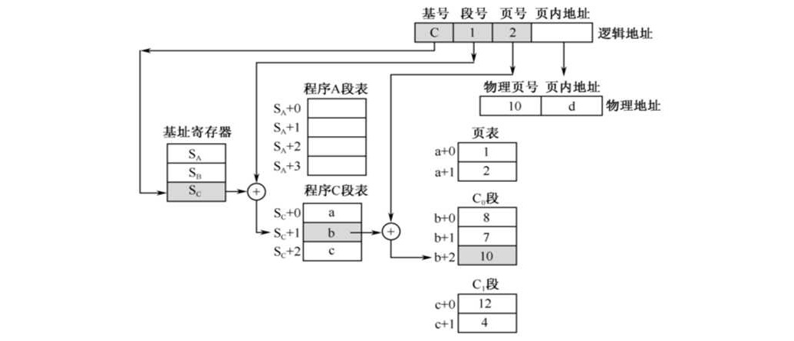

> 虚拟存储器（Virtual Memory）将**主存和磁盘**统一编址，使程序员看到的是一个比实际物理内存大得多的地址空间。由**操作系统和硬件（MMU）**共同管理。

## 一、虚拟存储器的基本概念

### 1. 为什么需要虚拟存储器？

- **内存不够用**：程序中有些部分（如错误处理、初始化代码）很少执行，没必要一直占用内存
- **多道程序并发**：多个程序同时运行时，物理内存可能不够分配
- **程序员方便**：程序员只需关心虚拟地址，不必考虑物理内存的实际大小和布局

### 2. 三个地址空间

| 地址空间                 | 含义                             | 示例                   |
| :----------------------- | :------------------------------- | :--------------------- |
| **虚拟地址（逻辑地址）** | CPU 发出的地址，程序员眼中的地址 | 32 位虚拟地址：0 ~ 4GB |
| **物理地址（实地址）**   | 实际访问主存的地址               | 物理内存大小：如 1GB   |
| **磁盘地址**             | 数据在磁盘上的位置               | 交换空间               |

> 程序的再定位：程序进行虚地址向实地址的转换。

### 3. 基本工作流程



**第一步：CPU发出虚拟地址（VA）**

CPU执行指令（比如 `LOAD R1, [0x7FFF1234]`）时，送出的地址是**虚拟地址（Virtual Address）**。

- 这个地址由两部分组成：**高位数（虚拟页号，VPN）** 和 **低位数（页内偏移，Offset）**。
- **关键**：这个地址不能直接拿去插在内存条上，必须立刻转换。

**第二步：硬件快车道——查询 TLB（快表）**

CPU将虚拟地址发给MMU（内存管理单元）。MMU不会马上去翻内存，而是先查自己内部的**TLB（旁路转换缓冲，即快表）**。

- **情况 A（TLB 命中）**：TLB里正好存着这个“虚拟页号”对应的“物理页框号”。MMU **瞬间（1个时钟周期）** 拿到物理地址，直接跳转到**第四步**。
- **情况 B（TLB 未命中）**：TLB里没找到。MMU只好启动慢速路径，进入**第三步**。

> **注意**：现代CPU中，MMU查询TLB的同时，也会把虚拟地址的“页内偏移”发送给L1 Cache，因为虚实地址的页内偏移是相同的，可以提前准备数据（这称为VIPT并行）。

**第三步：软件/硬件慢车道——查询页表（Page Table）**

当TLB未命中时，MMU需要去**主存（DRAM）** 里查页表。但是，**页表本身也是数据**，它也会经过CPU的L1/L2/L3缓存。

- **MMU动作**：MMU发出读取“页表项（PTE）”的请求。
- **硬件检查**：
  - **如果页表项在L1/L2/L3缓存中**：MMU直接从高速SRAM缓存中拿到PTE，速度较快。
  - **如果页表项不在缓存中**：MMU穿透缓存，去慢速的DRAM（主存）里把页表项取出来。
- **解析PTE**：MMU拿到页表项后，查看其中的**“有效位（Present/Valid Bit）”**。

**第四步：分支判断——页命中 vs 缺页（Page Fault）**

- **路径 1：页命中（有效位 = 1）**
  - 页表项里的物理页框号是有效的。MMU将其取出，**拼上**虚拟地址里的“页内偏移”，组装成完整的**物理地址（PA）**。
  - **同时**，MMU会把这个刚查到的映射关系**加载进TLB**，以备下次快速使用。
  - 拿着物理地址，进入**第五步**。
- **路径 2：缺页中断（有效位 = 0）**
  - 物理页框号无效，说明这个虚拟页被**换出到磁盘（Swap空间）** 了。
  - MMU触发**缺页中断（Page Fault）**，CPU陷入操作系统内核。
  - **操作系统接管**：OS调度磁盘I/O，将数据从硬盘读入内存；如果内存满了，OS会使用我们之前聊的**页面置换算法（如LRU）**踢出一页；最后更新页表，修改有效位为1。
  - **返回**：中断返回，CPU重新执行这条指令。此时，TLB里依然没有映射（或者无效），MMU会重新走一遍第三步，这次页表有效位为1，顺利拿到物理地址。

**第五步：最终数据访问——通过物理地址访问 Cache / DRAM**

MMU最终拿到了合法的**物理地址（PA）**。现在，它要去拿真正的数据（指令或操作数）了：

1. **查 L1 Cache**：CPU将物理地址发给L1缓存（或之前已经并行开始查了）。
2. **命中（Hit）**：数据就在SRAM中，极速返回给CPU，指令执行完毕。
3. **未命中（Miss）**：依次查L2、L3缓存。如果L3也没有，CPU控制器才发起总线请求，去**主存（DRAM）** 里把数据读出来，同时填充各级缓存。

**MMU（Memory Management Unit）**：硬件单元，负责将虚拟地址翻译为物理地址。核心组件是 **TLB（快表）** + **页表基址寄存器**。

### 4. Cache 与虚存的异同

Cache 和虚拟存储器都是基于**局部性原理**构建的层次存储体系，但位于不同的层次、解决不同的问题：

|     维度     |               Cache               |            虚拟存储器             |
| :----------: | :-------------------------------: | :-------------------------------: |
|   **目标**   |   弥补 CPU 与主存的**速度差距**   |   弥补主存与磁盘的**容量差距**    |
| **层次位置** |          CPU ↔ 主存之间           |          主存 ↔ 磁盘之间          |
| **存储介质** |          SRAM（快、小）           |         主存 DRAM + 磁盘          |
| **传输单位** | **块（Cache Line）**，通常 32~64B |     **页（Page）**，通常 4KB      |
| **速度差距** |     约 10 倍（1ns vs 100ns）      |    约 10⁵ 倍（100ns vs 10ms）     |
| **对程序员** |     **透明**（硬件自动管理）      |     透明（OS + MMU 硬件管理）     |
| **缺失处理** |         硬件完成（调块）          | **OS 软件完成**（缺页中断，调页） |
| **替换算法** |   LRU / FIFO / RAND（硬件实现）   | LRU / CLOCK / OPT（OS 软件实现）  |
|  **命中率**  |               > 95%               |      > 99%（但缺失惩罚极大）      |
| **映射方式** |  直接 / 组相联 / 全相联（硬件）   |  页表映射、TLB 加速（硬件 + OS）  |

**核心相同点**：

- 都依赖**局部性原理**工作——没有局部性，Cache 和虚存都毫无用处
- 都用**层次化映射**结构——Cache 行 ↔ 主存块；虚拟页 ↔ 物理页框
- 都有**替换策略**处理缺失——Cache 用 LRU/FIFO，虚存用 LRU/CLOCK
- 都用**高速缓存加速翻译**——Cache 本身是 SRAM，虚存用 TLB 加速页表查询

**核心不同点**：

- Cache 缺失由**硬件**自动处理；缺页由**操作系统软件**处理（中断机制）
- Cache 传输单位（块，64B）远小于虚存（页，4KB）——因为缺失代价差距大：访问主存 ~100ns，访问磁盘 ~10ms（10 万倍差距！）
- Cache 命中率 95%+，虚存命中率 99%+——因为缺页代价实在太大了，必须有更高命中率

> **总结**：Cache = 速度层次（快慢之间），虚存 = 容量层次（大小之间）。两者解决不同矛盾，但设计思想同出一源——**局部性原理 + 层次化映射 + 按需调入 + 替换策略**。

### 5. 页表

**页表**是虚拟存储器中最核心的数据结构——记录每个虚拟页是否在主存中，以及对应的物理页框号（或磁盘地址）。

```
页表项（PTE, Page Table Entry）：
  ┌─────┬─────┬─────┬─────┬─────┬─────┐
  │有效位│脏位  │访问位│权限 │ 物理页框号  │
  └─────┴─────┴─────┴─────┴─────┴─────┘
    │     │     │     │     └── 若有效位=1，则为此值
    │     │     │     └── 读/写/执行权限
    │     │     └── 被访问过吗（用于替换算法）
    │     └── 被修改过吗（写回磁盘时需要）
    └── 该页在主存中吗？0 → 缺页（Page Fault）
```
---

## 二、页式虚拟存储器

### 1. 基本概念

将**虚拟地址空间**和**物理地址空间**都分成固定大小的**页**（Page）和**页框**（Page Frame，也称页帧）。

- **页**：虚拟地址空间被等分为固定大小的页（如 4KB/页）
- **逻辑页**：虚地址空间被分成**等长大小**的页，被称为逻辑页
- **物理页**：主存也被分成**同样大小**的页，称之为物理页
- **页框**：物理主存被等分为与页相同大小的页框
- **页大小 = 页框大小**，通常 4KB（$2^{12}$ 字节）
- 页的划分对程序员**透明**——程序员看到的是连续的虚拟地址空间

### 2. 地址映射过程





### 3. 快表（TLB, Translation Lookaside Buffer）

**为什么需要 TLB？** 页表存放在主存中，每次地址翻译都需要访问主存查页表——即使多级页表只查两级，也需 2 次访存。加上最终的数据访存，一次操作可能需要 **3 次访存**，性能极差。

**TLB 的原理**：TLB 是 MMU 内部的**专用高速缓存（SRAM）**，专门缓存最近使用过的页表项。

```
  CPU 发出虚拟地址
       │
       ▼
  ┌──────────────┐
  │    TLB       │  命中？── 是 ──▶ 直接得到物理页框号（快，1个时钟）
  │ (SRAM,小容量) │
  └──────┬───────┘
         │ 否（TLB 缺失）
         ▼
  ┌──────────────┐
  │  页表（主存）  │  查页表 → 得到 PPN，同时更新 TLB
  └──────────────┘
```

**TLB 的条目结构**：

```
TLB 条目 =
┌─────┬──────────┬──────────┐
│有效位│ 虚拟页号  │ 物理页框号 │  (+ 保护位、脏位等)
└─────┴──────────┴──────────┘
```

- **TLB 命中**：虚拟页号匹配 → 直接输出物理页框号，拼接页内偏移 → 物理地址
- **TLB 缺失**：需查主存页表，找到后将对应页表项加载到 TLB

**TLB 的特点**：

| 特性                | 说明                                                       |
| :------------------ | :--------------------------------------------------------- |
| **容量**            | 很小（通常 32~512 个条目）                                 |
| **相联度**          | 通常为**全相联**（或高路组相联）——因容量小，全相联硬件可行 |
| **命中率**          | 极高（> 99%），因为页访问具有极强的时间局部性              |
| **缺失处理**        | 由硬件（或软件）查页表并填入 TLB                           |
| **替换算法**        | 通常 LRU 或随机（小容量硬件实现简单）                      |
| **与 Cache 的关系** | TLB 翻译地址在先，Cache 访问在后 → 可**并行**以加速        |

**TLB 与 Cache 的访问流水线**（典型顺序）：

```
虚拟地址 → TLB 翻译 → 物理地址 → Cache 访问 → 命中/缺失处理
```

> 现代 CPU 采用**虚拟索引物理标记（VIPT）**等技术，使 Cache Index 的提取与 TLB 翻译**并行进行**，大幅减少延迟。

---

### 4. 多级页表

单级页表太大——32 位系统有 1M 个页表项，每个 4 字节，共占 4MB。且大多数页表项是空的。**多级页表**将页表也分页存储，只将用到的部分调入内存。

```
两级页表示例（32 位虚拟地址）：
 31      22  21      12  11       0
 ┌──────────┬──────────┬──────────┐
 │ 页目录号  │ 页表号     │ 页内偏移  │
 │ (10 位)  │ (10 位)   │ (12 位)  │
 └──────────┴──────────┴──────────┘
     │           │
     ▼           ▼
  ┌──────┐  ┌──────────┐
  │页目录 │─▶│   页表   │  两级索引, 最终得到物理页框号
  └──────┘  └──────────┘
```

## 三、段式虚拟存储器和段页式虚拟存储器

### 1. 段式虚拟存储器



按**程序的逻辑结构**分段（如代码段、数据段、堆栈段），各段长度可变。

**分段地址结构**：

```
虚拟地址 = 段号(Seg#) │ 段内偏移
```

**段表项**：

```
┌─────┬─────┬─────┐
│有效位│段长 │段基址│
└─────┴─────┴─────┘
```

- **优点**：符合程序逻辑、便于共享和保护（按段设置权限）
- **缺点**：段长不一，易产生**外部碎片**；地址翻译略复杂

### 2. 段页式虚拟存储器



结合段式和页式的优点：先按**逻辑分段**，段内再按**固定大小分页**。

**段页式地址结构**：

```
虚拟地址 = 段号(Seg#) │ 段内页号 │ 页内偏移
```

```
  段号
   │
   ▼
 段表 → 该段的页表基址
             │
     段内页号 │
             ▼
           页表 → 物理页框号 + 页内偏移 → 物理地址
```

| 特性      | 页式             | 段式             | 段页式                    |
| :-------- | :--------------- | :--------------- | :------------------------ |
| 划分依据  | 固定大小（硬件） | 逻辑结构（软件） | 逻辑分段 + 段内分页       |
| 碎片      | 内部碎片         | 外部碎片         | 内部碎片                  |
| 共享/保护 | 不方便           | 方便             | 方便                      |
| 地址翻译  | 1 次查表         | 1 次查表         | **2 次查表**（段表+页表） |
| 实际使用  | 现代 OS 主流     | 很少单独使用     | Intel x86 曾经使用        |

---

## 四、虚存的替换算法

当物理内存已满且需要调入新页面时，由 OS 选择一个页面替换出去。

| 算法                | 规则                       | 特点                                  |
| :------------------ | :------------------------- | :------------------------------------ |
| **OPT（最佳置换）** | 替换未来最久不再使用的页   | 理论最优，但无法实现（无法预知未来）  |
| **FIFO**            | 替换最早调入的页           | 简单，但可能替换常用页（Belady 异常） |
| **LRU**             | 替换最久未使用的页         | 接近最优，但硬件成本高（需记录时序）  |
| **LFU**             | 替换历史上访问次数最少的页 | 适合访问频率稳定场景，但新页易被淘汰  |
| **CLOCK（NRU）**    | 环形扫描，找"未访问"页     | **实际主流**——LRU 的硬件近似          |

- Cache 的替换通过**硬件**实现，而虚存的替换依靠**操作系统（软件）**支持
- 虚存缺页的影响远大于cache未命中，因为虚存需要访问辅存，并且进行任务切换
- 虚存页面替换的选择余地很大，属于一个进程的页面都可以替换
- LFU 需每页维护计数器记录访问次数，替换时选计数值最小的页——缺点是刚调入的新页可能立即被淘汰（"旧数据霸占"）

**CLOCK 算法示例**：

```
页表项中有一"访问位 A"：CPU 访问该页时置 1，OS 替换时清 0

  指针顺时针扫描：
  ┌────┐ ┌────┐
  │ A=1│→│ A=1│→ ...  遇到 A=1 → 清 0，继续扫描
  └────┘ └────┘         遇到 A=0 → 替换该页

  类似"钟表指针"旋转，被访问过的页得到"第二次机会"。
```

> **Belady 异常**：FIFO 算法中，增加物理页框数反而可能导致缺页次数增加（违反了直觉）。LRU 和 OPT 不会出现 Belady 异常。

